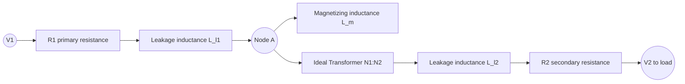
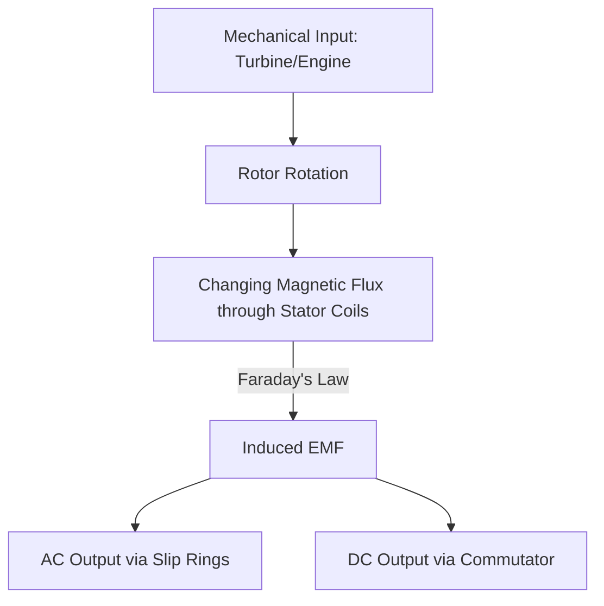

## Transformers and Generators

### Overview

Transformers and generators are both applications of electromagnetic induction (Faraday's law), but they serve fundamentally different purposes: a generator converts mechanical energy into electrical energy by moving a conductor through a magnetic field, while a transformer converts electrical energy at one voltage/current level into electrical energy at another level, with no mechanical motion and (ideally) no change in power. Both devices exploit time-varying magnetic flux to induce EMF, making them a natural pairing within the study of induction phenomena.

---

## Part 1: Transformers

### Basic Principle

A transformer consists of two (or more) coils — the **primary** and **secondary** — wound on a common ferromagnetic core. An alternating current in the primary produces a time-varying magnetic flux, which the core channels through the secondary winding, inducing an EMF there via Faraday's law:

$$\varepsilon = -N\frac{d\Phi}{dt}$$

Since both windings link nearly the same flux $\Phi$ (assuming a well-designed core with negligible leakage), the induced EMFs are proportional to the number of turns:

$$\frac{V_2}{V_1} = \frac{N_2}{N_1} = a$$

where $a$ is the **turns ratio**. If $a > 1$, the device is a **step-up transformer**; if $a < 1$, it is a **step-down transformer**.

### Ideal Transformer Equations

For an ideal transformer (zero winding resistance, zero leakage flux, infinite core permeability, no core losses), power is conserved:

$$V_1 I_1 = V_2 I_2$$

Combining with the voltage ratio gives the current ratio:

$$\frac{I_2}{I_1} = \frac{N_1}{N_2} = \frac{1}{a}$$

**Key Points**

- Voltage steps up/down in direct proportion to turns ratio; current steps in the *inverse* proportion — this preserves power.
- An ideal transformer also transforms impedance: a load impedance $Z_2$ on the secondary appears on the primary side as $Z_1 = a^2 Z_2$, a principle used extensively in impedance matching (e.g., audio output transformers).

### Real Transformer Non-Idealities

**Key Points**

- **Winding resistance ($R_1$, $R_2$)**: causes $I^2R$ copper losses and voltage drop under load.
- **Leakage flux**: flux from the primary that does not link the secondary (and vice versa), modeled as leakage inductances $L_{l1}$, $L_{l2}$ in series with an ideal transformer core.
- **Finite core permeability**: requires a small magnetizing current $I_m$ even at no load, modeled as a magnetizing inductance $L_m$ in parallel.
- **Core losses**:
  - **Hysteresis loss**: energy dissipated as the core material's magnetic domains repeatedly reorient through the B-H loop each AC cycle; proportional to frequency and the area of the hysteresis loop.
  - **Eddy current loss**: circulating currents induced within the conductive core material itself, dissipated as $I^2R$ heat; mitigated by laminating the core (thin insulated sheets) to increase resistance to eddy current paths.

### Equivalent Circuit Model

### Transformer Efficiency and Voltage Regulation

Efficiency is the ratio of output power to input power:

$$\eta = \frac{P_{out}}{P_{in}} = \frac{P_{out}}{P_{out} + P_{cu} + P_{fe}}$$

where $P_{cu}$ is copper (resistive) loss and $P_{fe}$ is core (iron) loss. Voltage regulation quantifies how much the secondary voltage sags between no-load and full-load conditions:

$$\text{VR} = \frac{V_{2,no\text{-}load} - V_{2,full\text{-}load}}{V_{2,full\text{-}load}} \times 100\%$$

**Example**

A transformer with $N_1 = 500$, $N_2 = 100$, delivers 10 A to a load at the secondary voltage of 40 V.

Turns ratio: $a = N_1/N_2 = 5$

Primary voltage (ideal case): $V_1 = aV_2 = 5 \times 40 = 200\ \text{V}$

Primary current (ideal case): $I_1 = I_2/a = 10/5 = 2\ \text{A}$

Power check: $P_1 = V_1I_1 = 200 \times 2 = 400\ \text{W}$; $P_2 = V_2I_2 = 40\times10 = 400\ \text{W}$ ✓ (power conserved, as expected for the ideal case)

### Types of Transformers

**Key Points**

- **Power transformers**: large-scale voltage transformation for electrical grid transmission and distribution (step-up at generation, step-down near loads).
- **Distribution transformers**: step down to residential/commercial usage voltages.
- **Autotransformers**: single winding shared between primary and secondary (tapped), more efficient but without electrical isolation.
- **Instrument transformers (CTs and PTs)**: current transformers and potential (voltage) transformers scale high currents/voltages down to safe, measurable levels for metering and protection relays.
- **Isolation transformers**: primary purpose is electrical isolation (1:1 ratio) rather than voltage transformation, used for safety and noise reduction.

---

## Part 2: Generators

### Basic Principle

A generator (alternator, in the AC case) converts mechanical rotational energy into electrical energy by rotating a conductor (or coil) within a magnetic field, or equivalently rotating a magnetic field (rotor) within stationary conductors (stator). As the conductor's orientation relative to the field changes, the enclosed flux $\Phi(t)$ changes, inducing an EMF per Faraday's law.

For a rectangular coil of $N$ turns, area $A$, rotating at constant angular velocity $\omega$ in a uniform field $B$, the flux is:

$$\Phi(t) = BA\cos(\omega t)$$

Applying Faraday's law:

$$\varepsilon(t) = -N\frac{d\Phi}{dt} = N B A \omega \sin(\omega t)$$

This produces a sinusoidal EMF with peak value:

$$\varepsilon_0 = NBA\omega$$

**Key Points**

- The induced EMF is maximum when the coil plane is parallel to $B$ (flux changing fastest) and zero when the coil plane is perpendicular to $B$ (flux at its extremum, momentarily not changing).
- $\varepsilon_0 \propto \omega$: faster rotation produces proportionally higher peak voltage and frequency.
- The output frequency in Hz relates to mechanical rotational speed by $f = \omega/(2\pi)$, and for a generator with $p$ magnetic pole pairs, $f = p \times (\text{rev/s})$.

### AC vs. DC Generators

**Key Points**

- **AC generator (alternator)**: uses slip rings to maintain continuous electrical contact with the rotating coil, outputting sinusoidal EMF directly, matching the natural rotational physics.
- **DC generator**: uses a split-ring commutator that reverses connections every half-rotation, converting the naturally alternating EMF into a unidirectional (though pulsating) output; smoothed further with multiple coils/commutator segments.

### Rotating Field vs. Rotating Armature Design

**Key Points**

- **Rotating armature** (older/smaller machines): the conductor coils rotate within a stationary field; output is extracted via slip rings/brushes — mechanically simpler for small generators, but brushes wear and limit power/voltage capacity.
- **Rotating field** (standard for large power-generation alternators): the field winding (often a DC-excited electromagnet) rotates on the rotor while the output-carrying armature windings are stationary in the stator; this avoids passing high power through sliding contacts, improving reliability at large scale.

### Generator Diagram

### AC Generator Rotating Coil (svg_diagram)

<svg xmlns="http://www.w3.org/2000/svg" viewBox="0 0 480 260">
<text x="240" y="24" font-size="16" text-anchor="middle" fill="#222">Rotating Coil in Uniform Field (svg_diagram)</text>
<rect x="60" y="60" width="360" height="150" fill="none" stroke="#909497" stroke-width="1" stroke-dasharray="4,4" />
<text x="240" y="55" font-size="12" text-anchor="middle" fill="#909497">Uniform Magnetic Field B (into page shown as x, out as •)</text>
<g>
<text x="90" y="90" font-size="14" fill="#1a5276">×</text>
<text x="150" y="90" font-size="14" fill="#1a5276">×</text>
<text x="330" y="90" font-size="14" fill="#1a5276">×</text>
<text x="390" y="90" font-size="14" fill="#1a5276">×</text>
<text x="90" y="190" font-size="14" fill="#1a5276">×</text>
<text x="150" y="190" font-size="14" fill="#1a5276">×</text>
<text x="330" y="190" font-size="14" fill="#1a5276">×</text>
<text x="390" y="190" font-size="14" fill="#1a5276">×</text>
</g>
<ellipse cx="240" cy="135" rx="70" ry="35" fill="none" stroke="#a04000" stroke-width="4" transform="rotate(30 240 135)" />
<line x1="240" y1="135" x2="310" y2="95" stroke="#27ae60" stroke-width="2" marker-end="url(arrow2)" />
<text x="330" y="90" font-size="12" fill="#27ae60">ω</text>
<line x1="180" y1="230" x2="300" y2="230" stroke="#333" stroke-width="2" />
<circle cx="180" cy="230" r="8" fill="none" stroke="#333" stroke-width="2" />
<circle cx="300" cy="230" r="8" fill="none" stroke="#333" stroke-width="2" />
<text x="240" y="250" font-size="12" text-anchor="middle" fill="#333">Slip rings and brushes to external circuit</text>
</svg>

### Transformer vs. Generator: Key Distinctions

| Property | Transformer | Generator |
| --- | --- | --- |
| Energy conversion | Electrical → Electrical | Mechanical → Electrical |
| Physical motion | None (stationary) | Rotational (mechanical input required) |
| Flux change mechanism | Time-varying current in primary | Physical rotation changing flux linkage |
| Governing law | Faraday's law (transformer EMF) | Faraday's law (motional EMF) |
| Core purpose | Efficient flux linkage between windings | Support rotating field/armature structure |
| Typical output | Same frequency as input | Frequency set by mechanical speed and pole count |

### Applications and Practical Context

**Key Points**

- **Power transmission systems**: step-up transformers at generating stations reduce $I^2R$ transmission losses over long lines by raising voltage (and correspondingly lowering current) for a given power level; step-down transformers restore usable voltages near consumption points.
- **Renewable energy integration**: wind turbine generators (often variable-speed, requiring power electronic frequency conversion) and synchronous generators in hydro/thermal plants both rely on the rotating-field induction principle described above.
- **Automotive alternators**: small rotating-field AC generators with built-in rectification (diode bridge) to supply DC for battery charging and vehicle electrical systems.
- **Grid frequency synchronization**: synchronous generators must be phase-locked and frequency-matched (e.g., 50 Hz or 60 Hz) before being connected in parallel to the grid, a critical operational procedure in power systems engineering.

### Common Pitfalls

**Key Points**

- Assuming a transformer works on DC — since transformer action fundamentally requires *changing* flux ($d\Phi/dt \ne 0$), a steady DC current in the primary produces no sustained induced EMF in the secondary (aside from brief transients during current changes).
- Confusing turns ratio direction: mixing up $N_1/N_2$ vs. $N_2/N_1$ when computing whether a transformer steps voltage up or down.
- Treating real transformers as lossless in efficiency calculations, ignoring copper and core losses that are significant at partial loads or high frequencies.
- Confusing the AC generator's continuous slip-ring output with the DC generator's commutated (rectified) output when analyzing waveform shape.
- Forgetting that generator EMF depends on rotational *speed* — at zero rotation, even a generator sitting in a strong magnetic field produces no EMF, since $d\Phi/dt = 0$.

**Next Steps**

- Faraday's Law of Electromagnetic Induction
- Motional EMF and the Rotating Coil Derivation
- Lenz's Law and Energy Conservation in Induction
- Self-Inductance and Mutual Inductance
- AC Circuit Analysis: Phasors and Impedance
- Three-Phase Power Systems and Generation
- Power System Transmission and Distribution Architecture
- Electric Motors as the Inverse of Generators