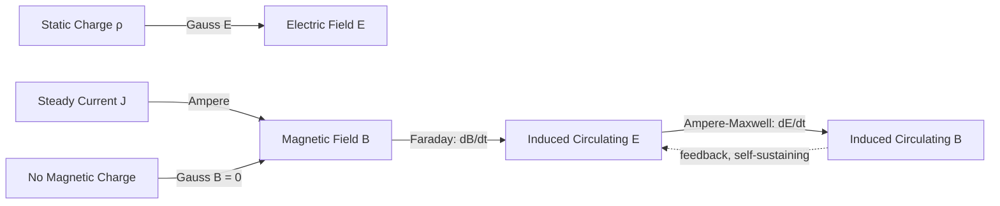

## Maxwell's Equations in Integral and Differential Form

### Overview

Maxwell's equations are the four fundamental equations that describe all classical electromagnetic phenomena — how electric and magnetic fields are generated by charges, currents, and by each other. Each equation exists in two mathematically equivalent forms: **integral form**, which relates field behavior over extended regions (surfaces, loops, volumes) and is often more physically intuitive; and **differential form**, which relates fields at a single point in space via derivatives (divergence and curl), making it the natural language for wave equations and local field theory.

### Mathematical Prerequisites

**Key Points**

- **Divergence** ($\nabla\cdot\vec{F}$): a scalar measuring the net outward flux per unit volume at a point — sources/sinks of a vector field.
- **Curl** ($\nabla\times\vec{F}$): a vector measuring the local rotational tendency ("circulation density") of a vector field at a point.
- **Divergence theorem**: $\int_V(\nabla\cdot\vec{F})\,dV = \oint_S \vec{F}\cdot d\vec{A}$ — converts a volume integral of divergence into a surface flux integral.
- **Stokes' theorem**: $\int_S(\nabla\times\vec{F})\cdot d\vec{A} = \oint_C \vec{F}\cdot d\vec{l}$ — converts a surface integral of curl into a line integral around the boundary.

These two theorems are the mathematical bridge connecting each equation's integral and differential forms.

### 1. Gauss's Law for Electricity

**Integral form:**

$$\oint_S \vec{E}\cdot d\vec{A} = \frac{Q_{enc}}{\epsilon_0}$$

The net electric flux through any closed surface equals the enclosed charge divided by the permittivity of free space.

**Differential form:**

$$\nabla\cdot\vec{E} = \frac{\rho}{\epsilon_0}$$

where $\rho$ is the volume charge density. Applying the divergence theorem to the integral form and noting $Q_{enc} = \int_V \rho\,dV$ yields the differential form directly, since the relation must hold for arbitrary volumes.

**Key Points**

- Physically expresses that electric field lines originate on positive charges and terminate on negative charges — electric charge is the *source* of the electric field's divergence.
- A non-zero divergence at a point means net field lines are emerging from (or converging into) that point, i.e., charge is present there.

### 2. Gauss's Law for Magnetism

**Integral form:**

$$\oint_S \vec{B}\cdot d\vec{A} = 0$$

**Differential form:**

$$\nabla\cdot\vec{B} = 0$$

**Key Points**

- States that there are no magnetic monopoles — magnetic field lines always form closed loops with no beginning or end, so the net magnetic flux through *any* closed surface is always exactly zero.
- This is structurally identical to Gauss's law for $\vec{E}$, but with the source term set to zero, reflecting the empirically-established absence of isolated magnetic charge.
- [Unverified] Whether magnetic monopoles exist at all (e.g., as predicted by some grand unified theories) remains an open experimental question in fundamental physics; no confirmed detection has been made, and this equation reflects all observations to date.

### 3. Faraday's Law of Induction

**Integral form:**

$$\oint_C \vec{E}\cdot d\vec{l} = -\frac{d}{dt}\int_S \vec{B}\cdot d\vec{A} = -\frac{d\Phi_B}{dt}$$

**Differential form:**

$$\nabla\times\vec{E} = -\frac{\partial\vec{B}}{\partial t}$$

Applying Stokes' theorem to the integral form's left side, and equating integrands (valid for arbitrary surfaces $S$), yields the differential form.

**Key Points**

- A time-varying magnetic field creates a circulating (non-conservative) electric field — this is the induction principle underlying generators, transformers, and inductors.
- The negative sign encodes Lenz's law: the induced field opposes the change in magnetic flux that created it.
- Unlike the electrostatic field (which is curl-free, $\nabla\times\vec{E} = 0$), the induced electric field here has non-zero curl and cannot be expressed purely as the gradient of a scalar potential.

### 4. The Ampère–Maxwell Law

**Integral form:**

$$\oint_C \vec{B}\cdot d\vec{l} = \mu_0 I_{enc} + \mu_0\epsilon_0\frac{d\Phi_E}{dt}$$

**Differential form:**

$$\nabla\times\vec{B} = \mu_0\vec{J} + \mu_0\epsilon_0\frac{\partial\vec{E}}{\partial t}$$

**Key Points**

- This is Ampère's original law augmented by Maxwell's displacement current term $\mu_0\epsilon_0\,\partial\vec{E}/\partial t$, which is essential for consistency with charge conservation in time-varying situations and for permitting electromagnetic wave propagation.
- $\vec{J}$ is the conduction current density; the second term represents the displacement current density $\vec{J}_d = \epsilon_0\,\partial\vec{E}/\partial t$.
- Symmetric in structure to Faraday's law: here, a changing electric field (or a real current) creates a circulating magnetic field.

### Summary Table

| # | Name | Integral Form | Differential Form | Physical Meaning |
| --- | --- | --- | --- | --- |
| 1 | Gauss's Law (Electric) | $\oint\vec{E}\cdot d\vec{A} = Q_{enc}/\epsilon_0$ | $\nabla\cdot\vec{E} = \rho/\epsilon_0$ | Charges are sources of $\vec{E}$ |
| 2 | Gauss's Law (Magnetic) | $\oint\vec{B}\cdot d\vec{A} = 0$ | $\nabla\cdot\vec{B} = 0$ | No magnetic monopoles |
| 3 | Faraday's Law | $\oint\vec{E}\cdot d\vec{l} = -d\Phi_B/dt$ | $\nabla\times\vec{E} = -\partial\vec{B}/\partial t$ | Changing $\vec{B}$ induces circulating $\vec{E}$ |
| 4 | Ampère–Maxwell Law | $\oint\vec{B}\cdot d\vec{l} = \mu_0 I_{enc} + \mu_0\epsilon_0\,d\Phi_E/dt$ | $\nabla\times\vec{B} = \mu_0\vec{J} + \mu_0\epsilon_0\,\partial\vec{E}/\partial t$ | Current and changing $\vec{E}$ induce circulating $\vec{B}$ |

### The Lorentz Force Law (Companion Equation)

Maxwell's equations describe how charges and currents produce fields; the **Lorentz force law** describes how those fields act back on a charge $q$ moving with velocity $\vec{v}$:

$$\vec{F} = q\vec{E} + q\vec{v}\times\vec{B}$$

Although not one of the four Maxwell equations proper, this relation is required to close the loop between fields and the mechanical motion of charged matter, and together with Maxwell's equations, it forms the complete classical electrodynamic description.

### Structural Symmetry and Field Interdependence Diagram

### Free-Space (Vacuum) Form and Electromagnetic Waves

In a source-free region ($\rho = 0$, $\vec{J} = 0$, as in vacuum far from any charges), the four differential equations simplify to:

$$\nabla\cdot\vec{E} = 0, \quad \nabla\cdot\vec{B} = 0$$

$$\nabla\times\vec{E} = -\frac{\partial\vec{B}}{\partial t}, \quad \nabla\times\vec{B} = \mu_0\epsilon_0\frac{\partial\vec{E}}{\partial t}$$

Taking the curl of Faraday's law and substituting the Ampère–Maxwell law (using the vector identity $\nabla\times(\nabla\times\vec{F}) = \nabla(\nabla\cdot\vec{F}) - \nabla^2\vec{F}$, with $\nabla\cdot\vec{E}=0$) produces the electromagnetic wave equation:

$$\nabla^2\vec{E} = \mu_0\epsilon_0\frac{\partial^2\vec{E}}{\partial t^2}$$

with an identical equation for $\vec{B}$. This confirms that Maxwell's equations, entirely on their own with no source terms, predict self-propagating electromagnetic waves traveling at speed $c = 1/\sqrt{\mu_0\epsilon_0}$.

### Field Line Topology Comparison (svg_diagram)

<svg xmlns="http://www.w3.org/2000/svg" viewBox="0 0 520 260">
<text x="260" y="24" font-size="16" text-anchor="middle" fill="#222">Divergent vs. Circulating Field Patterns (svg_diagram)</text>
<circle cx="130" cy="140" r="6" fill="#a04000" />
<text x="130" y="165" font-size="11" text-anchor="middle" fill="#a04000">+Q</text>
<line x1="130" y1="140" x2="130" y2="80" stroke="#1a5276" stroke-width="1.5" marker-end="url(a1)" />
<line x1="130" y1="140" x2="180" y2="100" stroke="#1a5276" stroke-width="1.5" marker-end="url(a1)" />
<line x1="130" y1="140" x2="80" y2="100" stroke="#1a5276" stroke-width="1.5" marker-end="url(a1)" />
<line x1="130" y1="140" x2="130" y2="200" stroke="#1a5276" stroke-width="1.5" marker-end="url(a1)" />
<line x1="130" y1="140" x2="180" y2="180" stroke="#1a5276" stroke-width="1.5" marker-end="url(a1)" />
<line x1="130" y1="140" x2="80" y2="180" stroke="#1a5276" stroke-width="1.5" marker-end="url(a1)" />
<text x="130" y="230" font-size="12" text-anchor="middle" fill="#333">Gauss's Law: E diverges from charge</text>
<ellipse cx="380" cy="140" rx="55" ry="55" fill="none" stroke="#27ae60" stroke-width="2.5" />
<path d="M 380 85 A 55 55 0 0 1 435 140" fill="none" stroke="#27ae60" stroke-width="2.5" marker-end="url(a2)" />
<text x="380" y="145" font-size="11" text-anchor="middle" fill="#27ae60">dB/dt (in)</text>
<text x="380" y="230" font-size="12" text-anchor="middle" fill="#333">Faraday/Ampère-Maxwell: circulating field</text>
</svg>

### Boundary Conditions (Practical Consequence)

At an interface between two media, Maxwell's equations in integral form (applied to small pillbox and loop constructions straddling the boundary) yield standard boundary conditions:

- $\vec{E}_{\parallel}$ is continuous across the interface (from Faraday's law with a vanishingly thin loop)
- $\vec{B}_{\perp}$ is continuous across the interface (from Gauss's law for magnetism)
- Discontinuities in $\vec{D}_\perp$ (electric displacement) relate to free surface charge density; discontinuities in $\vec{H}_\parallel$ relate to free surface current density (Ampère–Maxwell law)

These conditions are essential for solving boundary-value problems such as reflection/transmission of electromagnetic waves at interfaces (e.g., Fresnel equations, waveguides).

### Applications

**Key Points**

- **Antenna design and radio-frequency engineering**: predicting radiation patterns and impedance from time-varying charge/current distributions using the full Maxwell system.
- **Optics as electromagnetic wave theory**: refraction, reflection, diffraction, and polarization all follow from Maxwell's equations at interfaces and in bulk media.
- **Circuit theory as a low-frequency approximation**: Kirchhoff's laws emerge as simplified limits of Maxwell's equations when the physical dimensions of a circuit are much smaller than the wavelength of the signals involved (quasi-static approximation).
- **Computational electromagnetics**: numerical methods (FDTD, method of moments, finite element) directly discretize the differential or integral forms to simulate antennas, waveguides, and scattering problems.

### Common Pitfalls

**Key Points**

- Treating the integral and differential forms as separate laws rather than mathematically equivalent statements — the differential form is simply the "point-wise" version of the integral form, related by the divergence and Stokes' theorems.
- Forgetting the displacement current term in the Ampère–Maxwell law when analyzing any situation involving a time-varying electric field (e.g., capacitor charging, wave propagation in vacuum).
- Assuming Gauss's law for magnetism ($\nabla\cdot\vec{B}=0$) is a special case rather than a fully general and exact statement — it must hold for *every* magnetic field configuration, discovered or hypothetical, given no observed magnetic monopoles.
- Confusing $\vec{E}$ and $\vec{D}$ (or $\vec{B}$ and $\vec{H}$) when applying Maxwell's equations inside material media — the vacuum forms given here require modification (via constitutive relations $\vec{D} = \epsilon\vec{E}$, $\vec{B} = \mu\vec{H}$) when dielectric or magnetic materials are present.

**Next Steps**

- Gauss's Law and Electric Flux
- Faraday's Law of Electromagnetic Induction
- The Displacement Current and Ampère–Maxwell Law
- The Electromagnetic Wave Equation and Derivation
- Boundary Conditions at Material Interfaces
- Poynting Vector and Electromagnetic Energy Flow
- Electromagnetic Waves in Dielectric and Conducting Media
- Vector Calculus: Divergence, Curl, and the Relevant Integral Theorems