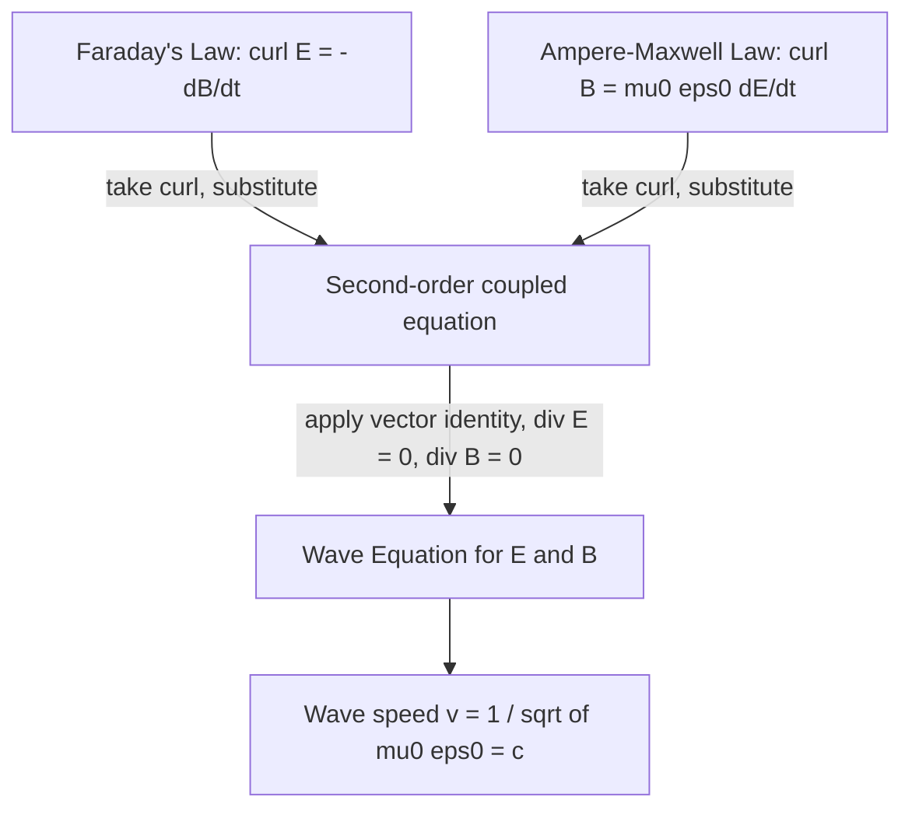

## Derivation of the Electromagnetic Wave Equation

### Starting Point: Maxwell's Equations in Free Space

The derivation begins with Maxwell's equations in a source-free region — vacuum, with no free charges ($\rho = 0$) and no conduction currents ($\vec{J} = 0$). Under these conditions, all four equations in differential form become:

$$\nabla\cdot\vec{E} = 0 \quad \text{(1)}$$

$$\nabla\cdot\vec{B} = 0 \quad \text{(2)}$$

$$\nabla\times\vec{E} = -\frac{\partial\vec{B}}{\partial t} \quad \text{(3, Faraday's law)}$$

$$\nabla\times\vec{B} = \mu_0\epsilon_0\frac{\partial\vec{E}}{\partial t} \quad \text{(4, Ampère–Maxwell law)}$$

The goal is to decouple these two coupled first-order curl equations (3) and (4) into a single second-order equation involving only $\vec{E}$ (or only $\vec{B}$).

### Step 1: Take the Curl of Faraday's Law

Apply the curl operator to both sides of equation (3):

$$\nabla\times(\nabla\times\vec{E}) = \nabla\times\left(-\frac{\partial\vec{B}}{\partial t}\right)$$

Since spatial differentiation (curl) and time differentiation commute (assuming well-behaved fields), the right-hand side can be rewritten:

$$\nabla\times(\nabla\times\vec{E}) = -\frac{\partial}{\partial t}(\nabla\times\vec{B})$$

### Step 2: Substitute the Ampère–Maxwell Law

Substitute equation (4) for $\nabla\times\vec{B}$ into the right-hand side:

$$\nabla\times(\nabla\times\vec{E}) = -\frac{\partial}{\partial t}\left(\mu_0\epsilon_0\frac{\partial\vec{E}}{\partial t}\right) = -\mu_0\epsilon_0\frac{\partial^2\vec{E}}{\partial t^2}$$

This is the key step where the two equations become linked: the spatial behavior of $\vec{E}$ (via the double curl on the left) is now directly tied to its own time evolution.

### Step 3: Apply the Vector Identity for Curl of a Curl

A standard vector calculus identity states:

$$\nabla\times(\nabla\times\vec{F}) = \nabla(\nabla\cdot\vec{F}) - \nabla^2\vec{F}$$

Applying this to $\vec{F} = \vec{E}$:

$$\nabla\times(\nabla\times\vec{E}) = \nabla(\nabla\cdot\vec{E}) - \nabla^2\vec{E}$$

From equation (1), $\nabla\cdot\vec{E} = 0$ in the source-free region, so $\nabla(\nabla\cdot\vec{E}) = 0$. This eliminates the gradient term entirely:

$$\nabla\times(\nabla\times\vec{E}) = -\nabla^2\vec{E}$$

### Step 4: Combine and Obtain the Wave Equation

Equating the two expressions derived for $\nabla\times(\nabla\times\vec{E})$:

$$-\nabla^2\vec{E} = -\mu_0\epsilon_0\frac{\partial^2\vec{E}}{\partial t^2}$$

$$\boxed{\nabla^2\vec{E} = \mu_0\epsilon_0\frac{\partial^2\vec{E}}{\partial t^2}}$$

By an entirely symmetric derivation — starting instead by taking the curl of the Ampère–Maxwell law (4) and substituting Faraday's law (3), using $\nabla\cdot\vec{B}=0$ from equation (2) — an identical equation is obtained for $\vec{B}$:

$$\nabla^2\vec{B} = \mu_0\epsilon_0\frac{\partial^2\vec{B}}{\partial t^2}$$

**Key Points**

- Both $\vec{E}$ and $\vec{B}$ independently satisfy the same second-order partial differential equation — the classical wave equation.
- This derivation shows that electromagnetic waves are not assumed but emerge as a *necessary mathematical consequence* of Maxwell's coupled equations, requiring no additional postulates beyond the four field equations themselves.
- The vanishing divergence terms ($\nabla\cdot\vec{E}=0$, $\nabla\cdot\vec{B}=0$) are essential to this derivation — they are what allow the double-curl identity to reduce cleanly to $-\nabla^2$ rather than leaving an extra gradient term.

### Identifying the Wave Speed

The general 3D scalar/vector wave equation has the form:

$$\nabla^2\psi = \frac{1}{v^2}\frac{\partial^2\psi}{\partial t^2}$$

where $v$ is the wave's propagation speed. Comparing this standard form to the derived equation:

$$\frac{1}{v^2} = \mu_0\epsilon_0 \quad\Rightarrow\quad v = \frac{1}{\sqrt{\mu_0\epsilon_0}}$$

Substituting the known constants $\mu_0 = 4\pi\times10^{-7}\ \text{T·m/A}$ (exact, by definition prior to the 2019 SI redefinition, and still the standard reference value) and $\epsilon_0 = 8.8542\times10^{-12}\ \text{F/m}$:

$$v = \frac{1}{\sqrt{(4\pi\times10^{-7})(8.8542\times10^{-12})}} \approx 2.998\times10^8\ \text{m/s}$$

This value matches the experimentally measured speed of light $c$ to extremely high precision — a result Maxwell himself recognized as strong evidence that light is an electromagnetic phenomenon, unifying optics with electromagnetism.

### Plane Wave Solutions

**Example**

A standard solution to the 1D wave equation propagating along the $z$-axis is a sinusoidal plane wave:

$$\vec{E}(z,t) = E_0\cos(kz - \omega t)\,\hat{x}$$

Substituting into $\partial^2 E_x/\partial z^2 = \mu_0\epsilon_0\,\partial^2E_x/\partial t^2$:

$$-k^2E_0\cos(kz-\omega t) = \mu_0\epsilon_0(-\omega^2)E_0\cos(kz-\omega t)$$

$$k^2 = \mu_0\epsilon_0\omega^2 \quad\Rightarrow\quad \frac{\omega}{k} = \frac{1}{\sqrt{\mu_0\epsilon_0}} = c$$

confirming that the wave travels at speed $c$, with wavelength $\lambda = 2\pi/k$ and frequency $f = \omega/(2\pi)$ related by $c = f\lambda$, the standard wave relation.

### The Coupled E and B Fields

Faraday's law imposes a specific relationship between the electric and magnetic field components of the wave. For the plane wave above, applying $\nabla\times\vec{E} = -\partial\vec{B}/\partial t$ shows that $\vec{B}$ must point along $\hat{y}$ (perpendicular to both $\vec{E}$ and the propagation direction $\hat{z}$), with magnitude related by:

$$B_0 = \frac{E_0}{c}$$

**Key Points**

- $\vec{E}$, $\vec{B}$, and the propagation direction $\hat{k}$ form a mutually perpendicular right-handed triad at every point and instant — electromagnetic waves are strictly transverse in vacuum.
- $\vec{E}$ and $\vec{B}$ oscillate exactly in phase with each other (same $\cos(kz-\omega t)$ dependence), reaching maxima and zeros simultaneously.
- The fixed ratio $E_0/B_0 = c$ holds for any plane electromagnetic wave in vacuum, regardless of frequency or amplitude.

### Wave Propagation Diagram

### Transverse Wave Structure (svg_diagram)

<svg xmlns="http://www.w3.org/2000/svg" viewBox="0 0 520 260">
<text x="260" y="24" font-size="16" text-anchor="middle" fill="#222">E and B Fields in a Plane EM Wave (svg_diagram)</text>
<line x1="40" y1="140" x2="480" y2="140" stroke="#666" stroke-width="1.5" marker-end="url(az)" />
<text x="490" y="145" font-size="12" fill="#666">z (propagation)</text>
<path d="M 60 140 Q 100 60, 140 140 T 220 140 T 300 140 T 380 140 T 460 140" fill="none" stroke="#a04000" stroke-width="2.5" />
<text x="465" y="80" font-size="12" fill="#a04000">E (x-direction)</text>
<path d="M 60 140 Q 100 220, 140 140 T 220 140 T 300 140 T 380 140 T 460 140" fill="none" stroke="#1a5276" stroke-width="2.5" stroke-dasharray="1,0" />
<text x="465" y="215" font-size="12" fill="#1a5276">B (y-direction, into/out of page sense)</text>
<text x="260" y="245" font-size="12" text-anchor="middle" fill="#333">E, B, and propagation direction are mutually perpendicular</text>
</svg>

### Wave Equation in Media (Generalization)

Inside a linear, homogeneous, non-conducting dielectric medium with permittivity $\epsilon = \epsilon_r\epsilon_0$ and permeability $\mu = \mu_r\mu_0$, the identical derivation (using the medium's constitutive relations) yields:

$$\nabla^2\vec{E} = \mu\epsilon\frac{\partial^2\vec{E}}{\partial t^2}$$

giving a phase velocity:

$$v = \frac{1}{\sqrt{\mu\epsilon}} = \frac{c}{\sqrt{\mu_r\epsilon_r}} = \frac{c}{n}$$

where $n = \sqrt{\mu_r\epsilon_r}$ is the medium's index of refraction (for most non-magnetic dielectrics, $\mu_r \approx 1$, so $n \approx \sqrt{\epsilon_r}$). This directly connects the wave equation derivation to the optics of refraction.

### Worked Example: Verifying Wave Speed in a Dielectric

**Example**

Glass has a relative permittivity $\epsilon_r \approx 2.25$ (with $\mu_r \approx 1$, non-magnetic). Find the wave speed and index of refraction.

$$n = \sqrt{\mu_r\epsilon_r} = \sqrt{(1)(2.25)} = 1.5$$

$$v = \frac{c}{n} = \frac{3\times10^8}{1.5} = 2\times10^8\ \text{m/s}$$

This matches the well-known refractive index of common glass, confirming the wave equation's consistency with measured optical properties. [Inference] Real glass shows slight frequency-dependence (dispersion) in $\epsilon_r$ and thus $n$, so this calculation represents an idealized, frequency-independent approximation rather than the exact behavior across the visible spectrum.

### Common Pitfalls

**Key Points**

- Forgetting that $\nabla\cdot\vec{E}=0$ and $\nabla\cdot\vec{B}=0$ are essential inputs to the derivation — omitting them leaves an uncancelled gradient term and an incorrect (or incomplete) wave equation.
- Misapplying the vector identity $\nabla\times(\nabla\times\vec{F}) = \nabla(\nabla\cdot\vec{F}) - \nabla^2\vec{F}$, particularly sign errors, which propagate through to an incorrect final wave equation.
- Assuming the wave equation derivation requires charges or currents to be present — it explicitly applies to the source-free (vacuum) case, which is what makes the self-sustaining propagation of light through empty space possible.
- Treating $\vec{E}$ and $\vec{B}$ as independent oscillators rather than recognizing they are rigidly locked in phase and magnitude ratio ($E_0 = cB_0$) by Faraday's and Ampère–Maxwell's laws.

**Next Steps**

- Maxwell's Equations in Integral and Differential Form
- The Displacement Current and Its Role in Wave Propagation
- Poynting Vector and Electromagnetic Energy Flow
- Plane Wave Solutions and Polarization
- Electromagnetic Waves in Conducting Media and Skin Depth
- Reflection and Transmission at Dielectric Boundaries
- Index of Refraction and Dispersion
- The Electromagnetic Spectrum