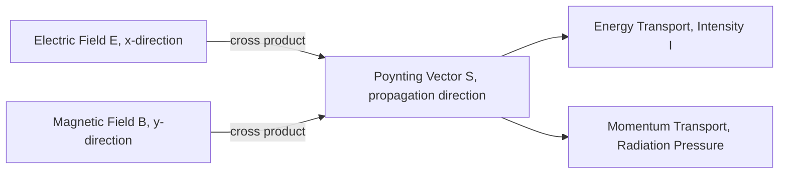

## Properties of Electromagnetic Waves

### Overview

Electromagnetic (EM) waves are self-propagating oscillations of coupled electric and magnetic fields, emerging directly as solutions to Maxwell's equations in source-free regions. Unlike mechanical waves, EM waves require no medium and can propagate through vacuum. Their behavior is governed entirely by the structure of Maxwell's equations, giving rise to a specific and universal set of properties: transversality, fixed field ratios, energy transport, momentum carrying, and polarization.

### Transverse Nature

For a plane EM wave traveling in the $+\hat{z}$ direction, both $\vec{E}$ and $\vec{B}$ oscillate in directions perpendicular to the direction of propagation:

$$\vec{E}(z,t) = E_0\cos(kz-\omega t)\,\hat{x}, \qquad \vec{B}(z,t) = B_0\cos(kz-\omega t)\,\hat{y}$$

**Key Points**

- $\vec{E}$, $\vec{B}$, and the propagation direction $\hat{k}$ form a mutually orthogonal, right-handed set: $\hat{E}\times\hat{B} = \hat{k}$.
- This transversality follows directly from the zero-divergence conditions $\nabla\cdot\vec{E}=0$ and $\nabla\cdot\vec{B}=0$ in source-free regions — neither field can have a component along the propagation direction without violating these conditions for a traveling wave solution.
- EM waves contrast with longitudinal waves (e.g., sound), where oscillation is parallel to propagation.

### Fixed Field Ratio: E = cB

Faraday's law directly links the magnitudes of the two field components at every point and instant:

$$E_0 = cB_0 \qquad \text{(SI units, vacuum)}$$

**Key Points**

- This ratio is universal for any plane EM wave in vacuum, independent of frequency, amplitude, or wavelength.
- $\vec{E}$ and $\vec{B}$ oscillate exactly in phase — both reach zero and maximum simultaneously, never independently.
- In a medium, the analogous relation becomes $E_0 = vB_0$ where $v = c/n$ is the wave's phase velocity in that medium.

### Wave Speed, Frequency, and Wavelength

$$c = f\lambda = \frac{\omega}{k}$$

where $c \approx 3.00\times10^8\ \text{m/s}$ in vacuum, $f$ is frequency (Hz), $\lambda$ is wavelength (m), $\omega = 2\pi f$ is angular frequency, and $k = 2\pi/\lambda$ is the wavenumber.

**Key Points**

- All EM waves — from radio waves to gamma rays — travel at the same speed $c$ in vacuum; they differ only in frequency and wavelength.
- This speed is a fundamental constant derived directly from Maxwell's equations: $c = 1/\sqrt{\mu_0\epsilon_0}$, independent of any observer's reference frame (a cornerstone later incorporated into special relativity).
- In a dispersive medium, different frequencies travel at different phase velocities, causing effects like the separation of white light into a spectrum by a prism.

### Energy Density and the Poynting Vector

An EM wave carries energy, stored in both its electric and magnetic field components. The instantaneous energy density is:

$$u = u_E + u_B = \frac{1}{2}\epsilon_0E^2 + \frac{1}{2\mu_0}B^2$$

Using $B = E/c$ and $c^2 = 1/(\mu_0\epsilon_0)$, it can be shown that at every instant $u_E = u_B$ — the electric and magnetic fields contribute *equally* to the total energy density:

$$u = \epsilon_0 E^2$$

The directional flow of this energy is described by the **Poynting vector**:

$$\vec{S} = \frac{1}{\mu_0}\vec{E}\times\vec{B}$$

$\vec{S}$ points in the direction of wave propagation, with magnitude equal to the instantaneous power per unit area (W/m²) carried by the wave.

**Key Points**

- The time-averaged Poynting vector magnitude, called **intensity**, is: $I = \langle S\rangle = \frac{1}{2}\epsilon_0cE_0^2 = \frac{cB_0^2}{2\mu_0} = \frac{E_0B_0}{2\mu_0}$.
- Intensity follows an inverse-square law from a point source: $I \propto 1/r^2$, since the same total power spreads over a sphere of increasing area $4\pi r^2$.
- Because $\vec{S} = \frac{1}{\mu_0}\vec{E}\times\vec{B}$ is always perpendicular to both fields, energy flow direction is automatically consistent with the wave's propagation direction $\hat{k}$.

### Momentum and Radiation Pressure

EM waves carry linear momentum as well as energy. The momentum density is related to the energy density by:

$$p = \frac{u}{c}$$

When an EM wave is fully absorbed by a surface, it exerts a **radiation pressure**:

$$P_{rad} = \frac{I}{c} \quad \text{(full absorption)}$$

$$P_{rad} = \frac{2I}{c} \quad \text{(full reflection)}$$

The factor of 2 for reflection arises because the wave's momentum must be reversed rather than merely absorbed, transferring twice the momentum per unit time to the reflecting surface.

**Example**

Sunlight at Earth's orbit has an intensity of approximately $I \approx 1360\ \text{W/m}^2$ (the solar constant). The radiation pressure on a perfectly absorbing surface is:

$$P_{rad} = \frac{I}{c} = \frac{1360}{3\times10^8} \approx 4.5\times10^{-6}\ \text{Pa}$$

Though minuscule, this pressure is the operating principle behind solar sails for spacecraft propulsion, where cumulative thrust over long durations can produce meaningful orbital changes despite the small instantaneous force.

### Polarization

Polarization describes the orientation and time-behavior of the $\vec{E}$ field vector as the wave propagates.

**Key Points**

- **Linear polarization**: $\vec{E}$ oscillates along a single fixed direction (e.g., purely along $\hat{x}$).
- **Circular polarization**: formed by superposing two linearly polarized waves of equal amplitude, perpendicular directions, and a 90° phase difference; the resulting $\vec{E}$ vector traces a circle (rotating at constant magnitude) as the wave propagates.
- **Elliptical polarization**: the general case, formed by two perpendicular components with arbitrary relative amplitude and phase difference; linear and circular polarization are special limiting cases.
- **Unpolarized light**: (e.g., from thermal/incoherent sources like the sun or an incandescent bulb) consists of a rapidly and randomly varying superposition of polarization states, with no fixed orientation over observable timescales.
- Polarizing filters transmit only the field component along their transmission axis; for linearly polarized light incident at angle $\theta$ to the filter axis, the transmitted intensity follows **Malus's law**: $I = I_0\cos^2\theta$.

### Worked Example: Malus's Law

**Example**

Unpolarized light of intensity $I_0 = 100\ \text{W/m}^2$ passes through a first polarizer, then a second polarizer oriented at 30° to the first.

Step 1 — After the first polarizer (unpolarized → linear polarized), intensity is halved regardless of orientation:

$$I_1 = \frac{I_0}{2} = 50\ \text{W/m}^2$$

Step 2 — Apply Malus's law for the second polarizer at $\theta = 30°$:

$$I_2 = I_1\cos^2(30°) = 50 \times (0.866)^2 \approx 50\times0.75 = 37.5\ \text{W/m}^2$$

### The Electromagnetic Spectrum

EM waves span an enormous range of frequencies/wavelengths, all governed by identical underlying physics but exhibiting very different interactions with matter due to their differing photon energies ($E_{photon} = hf$).

| Region | Approx. Wavelength Range | Approx. Frequency Range | Typical Sources/Uses |
| --- | --- | --- | --- |
| Radio | > 1 m | < 300 MHz | Broadcasting, communications |
| Microwave | 1 mm – 1 m | 300 MHz – 300 GHz | Radar, ovens, Wi-Fi |
| Infrared | 700 nm – 1 mm | 300 GHz – 430 THz | Thermal radiation, remote controls |
| Visible light | 400 – 700 nm | 430 – 750 THz | Human vision |
| Ultraviolet | 10 – 400 nm | 750 THz – 30 PHz | Sterilization, sunburn |
| X-rays | 0.01 – 10 nm | 30 PHz – 30 EHz | Medical imaging |
| Gamma rays | < 0.01 nm | > 30 EHz | Nuclear decay, astrophysics |

### Field and Energy Flow Diagram

### Polarization States Illustration (svg_diagram)

<svg xmlns="http://www.w3.org/2000/svg" viewBox="0 0 520 220">
<text x="260" y="22" font-size="16" text-anchor="middle" fill="#222">Linear vs. Circular Polarization (svg_diagram)</text>
<line x1="60" y1="120" x2="60" y2="40" stroke="#a04000" stroke-width="2.5" marker-end="url(p1)" />
<line x1="60" y1="120" x2="60" y2="200" stroke="#a04000" stroke-width="1" stroke-dasharray="3,3" />
<text x="60" y="215" font-size="12" text-anchor="middle" fill="#333">Linear (fixed axis)</text>
<circle cx="260" cy="120" r="60" fill="none" stroke="#909497" stroke-width="1" stroke-dasharray="3,3" />
<line x1="260" y1="120" x2="260" y2="60" stroke="#1a5276" stroke-width="2.5" marker-end="url(p2)" />
<path d="M 260 60 A 60 60 0 0 1 320 120" fill="none" stroke="#1a5276" stroke-width="1.5" stroke-dasharray="4,3" />
<text x="260" y="215" font-size="12" text-anchor="middle" fill="#333">Circular (rotating E vector)</text>
<ellipse cx="440" cy="120" rx="60" ry="30" fill="none" stroke="#27ae60" stroke-width="2" stroke-dasharray="4,3" />
<line x1="440" y1="120" x2="470" y2="98" stroke="#27ae60" stroke-width="2.5" marker-end="url(p3)" />
<text x="440" y="215" font-size="12" text-anchor="middle" fill="#333">Elliptical (general case)</text>
</svg>

### Applications

**Key Points**

- **Wireless communications**: radio and microwave EM waves carry modulated information across the spectrum, with antenna design relying directly on Maxwell's equations and wave propagation properties.
- **Polarized sunglasses and LCD screens**: exploit Malus's law and selective polarization to reduce glare or control pixel brightness.
- **Solar sails and radiation pressure propulsion**: use the momentum-carrying property of light for spacecraft thrust without propellant.
- **Remote sensing and spectroscopy**: different EM spectrum regions interact distinctly with matter (absorption, scattering, fluorescence), enabling material identification, medical imaging, and astronomical observation.
- **Fiber optic communication**: relies on total internal reflection of EM waves (visible/near-infrared) governed by wave behavior at dielectric interfaces.

### Common Pitfalls

**Key Points**

- Assuming $\vec{E}$ and $\vec{B}$ can have arbitrary independent amplitudes — they are rigidly locked by $E_0 = cB_0$ in vacuum, a direct consequence of Faraday's law.
- Confusing energy density (an instantaneous, position-dependent quantity) with intensity (a time-averaged flux quantity) — intensity involves an additional time-averaging step over the oscillation, introducing the factor of $\frac{1}{2}$ for sinusoidal waves.
- Forgetting the factor of 2 for radiation pressure on a *reflecting* versus *absorbing* surface — a common source of error in momentum-transfer problems.
- Treating polarization as an all-or-nothing property — real light sources and optical systems often involve partial polarization, requiring a more general (Stokes parameter) description beyond the simple linear/circular/elliptical classification for full generality. [Inference] This nuance is typically introduced only in advanced optics treatments rather than an introductory EM waves discussion.

**Next Steps**

- Derivation of the Electromagnetic Wave Equation
- The Poynting Vector and Energy Flow in Detail
- Polarization: Malus's Law and Polarizing Devices
- Radiation Pressure and Photon Momentum
- The Electromagnetic Spectrum and Photon Energy
- Reflection, Refraction, and Total Internal Reflection
- Doppler Effect for Electromagnetic Waves
- Antenna Radiation Patterns and Dipole Radiation