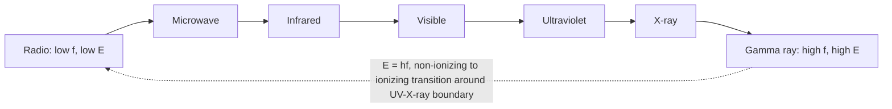

## The Electromagnetic Spectrum

### Overview

The electromagnetic spectrum is the complete range of frequencies (and corresponding wavelengths) over which electromagnetic radiation exists, from extremely low-frequency radio waves to extremely high-frequency gamma rays. All regions of the spectrum are physically identical in nature — self-propagating transverse oscillations of coupled $\vec{E}$ and $\vec{B}$ fields obeying the same wave equation derived from Maxwell's equations, all traveling at speed $c$ in vacuum. The regions differ only in frequency $f$, wavelength $\lambda$, and photon energy $E$, related by:

$$c = f\lambda, \qquad E = hf = \frac{hc}{\lambda}$$

where $h = 6.626\times10^{-34}\ \text{J·s}$ is Planck's constant. It is this photon energy that determines how radiation of a given frequency interacts with matter, producing the dramatically different physical effects (heating, ionization, chemical change) observed across the spectrum despite the underlying wave physics being identical.

### Spectrum Regions and Boundaries

**Key Points**

- Boundaries between adjacent regions are not sharp physical divisions but conventional demarcations based on typical generation methods, detection techniques, and characteristic interactions with matter.
- The spectrum is continuous — there is no physical wavelength gap between, say, the top of the infrared range and the bottom of the microwave range.
- Wavelength and frequency are inversely related, so "higher frequency" always corresponds to "shorter wavelength" across the entire spectrum.

| Region | Wavelength Range | Frequency Range | Photon Energy Range |
| --- | --- | --- | --- |
| Radio | > 1 m | < 300 MHz | < 1.24 μeV |
| Microwave | 1 mm – 1 m | 300 MHz – 300 GHz | 1.24 μeV – 1.24 meV |
| Infrared | 700 nm – 1 mm | 300 GHz – 430 THz | 1.24 meV – 1.77 eV |
| Visible | 400 – 700 nm | 430 – 750 THz | 1.77 – 3.10 eV |
| Ultraviolet | 10 – 400 nm | 750 THz – 30 PHz | 3.10 eV – 124 eV |
| X-ray | 0.01 – 10 nm | 30 PHz – 30 EHz | 124 eV – 124 keV |
| Gamma ray | < 0.01 nm | > 30 EHz | > 124 keV |

### Radio Waves

**Key Points**

- Generated by oscillating currents in antennas (macroscopic circuit-scale currents, per antenna theory and Maxwell's equations); frequencies range from a few Hz up to about 300 GHz depending on classification convention.
- Sub-bands include AM radio (~530–1700 kHz), FM radio (~88–108 MHz), and various bands allocated for television, aviation, and mobile communication.
- Low photon energy means radio waves are non-ionizing and generally pass through many non-conducting materials with limited absorption.
- Applications: broadcasting, wireless communication, radar, radio astronomy (detecting radio emission from astrophysical sources like pulsars and the cosmic microwave background).

### Microwaves

**Key Points**

- Typically generated by specialized electronic devices such as magnetrons and klystrons, or solid-state oscillators, rather than simple wire antennas.
- Water molecules absorb microwave radiation efficiently at certain frequencies due to rotational transitions, the basis for microwave ovens (typically operating at 2.45 GHz).
- Used extensively in radar systems, satellite communication, and Wi-Fi/Bluetooth (2.4 GHz and 5 GHz bands).
- The cosmic microwave background (CMB) radiation, a relic of the early universe, peaks in this region of the spectrum and provides key evidence for the Big Bang model.

### Infrared Radiation

**Key Points**

- Commonly associated with thermal (heat) radiation — objects at everyday temperatures emit predominantly in the infrared according to blackbody radiation principles (Wien's displacement law: $\lambda_{max} \propto 1/T$).
- Subdivided into near-infrared (closest to visible), mid-infrared, and far-infrared, each with distinct applications.
- Used in thermal imaging cameras, night-vision equipment, remote controls, and fiber-optic telecommunications (which often use near-infrared wavelengths around 1310 nm and 1550 nm for low fiber attenuation).
- Molecular vibrational transitions (bond stretching/bending) typically absorb in the infrared, making IR spectroscopy a key tool for identifying chemical compounds.

### Visible Light

**Key Points**

- The narrow band (approximately 400–700 nm) to which human photoreceptors (rods and cones) are sensitive; this sensitivity range coincides closely with the peak emission wavelength of the sun, consistent with evolutionary adaptation to solar illumination.
- Perceived color corresponds to wavelength: violet/blue at the short-wavelength end (~400–500 nm), through green and yellow, to red at the long-wavelength end (~620–700 nm).
- Governs the entire field of classical optics: reflection, refraction, diffraction, interference, and polarization phenomena are most commonly studied and observed in this band.
- The only region of the spectrum directly perceptible to unaided human vision, though many other organisms (e.g., some insects, birds) can perceive into the near-ultraviolet or near-infrared.

### Ultraviolet Radiation

**Key Points**

- Divided into UV-A (315–400 nm, least harmful, largely passes through atmospheric ozone), UV-B (280–315 nm, partially absorbed by ozone, primary cause of sunburn), and UV-C (100–280 nm, almost entirely absorbed by the atmosphere, strongly germicidal).
- Sufficient photon energy to break some molecular bonds and cause photochemical reactions, including DNA damage — the basis for both UV's biological hazards (skin cancer risk) and its beneficial uses (vitamin D synthesis in skin, water/surface sterilization).
- Ozone layer absorption of UV-B and UV-C is critical to shielding the biosphere from harmful high-energy UV.
- Used in fluorescent lighting (with a phosphor coating converting UV to visible light), sterilization equipment, and fluorescence-based analytical techniques.

### X-rays

**Key Points**

- Photon energies in the keV range are sufficient to penetrate soft tissue while being more strongly absorbed by denser material (bone, metal), the physical basis for radiographic medical imaging.
- Generated by high-energy electron transitions in atoms (characteristic X-rays) or by rapid deceleration of energetic electrons striking a target (bremsstrahlung radiation) in X-ray tubes.
- Sufficiently energetic to ionize atoms directly, making X-rays a form of ionizing radiation requiring shielding (e.g., lead) and dose management in medical and industrial use.
- Applications: medical radiography and CT scanning, airport security screening, crystallography (X-ray diffraction for determining atomic/molecular structure), and astrophysical observation of high-energy sources.

### Gamma Rays

**Key Points**

- The highest-energy, shortest-wavelength region of the spectrum, typically originating from nuclear processes — radioactive decay, nuclear reactions, and high-energy astrophysical events (supernovae, gamma-ray bursts, matter-antimatter annihilation).
- Extremely penetrating and strongly ionizing, requiring substantial shielding (thick lead or concrete) for radiation protection.
- Applications: cancer radiotherapy (targeted destruction of malignant cells), sterilization of medical equipment, and gamma-ray astronomy for studying the most energetic processes in the universe.
- [Unverified] The precise boundary between "hard X-rays" and "gamma rays" is sometimes defined by origin (nuclear vs. atomic/electronic processes) rather than strictly by wavelength, so some sources describe overlapping wavelength ranges for the two categories.

### Spectrum Visualization Diagram (svg_diagram)

<svg xmlns="http://www.w3.org/2000/svg" viewBox="0 0 700 220">
<text x="350" y="22" font-size="16" text-anchor="middle" fill="#222">The Electromagnetic Spectrum (svg_diagram)</text>
<rect x="40" y="70" width="620" height="50" fill="none" stroke="#333" stroke-width="1" />
<rect x="40" y="70" width="80" height="50" fill="#d5d8dc" />
<rect x="120" y="70" width="70" height="50" fill="#aeb6bf" />
<rect x="190" y="70" width="90" height="50" fill="#f1c40f" opacity="0.5" />
<rect x="280" y="70" width="50" height="50" fill="linear-gradient(#8e44ad)" fill-opacity="0.8" style="fill:#8e44ad" />
<rect x="330" y="70" width="70" height="50" fill="#e67e22" opacity="0.6" />
<rect x="400" y="70" width="90" height="50" fill="#5dade2" opacity="0.6" />
<rect x="490" y="70" width="90" height="50" fill="#7f8c8d" />
<rect x="580" y="70" width="80" height="50" fill="#34495e" />
<text x="80" y="100" font-size="11" text-anchor="middle" fill="#333">Radio</text>
<text x="155" y="100" font-size="11" text-anchor="middle" fill="#333">Microwave</text>
<text x="235" y="100" font-size="11" text-anchor="middle" fill="#333">Infrared</text>
<text x="305" y="100" font-size="10" text-anchor="middle" fill="#fff">Vis</text>
<text x="365" y="100" font-size="11" text-anchor="middle" fill="#333">UV</text>
<text x="445" y="100" font-size="11" text-anchor="middle" fill="#333">X-ray</text>
<text x="535" y="100" font-size="11" text-anchor="middle" fill="#fff">Gamma</text>
<line x1="40" y1="140" x2="40" y2="150" stroke="#333" />
<text x="40" y="165" font-size="10" text-anchor="middle" fill="#333">longer λ</text>
<line x1="660" y1="140" x2="660" y2="150" stroke="#333" />
<text x="660" y="165" font-size="10" text-anchor="middle" fill="#333">shorter λ</text>
<text x="350" y="180" font-size="12" text-anchor="middle" fill="#333">Increasing frequency and photon energy →</text>
</svg>

### Frequency-Energy Relation Diagram

### Worked Example: Photon Energy Calculation

**Example**

Find the photon energy of green light with wavelength $\lambda = 550\ \text{nm}$.

$$E = \frac{hc}{\lambda} = \frac{(6.626\times10^{-34})(3\times10^8)}{550\times10^{-9}}$$

$$E \approx 3.615\times10^{-19}\ \text{J}$$

Converting to electron-volts ($1\ \text{eV} = 1.602\times10^{-19}\ \text{J}$):

$$E \approx \frac{3.615\times10^{-19}}{1.602\times10^{-19}} \approx 2.26\ \text{eV}$$

This falls within the expected visible-light photon energy range (1.77–3.10 eV), confirming consistency.

### The Ionizing Radiation Threshold

**Key Points**

- A key physical distinction across the spectrum is whether photon energy exceeds typical atomic/molecular ionization or bond-dissociation energies (roughly a few eV), which occurs around the UV-to-X-ray transition.
- Below this threshold (radio through most UV), radiation primarily causes heating or excites electronic/vibrational/rotational transitions without removing electrons — generally classified as **non-ionizing radiation**.
- Above this threshold (higher-energy UV, X-rays, gamma rays), photons carry enough energy to eject electrons from atoms, classified as **ionizing radiation** — a critical distinction for radiation safety and biological hazard assessment.
- [Inference] The exact boundary is not a sharp universal number since ionization energies vary by material, but roughly 10–12 eV (deep UV region) is commonly cited as the practical threshold where ionizing effects become significant for biological tissue.

### Applications Across the Spectrum

**Key Points**

- **Astronomy**: multi-wavelength observation (radio telescopes, infrared telescopes, optical telescopes, X-ray and gamma-ray space observatories) reveals different physical processes — cold gas clouds (radio/microwave), stellar formation regions (infrared), stellar surfaces (visible/UV), and high-energy phenomena like black holes and neutron stars (X-ray/gamma).
- **Medical imaging and treatment**: spans infrared (thermography), visible (endoscopy), X-ray (radiography, CT), and gamma-ray (PET scanning, radiotherapy).
- **Telecommunications**: radio and microwave for wireless signals; infrared for fiber optics and short-range remote controls.
- **Spectroscopy**: each band probes different molecular/atomic/nuclear transitions, making multi-band spectroscopy a comprehensive tool for material and compositional analysis across chemistry, materials science, and astrophysics.

### Common Pitfalls

**Key Points**

- Assuming a hard boundary exists between spectral regions — the divisions are practical/conventional, not fundamental physical discontinuities.
- Confusing wavelength and frequency ordering — remembering that *shorter* wavelength corresponds to *higher* frequency and *higher* photon energy is essential to avoid inverted reasoning about which radiation is "more energetic."
- Treating all UV, X-ray, or gamma radiation as uniformly dangerous — biological and material effects depend on both photon energy and dose/intensity, and even within a single named region (e.g., UV-A vs. UV-C) hazard levels differ substantially.
- Forgetting that visible light is an extremely narrow slice of the full spectrum — human intuition about "light" often implicitly excludes the vastly broader ranges of non-visible EM radiation governed by identical physics.

**Next Steps**

- Properties of Electromagnetic Waves
- Blackbody Radiation and Wien's Displacement Law
- Photon Energy and the Photoelectric Effect
- X-ray Generation and Diffraction Techniques
- Atmospheric Absorption and the Optical/Radio Windows
- Spectroscopy Techniques Across the EM Spectrum
- Radiation Safety and Ionizing vs. Non-Ionizing Radiation
- Multi-Wavelength Astronomy