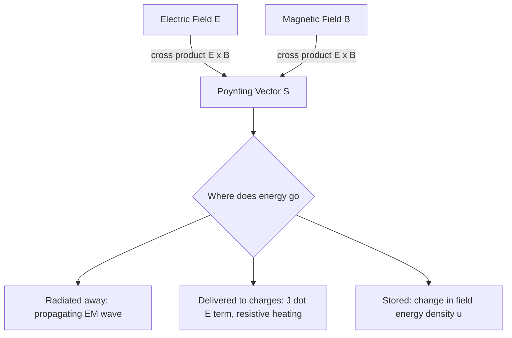

## The Poynting Vector and Energy Flow

### Definition

The Poynting vector describes the directional flow of electromagnetic energy — its direction indicates the direction energy is being transported, and its magnitude gives the instantaneous power transmitted per unit area (an energy flux). It is defined as:

$$\vec{S} = \frac{1}{\mu_0}\vec{E}\times\vec{B}$$

with SI units of W/m² (watts per square meter). In a linear magnetic medium, this generalizes to $\vec{S} = \vec{E}\times\vec{H}$, where $\vec{H} = \vec{B}/\mu$.

**Key Points**

- Because $\vec{S}$ is a cross product of $\vec{E}$ and $\vec{B}$, it is automatically perpendicular to both fields — for a plane EM wave, this means $\vec{S}$ points exactly along the propagation direction $\hat{k}$.
- $\vec{S}$ is named after John Henry Poynting, who introduced it in 1884 as part of a broader theorem describing electromagnetic energy conservation.
- Unlike $\vec{E}$ and $\vec{B}$, which are fundamental field quantities, $\vec{S}$ is a derived quantity constructed specifically to track energy transport.

### Derivation: Poynting's Theorem

Poynting's theorem is derived by considering the work done by electromagnetic fields on charges and combining it with Maxwell's equations. Starting from the rate of work done per unit volume on charges by the fields, $\vec{J}\cdot\vec{E}$, and using the Ampère–Maxwell law to substitute for $\vec{J}$:

$$\vec{J} = \frac{1}{\mu_0}\nabla\times\vec{B} - \epsilon_0\frac{\partial\vec{E}}{\partial t}$$

Substituting into $\vec{J}\cdot\vec{E}$ and applying the vector identity $\nabla\cdot(\vec{E}\times\vec{B}) = \vec{B}\cdot(\nabla\times\vec{E}) - \vec{E}\cdot(\nabla\times\vec{B})$ together with Faraday's law, algebraic manipulation yields the differential form of Poynting's theorem:

$$-\nabla\cdot\vec{S} = \vec{J}\cdot\vec{E} + \frac{\partial u}{\partial t}$$

where $u = \frac{1}{2}\epsilon_0E^2 + \frac{1}{2\mu_0}B^2$ is the total electromagnetic energy density. Integrating over a volume $V$ and applying the divergence theorem gives the integral (global energy conservation) form:

$$-\oint_S \vec{S}\cdot d\vec{A} = \int_V \vec{J}\cdot\vec{E}\,dV + \frac{d}{dt}\int_V u\,dV$$

**Key Points**

- Physically: the rate at which electromagnetic energy flows *into* a volume (left side) equals the rate at which work is done on charges within that volume (Ohmic/mechanical dissipation) plus the rate of increase of field energy stored within the volume.
- This is a statement of local energy conservation applied specifically to the electromagnetic field — exactly analogous in structure to the continuity equation for charge conservation, but for energy instead of charge.
- The term $\vec{J}\cdot\vec{E}$ represents power delivered by the field to matter (e.g., resistive/Joule heating in a conductor); when $\vec{J}=0$ (vacuum, no conduction), all energy flow is purely electromagnetic.

### Energy Density Components

The total electromagnetic energy density combines contributions from both fields:

$$u = u_E + u_B = \frac{1}{2}\epsilon_0E^2 + \frac{B^2}{2\mu_0}$$

For a propagating plane wave in vacuum, using $B = E/c$ and $c^2 = 1/(\mu_0\epsilon_0)$:

$$u_B = \frac{B^2}{2\mu_0} = \frac{(E/c)^2}{2\mu_0} = \frac{E^2}{2\mu_0c^2} = \frac{E^2\mu_0\epsilon_0}{2\mu_0} = \frac{1}{2}\epsilon_0E^2 = u_E$$

This confirms that in a freely propagating EM wave, the electric and magnetic fields carry **exactly equal** shares of the instantaneous energy density, so:

$$u = 2u_E = \epsilon_0E^2$$

### Poynting Vector Magnitude for a Plane Wave

For a plane wave $\vec{E} = E_0\cos(kz-\omega t)\hat{x}$, $\vec{B} = B_0\cos(kz-\omega t)\hat{y}$, with $B_0 = E_0/c$:

$$S = \frac{1}{\mu_0}EB = \frac{1}{\mu_0}E_0B_0\cos^2(kz-\omega t) = \epsilon_0cE_0^2\cos^2(kz-\omega t)$$

This oscillates in time at twice the wave frequency (due to the $\cos^2$ dependence) and is always non-negative — energy flow never reverses direction for a wave propagating in a single fixed direction.

### Intensity: The Time-Averaged Poynting Vector

Since detectors (eyes, photodiodes, antennas) respond over many oscillation cycles rather than resolving instantaneous field oscillations, the practically measured quantity is the time average, called **intensity**:

$$I = \langle S\rangle = \epsilon_0cE_0^2\langle\cos^2(kz-\omega t)\rangle$$

Using $\langle\cos^2\rangle = \frac{1}{2}$ over a full cycle:

$$\boxed{I = \frac{1}{2}\epsilon_0cE_0^2 = \frac{cB_0^2}{2\mu_0} = \frac{E_0B_0}{2\mu_0}}$$

**Key Points**

- The factor of $\frac{1}{2}$ arises purely from time-averaging a squared sinusoid — the same factor that appears in AC circuit RMS power calculations.
- Equivalently, $I = \epsilon_0c\langle E^2\rangle = \epsilon_0cE_{rms}^2$ where $E_{rms} = E_0/\sqrt{2}$.
- Intensity has units of W/m², the standard measure of radiative flux (e.g., the solar constant, laser power density, antenna radiation intensity).

### Worked Example: Laser Beam Intensity

**Example**

A laser beam with power $P = 5\ \text{mW}$ is focused to a circular spot of diameter $d = 2\ \text{mm}$. Find the peak electric field amplitude.

Step 1 — Compute intensity:

$$I = \frac{P}{A} = \frac{P}{\pi(d/2)^2} = \frac{5\times10^{-3}}{\pi(1\times10^{-3})^2} \approx \frac{5\times10^{-3}}{3.14\times10^{-6}} \approx 1592\ \text{W/m}^2$$

Step 2 — Solve for $E_0$ using $I = \frac{1}{2}\epsilon_0cE_0^2$:

$$E_0 = \sqrt{\frac{2I}{\epsilon_0c}} = \sqrt{\frac{2(1592)}{(8.854\times10^{-12})(3\times10^8)}}$$

$$E_0 = \sqrt{\frac{3184}{2.656\times10^{-3}}} = \sqrt{1.199\times10^6} \approx 1095\ \text{V/m}$$

### Poynting Vector for a DC Circuit: A Non-Obvious Application

**Example**

Consider a resistor of resistance $R$, radius $a$, carrying steady current $I$ with voltage drop $V$ along its length $l$. Surprisingly, the Poynting vector formalism shows that the energy dissipated as heat does *not* flow through the wire itself, but flows radially inward from the surrounding electromagnetic field into the resistor's surface.

The axial electric field just outside/inside the resistor surface is $E = V/l$ (driving the current), and the azimuthal magnetic field at the surface (from Ampère's law) is $B = \mu_0I/(2\pi a)$. The Poynting vector $\vec{S} = \frac{1}{\mu_0}\vec{E}\times\vec{B}$ points radially *inward*, with magnitude:

$$S = \frac{1}{\mu_0}\left(\frac{V}{l}\right)\left(\frac{\mu_0I}{2\pi a}\right) = \frac{VI}{2\pi a l}$$

Multiplying by the lateral surface area $2\pi a l$ gives the total power flowing into the resistor:

$$P = S \times (2\pi al) = VI$$

This exactly matches the familiar circuit power formula $P = VI$, but reveals a conceptually striking result: energy delivered to a resistor arrives via the surrounding electromagnetic field flowing in through its lateral surface, not by being "pushed" along inside the current-carrying wire itself.

**Key Points**

- This example illustrates that the Poynting vector formalism, while equivalent to circuit-theory power calculations in total, offers a fundamentally different (field-based) picture of *how* energy actually travels through space.
- [Inference] This reframing is mathematically rigorous and widely presented in electromagnetism courses, though it can feel counterintuitive since everyday circuit intuition treats energy as flowing along the wire.

### Energy Flow Diagram

### Poynting Vector Around a Current-Carrying Resistor (svg_diagram)

<svg xmlns="http://www.w3.org/2000/svg" viewBox="0 0 480 240">
<text x="240" y="22" font-size="16" text-anchor="middle" fill="#222">Energy Flow Into a Resistor (svg_diagram)</text>
<rect x="150" y="90" width="180" height="60" fill="#f5cba7" stroke="#a04000" stroke-width="2" />
<text x="240" y="125" font-size="13" text-anchor="middle" fill="#7d3c00">Resistor (I flows axially)</text>
<line x1="150" y1="120" x2="330" y2="120" stroke="#333" stroke-width="1" stroke-dasharray="3,3" />
<line x1="240" y1="60" x2="240" y2="88" stroke="#27ae60" stroke-width="2.5" marker-end="url(sIn)" />
<line x1="200" y1="60" x2="200" y2="88" stroke="#27ae60" stroke-width="2.5" marker-end="url(sIn)" />
<line x1="280" y1="60" x2="280" y2="88" stroke="#27ae60" stroke-width="2.5" marker-end="url(sIn)" />
<line x1="240" y1="180" x2="240" y2="152" stroke="#27ae60" stroke-width="2.5" marker-end="url(sIn)" />
<line x1="200" y1="180" x2="200" y2="152" stroke="#27ae60" stroke-width="2.5" marker-end="url(sIn)" />
<line x1="280" y1="180" x2="280" y2="152" stroke="#27ae60" stroke-width="2.5" marker-end="url(sIn)" />
<text x="240" y="210" font-size="12" text-anchor="middle" fill="#27ae60">S (Poynting vector) flows radially inward, delivering P = VI</text>
</svg>

### Applications

**Key Points**

- **Solar energy measurement**: the solar constant (~1360 W/m² at Earth's orbit) is a direct measurement of the time-averaged Poynting vector magnitude from sunlight.
- **Antenna and radar power budgets**: link-budget calculations in communications engineering use intensity (derived from the Poynting vector) to determine received signal strength as a function of distance and transmitted power.
- **Laser and optical power measurement**: laser intensity specifications, safety classifications, and material-processing (cutting, welding) applications rely directly on Poynting-vector-derived intensity values.
- **Waveguide and transmission line analysis**: Poynting vector integration across a waveguide's cross-section gives the total power being transmitted along it, essential in microwave and RF engineering.

### Common Pitfalls

**Key Points**

- Confusing instantaneous Poynting vector magnitude $S$ with the time-averaged intensity $I$ — the factor of $\frac{1}{2}$ from time-averaging $\cos^2$ is frequently dropped in error.
- Assuming energy in a circuit flows "through" the conducting wire like water in a pipe — the Poynting vector formalism shows energy actually flows through the surrounding field and into the conductor from the side, a subtle but well-established result of applying Maxwell's equations to circuits.
- Forgetting that $\vec{S}$ requires *both* $\vec{E}$ and $\vec{B}$ to be non-zero and non-parallel; if either field vanishes, or if they are parallel, no energy flow is described by that Poynting vector value at that point.
- Neglecting the $\vec{J}\cdot\vec{E}$ term in Poynting's theorem when analyzing energy balance in a lossy or conducting medium, leading to an incomplete accounting of where field energy is going (radiated vs. dissipated vs. stored).

**Next Steps**

- Properties of Electromagnetic Waves
- Energy Density of Electric and Magnetic Fields
- Radiation Pressure and Momentum of EM Waves
- Derivation of the Electromagnetic Wave Equation
- Antenna Radiation and the Far-Field Approximation
- Waveguides and Transmission Line Power Flow
- Poynting's Theorem in Conducting Media
- The Electromagnetic Spectrum