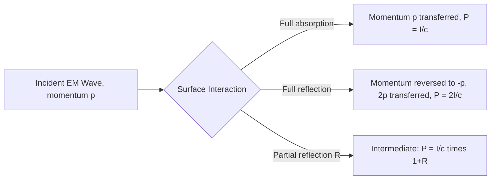

## Radiation Pressure

### Definition

Radiation pressure is the mechanical pressure exerted on a surface by electromagnetic radiation, arising from the transfer of momentum carried by the EM wave to the surface upon absorption or reflection. Although electromagnetic fields carry no rest mass, Maxwell's equations predict — and experiments confirm — that EM waves carry genuine linear momentum, and this momentum transfer manifests as a measurable force per unit area.

### Momentum Carried by Electromagnetic Waves

For a plane EM wave, the momentum density (momentum per unit volume) is related to the energy density $u$ by:

$$p = \frac{u}{c}$$

This relation follows from the relativistic energy-momentum relation for massless entities ($E = pc$) applied to the field, and is consistent with treating the EM field as being carried by photons of energy $E_{photon} = hf$ and momentum $p_{photon} = hf/c = h/\lambda$.

Since intensity $I = \langle S \rangle$ is the time-averaged energy flux, the momentum flux (momentum delivered per unit area per unit time) is:

$$\frac{I}{c}$$

This quantity forms the basis for calculating radiation pressure under different surface conditions.

### Radiation Pressure on an Absorbing Surface

**Key Points**

- When EM radiation strikes a perfectly absorbing (black) surface, all of its momentum is transferred to the surface.
- The resulting pressure equals the momentum flux:

$$P_{rad} = \frac{I}{c}$$

- This is the minimum possible radiation pressure for a given intensity, since none of the incident momentum is "returned" to the field.

### Radiation Pressure on a Reflecting Surface

**Key Points**

- When EM radiation strikes a perfectly reflecting surface (normal incidence), the wave's momentum must be *reversed* in direction rather than simply absorbed.
- By conservation of momentum, the surface must receive momentum equal to the change in the wave's momentum — which is twice the incident momentum, since the wave's momentum changes from $+p$ to $-p$.

$$P_{rad} = \frac{2I}{c}$$

- Partial reflection (reflectance $R$, with $0 \le R \le 1$) gives an intermediate result:

$$P_{rad} = \frac{I}{c}(1+R)$$

which reduces to $I/c$ for full absorption ($R=0$) and $2I/c$ for full reflection ($R=1$).

### Derivation via the Lorentz Force

**Key Points**

- A more mechanistic derivation considers a charge in the absorbing material experiencing the wave's oscillating $\vec{E}$ field, which accelerates the charge and produces a velocity $\vec{v}$ (in phase with $\vec{E}$, for a resistive/absorbing response).
- The magnetic component of the Lorentz force, $q\vec{v}\times\vec{B}$, then acts on this moving charge. Because $\vec{v}$ is parallel to $\vec{E}$, and $\vec{B}$ is perpendicular to $\vec{E}$, this force component points along the wave's propagation direction — precisely the mechanism by which the wave pushes the absorbing material forward.
- This derivation shows radiation pressure is not a mysterious extra postulate but a direct consequence of the standard Lorentz force law acting on charges responding to the wave's own fields.

### Worked Example: Sunlight Radiation Pressure

**Example**

At Earth's orbital distance, the solar intensity ("solar constant") is $I \approx 1360\ \text{W/m}^2$.

**Absorbing surface:**

$$P_{rad} = \frac{I}{c} = \frac{1360}{2.998\times10^8} \approx 4.54\times10^{-6}\ \text{Pa}$$

**Perfectly reflecting surface:**

$$P_{rad} = \frac{2I}{c} \approx 9.07\times10^{-6}\ \text{Pa}$$

For comparison, atmospheric pressure at sea level is about $1.01\times10^5\ \text{Pa}$ — solar radiation pressure is roughly ten billion times smaller, which is why it is imperceptible in everyday life but becomes significant over the long timescales and force-free environment of spaceflight.

### Worked Example: Force on a Solar Sail

**Example**

A solar sail with reflective area $A = 1000\ \text{m}^2$ and reflectance $R \approx 0.9$ is deployed at Earth's orbital distance ($I \approx 1360\ \text{W/m}^2$), oriented perpendicular to sunlight.

$$P_{rad} = \frac{I}{c}(1+R) = \frac{1360}{2.998\times10^8}(1.9) \approx 8.62\times10^{-6}\ \text{Pa}$$

$$F = P_{rad}\times A = (8.62\times10^{-6})(1000) \approx 8.62\times10^{-3}\ \text{N}$$

Though less than 9 millinewtons — comparable to the weight of a small paperclip — this continuous, propellant-free thrust, applied over months to years in the vacuum of space, can produce substantial cumulative velocity changes, which is the operating principle of solar sail spacecraft propulsion.

### Radiation Pressure and Stellar Physics

**Key Points**

- Inside stars, radiation pressure (from the intense photon flux generated by nuclear fusion) contributes to the outward pressure balancing gravitational collapse, alongside gas (thermal) pressure — this balance is central to stellar structure models.
- In very massive stars, radiation pressure can become the dominant supporting pressure component, influencing maximum stable stellar mass limits (related to the Eddington luminosity, the maximum luminosity at which radiation pressure balances gravitational attraction on infalling material).
- [Inference] Detailed stellar structure calculations require solving coupled equations of hydrostatic equilibrium, energy transport, and radiation pressure together; the relative importance of radiation vs. gas pressure varies significantly with stellar mass and evolutionary stage, so this is presented here at a conceptual rather than fully quantitative level.

### Radiation Pressure Force Diagram

### Momentum Transfer on Reflection vs. Absorption (svg_diagram)

<svg xmlns="http://www.w3.org/2000/svg" viewBox="0 0 520 220">
<text x="260" y="22" font-size="16" text-anchor="middle" fill="#222">Absorption vs. Reflection Momentum Transfer (svg_diagram)</text>
<rect x="70" y="60" width="20" height="120" fill="#333" />
<text x="80" y="200" font-size="12" text-anchor="middle" fill="#333">Absorber</text>
<line x1="20" y1="120" x2="65" y2="120" stroke="#a04000" stroke-width="3" marker-end="url(rIn1)" />
<text x="30" y="105" font-size="11" fill="#a04000">p in</text>
<text x="120" y="120" font-size="12" fill="#333">Momentum p absorbed → P = I/c</text>
<rect x="370" y="60" width="20" height="120" fill="#1a5276" />
<text x="380" y="200" font-size="12" text-anchor="middle" fill="#1a5276">Mirror</text>
<line x1="320" y1="120" x2="365" y2="120" stroke="#a04000" stroke-width="3" marker-end="url(rIn2)" />
<line x1="395" y1="120" x2="440" y2="120" stroke="#27ae60" stroke-width="3" marker-end="url(rOut)" />
<text x="330" y="105" font-size="11" fill="#a04000">p in</text>
<text x="420" y="105" font-size="11" fill="#27ae60">-p out</text>
<text x="380" y="215" font-size="12" text-anchor="middle" fill="#333">Momentum reversed → 2p transferred → P = 2I/c</text>
</svg>

### Experimental Verification

**Key Points**

- Radiation pressure was first experimentally confirmed in the early 20th century (Nichols and Hull, and independently Lebedev, circa 1900–1903), using delicate torsion-balance apparatus to detect the minute forces involved.
- Modern optical tweezers use focused laser light and the associated radiation pressure (and related gradient forces from non-uniform intensity) to trap and manipulate microscopic particles, including individual cells and biomolecules — a technique recognized with the 2018 Nobel Prize in Physics for its development. [Unverified — specific technical implementation details of optical tweezers involve additional gradient-force physics beyond simple radiation pressure and are best treated as a related but distinct topic.]

### Applications

**Key Points**

- **Solar sail spacecraft propulsion**: propellant-free thrust from sunlight for long-duration missions (e.g., demonstrated by missions such as IKAROS and LightSail).
- **Optical tweezers**: precise manipulation of microscopic objects using focused laser radiation pressure and gradient forces, widely used in biophysics research.
- **Poynting–Robertson effect**: radiation pressure from sunlight causes small dust particles in orbit to gradually lose angular momentum and spiral inward toward the sun, an important effect in the dynamics of interplanetary dust and debris disks.
- **Laser cooling and atom trapping**: radiation pressure from precisely tuned laser light is used to slow (cool) atoms to extremely low temperatures in atomic physics and precision metrology (e.g., atomic clocks, Bose-Einstein condensate experiments).

### Common Pitfalls

**Key Points**

- Forgetting the factor of 2 difference between absorbing ($P = I/c$) and reflecting ($P = 2I/c$) surfaces — a very common source of error in radiation pressure calculations.
- Assuming radiation pressure requires the EM wave to have mass — it does not; the momentum arises from the wave's energy and the relativistic relation $p = E/c$ for massless fields/photons, not from any rest mass.
- Neglecting that non-normal incidence reduces the effective pressure by a factor involving the angle of incidence (the momentum transfer normal to the surface scales with $\cos^2\theta$ for reflection, or $\cos\theta$ for absorption, where $\theta$ is measured from the surface normal).
- Underestimating radiation pressure's practical relevance by focusing only on its tiny magnitude in everyday settings — while negligible for terrestrial objects, it becomes a dominant or critical force in space environments over long timescales, and inside massive stars.

**Next Steps**

- The Poynting Vector and Energy Flow
- Properties of Electromagnetic Waves
- Photon Momentum and the Photoelectric Effect
- Solar Sail Mission Design and Orbital Mechanics
- The Eddington Luminosity and Stellar Structure
- Optical Tweezers and Laser Cooling Techniques
- The Poynting–Robertson Effect in Interplanetary Dust Dynamics
- Special Relativity: Energy-Momentum Relations for Massless Particles