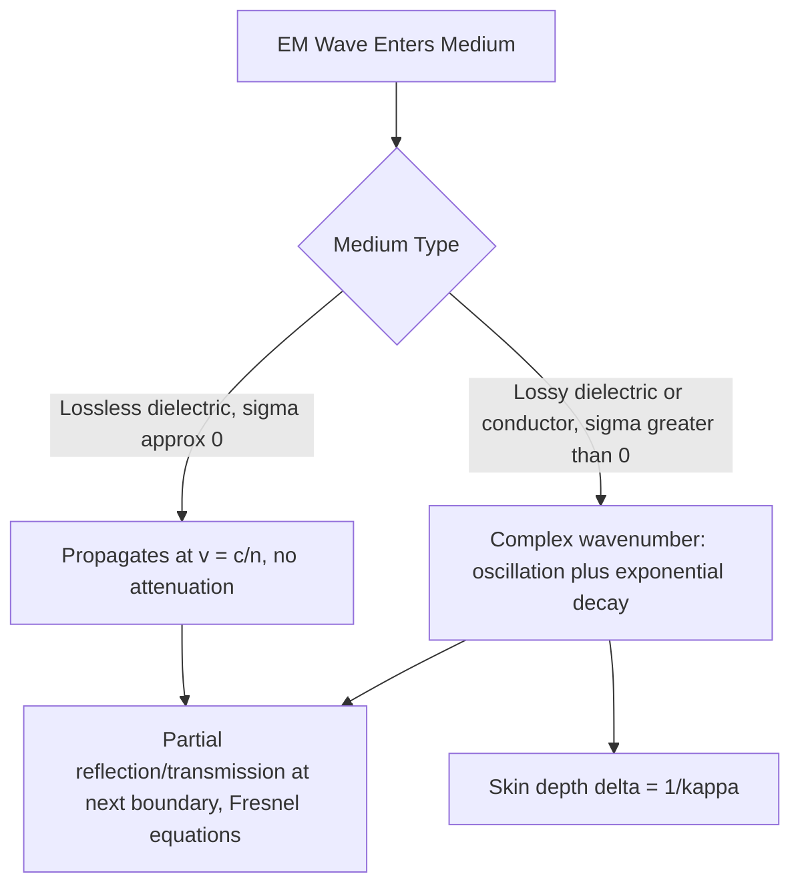

## Electromagnetic Waves in Matter

### Overview

When electromagnetic waves propagate through material media rather than vacuum, their behavior is modified by the medium's electric and magnetic response — polarization of bound charges, magnetization, and (in conductive media) free charge motion. Maxwell's equations remain fully valid, but the constitutive relations connecting $\vec{D}$ to $\vec{E}$ and $\vec{B}$ to $\vec{H}$ introduce material-dependent parameters that alter wave speed, cause attenuation, and produce dispersion.

### Maxwell's Equations in Matter

Inside a linear medium, the macroscopic Maxwell's equations are written in terms of $\vec{D}$ (electric displacement) and $\vec{H}$ (auxiliary magnetic field), which account for the medium's bound charge and bound current responses:

$$\nabla\cdot\vec{D} = \rho_{free}, \qquad \nabla\cdot\vec{B} = 0$$

$$\nabla\times\vec{E} = -\frac{\partial\vec{B}}{\partial t}, \qquad \nabla\times\vec{H} = \vec{J}_{free} + \frac{\partial\vec{D}}{\partial t}$$

For a linear, homogeneous, isotropic medium, the constitutive relations are:

$$\vec{D} = \epsilon\vec{E} = \epsilon_r\epsilon_0\vec{E}, \qquad \vec{B} = \mu\vec{H} = \mu_r\mu_0\vec{H}$$

where $\epsilon_r$ (relative permittivity) and $\mu_r$ (relative permeability) characterize the medium's response.

### Wave Equation and Phase Velocity in a Dielectric

For a non-conducting (lossless) dielectric with no free charges or currents, the same derivation used for vacuum yields:

$$\nabla^2\vec{E} = \mu\epsilon\frac{\partial^2\vec{E}}{\partial t^2}$$

giving a phase velocity:

$$v = \frac{1}{\sqrt{\mu\epsilon}} = \frac{c}{\sqrt{\mu_r\epsilon_r}} = \frac{c}{n}$$

where $n = \sqrt{\mu_r\epsilon_r}$ is the **index of refraction**. For most non-magnetic dielectrics, $\mu_r \approx 1$, so $n \approx \sqrt{\epsilon_r}$.

**Key Points**

- Since $n \ge 1$ for typical dielectrics, waves travel *slower* in matter than in vacuum ($v < c$), though the frequency of the wave remains unchanged as it crosses a boundary (only wavelength changes, per $\lambda = v/f$).
- The field ratio also changes: $E_0 = vB_0$ (using the medium's phase velocity $v$ in place of $c$).
- The energy density relation generalizes to $u = \frac{1}{2}\epsilon E^2 + \frac{1}{2\mu}B^2$, and the Poynting vector becomes $\vec{S} = \vec{E}\times\vec{H}$.

### Dispersion

In real materials, $\epsilon_r$ (and hence $n$) generally depends on frequency — a phenomenon called **dispersion**. This means different frequencies of light travel at different phase velocities within the same medium.

**Key Points**

- **Normal dispersion**: $n$ increases with frequency (decreases with wavelength) — the common behavior in transparent optical materials across the visible spectrum, responsible for a prism separating white light into its spectral colors (violet bends more than red).
- **Anomalous dispersion**: $n$ decreases with increasing frequency, typically occurring near strong absorption resonances of the material.
- Dispersion arises microscopically because the medium's bound electrons respond to the oscillating field with a frequency-dependent phase lag, modeled classically by the **Lorentz oscillator model** (electrons as damped, driven harmonic oscillators bound to atomic nuclei).
- Dispersion is responsible for **group velocity** differing from **phase velocity** for wave packets (pulses) composed of multiple frequencies, an effect critical in fiber-optic communication (pulse spreading/broadening).

### Wave Propagation in Conducting Media

When the medium has non-negligible conductivity $\sigma$ (free charges present, per Ohm's law $\vec{J} = \sigma\vec{E}$), the Ampère–Maxwell law becomes:

$$\nabla\times\vec{H} = \sigma\vec{E} + \epsilon\frac{\partial\vec{E}}{\partial t}$$

Assuming a harmonic time dependence $e^{-i\omega t}$, this can be written using a **complex permittivity**:

$$\epsilon_{complex} = \epsilon + i\frac{\sigma}{\omega}$$

The resulting wave equation admits solutions with a **complex wavenumber** $\tilde{k} = k + i\kappa$, giving:

$$E(z,t) = E_0e^{-\kappa z}\cos(kz - \omega t)$$

**Key Points**

- The real part $k$ governs oscillatory propagation (as in a lossless medium); the imaginary part $\kappa$ (the **attenuation coefficient**) causes exponential decay of amplitude with distance — the wave is progressively absorbed as it travels.
- This exponential decay is the physical basis for the finite penetration of EM waves into conductors, and for absorption/attenuation in lossy dielectrics generally.
- A medium is often classified as a "good conductor" or "good insulator" at a given frequency based on the ratio $\sigma/(\omega\epsilon)$ — good conductor when this ratio $\gg 1$, good insulator (low-loss dielectric) when $\ll 1$.

### Skin Depth

**Example**

The characteristic distance over which the wave amplitude decays to $1/e$ of its initial value is the **skin depth**:

$$\delta = \frac{1}{\kappa}$$

For a good conductor ($\sigma \gg \omega\epsilon$), this simplifies to:

$$\delta \approx \sqrt{\frac{2}{\mu\sigma\omega}}$$

For copper ($\sigma \approx 5.96\times10^7\ \text{S/m}$, $\mu \approx \mu_0$) at $f = 60\ \text{Hz}$ (power-line frequency), $\omega = 2\pi f \approx 377\ \text{rad/s}$:

$$\delta = \sqrt{\frac{2}{(4\pi\times10^{-7})(5.96\times10^7)(377)}} \approx \sqrt{\frac{2}{2.822\times10^4}} \approx 8.4\times10^{-3}\ \text{m} \approx 8.4\ \text{mm}$$

At much higher frequencies (e.g., GHz-range microwaves), skin depth in copper shrinks to the micrometer scale, meaning high-frequency currents flow almost entirely near the conductor's surface — the **skin effect**, a critical consideration in RF/microwave engineering, conductor design, and electromagnetic shielding.

### Reflection and Transmission at a Boundary

When an EM wave encounters a boundary between two media with different indices of refraction ($n_1$, $n_2$), part of the wave is reflected and part transmitted. At normal incidence, the reflection and transmission coefficients (for amplitude) are given by the Fresnel equations:

$$r = \frac{n_1-n_2}{n_1+n_2}, \qquad t = \frac{2n_1}{n_1+n_2}$$

The corresponding reflectance (fraction of *power* reflected) is:

$$R = r^2 = \left(\frac{n_1-n_2}{n_1+n_2}\right)^2$$

**Key Points**

- These boundary conditions are derived directly from requiring continuity of $E_\parallel$ and $H_\parallel$ (and the corresponding $D_\perp$, $B_\perp$ conditions) across the interface, per Maxwell's equations in integral form.
- For light going from air ($n_1\approx1$) into glass ($n_2\approx1.5$), $R = \left(\frac{1-1.5}{1+1.5}\right)^2 = (0.2)^2 = 0.04$ — about 4% of incident power is reflected at each such interface, consistent with everyday observation of weak reflections from glass surfaces.
- At oblique incidence, the reflection/transmission coefficients depend on polarization (split into s- and p-polarized components), leading to phenomena such as Brewster's angle, where p-polarized reflection vanishes entirely.

### Wave Propagation Diagram: Dielectric vs. Conductor

### Attenuation in a Conducting Medium (svg_diagram)

<svg xmlns="http://www.w3.org/2000/svg" viewBox="0 0 520 220">
<text x="260" y="22" font-size="16" text-anchor="middle" fill="#222">Wave Attenuation in a Conductor (svg_diagram)</text>
<line x1="40" y1="120" x2="480" y2="120" stroke="#666" stroke-width="1" />
<path d="M 60 120 C 75 60, 95 60, 110 120 S 145 180, 160 120 S 195 60, 210 120 S 245 90, 260 120 S 285 105, 300 120 S 315 113, 330 120" fill="none" stroke="#a04000" stroke-width="2.5" />
<path d="M 60 120 Q 260 60, 460 118" fill="none" stroke="#909497" stroke-width="1" stroke-dasharray="4,3" />
<path d="M 60 120 Q 260 180, 460 122" fill="none" stroke="#909497" stroke-width="1" stroke-dasharray="4,3" />
<text x="90" y="145" font-size="11" fill="#333">Surface (z=0)</text>
<text x="330" y="145" font-size="11" fill="#333">Amplitude ~ e^(-z/δ)</text>
<text x="260" y="200" font-size="12" text-anchor="middle" fill="#333">Envelope decays over skin depth δ</text>
</svg>

### Worked Example: Reflectance Calculation

**Example**

Light travels from water ($n_1 = 1.33$) into air ($n_2 = 1.00$) at normal incidence. Find the reflectance.

$$R = \left(\frac{n_1-n_2}{n_1+n_2}\right)^2 = \left(\frac{1.33-1.00}{1.33+1.00}\right)^2 = \left(\frac{0.33}{2.33}\right)^2 \approx (0.1416)^2 \approx 0.020$$

About 2% of the light's power is reflected at the water-air interface at normal incidence, with the remaining 98% transmitted (in the lossless approximation, $R+T=1$).

### Comparison: Dielectric vs. Conducting Media

| Property | Lossless Dielectric | Conducting Medium |
| --- | --- | --- |
| Wavenumber | Real: $k = \omega\sqrt{\mu\epsilon}$ | Complex: $\tilde{k} = k+i\kappa$ |
| Wave behavior | Pure oscillation, no decay | Oscillation with exponential attenuation |
| Governing parameter | $n = \sqrt{\mu_r\epsilon_r}$ | Ratio $\sigma/(\omega\epsilon)$ |
| Energy fate | Fully transmitted (or reflected) | Partially converted to heat ($\vec{J}\cdot\vec{E}$ term) |
| Example | Glass, water (visible light), air | Metals (especially at low-to-RF frequencies) |

### Applications

**Key Points**

- **Fiber-optic communications**: relies on wave propagation and total internal reflection in low-loss dielectric (glass/silica) fibers; dispersion management is critical for minimizing pulse spreading over long distances.
- **Electromagnetic shielding**: exploits the skin effect — thin conductive enclosures (Faraday cages) effectively block external EM fields at a given frequency once their thickness exceeds a few skin depths.
- **Antenna and waveguide design**: skin depth determines effective conductor cross-section and resistive losses at RF/microwave frequencies, informing conductor material and geometry choices.
- **Anti-reflection coatings**: engineered thin-film dielectric layers exploit interference (governed by the Fresnel equations and layer thickness) to minimize reflectance at optical interfaces, e.g., on camera lenses and solar panels.
- **Medical and industrial imaging**: microwave and radio-frequency penetration depth in biological tissue (a lossy dielectric) determines feasibility and design parameters for techniques such as MRI and microwave hyperthermia.

### Common Pitfalls

**Key Points**

- Assuming wave frequency changes when crossing into a different medium — it is the wavelength (and phase velocity) that change; frequency is conserved across a boundary, set by the source.
- Confusing phase velocity (speed of a single-frequency wave crest) with group velocity (speed of a pulse/wave packet envelope) — these differ in dispersive media and are frequently conflated.
- Applying the vacuum Poynting vector formula $\vec{S} = \frac{1}{\mu_0}\vec{E}\times\vec{B}$ inside a magnetic medium without adjusting for $\mu$ — the correct general form is $\vec{S} = \vec{E}\times\vec{H}$.
- Neglecting that "conductor" versus "dielectric" behavior is frequency-dependent, not an absolute material property — the same material can behave as a good conductor at low frequency and a lossy dielectric at optical frequencies, depending on the ratio $\sigma/(\omega\epsilon)$.

**Next Steps**

- Derivation of the Electromagnetic Wave Equation
- The Poynting Vector and Energy Flow
- Reflection, Refraction, and Fresnel Equations
- Dispersion and Group Velocity
- The Skin Effect in Conductors
- Total Internal Reflection and Fiber Optics
- Boundary Conditions for E and B Fields at Interfaces
- Anti-Reflection Coatings and Thin-Film Interference