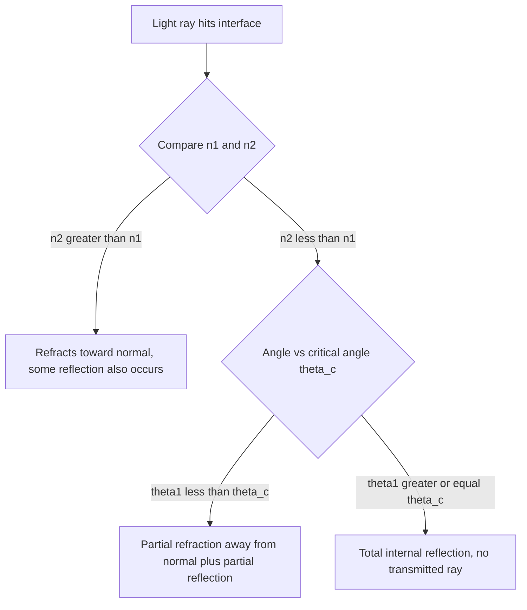

## Reflection and Refraction

### Overview

Reflection and refraction describe how light behaves when it encounters a boundary between two different optical media. Reflection is the bouncing-back of light at an interface, while refraction is the bending of light as it passes from one medium into another due to a change in propagation speed. Both phenomena follow directly from the wave nature of light and from Maxwell's equations, but in geometric optics they are treated using simple ray-based laws that predict the direction of reflected and refracted rays without needing full wave analysis.

### The Law of Reflection

When a light ray strikes a smooth (specular) surface, the reflected ray obeys:

$$\theta_i = \theta_r$$

where $\theta_i$ is the angle of incidence and $\theta_r$ is the angle of reflection, both measured from the **normal** (a line perpendicular to the surface at the point of incidence).

**Key Points**

- The incident ray, reflected ray, and the normal all lie in the same plane (the plane of incidence).
- This law holds regardless of the media involved on either side of the interface — it depends only on the surface geometry.
- **Specular reflection** occurs on smooth surfaces (mirrors), producing a clear, coherent reflected image; **diffuse reflection** occurs on rough surfaces, where the law of reflection still holds locally at each microscopic facet, but the varying facet orientations scatter light in many directions, producing no clear image (e.g., paper, matte walls).

### Snell's Law of Refraction

When light passes from a medium of refractive index $n_1$ into a medium of index $n_2$, the ray bends according to **Snell's law**:

$$n_1\sin\theta_1 = n_2\sin\theta_2$$

where $\theta_1$ and $\theta_2$ are the angles of incidence and refraction, both measured from the normal.

**Key Points**

- The refractive index $n = c/v$ characterizes how much slower light travels in a medium compared to vacuum; higher $n$ means slower propagation speed.
- If light travels from a less dense medium into a more dense one ($n_2 > n_1$), it bends *toward* the normal ($\theta_2 < \theta_1$).
- If light travels from a more dense medium into a less dense one ($n_2 < n_1$), it bends *away* from the normal ($\theta_2 > \theta_1$).
- The incident ray, refracted ray, and normal all lie in the same plane, just as with reflection.

### Derivation from Wave Physics (Huygens' Principle)

Snell's law can be derived by considering a plane wavefront approaching the boundary at angle $\theta_1$. As the wavefront crosses the interface, different points reach the boundary at different times; the portion of the wave still in medium 1 continues at speed $v_1 = c/n_1$, while the portion already in medium 2 travels at $v_2 = c/n_2$. Requiring the wavefronts to remain continuous across the boundary (same time for corresponding points to traverse a given path) leads geometrically to:

$$\frac{\sin\theta_1}{\sin\theta_2} = \frac{v_1}{v_2} = \frac{n_2}{n_1}$$

which rearranges to Snell's law, $n_1\sin\theta_1 = n_2\sin\theta_2$. This derivation confirms that refraction is fundamentally a consequence of the wave's changing propagation speed across the boundary, consistent with the wave-equation treatment of EM waves in matter.

### Total Internal Reflection

When light travels from a denser medium ($n_1$) into a less dense medium ($n_2 < n_1$), there exists a **critical angle** $\theta_c$ beyond which no refracted ray exists, and all light is reflected back into the denser medium:

$$\sin\theta_c = \frac{n_2}{n_1}$$

**Key Points**

- Total internal reflection (TIR) occurs only when light attempts to go from higher to lower index ($n_1 > n_2$); it cannot occur in the reverse direction.
- Beyond $\theta_c$, Snell's law would require $\sin\theta_2 > 1$, which is mathematically impossible for a real angle — physically, the transmitted wave becomes evanescent (exponentially decaying, non-propagating) rather than a true refracted ray.
- TIR is the physical basis for fiber-optic communication, where light is guided along a high-index core surrounded by a lower-index cladding, propagating via repeated total internal reflections along the fiber's length with minimal loss.
- Common example: light inside water ($n\approx1.33$) striking the water-air surface at angles beyond $\theta_c = \arcsin(1/1.33) \approx 48.8°$ is entirely reflected back into the water — the basis of the "critical angle view" seen by divers looking upward at the water surface.

### Worked Example: Refraction at a Glass Interface

**Example**

Light traveling in air ($n_1 = 1.00$) strikes a glass surface ($n_2 = 1.50$) at an angle of incidence $\theta_1 = 40°$. Find the angle of refraction.

$$n_1\sin\theta_1 = n_2\sin\theta_2$$

$$(1.00)\sin(40°) = (1.50)\sin\theta_2$$

$$\sin\theta_2 = \frac{0.643}{1.50} \approx 0.4287$$

$$\theta_2 = \arcsin(0.4287) \approx 25.4°$$

As expected, the ray bends toward the normal ($25.4° < 40°$) when entering the higher-index medium.

### Worked Example: Critical Angle for Total Internal Reflection

**Example**

Find the critical angle for light traveling from a glass core ($n_1 = 1.52$) into an air cladding ($n_2 = 1.00$) in a hypothetical uncoated fiber.

$$\sin\theta_c = \frac{n_2}{n_1} = \frac{1.00}{1.52} \approx 0.658$$

$$\theta_c = \arcsin(0.658) \approx 41.1°$$

Any light striking the core-cladding boundary at an angle greater than 41.1° (measured from the normal) undergoes total internal reflection and remains guided within the fiber.

### Partial Reflection and Transmission (Fresnel Equations)

Even below the critical angle, some light is always partially reflected at a refractive boundary (except at specific angles for certain polarizations). At normal incidence, the reflectance (fraction of power reflected) is:

$$R = \left(\frac{n_1-n_2}{n_1+n_2}\right)^2$$

**Key Points**

- At oblique incidence, reflectance depends on polarization, split into s-polarized (perpendicular to plane of incidence) and p-polarized (parallel to plane of incidence) components, each with distinct Fresnel coefficients.
- **Brewster's angle** ($\theta_B$) is the specific angle of incidence at which the reflected light becomes entirely s-polarized (p-polarized reflectance drops to exactly zero), given by $\tan\theta_B = n_2/n_1$.
- Polarizing sunglasses exploit this: since much environmental glare comes from near-Brewster-angle reflections off horizontal surfaces (water, roads), which are predominantly s-polarized (horizontally oriented), a vertically-oriented polarizing filter blocks much of this reflected glare.

### Ray Diagram: Reflection and Refraction (svg_diagram)

<svg xmlns="http://www.w3.org/2000/svg" viewBox="0 0 480 260">
<text x="240" y="22" font-size="16" text-anchor="middle" fill="#222">Reflection and Refraction at an Interface (svg_diagram)</text>
<line x1="40" y1="130" x2="440" y2="130" stroke="#333" stroke-width="2" />
<text x="450" y="135" font-size="11" fill="#333">interface</text>
<line x1="240" y1="40" x2="240" y2="220" stroke="#909497" stroke-width="1" stroke-dasharray="4,3" />
<text x="245" y="45" font-size="11" fill="#909497">normal</text>
<line x1="120" y1="60" x2="240" y2="130" stroke="#a04000" stroke-width="2.5" marker-end="url(rIn)" />
<text x="120" y="50" font-size="11" fill="#a04000">incident ray θ₁</text>
<line x1="240" y1="130" x2="360" y2="60" stroke="#27ae60" stroke-width="2.5" marker-end="url(rRef)" />
<text x="330" y="50" font-size="11" fill="#27ae60">reflected θ_r</text>
<line x1="240" y1="130" x2="290" y2="215" stroke="#1a5276" stroke-width="2.5" marker-end="url(rTr)" />
<text x="290" y="230" font-size="11" fill="#1a5276">refracted θ₂ (bent toward normal)</text>
<text x="80" y="150" font-size="12" fill="#333">n₁ (less dense)</text>
<text x="80" y="200" font-size="12" fill="#333">n₂ (more dense)</text>
</svg>

### Reflection/Refraction Decision Flow

### Applications

**Key Points**

- **Fiber-optic telecommunications**: total internal reflection guides light signals over long distances through glass fibers with minimal signal loss.
- **Corrective lenses and camera optics**: precise control of refraction at curved surfaces (governed by Snell's law applied point-by-point) forms the basis of all lens design for vision correction, photography, and microscopy.
- **Prisms and spectrometers**: dispersion (wavelength-dependent refractive index) combined with refraction at angled surfaces separates white light into its component colors, or resolves spectral lines for chemical analysis.
- **Rainbow formation**: combines refraction (entering and exiting raindrops), internal reflection (once inside the droplet), and dispersion, producing the characteristic angular separation of colors observed in a rainbow.
- **Anti-glare and polarizing coatings**: exploit both partial reflection reduction (thin-film interference) and Brewster-angle polarization effects to manage unwanted reflections in optical instruments and eyewear.

### Common Pitfalls

**Key Points**

- Measuring incidence and refraction angles from the surface itself rather than from the normal — a very common setup error that inverts the geometry of Snell's law.
- Forgetting that total internal reflection can only occur when light travels from a higher-index to a lower-index medium — attempting to apply the critical-angle concept in the reverse direction is a conceptual error.
- Assuming refraction bends light toward the normal in all cases — the direction of bending depends on whether the light is entering a denser or less dense medium.
- Neglecting that some reflection always occurs at a refractive interface (except at very specific angles or for one polarization at Brewster's angle) — treating a boundary as either "fully reflecting" or "fully refracting" oversimplifies actual behavior, especially in precision optical design.

**Next Steps**

- Electromagnetic Waves in Matter: Index of Refraction
- Fresnel Equations and Polarization at Interfaces
- Total Internal Reflection and Fiber Optics
- Thin Lenses and the Lensmaker's Equation
- Dispersion and Prism Spectroscopy
- Brewster's Angle and Polarization by Reflection
- Mirrors: Plane and Curved Surface Imaging
- Fermat's Principle and the Path of Least Time