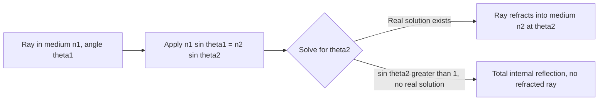

## Snell's Law

### Definition

Snell's law (also known as the law of refraction) quantitatively describes how a light ray bends when it crosses the boundary between two media of different refractive indices. It states:

$$n_1\sin\theta_1 = n_2\sin\theta_2$$

where $n_1$ and $n_2$ are the refractive indices of the incident and transmitted media, and $\theta_1$, $\theta_2$ are the angles of incidence and refraction, both measured from the normal to the interface at the point of incidence.

### The Refractive Index

The refractive index of a medium is defined as:

$$n = \frac{c}{v}$$

where $c$ is the speed of light in vacuum and $v$ is the phase velocity of light within that medium.

**Key Points**

- $n \ge 1$ for all ordinary transparent materials, since light always propagates slower in matter than in vacuum ($v \le c$).
- Typical values: vacuum/air $n \approx 1.00$, water $n \approx 1.33$, common glass $n \approx 1.50$, diamond $n \approx 2.42$.
- The refractive index generally depends on the wavelength of light (dispersion), so precise values are often quoted for a specific reference wavelength (commonly the sodium D-line at 589 nm).

### Derivation from Huygens' Principle

Consider a plane wavefront approaching a flat interface at angle $\theta_1$, with the wave traveling at speed $v_1$ in medium 1 and $v_2$ in medium 2. Let two rays, A and B, in the same wavefront reach the interface at different points, separated along the interface by a distance $d$.

While point A's wavelet (now in medium 2) travels an additional distance $v_2\Delta t$ in time $\Delta t$, point B's wavelet (still in medium 1, having further to travel to reach the interface) covers a distance $v_1\Delta t$. Geometric analysis of the resulting right triangles gives:

$$\sin\theta_1 = \frac{v_1\Delta t}{d}, \qquad \sin\theta_2 = \frac{v_2\Delta t}{d}$$

Dividing these:

$$\frac{\sin\theta_1}{\sin\theta_2} = \frac{v_1}{v_2}$$

Substituting $v_1 = c/n_1$ and $v_2 = c/n_2$:

$$\frac{\sin\theta_1}{\sin\theta_2} = \frac{c/n_1}{c/n_2} = \frac{n_2}{n_1}$$

Rearranging yields Snell's law: $n_1\sin\theta_1 = n_2\sin\theta_2$. This derivation confirms that refraction is a direct geometric consequence of light traveling at different speeds in the two media.

### Derivation via Fermat's Principle

**Key Points**

- Fermat's principle states that light travels between two points along the path that takes the least time (more precisely, a stationary/extremal time, per the calculus of variations).
- For a ray going from point $A$ in medium 1 to point $B$ in medium 2, the total travel time $T = d_1n_1/c + d_2n_2/c$ (using $v = c/n$) is minimized with respect to the point of intersection on the interface.
- Applying $dT/dx = 0$ (setting the derivative of travel time with respect to the interface crossing point to zero) yields exactly Snell's law — an elegant, independent confirmation that connects geometric optics to the broader variational principles of physics.

### Direction of Bending

**Key Points**

- When light travels from a lower-index medium into a higher-index medium ($n_2 > n_1$), Snell's law requires $\sin\theta_2 < \sin\theta_1$, so the ray bends **toward** the normal.
- When light travels from a higher-index medium into a lower-index medium ($n_2 < n_1$), the ray bends **away** from the normal.
- At normal incidence ($\theta_1 = 0$), Snell's law gives $\theta_2 = 0$ regardless of the indices — light passes straight through without bending, though its speed still changes.

### Worked Example: Basic Refraction Calculation

**Example**

A light ray traveling through air ($n_1 = 1.00$) strikes the surface of water ($n_2 = 1.33$) at an angle of incidence $\theta_1 = 55°$. Find the angle of refraction.

$$n_1\sin\theta_1 = n_2\sin\theta_2$$

$$(1.00)\sin(55°) = (1.33)\sin\theta_2$$

$$\sin\theta_2 = \frac{0.8192}{1.33} \approx 0.6159$$

$$\theta_2 = \arcsin(0.6159) \approx 38.0°$$

The ray bends toward the normal (from 55° to 38°) upon entering the denser medium, as expected.

### Worked Example: Finding an Unknown Refractive Index

**Example**

A ray of light passes from air into an unknown transparent material. The angle of incidence is $30°$ and the measured angle of refraction is $19.2°$. Find the material's refractive index.

$$n_1\sin\theta_1 = n_2\sin\theta_2$$

$$(1.00)\sin(30°) = n_2\sin(19.2°)$$

$$n_2 = \frac{0.500}{0.3290} \approx 1.52$$

This value ($n \approx 1.52$) is close to the refractive index of common crown glass, illustrating how Snell's law is used experimentally to determine the optical properties of unknown materials.

### The Critical Angle and Total Internal Reflection

When light travels from a higher-index medium ($n_1$) toward a lower-index medium ($n_2 < n_1$), Snell's law predicts a **critical angle** $\theta_c$ at which the refracted ray grazes along the interface ($\theta_2 = 90°$):

$$n_1\sin\theta_c = n_2\sin(90°) = n_2$$

$$\sin\theta_c = \frac{n_2}{n_1}$$

For angles of incidence greater than $\theta_c$, Snell's law would require $\sin\theta_2 > 1$, which has no real solution — physically, this means no transmitted ray exists, and all incident light undergoes **total internal reflection**.

### Refraction Ray Diagram (svg_diagram)

<svg xmlns="http://www.w3.org/2000/svg" viewBox="0 0 480 260">
<text x="240" y="22" font-size="16" text-anchor="middle" fill="#222">Snell's Law Geometry (svg_diagram)</text>
<line x1="40" y1="130" x2="440" y2="130" stroke="#333" stroke-width="2" />
<text x="30" y="120" font-size="11" fill="#333">n₁</text>
<text x="30" y="150" font-size="11" fill="#333">n₂</text>
<line x1="240" y1="40" x2="240" y2="220" stroke="#909497" stroke-width="1" stroke-dasharray="4,3" />
<text x="248" y="45" font-size="11" fill="#909497">normal</text>
<line x1="140" y1="60" x2="240" y2="130" stroke="#a04000" stroke-width="2.5" marker-end="url(sIn)" />
<path d="M 240 90 A 40 40 0 0 0 218 100" fill="none" stroke="#a04000" stroke-width="1" />
<text x="200" y="85" font-size="11" fill="#a04000">θ₁</text>
<line x1="240" y1="130" x2="270" y2="215" stroke="#1a5276" stroke-width="2.5" marker-end="url(sOut)" />
<path d="M 240 170 A 40 40 0 0 1 254 175" fill="none" stroke="#1a5276" stroke-width="1" />
<text x="255" y="190" font-size="11" fill="#1a5276">θ₂</text>
<text x="240" y="240" font-size="12" text-anchor="middle" fill="#333">n₁ sin θ₁ = n₂ sin θ₂</text>
</svg>

### Multi-Interface Refraction Logic

### Refraction Through a Parallel Slab

**Key Points**

- When light passes through a flat slab of material (e.g., a glass window) with parallel front and back surfaces, Snell's law is applied twice — once at each surface.
- Because the second surface has the media reversed (medium 2 to medium 1), the outgoing ray emerges **parallel** to the original incident ray, though laterally displaced.
- The lateral displacement increases with slab thickness, angle of incidence, and the difference between the refractive indices — a standard result used in optical bench and window-glass analysis.

### Applications

**Key Points**

- **Lens design**: Snell's law applied at each curved surface of a lens (combined with the paraxial/small-angle approximation) underlies the derivation of the lensmaker's equation and thin-lens imaging formulas.
- **Fiber optics**: precise refractive index engineering of core and cladding materials, combined with the critical angle condition, enables reliable signal-guiding via total internal reflection.
- **Atmospheric optics**: gradual refractive index variations in the atmosphere (due to temperature/density gradients) cause phenomena like mirages and the apparent flattening of the sun near the horizon at sunset.
- **Refractometry**: precise Snell's law-based measurement of refractive index is used in chemistry and materials science to identify substances, check purity, or measure concentration (e.g., sugar content via a refractometer).
- **Corrective eyewear and contact lenses**: refractive index matching and surface curvature calculations, rooted directly in Snell's law, determine the optical power needed to correct vision.

### Common Pitfalls

**Key Points**

- Measuring angles from the interface surface instead of from the normal — this is the single most common setup error when first applying Snell's law.
- Forgetting that $n_1$ and $n_2$ must be correctly matched to which side the ray originates from and refracts into — swapping them inverts the direction of predicted bending.
- Assuming refraction always bends light toward the normal — the direction depends entirely on whether $n_2$ is greater or less than $n_1$.
- Applying Snell's law directly at angles beyond the critical angle (from denser to less dense medium) without first checking whether a real solution for $\theta_2$ exists — doing so yields a mathematically undefined arcsine argument, signaling total internal reflection rather than a calculation error.

**Next Steps**

- Reflection and Refraction: General Principles
- Total Internal Reflection and Fiber Optics
- Fermat's Principle and Variational Optics
- Dispersion and Wavelength-Dependent Refractive Index
- Thin Lenses and the Lensmaker's Equation
- Brewster's Angle and Polarization at Interfaces
- Refraction Through Prisms and Slabs
- Atmospheric Refraction and Optical Illusions