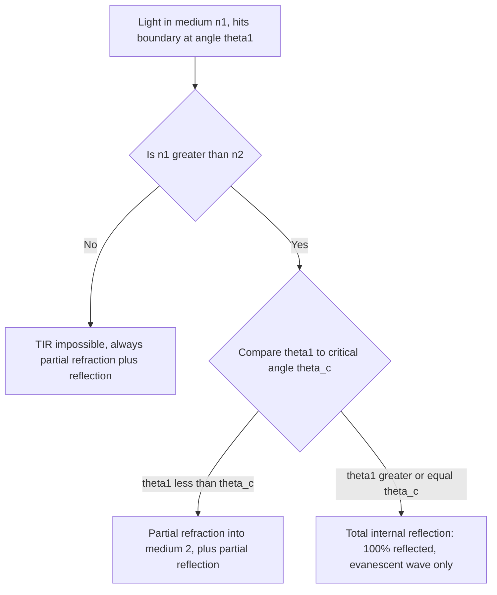

## Total Internal Reflection

### Definition

Total internal reflection (TIR) is the phenomenon in which a light ray traveling within a denser medium is completely reflected at the boundary with a less dense medium, with no light transmitted across the interface, provided the angle of incidence exceeds a specific threshold called the **critical angle**. Unlike ordinary partial reflection, TIR reflects 100% of the incident light intensity back into the original medium, making it a highly efficient and lossless reflection mechanism.

### Condition for Total Internal Reflection

TIR can only occur when light travels from a medium of higher refractive index $n_1$ toward a medium of lower refractive index $n_2$, i.e., $n_1 > n_2$. Starting from Snell's law:

$$n_1\sin\theta_1 = n_2\sin\theta_2$$

As $\theta_1$ increases, $\theta_2$ increases faster (since $n_2 < n_1$ means the ray bends away from the normal). At a specific incidence angle called the **critical angle** $\theta_c$, the refracted ray grazes exactly along the interface, meaning $\theta_2 = 90°$:

$$n_1\sin\theta_c = n_2\sin(90°) = n_2$$

$$\boxed{\sin\theta_c = \frac{n_2}{n_1}}$$

For any angle of incidence $\theta_1 > \theta_c$, Snell's law would require $\sin\theta_2 = (n_1/n_2)\sin\theta_1 > 1$, which has no real solution — physically indicating that no propagating refracted ray can exist, and all the incident energy is reflected back into medium 1.

**Key Points**

- TIR is impossible in the reverse direction (light going from lower to higher index) — Snell's law never produces $\sin\theta_2 > 1$ in that case, since $n_1 < n_2$ means $\theta_2 < \theta_1$ always.
- The critical angle depends only on the ratio of refractive indices $n_2/n_1$, not on wavelength directly, though since $n$ itself is wavelength-dependent (dispersion), $\theta_c$ technically varies slightly across the visible spectrum for real materials.
- At exactly $\theta_1 = \theta_c$, the refracted ray theoretically travels along the interface itself ($\theta_2 = 90°$); in practice, this is a mathematical limiting case rather than a directly observed transmitted beam.

### Worked Example: Critical Angle for Water-Air Interface

**Example**

Find the critical angle for light traveling from water ($n_1 = 1.33$) into air ($n_2 = 1.00$).

$$\sin\theta_c = \frac{n_2}{n_1} = \frac{1.00}{1.33} \approx 0.7519$$

$$\theta_c = \arcsin(0.7519) \approx 48.8°$$

Any light ray traveling upward within a body of water and striking the water-air surface at an angle greater than 48.8° from the vertical normal is completely reflected back into the water. This explains why an underwater observer looking upward sees the entire sky compressed into a circular window (Snell's window) of half-angle 48.8°, with the water surface outside this cone appearing as a mirror-like reflection of the underwater scene.

### Worked Example: Critical Angle for Diamond

**Example**

Diamond has an exceptionally high refractive index, $n_1 \approx 2.42$. Find its critical angle relative to air ($n_2 = 1.00$).

$$\sin\theta_c = \frac{1.00}{2.42} \approx 0.4132$$

$$\theta_c = \arcsin(0.4132) \approx 24.4°$$

This unusually small critical angle means light entering a cut diamond undergoes multiple total internal reflections before exiting, since most internal ray paths exceed this narrow angle — a major contributor to diamond's characteristic brilliance and sparkle, alongside its high dispersion.

### Physical Mechanism: Evanescent Waves

**Key Points**

- Even during total internal reflection, the electromagnetic field does not abruptly vanish at the boundary; a non-propagating **evanescent wave** extends a short distance (typically less than one wavelength) into the less dense medium, with its amplitude decaying exponentially with distance from the interface.
- The evanescent wave carries no net energy away from the interface on time-average (for a single interface with no material to interact with beyond it) — energy conservation is satisfied by the incident beam's power being fully returned in the reflected beam.
- If a second high-index medium is brought very close to the interface (within about one wavelength), the evanescent wave can couple into it and produce a transmitted wave — a phenomenon called **frustrated total internal reflection**, used in devices like beam-splitting prisms with a variable air gap.

### Ray Diagram: Behavior Near and Beyond the Critical Angle (svg_diagram)

<svg xmlns="http://www.w3.org/2000/svg" viewBox="0 0 520 260">
<text x="260" y="22" font-size="16" text-anchor="middle" fill="#222">Total Internal Reflection Onset (svg_diagram)</text>
<line x1="40" y1="130" x2="480" y2="130" stroke="#333" stroke-width="2" />
<text x="30" y="120" font-size="11" fill="#333">n₂ (less dense)</text>
<text x="30" y="150" font-size="11" fill="#333">n₁ (more dense)</text>
<line x1="260" y1="40" x2="260" y2="220" stroke="#909497" stroke-width="1" stroke-dasharray="4,3" />
<line x1="260" y1="130" x2="180" y2="60" stroke="#a04000" stroke-width="2" marker-end="url(t1)" />
<line x1="260" y1="130" x2="340" y2="60" stroke="#a04000" stroke-width="2" stroke-dasharray="2,2" />
<text x="150" y="50" font-size="10" fill="#a04000">θ &lt; θc: partial refraction + reflection</text>
<line x1="260" y1="130" x2="200" y2="140" stroke="#1a5276" stroke-width="2" marker-end="url(t2)" />
<text x="120" y="150" font-size="10" fill="#1a5276">θ = θc: grazing ray along interface</text>
<line x1="260" y1="200" x2="340" y2="130" stroke="#27ae60" stroke-width="2.5" marker-end="url(t3)" />
<line x1="340" y1="130" x2="420" y2="60" stroke="#27ae60" stroke-width="2.5" marker-end="url(t3)" />
<text x="350" y="220" font-size="10" fill="#27ae60">θ &gt; θc: total internal reflection, 100% reflected</text>
</svg>

### Onset Logic Diagram

### Applications

**Key Points**

- **Fiber-optic communication**: light is guided along a glass or plastic optical fiber core (higher $n$) surrounded by a cladding layer (lower $n$); as long as the light strikes the core-cladding boundary beyond the critical angle, it propagates along the fiber via repeated TIR with very low loss over long distances.
- **Prism-based reflectors (e.g., binoculars, periscopes)**: right-angle or porro prisms use TIR at 45° internal surfaces (which exceed the critical angle for glass-air, typically around 41-42°) to redirect light without the losses or coating requirements of metallic mirrors.
- **Endoscopes and medical imaging**: bundles of optical fibers use TIR to transmit images from inside the body to an external viewer or camera with minimal signal degradation.
- **Diamond and gemstone cutting**: gem cutters exploit the small critical angle of high-index materials (like diamond) to maximize internal light trapping and reflection, enhancing brilliance and fire.
- **Frustrated total internal reflection sensors**: used in touchscreens and fingerprint scanners, where contact with a surface (e.g., a fingertip) locally disrupts the TIR condition, allowing light to escape and be detected at the contact point.
- **Attenuated total reflectance (ATR) spectroscopy**: an analytical chemistry technique that uses the evanescent wave penetrating a small distance into a sample placed against a high-index crystal to measure infrared absorption spectra of the sample material.

### Common Pitfalls

**Key Points**

- Assuming TIR can occur in either direction across an interface — it is strictly a one-way phenomenon, occurring only when light attempts to go from a higher-index to a lower-index medium.
- Believing that literally zero electromagnetic field exists beyond the interface during TIR — an evanescent field does exist just past the boundary, even though it does not carry away net energy on average.
- Forgetting that the critical angle formula $\sin\theta_c = n_2/n_1$ requires $n_2 < n_1$ for a valid (less than 1) sine value — attempting to compute a critical angle in the wrong direction yields an undefined or non-physical result.
- Treating TIR as producing zero optical loss in all practical devices — while TIR itself is ideally lossless, real fiber-optic and prism systems still experience some attenuation from material absorption, scattering, and imperfect surface/interface quality.

**Next Steps**

- Snell's Law and Refraction Fundamentals
- Reflection and Refraction: General Principles
- Fiber Optics: Core-Cladding Design and Signal Propagation
- Evanescent Waves and Frustrated Total Internal Reflection
- Prisms: Dispersion and Reflective Applications
- Brewster's Angle and Polarization Effects
- Electromagnetic Waves in Matter: Index of Refraction
- Attenuated Total Reflectance (ATR) Spectroscopy