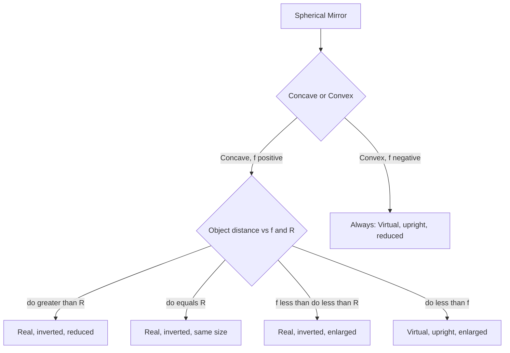

## Plane and Curved Mirrors

### Overview

Mirrors form images by reflecting light according to the law of reflection ($\theta_i = \theta_r$). The geometry of the reflecting surface — flat (plane) or curved (spherical, parabolic) — determines the size, orientation, and location of the resulting image. Plane mirrors always produce simple, predictable virtual images, while curved mirrors (concave and convex) can produce a much richer variety of image types depending on object distance, governed by the mirror equation and magnification relations.

### Plane Mirrors

For a flat reflecting surface, every incident ray obeys $\theta_i = \theta_r$ relative to the local normal (which is the same direction everywhere on a flat surface).

**Key Points**

- The image formed is always **virtual** (light rays do not actually converge at the image location; they only appear to diverge from it when traced backward).
- The image is **upright** (same orientation as the object) and the same size as the object (**magnification** $m = +1$).
- The image distance behind the mirror equals the object distance in front of it: $d_i = -d_o$ (using the sign convention where distances behind the mirror are negative).
- Plane mirror images exhibit **left-right reversal** (more precisely, front-back reversal along the axis perpendicular to the mirror), which is why text appears mirror-reversed.

### Spherical Mirror Geometry

A spherical mirror is a small section of a sphere's surface, characterized by its **radius of curvature** $R$ and **focal length** $f$:

$$f = \frac{R}{2}$$

**Key Points**

- **Concave mirrors** curve inward (reflecting surface on the inside of the sphere) and converge parallel rays toward a real focal point in front of the mirror.
- **Convex mirrors** curve outward (reflecting surface on the outside of the sphere) and diverge parallel rays as if they originated from a virtual focal point behind the mirror.
- The **principal axis** is the line through the center of curvature $C$ and the vertex of the mirror; the **focal point** $F$ lies on this axis at distance $f$ from the vertex.
- This relation ($f = R/2$) holds exactly only for the **paraxial approximation** — rays close to and nearly parallel to the principal axis; rays far from the axis exhibit **spherical aberration**, focusing at slightly different points.

### The Mirror Equation

The relationship between object distance $d_o$, image distance $d_i$, and focal length $f$ is:

$$\frac{1}{d_o} + \frac{1}{d_i} = \frac{1}{f}$$

with the associated **magnification**:

$$m = -\frac{d_i}{d_o}$$

**Key Points**

- **Sign convention** (one common convention): $d_o > 0$ for a real object in front of the mirror; $d_i > 0$ for a real image in front of the mirror, $d_i < 0$ for a virtual image behind the mirror; $f > 0$ for concave mirrors, $f < 0$ for convex mirrors.
- $m > 0$ indicates an upright image; $m < 0$ indicates an inverted image. $|m| > 1$ means magnified; $|m| < 1$ means reduced.
- These sign conventions vary between textbooks — some define distances behind the mirror as positive instead — so consistent application within a single convention is essential.

### Ray Tracing Rules for Concave Mirrors

**Key Points**

- A ray parallel to the principal axis reflects through the focal point $F$.
- A ray passing through the focal point $F$ reflects parallel to the principal axis.
- A ray passing through the center of curvature $C$ reflects straight back along its original path (since it strikes the mirror perpendicular to the surface).
- A ray striking the vertex reflects symmetrically about the principal axis, obeying $\theta_i = \theta_r$ relative to the axis.

Any two of these rules suffice to graphically locate the image formed by an object.

### Image Formation by Concave Mirrors: Case Analysis

| Object Position | Image Type | Orientation | Size |
| --- | --- | --- | --- |
| Beyond center of curvature ($d_o > R$) | Real | Inverted | Reduced |
| At center of curvature ($d_o = R$) | Real | Inverted | Same size |
| Between $C$ and $F$ ($f < d_o < R$) | Real | Inverted | Enlarged |
| At the focal point ($d_o = f$) | At infinity | — | — |
| Inside the focal point ($d_o < f$) | Virtual | Upright | Enlarged |

**Key Points**

- Concave mirrors are the only mirror type capable of producing a **real** image (light rays actually converge and could be projected on a screen).
- The transition at $d_o = f$ produces parallel reflected rays that never converge — this is the principle behind mirror-based flashlight and headlight reflectors, which place a small light source at the focal point to produce a parallel (collimated) beam.
- When $d_o < f$, concave mirrors behave like a magnifying mirror, producing the familiar enlarged upright image seen in cosmetic/shaving mirrors held close to the face.

### Image Formation by Convex Mirrors

**Key Points**

- Convex mirrors have a negative focal length ($f < 0$ in the standard sign convention) and always produce a **virtual, upright, reduced** image, regardless of object distance.
- This is because the diverging geometry of a convex surface never allows reflected rays to converge on the same side as the object.
- The reduced image size provides a wider field of view for a given mirror size, which is why convex mirrors are used for security and vehicle side/rearview mirrors — trading image size for increased viewing area (often accompanied by a "objects in mirror are closer than they appear" warning, since the reduced image can misleadingly suggest greater distance).

### Worked Example: Concave Mirror, Object Beyond Center of Curvature

**Example**

An object is placed $d_o = 30\ \text{cm}$ in front of a concave mirror with focal length $f = 10\ \text{cm}$. Find the image distance and magnification.

$$\frac{1}{d_o} + \frac{1}{d_i} = \frac{1}{f}$$

$$\frac{1}{d_i} = \frac{1}{10} - \frac{1}{30} = \frac{3}{30} - \frac{1}{30} = \frac{2}{30}$$

$$d_i = 15\ \text{cm}$$

$$m = -\frac{d_i}{d_o} = -\frac{15}{30} = -0.5$$

The image is real (positive $d_i$), inverted ($m<0$), and reduced to half size ($|m|=0.5$) — consistent with an object placed beyond the center of curvature ($R = 2f = 20\ \text{cm}$, and $d_o = 30\ \text{cm} > R$).

### Worked Example: Convex Mirror

**Example**

An object is placed $d_o = 20\ \text{cm}$ in front of a convex mirror with $|R| = 30\ \text{cm}$, so $f = -15\ \text{cm}$.

$$\frac{1}{d_i} = \frac{1}{f} - \frac{1}{d_o} = \frac{1}{-15} - \frac{1}{20} = -\frac{4}{60} - \frac{3}{60} = -\frac{7}{60}$$

$$d_i \approx -8.57\ \text{cm}$$

$$m = -\frac{d_i}{d_o} = -\frac{-8.57}{20} \approx 0.43$$

The negative $d_i$ confirms a virtual image (behind the mirror); the positive magnification confirms it is upright and reduced to about 43% of the object's size — consistent with the general behavior of convex mirrors.

### Ray Diagram: Concave Mirror, Object Beyond C (svg_diagram)

<svg xmlns="http://www.w3.org/2000/svg" viewBox="0 0 520 260">
<text x="260" y="22" font-size="16" text-anchor="middle" fill="#222">Concave Mirror Ray Diagram (svg_diagram)</text>
<path d="M 380 60 Q 340 140, 380 220" fill="none" stroke="#333" stroke-width="3" />
<line x1="60" y1="140" x2="480" y2="140" stroke="#909497" stroke-width="1" stroke-dasharray="4,3" />
<circle cx="300" cy="140" r="3" fill="#333" />
<text x="300" y="155" font-size="11" fill="#333">F</text>
<circle cx="220" cy="140" r="3" fill="#333" />
<text x="220" y="155" font-size="11" fill="#333">C</text>
<line x1="140" y1="100" x2="140" y2="140" stroke="#a04000" stroke-width="3" />
<text x="120" y="95" font-size="11" fill="#a04000">Object</text>
<line x1="140" y1="100" x2="380" y2="100" stroke="#27ae60" stroke-width="2" marker-end="url(m1)" />
<line x1="380" y1="100" x2="300" y2="140" stroke="#27ae60" stroke-width="2" stroke-dasharray="1,0" />
<line x1="300" y1="140" x2="245" y2="163" stroke="#27ae60" stroke-width="2" marker-end="url(m1)" />
<line x1="140" y1="100" x2="220" y2="140" stroke="#1a5276" stroke-width="2" />
<line x1="220" y1="140" x2="140" y2="180" stroke="#1a5276" stroke-width="2" marker-end="url(m2)" />
<line x1="245" y1="163" x2="245" y2="140" stroke="#a04000" stroke-width="3" />
<text x="245" y="180" font-size="11" fill="#a04000">Real, inverted image</text>
</svg>

### Concave vs. Convex Comparison

### Applications

**Key Points**

- **Vehicle mirrors**: convex mirrors for side/rearview mirrors (wide field of view); flat mirrors for standard rearview mirrors (accurate distance perception).
- **Telescopes**: large concave (often parabolic, to eliminate spherical aberration at the design focus) primary mirrors collect and focus light from distant astronomical objects in reflecting telescopes.
- **Satellite dishes and solar concentrators**: parabolic concave reflectors focus incoming parallel rays (radio waves or sunlight) to a single point, maximizing signal or energy collection.
- **Cosmetic and dental mirrors**: small concave mirrors held closer than their focal length produce magnified, upright virtual images for close-up detail viewing.
- **Security and traffic mirrors**: convex mirrors placed at blind corners or in stores provide a wide-angle view of an area from a single vantage point.
- **Flashlight and headlight reflectors**: a light source placed at the focal point of a concave (often parabolic) reflector produces a collimated (parallel) beam.

### Common Pitfalls

**Key Points**

- Forgetting that convex mirrors *always* produce virtual, upright, reduced images regardless of object distance — unlike concave mirrors, there is no case analysis needed for convex mirrors.
- Confusing sign conventions between different textbooks or problem sets — always establish and consistently apply one convention (e.g., "real is positive" for concave mirror focal length) throughout a given calculation.
- Assuming the spherical mirror equation $f = R/2$ holds exactly for all rays — it is a paraxial approximation, and rays far from the principal axis suffer spherical aberration, which is why high-precision optical systems (telescopes) often use parabolic rather than spherical mirrors.
- Misinterpreting negative magnification as "smaller" rather than "inverted" — the sign of $m$ indicates orientation, while its magnitude indicates size relative to the object.

**Next Steps**

- Reflection and Refraction: General Principles
- The Mirror Equation and Sign Conventions
- Thin Lenses and the Lensmaker's Equation
- Spherical Aberration and Parabolic Mirrors
- Ray Tracing Techniques for Optical Systems
- Reflecting Telescopes: Design and Optics
- Real vs. Virtual Images: Conceptual Foundations
- Magnification and Optical Instrument Design