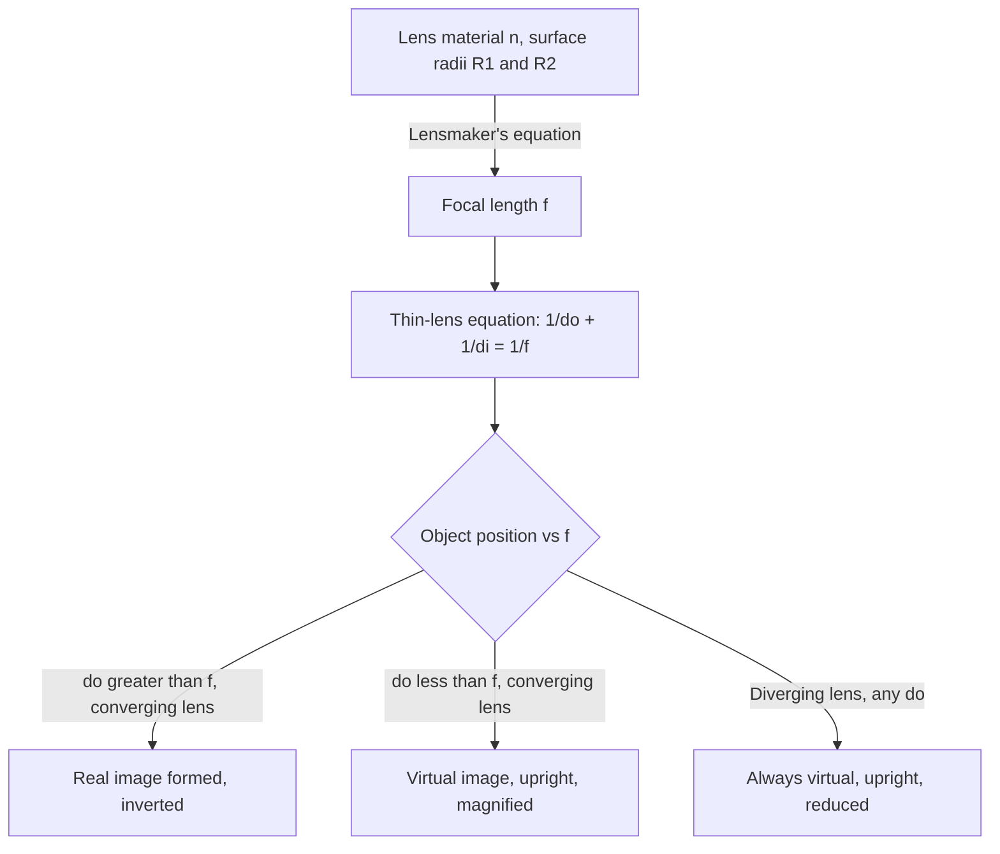

## Thin Lenses and the Lensmaker's Equation

### Overview

A thin lens is an optical element with negligible thickness compared to its focal length and radii of curvature, formed by two refracting surfaces that bend light via Snell's law at each interface. The lensmaker's equation relates a lens's focal length to its physical properties (refractive index, radii of curvature), while the thin-lens equation relates object and image distances for image formation — together forming the foundation of geometric optics for lens-based imaging systems.

### Types of Thin Lenses

**Key Points**

- **Converging (convex) lenses**: thicker at the center than the edges; bend parallel rays inward to converge at a real focal point on the far side of the lens. Focal length is positive by convention.
- **Diverging (concave) lenses**: thinner at the center than the edges; bend parallel rays outward, as if diverging from a virtual focal point on the same side as the incoming light. Focal length is negative by convention.
- Common sub-types include biconvex, plano-convex, and concavo-convex (converging); biconcave, plano-concave, and convexo-concave (diverging), classified by the curvature signs of their two surfaces.

### The Lensmaker's Equation

For a thin lens made of material with refractive index $n$, surrounded by a medium of index 1 (typically air), with surface radii of curvature $R_1$ (first surface) and $R_2$ (second surface), the focal length is given by:

$$\frac{1}{f} = (n-1)\left(\frac{1}{R_1} - \frac{1}{R_2}\right)$$

**Key Points**

- Sign convention: $R_1$ and $R_2$ are positive if their center of curvature lies on the outgoing (transmission) side of that surface, and negative if on the incoming side. Different textbooks may define this oppositely, so consistent application matters more than memorizing a specific sign.
- A higher refractive index $n$ produces a shorter focal length for given radii of curvature — denser lens materials bend light more strongly.
- This equation is derived by applying Snell's law (in the paraxial/small-angle approximation, where $\sin\theta \approx \theta$) sequentially at each of the lens's two refracting surfaces, then combining the results in the thin-lens limit (negligible lens thickness).

### Worked Example: Biconvex Lens Focal Length

**Example**

A biconvex lens made of glass ($n = 1.52$) has a first surface with $R_1 = +20\ \text{cm}$ (convex toward incoming light) and a second surface with $R_2 = -20\ \text{cm}$ (convex away from incoming light, by symmetry).

$$\frac{1}{f} = (1.52-1)\left(\frac{1}{20} - \frac{1}{-20}\right) = (0.52)\left(\frac{1}{20}+\frac{1}{20}\right) = (0.52)\left(\frac{2}{20}\right) = (0.52)(0.1)$$

$$\frac{1}{f} = 0.052\ \text{cm}^{-1} \quad\Rightarrow\quad f \approx 19.2\ \text{cm}$$

This positive focal length confirms the lens is converging, as expected for a symmetric biconvex shape.

### The Thin-Lens Equation

Once the focal length is known, the relationship between object distance $d_o$, image distance $d_i$, and focal length $f$ for image formation is:

$$\frac{1}{d_o} + \frac{1}{d_i} = \frac{1}{f}$$

identical in form to the mirror equation, with associated **magnification**:

$$m = -\frac{d_i}{d_o}$$

**Key Points**

- **Sign convention**: $d_o > 0$ for a real object; $d_i > 0$ for a real image on the opposite side of the lens from the object (light actually passes through and converges there); $d_i < 0$ for a virtual image on the same side as the object.
- $f > 0$ for converging lenses, $f < 0$ for diverging lenses.
- $m > 0$ indicates upright image; $m < 0$ indicates inverted image; $|m| > 1$ magnified, $|m| < 1$ reduced.

### Ray Tracing Rules for Converging Lenses

**Key Points**

- A ray parallel to the principal axis refracts through the far focal point $F$.
- A ray passing through the near focal point (on the object side) emerges parallel to the principal axis after refraction.
- A ray through the center of the lens passes through undeviated (in the thin-lens approximation, where the two surfaces are treated as coincident).

Any two of these rules are sufficient to graphically locate the image.

### Image Formation by Converging Lenses: Case Analysis

| Object Position | Image Type | Orientation | Size |
| --- | --- | --- | --- |
| Beyond $2f$ ($d_o > 2f$) | Real | Inverted | Reduced |
| At $2f$ ($d_o = 2f$) | Real | Inverted | Same size |
| Between $f$ and $2f$ ($f < d_o < 2f$) | Real | Inverted | Enlarged |
| At the focal point ($d_o = f$) | At infinity | — | — |
| Inside the focal point ($d_o < f$) | Virtual | Upright | Enlarged |

**Key Points**

- This case structure directly parallels that of concave mirrors, reflecting the shared underlying mathematics of the imaging equation.
- The $d_o < f$ case (virtual, upright, magnified image) is the operating principle of a simple magnifying glass.
- Converging lenses are the only single-lens type capable of forming a real image.

### Image Formation by Diverging Lenses

**Key Points**

- Diverging lenses (negative $f$) always produce a **virtual, upright, reduced** image, regardless of object distance — directly analogous to convex mirrors.
- This occurs because a diverging lens spreads out parallel rays; refracted rays never converge on the transmission side, so only their backward-traced virtual intersection forms an image.
- Common application: the reducing lens in a peephole viewer, and corrective lenses for nearsightedness (myopia), which use diverging lenses to shift the eye's focal point appropriately.

### Worked Example: Converging Lens, Object Between f and 2f

**Example**

An object is placed $d_o = 15\ \text{cm}$ in front of a converging lens with $f = 10\ \text{cm}$.

$$\frac{1}{d_i} = \frac{1}{f} - \frac{1}{d_o} = \frac{1}{10} - \frac{1}{15} = \frac{3}{30} - \frac{2}{30} = \frac{1}{30}$$

$$d_i = 30\ \text{cm}$$

$$m = -\frac{d_i}{d_o} = -\frac{30}{15} = -2$$

The image is real ($d_i>0$), inverted ($m<0$), and magnified to twice the object's size — consistent with the object being placed between $f$ (10 cm) and $2f$ (20 cm).

### Worked Example: Diverging Lens

**Example**

An object is placed $d_o = 25\ \text{cm}$ in front of a diverging lens with $f = -15\ \text{cm}$.

$$\frac{1}{d_i} = \frac{1}{-15} - \frac{1}{25} = -\frac{5}{75} - \frac{3}{75} = -\frac{8}{75}$$

$$d_i \approx -9.4\ \text{cm}$$

$$m = -\frac{-9.4}{25} \approx 0.375$$

The negative $d_i$ confirms a virtual image on the same side as the object; the positive $m$ confirms it is upright and reduced to about 38% of the object's original size.

### Ray Diagram: Converging Lens, Object Between f and 2f (svg_diagram)

<svg xmlns="http://www.w3.org/2000/svg" viewBox="0 0 520 260">
<text x="260" y="22" font-size="16" text-anchor="middle" fill="#222">Converging Lens Ray Diagram (svg_diagram)</text>
<line x1="280" y1="50" x2="280" y2="230" stroke="#333" stroke-width="3" />
<line x1="60" y1="140" x2="480" y2="140" stroke="#909497" stroke-width="1" stroke-dasharray="4,3" />
<circle cx="220" cy="140" r="3" fill="#333" />
<text x="220" y="155" font-size="11" fill="#333">F (object side)</text>
<circle cx="340" cy="140" r="3" fill="#333" />
<text x="340" y="155" font-size="11" fill="#333">F' (image side)</text>
<line x1="150" y1="100" x2="150" y2="140" stroke="#a04000" stroke-width="3" />
<text x="130" y="95" font-size="11" fill="#a04000">Object</text>
<line x1="150" y1="100" x2="280" y2="100" stroke="#27ae60" stroke-width="2" marker-end="url(l1)" />
<line x1="280" y1="100" x2="440" y2="205" stroke="#27ae60" stroke-width="2" marker-end="url(l1)" />
<line x1="150" y1="100" x2="280" y2="140" stroke="#1a5276" stroke-width="2" />
<line x1="280" y1="140" x2="440" y2="205" stroke="#1a5276" stroke-width="2" marker-end="url(l2)" />
<line x1="440" y1="140" x2="440" y2="205" stroke="#a04000" stroke-width="3" />
<text x="440" y="220" font-size="11" text-anchor="middle" fill="#a04000">Real, inverted, enlarged image</text>
</svg>

### Lensmaker's and Thin-Lens Equation Flow

### Combination of Multiple Lenses

**Key Points**

- For a system of thin lenses in close contact, the combined focal length follows: $\frac{1}{f_{total}} = \frac{1}{f_1} + \frac{1}{f_2} + \dots$, analogous to combining optical "powers" (measured in diopters, $D = 1/f$ in meters, in ophthalmology).
- For lenses separated by a distance, the image formed by the first lens serves as the object for the second lens, requiring sequential application of the thin-lens equation — a technique used in analyzing compound microscopes, telescopes, and camera lens systems.
- **Total magnification** for a multi-lens system is the product of the individual magnifications: $m_{total} = m_1 \times m_2 \times \dots$

### Applications

**Key Points**

- **Corrective eyewear**: converging lenses correct farsightedness (hyperopia) and presbyopia; diverging lenses correct nearsightedness (myopia), both by adjusting where incoming light focuses relative to the retina.
- **Cameras**: converging lens systems (often multi-element to reduce aberrations) focus light onto a sensor or film, with focal length determining field of view and magnification.
- **Microscopes and telescopes**: compound optical systems using multiple converging lenses (objective and eyepiece) to achieve high magnification of small or distant objects.
- **Magnifying glasses**: a simple converging lens used with the object inside the focal length, producing the enlarged, upright virtual image characteristic of everyday magnifiers.
- **Projectors**: converging lens systems placed with the object (film/slide/digital display) between $f$ and $2f$ to produce a magnified, inverted real image on a projection screen (with the image inverted again by the display orientation to appear correct).

### Common Pitfalls

**Key Points**

- Confusing the lensmaker's equation (which determines $f$ from a lens's physical shape and material) with the thin-lens equation (which determines image location from $f$ and object distance) — the two serve different purposes despite the similar-looking $1/f$ terms.
- Applying inconsistent sign conventions for $R_1$, $R_2$ between different sources — always verify a source's specific convention before using its version of the lensmaker's equation.
- Forgetting that a diverging lens, like a convex mirror, always produces the same qualitative image type (virtual, upright, reduced) regardless of object placement, unlike converging lenses which require case-by-case analysis.
- Neglecting the thin-lens approximation's limits — real lenses with finite thickness, or rays far from the paraxial region, exhibit aberrations (spherical aberration, chromatic aberration) not captured by this simplified treatment.

**Next Steps**

- Plane and Curved Mirrors: The Mirror Equation
- Reflection and Refraction: Snell's Law
- Optical Instruments: Microscopes and Telescopes
- Lens Aberrations: Spherical and Chromatic
- The Human Eye as an Optical System
- Combination of Lenses and Optical Power (Diopters)
- Magnification in Multi-Element Optical Systems
- Dispersion and Chromatic Aberration in Lenses