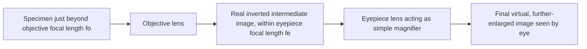

## Optical Instruments

### Overview

Optical instruments are devices that use combinations of lenses and/or mirrors to form images with properties useful for human observation or measurement — magnifying small or distant objects, correcting the eye's natural limitations, or capturing images for recording. All such instruments are built from the same foundational geometric optics principles (Snell's law, the thin-lens and mirror equations, ray tracing), applied sequentially across multiple optical elements.

### The Human Eye as a Reference Optical System

**Key Points**

- The eye functions as a single-lens imaging system: the cornea provides most of the fixed refractive power, while the flexible crystalline lens fine-tunes focus via **accommodation** (muscular adjustment of lens curvature).
- Light is focused onto the retina, which must lie at the image distance corresponding to the eye's effective focal length for objects at the current viewing distance.
- The **near point** (closest distance for clear focus, conventionally 25 cm for a "normal" eye) and **far point** (farthest distance for clear focus, ideally infinity) define the eye's accommodation range.
- **Myopia (nearsightedness)**: the eye focuses parallel rays in front of the retina (eyeball too long or cornea/lens too strong); corrected with a diverging lens.
- **Hyperopia (farsightedness)**: the eye focuses parallel rays behind the retina (eyeball too short or refractive power too weak); corrected with a converging lens.
- **Presbyopia**: age-related loss of lens flexibility, reducing accommodation range, typically corrected with reading glasses or bifocals (converging lenses for near work).

### The Simple Magnifier

A simple magnifier is a single converging lens used with the object placed inside the focal length ($d_o < f$), producing a virtual, upright, enlarged image.

**Angular magnification** compares the angle subtended by the image (viewed through the lens) to the angle subtended by the object at the eye's near point ($N \approx 25\ \text{cm}$) without the lens:

$$M = \frac{N}{f}$$

for the image formed at infinity (relaxed eye viewing), or more generally:

$$M = 1 + \frac{N}{f}$$

for the image formed at the near point (maximum magnification, but requiring more eye strain).

**Key Points**

- Shorter focal length lenses produce higher magnification, but also introduce greater aberrations and require the object to be held very close to the lens.
- The magnifier does not change the actual size of the object; it allows the eye to focus on the object from a much closer distance than the unaided near point would permit, thereby subtending a larger angle and appearing larger.

### Compound Microscope

A compound microscope uses two converging lenses — the **objective** (short focal length, close to the specimen) and the **eyepiece** (ocular, longer focal length) — arranged so the objective forms a real, inverted, magnified image that serves as the object for the eyepiece, which then acts as a simple magnifier on that intermediate image.

**Key Points**

- The objective lens is positioned so the specimen lies just beyond its focal point, producing a large, real, inverted intermediate image.
- This intermediate image falls within the eyepiece's focal length, so the eyepiece produces a further-magnified virtual image for the eye to view.
- Total angular magnification is approximately the product of the objective's linear magnification $m_o$ and the eyepiece's angular magnification $M_e$:

$$M_{total} = m_o \times M_e \approx \left(\frac{L}{f_o}\right)\left(\frac{N}{f_e}\right)$$

where $L$ is the distance between the objective's back focal point and the eyepiece's front focal point (the **tube length**), $f_o$ and $f_e$ are the objective and eyepiece focal lengths, and $N \approx 25\ \text{cm}$.

- The final image seen by the observer is virtual, and inverted relative to the original specimen (a well-known characteristic of standard compound microscopes).

### Worked Example: Compound Microscope Magnification

**Example**

A compound microscope has an objective with $f_o = 0.5\ \text{cm}$, an eyepiece with $f_e = 2.5\ \text{cm}$, and a tube length $L = 16\ \text{cm}$.

$$M_{total} = \left(\frac{L}{f_o}\right)\left(\frac{N}{f_e}\right) = \left(\frac{16}{0.5}\right)\left(\frac{25}{2.5}\right) = (32)(10) = 320$$

This microscope provides approximately 320× total angular magnification, a typical value for a standard laboratory compound microscope configuration.

### Refracting Telescope

A refracting telescope also uses an objective and an eyepiece, but is optimized for viewing distant objects (effectively at infinity) rather than close specimens. The objective (large focal length, large diameter for light-gathering) forms a real image near its focal point, which lies close to the eyepiece's focal point as well — the two focal points essentially coincide for the standard astronomical telescope configuration.

**Angular magnification** for a telescope:

$$M = -\frac{f_o}{f_e}$$

**Key Points**

- The negative sign indicates the final image is inverted relative to the object — acceptable for astronomical observation but requiring an additional image-erecting system (extra lenses or prisms) for terrestrial telescopes and binoculars.
- Unlike a microscope (which maximizes magnification for close, small objects), a telescope's objective is designed primarily to maximize **light-gathering power** (proportional to aperture diameter squared), since distant astronomical objects are typically very faint, not physically small in angular terms in the way microscope specimens require optical enlargement.
- Larger objective diameter improves both light-gathering power and angular resolution (via the diffraction limit), which is why large telescopes use big-aperture objectives (or, in reflecting designs, large primary mirrors) rather than simply increasing $f_o/f_e$.

### Worked Example: Telescope Magnification

**Example**

A refracting telescope has an objective lens with $f_o = 100\ \text{cm}$ and an eyepiece with $f_e = 2\ \text{cm}$.

$$M = -\frac{f_o}{f_e} = -\frac{100}{2} = -50$$

The telescope provides 50× angular magnification, with the negative sign indicating an inverted final image (standard for a basic astronomical refractor).

### Reflecting Telescopes

**Key Points**

- Reflecting telescopes replace the objective lens with a large concave (often parabolic) primary mirror, avoiding chromatic aberration entirely (since reflection, unlike refraction, does not depend on wavelength) and allowing much larger apertures than are practical for lenses (which must be supported only at their edges and are prone to sagging under their own weight at large sizes).
- Common designs include the Newtonian (flat secondary mirror diverts light to an eyepiece at the side of the tube) and Cassegrain (convex secondary mirror reflects light back through a hole in the primary mirror to an eyepiece behind it) configurations.
- Essentially all major modern research telescopes (ground-based and space-based) are reflecting designs, due to the practical size and aberration advantages over refractors.

### Camera Systems

**Key Points**

- A camera uses a converging lens system (often multi-element to correct for aberrations) to form a real, inverted image on a light-sensitive sensor (or historically, film).
- **Focal length** determines the field of view and magnification: longer focal lengths produce a narrower field of view and greater magnification (telephoto lenses); shorter focal lengths produce a wider field of view (wide-angle lenses).
- The **f-number** ($N = f/D$, where $D$ is the aperture diameter) controls both the amount of light admitted and the depth of field (range of object distances that appear acceptably in focus).
- Autofocus systems adjust lens-to-sensor distance (or internal lens element positions) to satisfy the thin-lens equation for the current object distance, ensuring $d_i$ matches the fixed sensor plane location.

### Optical Instrument Comparison

| Instrument | Elements | Primary Purpose | Typical Image (final) |
| --- | --- | --- | --- |
| Simple magnifier | 1 converging lens | Enlarge close, small objects | Virtual, upright, enlarged |
| Compound microscope | Objective + eyepiece (both converging) | High magnification of tiny nearby specimens | Virtual, inverted, greatly enlarged |
| Refracting telescope | Objective + eyepiece (both converging) | Magnify distant objects, gather light | Virtual, inverted (basic design) |
| Reflecting telescope | Concave primary mirror + eyepiece/secondary | Magnify distant objects, large aperture, no chromatic aberration | Virtual (via eyepiece) or real (at sensor) |
| Camera | Converging lens system | Record a real image on a sensor/film | Real, inverted (corrected electronically/optically for display) |

### Ray Path Diagram: Compound Microscope

### Telescope Light Path (svg_diagram)

<svg xmlns="http://www.w3.org/2000/svg" viewBox="0 0 520 220">
<text x="260" y="22" font-size="16" text-anchor="middle" fill="#222">Refracting Telescope Light Path (svg_diagram)</text>
<line x1="30" y1="110" x2="480" y2="90" stroke="#a04000" stroke-width="1.5" marker-end="url(tp1)" />
<line x1="30" y1="130" x2="480" y2="90" stroke="#a04000" stroke-width="1.5" marker-end="url(tp1)" />
<line x1="110" y1="40" x2="110" y2="180" stroke="#1a5276" stroke-width="4" />
<text x="110" y="195" font-size="11" text-anchor="middle" fill="#1a5276">Objective (large fo)</text>
<line x1="380" y1="70" x2="380" y2="110" stroke="#27ae60" stroke-width="3" />
<text x="380" y="195" font-size="11" text-anchor="middle" fill="#27ae60">Eyepiece (small fe)</text>
<circle cx="360" cy="90" r="2" fill="#333" />
<text x="360" y="105" font-size="10" fill="#333">Shared focal point (approx.)</text>
<line x1="380" y1="70" x2="470" y2="30" stroke="#333" stroke-width="1.5" stroke-dasharray="3,3" marker-end="url(tp2)" />
<text x="420" y="45" font-size="10" fill="#333">To eye (magnified view)</text>
</svg>

### Applications

**Key Points**

- **Astronomy**: reflecting telescopes (ground-based observatories, space telescopes) rely on the light-gathering and aberration advantages of large mirrors for observing faint, distant celestial objects.
- **Biology and medicine**: compound microscopes are fundamental tools for cellular and microbiological observation; specialized variants (phase-contrast, fluorescence) build on the same basic optical train.
- **Photography and videography**: camera lens design directly applies thin-lens and multi-element optical principles, balancing focal length, aperture, and aberration correction.
- **Vision correction**: eyeglasses and contact lenses apply single-lens correction principles directly derived from the eye's own optical system model.
- **Surveying and navigation**: telescopic sights, periscopes, and rangefinders combine lenses, mirrors, and sometimes prisms (for image erection) for practical measurement and observation tasks.

### Common Pitfalls

**Key Points**

- Confusing simple magnification (single lens, angular magnification formula) with the compound magnification formula used for microscopes and telescopes, which involves the product of two separate optical stages.
- Assuming telescope magnification is the primary design goal — in practice, light-gathering power (aperture size) and resolution are typically more important than raw magnification for astronomical utility, since a dim, poorly resolved magnified image is less useful than a well-resolved fainter one.
- Forgetting that both compound microscopes and basic refracting telescopes produce an inverted final image — this is often counterintuitive for those expecting an "upright" magnified view, and requires additional correcting optics (e.g., an Amici prism) in instruments designed for direct terrestrial viewing (spotting scopes, binoculars).
- Neglecting chromatic aberration in refracting instruments — since refractive index varies with wavelength, simple lens-only telescopes and microscopes suffer color fringing that achromatic or apochromatic lens designs (or reflecting designs entirely) are built to minimize.

**Next Steps**

- Thin Lenses and the Lensmaker's Equation
- Plane and Curved Mirrors
- The Human Eye: Accommodation and Vision Defects
- Lens Aberrations: Spherical and Chromatic
- Diffraction Limits and Optical Resolution
- Reflecting Telescope Designs: Newtonian and Cassegrain
- Camera Optics: Aperture, Depth of Field, and Focal Length
- Angular Magnification and Optical Instrument Design Principles