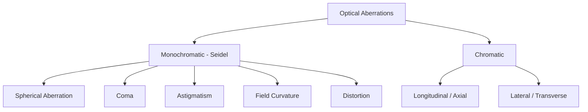
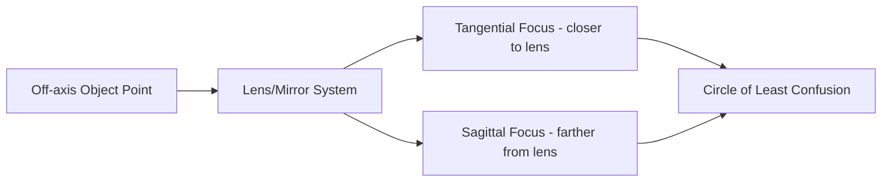

## Aberrations in Lenses and Mirrors

### Definition and Origin

Aberrations are deviations of a real optical system from the idealized predictions of paraxial (first-order Gaussian) optics. Paraxial theory assumes rays make small angles with the optical axis, allowing $\sin\theta \approx \theta$. Real systems accept rays over finite apertures and fields of view, where higher-order terms in the expansion of $\sin\theta$ become significant:

$$\sin\theta = \theta - \frac{\theta^3}{3!} + \frac{\theta^5}{5!} - \cdots$$

Retaining the cubic term produces third-order (Seidel) aberration theory, which classifies five monochromatic aberrations. A sixth category, chromatic aberration, arises from the wavelength dependence of refractive index and applies only to lenses (dioptric systems), not mirrors (catoptric systems), since reflection is wavelength-independent.

### Classification Overview

**Key Points**

- Monochromatic (Seidel) aberrations: spherical aberration, coma, astigmatism, field curvature, distortion
- Chromatic aberrations: longitudinal (axial) and lateral (transverse)
- Mirrors suffer from all monochromatic aberrations but are inherently free of chromatic aberration
- Aberrations scale differently with aperture ($h$, the ray height) and field angle ($\theta$, the object/image angle)

### Spherical Aberration

Spherical aberration occurs because rays striking a spherical surface far from the axis (marginal rays) are refracted or reflected more strongly than paraxial rays, causing them to converge at a point closer to the surface than paraxial rays.

**Key Points**

- Depends on aperture height $h$ approximately as $h^4$ in wavefront error, or the longitudinal shift scales as $h^2$
- Present even for on-axis object points (does not require off-axis field angle)
- Longitudinal spherical aberration (LSA): the axial separation between the marginal and paraxial focus
- Transverse spherical aberration (TSA): the corresponding blur radius at the paraxial focal plane, $\text{TSA} \approx \text{LSA} \times \tan u$, where $u$ is the marginal ray angle
- The image formed is a bright core surrounded by a halo, degrading contrast rather than producing a sharp geometric shape

For a single thin lens, the amount of spherical aberration depends on the **shape factor** (Coddington shape factor):

$$q = \frac{R_2 + R_1}{R_2 - R_1}$$

A plano-convex lens oriented with its curved side toward the more collimated beam minimizes spherical aberration compared to the reversed orientation, because bending the ray gradually across two surfaces of similar curvature distributes the refraction more evenly than a large deviation at a single surface.

**Correction Methods**

- Using aspheric surfaces (e.g., parabolic mirrors for on-axis point sources)
- Combining a converging and diverging lens of different glass types (achromatic/apochromatic doublets, which also correct chromatic aberration)
- Stopping down the aperture (reduces spherical aberration but also reduces light-gathering and increases diffraction-limited blur)
- Using the optimal shape factor for a given conjugate ratio

**Mirror-Specific Note**

A spherical mirror exhibits spherical aberration for finite-aperture beams; a parabolic mirror is aberration-free for on-axis parallel rays (this is why parabolic mirrors are used in reflecting telescopes and satellite dishes) but suffers from coma for off-axis sources.

SVG diagram illustrating marginal vs. paraxial focus (svg_diagram):

<svg xmlns="http://www.w3.org/2000/svg" viewBox="0 0 600 260">
<rect width="600" height="260" fill="#ffffff" />
<text x="300" y="20" font-size="14" text-anchor="middle" font-family="sans-serif" font-weight="bold">Spherical Aberration (svg_diagram)</text>
<line x1="20" y1="130" x2="580" y2="130" stroke="#888" stroke-width="1" stroke-dasharray="4,4" />
<ellipse cx="260" cy="130" rx="18" ry="90" fill="none" stroke="#333" stroke-width="2" />
<line x1="60" y1="60" x2="260" y2="60" stroke="#1f77b4" stroke-width="2" />
<line x1="260" y1="60" x2="420" y2="130" stroke="#1f77b4" stroke-width="2" />
<line x1="60" y1="100" x2="260" y2="100" stroke="#2ca02c" stroke-width="2" />
<line x1="260" y1="100" x2="470" y2="130" stroke="#2ca02c" stroke-width="2" />
<line x1="60" y1="130" x2="260" y2="130" stroke="#d62728" stroke-width="2" />
<circle cx="420" cy="130" r="3" fill="#1f77b4" />
<circle cx="470" cy="130" r="3" fill="#2ca02c" />
<text x="420" y="150" font-size="11" text-anchor="middle" font-family="sans-serif" fill="#1f77b4">Marginal focus</text>
<text x="470" y="170" font-size="11" text-anchor="middle" font-family="sans-serif" fill="#2ca02c">Paraxial focus</text>
<text x="240" y="45" font-size="11" font-family="sans-serif">Lens</text>
</svg>

### Coma

Coma affects off-axis object points, causing rays passing through different zones of the lens aperture to form circles of varying size and position in the image plane, producing a comet-shaped (asymmetric, flared) blur instead of a point.

**Key Points**

- Depends on both aperture ($h^2$ or $h^3$ depending on convention) and field angle $\theta$ (linear in $\theta$)
- Rays through the outer zones of the aperture form larger, displaced circles than rays through the central zone, creating the characteristic "comet tail" pointing away from the axis
- **Sine condition**: a system free of both spherical aberration and coma satisfies $n \sin\theta = n' \sin\theta'$ for the marginal ray, generalizing Abbe's sine condition to finite aperture
- Coma is the dominant residual aberration in fast parabolic mirrors used off-axis, which is why wide-field reflecting telescopes use correctors (e.g., Schmidt corrector plates, Ritchey–Chrétien designs with hyperbolic primary and secondary mirrors)

**Correction Methods**

- Aplanatic lens design (simultaneous correction of spherical aberration and coma)
- Stopping down the aperture
- Symmetric lens configurations about a central stop (naturally cancels coma, along with distortion and lateral chromatic aberration)

### Astigmatism

Astigmatism arises for off-axis points because rays in the tangential (meridional) plane and rays in the sagittal plane focus at different distances from the lens.

**Key Points**

- Produces two separate line-image foci instead of a point: the tangential focus (a line perpendicular to the meridional plane) and the sagittal focus (a line in the meridional plane)
- Between these two foci lies the **circle of least confusion**, the position of best overall focus compromise
- The separation between tangential and sagittal foci increases with field angle $\theta$ (roughly as $\theta^2$)
- Should not be confused with the "astigmatism" of the human eye, which is a related but distinct condition caused by a non-spherical cornea or lens

**Correction Methods**

- Using multiple lens elements to balance the tangential and sagittal field curves
- Anastigmat lens designs, which flatten and merge the two focal surfaces over a useful field
- Field stops to limit the usable off-axis field angle

### Field Curvature (Petzval Curvature)

Even after astigmatism is corrected, the surface of best focus is generally curved rather than flat, because the image of a planar object formed by a simple lens or mirror system naturally lies on a curved surface.

**Key Points**

- Described by the **Petzval sum**: for a system of thin lenses in air,

  $$\sum \frac{1}{n_i f_i} = \text{Petzval sum} \quad (\text{radius of curvature } R_p = -1/\text{Petzval sum})$$
- A flat detector (film sensor, CCD/CMOS array) placed at the paraxial focal plane records defocus increasing with radial distance from the center
- Independent of aperture; depends only on field angle and the power/index distribution of the elements

**Correction Methods**

- Petzval lens designs combining positive and negative elements of different refractive indices to flatten the field
- Field-flattener lens elements placed near the image plane
- Curving the detector or film to match the natural image surface (used in some specialized astronomical instruments)

### Distortion

Distortion is a variation of transverse magnification with field angle/height, so that a straight line in the object (away from the axis) is imaged as a curved line, even though each point may still be imaged sharply (distortion does not blur the image, unlike the other four Seidel aberrations).

**Key Points**

- **Barrel distortion**: magnification decreases with field height; a square appears to bulge outward like a barrel — common in wide-angle lenses
- **Pincushion distortion**: magnification increases with field height; a square appears pinched inward at the edges — common in telephoto and simple magnifier/eyepiece systems
- Since it is a mapping error rather than a blur, distortion can be corrected computationally in digital image processing after capture, unlike the other Seidel aberrations
- A system with a stop placed symmetrically between two identical lens groups is automatically free of distortion, coma, and lateral chromatic aberration (by symmetry of the ray paths)

**Example**

Photographing a rectangular grid through a fisheye (wide-angle) lens: the outer grid lines bow outward — this is barrel distortion, quantified as

$$\text{Distortion (\%)} = \frac{h' - h'_{\text{paraxial}}}{h'_{\text{paraxial}}} \times 100$$

where $h'$ is the actual image height and $h'_{\text{paraxial}}$ is the ideal (paraxial) image height.

### Chromatic Aberration

Since the refractive index $n(\lambda)$ of glass varies with wavelength (normal dispersion: $n$ decreases as $\lambda$ increases), a lens has a slightly different focal length for each color. Mirrors are free of this effect because the law of reflection, $\theta_i = \theta_r$, contains no wavelength dependence.

**Key Points**

- **Longitudinal (axial) chromatic aberration**: different wavelengths focus at different distances along the axis. Blue light (shorter $\lambda$, higher $n$) focuses closer to the lens than red light for a simple positive lens.
- **Lateral (transverse) chromatic aberration**: different wavelengths are imaged at different heights in the image plane for off-axis points, producing color fringing at high-contrast edges
- Quantified using the **Abbe number** (V-number) of a glass:

  $$V_d = \frac{n_d - 1}{n_F - n_C}$$

  where $n_d$, $n_F$, $n_C$ are refractive indices at the helium d-line (587.6 nm), hydrogen F-line (486.1 nm), and hydrogen C-line (656.3 nm) respectively. A higher $V_d$ means lower dispersion.

**Correction Methods**

- **Achromatic doublet**: cementing a low-dispersion crown glass positive lens with a high-dispersion flint glass negative lens brings two wavelengths (typically red and blue) to a common focus, leaving a residual "secondary spectrum" for other wavelengths
- **Apochromatic (APO) lens**: uses three or more elements, often including anomalous-dispersion (ED) glass or fluorite, to bring three wavelengths to a common focus, substantially reducing the secondary spectrum
- Using mirrors instead of lenses for the primary optical power (reflecting telescopes are inherently achromatic)

The condition for two thin lenses in contact to form an achromatic doublet (zero longitudinal chromatic aberration for two chosen wavelengths) is:

$$\frac{f_1}{V_1} + \frac{f_2}{V_2} = 0$$

where $f_1, f_2$ are the focal lengths and $V_1, V_2$ the Abbe numbers of the two glass elements. Since $V_1 \neq V_2$, this requires one positive and one negative element of different glass types.

### Seidel Aberration Coefficients (Summary Table Form)

| Aberration | Depends on Aperture | Depends on Field Angle | Affects Mirrors | Affects Lenses |
| --- | --- | --- | --- | --- |
| Spherical | Yes ($h^4$ wavefront) | No | Yes | Yes |
| Coma | Yes | Yes (linear) | Yes | Yes |
| Astigmatism | No | Yes ($\theta^2$) | Yes | Yes |
| Field Curvature | No | Yes ($\theta^2$) | Yes | Yes |
| Distortion | No | Yes ($\theta^3$) | Yes | Yes |
| Chromatic | Yes | Varies | No | Yes |

### Worked Example: Estimating Longitudinal Spherical Aberration

**Example**

A thin plano-convex lens with focal length $f = 100\text{ mm}$ and aperture radius $h = 20\text{ mm}$ is used at its optimal orientation (curved side toward the incoming collimated beam). For a lens of refractive index $n = 1.5$ in this configuration, the longitudinal spherical aberration can be approximated using the third-order formula:

$$\text{LSA} \approx \frac{h^2}{8f^3}\left(\text{shape and index dependent coefficient}\right)$$

[Inference] The exact numerical coefficient depends on the specific third-order aberration formula and sign convention used (e.g., Conrady or Coddington formulations), and full evaluation requires ray-tracing software (such as Zemax or OSLO) for a production-accurate result rather than the thin-lens approximation alone. The qualitative conclusion — LSA increases with the square of aperture and decreases with the cube of focal length (i.e., faster, lower f-number lenses show markedly worse spherical aberration) — is well established.

### Diagram: Astigmatic Foci (Tangential vs. Sagittal)

### Practical Implications by Instrument Type

**Key Points**

- **Camera lenses**: multi-element designs balance spherical aberration, coma, and field curvature; distortion is often corrected in-software for zoom lenses
- **Microscope objectives**: high numerical aperture demands strong spherical and chromatic correction; "achromat," "fluorite," and "apochromat" designations indicate the degree of chromatic correction
- **Telescopes**: refractors need achromatic/apochromatic doublets or triplets; reflectors (Newtonian) avoid chromatic aberration entirely but a simple parabolic primary suffers coma off-axis, addressed in Ritchey–Chrétien and Schmidt–Cassegrain designs
- **Human eye**: exhibits spherical aberration, coma, and (in irregular corneas) astigmatism as a natural optical system; corrective lenses primarily address defocus (myopia/hyperopia) and regular astigmatism

**Conclusion**

Aberrations represent the departure of real imaging systems from the idealized point-to-point mapping of paraxial optics. The five monochromatic Seidel aberrations (spherical, coma, astigmatism, field curvature, distortion) affect both lenses and mirrors and arise from the finite-aperture, finite-field nature of real optical systems, while chromatic aberration is unique to refractive (lens-based) systems due to dispersion. Optical design manages these effects through combinations of element shape, multiple-element compensation, aspheric surfaces, symmetric stop placement, and choice of glass dispersion properties, with the specific correction strategy dictated by the aperture, field of view, and spectral bandwidth demanded by the application.

**Related Topics**

- Paraxial (Gaussian) optics and the thin lens equation
- Wavefront aberration theory and Zernike polynomials
- Optical Path Difference (OPD) and the Rayleigh quarter-wave criterion
- Lens design software and ray-tracing methods
- Diffraction-limited resolution and the Airy disk
- Achromatic and apochromatic lens systems
- Telescope optical designs (Newtonian, Cassegrain, Ritchey–Chrétien, Schmidt)
- Modulation Transfer Function (MTF) as a comprehensive image-quality metric