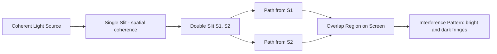

## Young's Double-Slit Experiment

### Historical Context and Significance

Thomas Young performed this experiment around 1801 to demonstrate the wave nature of light, providing the first strong experimental evidence for interference and challenging the then-dominant Newtonian corpuscular theory. By showing that light passing through two closely spaced slits produces a pattern of alternating bright and dark bands (fringes) rather than two simple overlapping spots, Young demonstrated that light exhibits constructive and destructive interference — a behavior characteristic of waves, not particles.

**Key Points**

- Historically pivotal in establishing the wave theory of light, later reinforced by Fresnel's diffraction theory and Maxwell's electromagnetic theory
- The modern version of the experiment (performed with single photons or electrons) also demonstrates wave–particle duality, since interference patterns build up even when particles are sent through one at a time

### Experimental Setup

**Key Points**

- A monochromatic, coherent light source (originally sunlight through a pinhole, modernly a laser) illuminates two narrow, closely spaced parallel slits, $S_1$ and $S_2$, separated by distance $d$
- The slits act as coherent secondary sources (per Huygens' Principle) since they are illuminated by the same wavefront
- A screen is placed at distance $L$ from the slits, where $L \gg d$ (far-field/Fraunhofer approximation)
- Light from both slits overlaps on the screen and interferes, producing a pattern of equally spaced bright and dark fringes

Geometry of the double-slit setup (svg_diagram):

<svg xmlns="http://www.w3.org/2000/svg" viewBox="0 0 640 320">
<rect width="640" height="320" fill="#ffffff" />
<text x="320" y="20" font-size="14" text-anchor="middle" font-family="sans-serif" font-weight="bold">Young's Double-Slit Geometry (svg_diagram)</text>
<rect x="40" y="140" width="8" height="40" fill="#333" />
<line x1="60" y1="60" x2="60" y2="260" stroke="#333" stroke-width="6" />
<line x1="60" y1="140" x2="60" y2="150" stroke="#ffffff" stroke-width="12" />
<line x1="60" y1="170" x2="60" y2="180" stroke="#ffffff" stroke-width="12" />
<text x="30" y="145" font-size="10" font-family="sans-serif">S1</text>
<text x="30" y="185" font-size="10" font-family="sans-serif">S2</text>
<line x1="60" y1="145" x2="560" y2="160" stroke="#1f77b4" stroke-width="1.5" />
<line x1="60" y1="175" x2="560" y2="160" stroke="#2ca02c" stroke-width="1.5" />
<line x1="560" y1="60" x2="560" y2="260" stroke="#333" stroke-width="4" />
<text x="590" y="160" font-size="11" font-family="sans-serif">Screen</text>
<line x1="60" y1="160" x2="560" y2="160" stroke="#888" stroke-width="1" stroke-dasharray="3,3" />
<circle cx="560" cy="90" r="3" fill="#d62728" />
<circle cx="560" cy="115" r="3" fill="#000" />
<circle cx="560" cy="140" r="3" fill="#d62728" />
<circle cx="560" cy="160" r="4" fill="#d62728" />
<circle cx="560" cy="180" r="3" fill="#d62728" />
<circle cx="560" cy="205" r="3" fill="#000" />
<circle cx="560" cy="230" r="3" fill="#d62728" />

<text x="150" y="240" font-size="10" font-family="sans-serif">d (slit separation)</text>

<line x1="60" y1="220" x2="60" y2="220" stroke="none" />

<text x="300" y="280" font-size="10" font-family="sans-serif">L (slit-to-screen distance)</text>

<text x="565" y="95" font-size="9" font-family="sans-serif" fill="`#d62728`">Bright</text>

<text x="565" y="120" font-size="9" font-family="sans-serif">Dark</text>

</svg>

### Path Difference and Interference Conditions

At an observation point $P$ on the screen at angle $\theta$ from the central axis, the two paths $S_1P$ and $S_2P$ differ in length. Using the far-field (Fraunhofer) approximation where $L \gg d$, the path difference is:

$$\Delta = d\sin\theta$$

**Constructive interference (bright fringes)** occurs when the path difference equals a whole number of wavelengths:

$$d\sin\theta = m\lambda, \quad m = 0, \pm1, \pm2, \dots$$

**Destructive interference (dark fringes)** occurs when the path difference equals a half-integer number of wavelengths:

$$d\sin\theta = \left(m + \tfrac{1}{2}\right)\lambda, \quad m = 0, \pm1, \pm2, \dots$$

Here $m$ is the **order** of the fringe ($m=0$ is the central maximum, $m=\pm1$ are the first-order maxima, etc.).

### Small-Angle Approximation and Fringe Spacing

For small angles (valid when $y \ll L$, where $y$ is the position on the screen measured from the center), $\sin\theta \approx \tan\theta \approx y/L$. Substituting into the bright-fringe condition:

$$y_m = \frac{m\lambda L}{d}$$

The **fringe spacing** (distance between adjacent bright fringes, or adjacent dark fringes) is therefore constant across the pattern near the center:

$$\Delta y = y_{m+1} - y_m = \frac{\lambda L}{d}$$

**Key Points**

- Fringe spacing increases with wavelength $\lambda$ and screen distance $L$
- Fringe spacing decreases as slit separation $d$ increases (narrower fringes for wider-spaced slits)
- This relation is routinely used in laboratory settings to measure the wavelength of light given known $d$, $L$, and measured $\Delta y$

**Example**

A laser with $\lambda = 633\text{ nm}$ (He-Ne laser) illuminates two slits separated by $d = 0.25\text{ mm}$, and the screen is $L = 2.0\text{ m}$ away.

$$\Delta y = \frac{\lambda L}{d} = \frac{(633\times10^{-9}\text{ m})(2.0\text{ m})}{0.25\times10^{-3}\text{ m}} = 5.064\times10^{-3}\text{ m} \approx 5.06\text{ mm}$$

The bright fringes are spaced approximately 5.06 mm apart on the screen.

### Intensity Distribution

The full intensity pattern (not just the fringe locations) follows a cosine-squared modulation. For two coherent sources of equal amplitude, the phase difference between the two paths is:

$$\phi = \frac{2\pi}{\lambda}d\sin\theta$$

and the resulting intensity as a function of position is:

$$I(\theta) = I_0 \cos^2\left(\frac{\phi}{2}\right) = I_0\cos^2\left(\frac{\pi d \sin\theta}{\lambda}\right)$$

where $I_0$ is the intensity of a single slit acting alone (times 4, since two coherent equal-amplitude waves in phase produce four times the single-source intensity at the maxima — amplitude doubles, and intensity scales with amplitude squared).

**Key Points**

- Maximum intensity (bright fringe) is $4\times$ the single-slit intensity, not $2\times$ — a signature of interference rather than simple intensity addition
- Minimum intensity (dark fringe) is zero, corresponding to perfect destructive interference (idealized case of equal-amplitude, fully coherent waves)
- This cosine-squared pattern assumes idealized point-source (infinitely narrow) slits; real slits of finite width introduce an additional diffraction envelope (see below)

### Combined Effect of Finite Slit Width: Diffraction Envelope

In practice, each slit has a finite width $a$, so single-slit diffraction (per the Huygens–Fresnel principle) modulates the amplitude of each source, producing a diffraction envelope that multiplies the interference pattern:

$$I(\theta) = I_0 \left(\frac{\sin\beta}{\beta}\right)^2 \cos^2\gamma, \quad \beta = \frac{\pi a \sin\theta}{\lambda}, \quad \gamma = \frac{\pi d \sin\theta}{\lambda}$$

**Key Points**

- The $\left(\frac{\sin\beta}{\beta}\right)^2$ term is the single-slit diffraction envelope, which suppresses fringe intensity toward larger angles and creates an overall envelope with zeros at $a\sin\theta = m\lambda$
- The $\cos^2\gamma$ term is the rapid double-slit interference oscillation
- **Missing orders**: if $d/a$ is an integer, certain interference maxima coincide exactly with diffraction minima and are suppressed entirely from the observed pattern — for example, if $d = 3a$, the interference order $m=3, 6, 9,\dots$ maxima are missing
- This combined pattern is the experimentally realistic result seen with actual finite-width slits, as opposed to the idealized infinite-fringe cosine-squared pattern of ideal point sources

**Example**

If $d = 3a$, the $3^\text{rd}$, $6^\text{th}$, $9^\text{th}$, etc. interference maxima (bright fringes) fall exactly where the diffraction envelope has a zero, so those orders appear "missing" from the pattern — a directly observable diagnostic of the ratio $d/a$ in a real experimental setup.

### Coherence Requirements

**Key Points**

- The two sources ($S_1$ and $S_2$) must be **coherent** — maintaining a constant phase relationship over time — for a stable, observable interference pattern; this is why Young used a single slit (or pinhole) before the double slit, to ensure both slits are illuminated by the same wavefront (spatial coherence)
- **Temporal coherence** requires reasonably monochromatic light; a light source with a broad spectral bandwidth washes out higher-order fringes because different wavelengths produce interference maxima at different positions, blurring the pattern away from the central ($m=0$) fringe (which is common to all wavelengths, appearing white in white-light experiments)
- Laser sources are commonly used in modern demonstrations because they provide high spatial and temporal coherence without requiring a separate single-slit collimating step

### Single-Photon / Wave–Particle Duality Extension

**Key Points**

- When the experiment is performed with the light intensity reduced so that only one photon (or electron) passes through the apparatus at a time, individual detection events appear at random, particle-like positions on the screen
- Over many such individual events, the accumulated statistical distribution reproduces the same interference fringe pattern, demonstrating that each individual quantum entity's probability of detection is governed by wave interference
- [Inference] Attempting to determine "which slit" a given photon/electron passed through (e.g., with a which-path detector) destroys the interference pattern, a manifestation of complementarity in quantum mechanics; this extension goes beyond Young's original classical wave-optics experiment and is generally treated in the context of quantum mechanics rather than classical wave optics

### Applications and Extensions

**Key Points**

- **Michelson-type and other interferometers** build on the same coherent-superposition principle for precision measurement of distances, wavelengths, and refractive indices
- **Diffraction gratings** extend the double-slit concept to many (N) coherent slits, producing much sharper and more widely separated interference maxima, used in spectroscopy
- **Radio astronomy interferometry** and **X-ray crystallography** apply the same interference principles at different wavelength regimes
- Thin-film interference and Newton's rings are related interference phenomena arising from a different geometric arrangement of coherent path differences

**Conclusion**

Young's Double-Slit Experiment demonstrates that coherent light waves from two closely spaced sources superpose to produce a stable interference pattern of bright and dark fringes, with fringe positions and spacing governed by the path difference $d\sin\theta$ relative to the wavelength. The experiment's historical role in establishing the wave theory of light, combined with its modern extension to single-particle quantum interference, makes it one of the most conceptually significant experiments in the history of physics.

**Related Topics**

- Huygens' Principle and coherent secondary wavelet sources
- Diffraction gratings and multiple-slit interference (N-slit systems)
- Coherence: spatial and temporal coherence, coherence length
- Thin-film interference and Newton's rings
- Michelson interferometer and precision interferometry
- Wave–particle duality and the quantum double-slit experiment
- Fraunhofer vs. Fresnel diffraction regimes
- Diffraction envelope and missing orders in real double-slit patterns