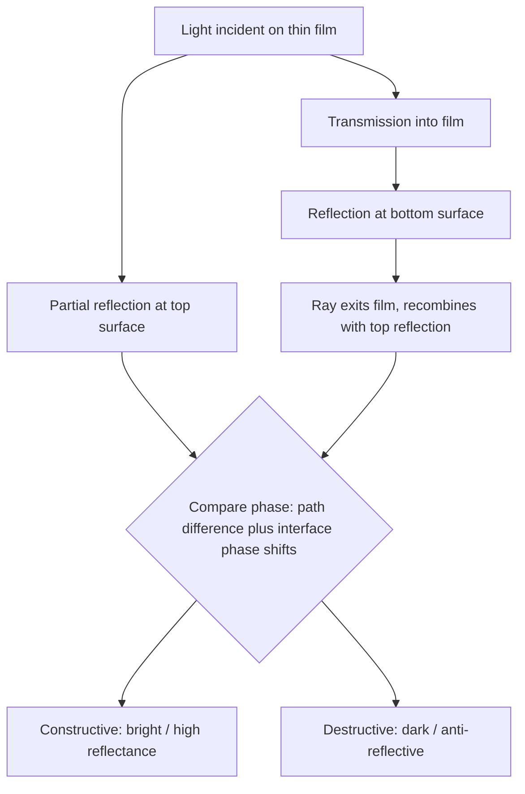

## Thin-Film Interference

### Physical Origin

Thin-film interference occurs when light reflects from both the top and bottom surfaces of a thin, transparent film (such as a soap bubble, an oil slick on water, or an anti-reflective coating), producing two coherent reflected waves that overlap and interfere. Because both reflected beams originate from the same incident wave, they maintain a fixed phase relationship, and their interference depends on the extra path length traveled by the wave reflecting from the bottom surface relative to the wave reflecting from the top surface.

**Key Points**

- Requires a film thickness comparable to the wavelength of light (typically hundreds of nanometers to a few micrometers) for observable interference effects
- The two interfering beams are the wave reflected at the top (film/air or film/first-medium) interface and the wave reflected at the bottom (film/substrate) interface after traversing the film twice
- Produces the familiar colored patterns seen in soap bubbles, oil slicks, and butterfly wings (structural color)

Geometry of thin-film reflection (svg_diagram):

<svg xmlns="http://www.w3.org/2000/svg" viewBox="0 0 500 320">
<rect width="500" height="320" fill="#ffffff" />
<text x="250" y="20" font-size="14" text-anchor="middle" font-family="sans-serif" font-weight="bold">Thin-Film Interference Geometry (svg_diagram)</text>
<rect x="60" y="120" width="380" height="60" fill="#cde8f0" stroke="#333" stroke-width="1" />
<text x="20" y="90" font-size="11" font-family="sans-serif">Medium 1 (n1, e.g., air)</text>
<text x="20" y="115" font-size="11" font-family="sans-serif" fill="#333" />
<text x="450" y="115" font-size="11" font-family="sans-serif">Film (n2)</text>
<text x="20" y="220" font-size="11" font-family="sans-serif">Medium 3 (n3, substrate)</text>
<line x1="120" y1="60" x2="220" y2="120" stroke="#1f77b4" stroke-width="2" />
<line x1="220" y1="120" x2="160" y2="60" stroke="#1f77b4" stroke-width="2" />
<text x="130" y="55" font-size="9" font-family="sans-serif" fill="#1f77b4">Incident</text>
<text x="165" y="55" font-size="9" font-family="sans-serif" fill="#1f77b4">Ray 1 (reflected)</text>
<line x1="220" y1="120" x2="260" y2="180" stroke="#2ca02c" stroke-width="2" />
<line x1="260" y1="180" x2="300" y2="120" stroke="#2ca02c" stroke-width="2" />
<line x1="300" y1="120" x2="360" y2="60" stroke="#2ca02c" stroke-width="2" />
<text x="330" y="55" font-size="9" font-family="sans-serif" fill="#2ca02c">Ray 2 (reflected)</text>
<line x1="60" y1="120" x2="440" y2="120" stroke="#666" stroke-width="1" stroke-dasharray="2,2" />
<line x1="60" y1="180" x2="440" y2="180" stroke="#666" stroke-width="1" stroke-dasharray="2,2" />
<text x="450" y="155" font-size="10" font-family="sans-serif">t (thickness)</text>
<line x1="470" y1="120" x2="470" y2="180" stroke="#000" stroke-width="1" />
</svg>

### Optical Path Difference

For near-normal incidence, light entering a film of thickness $t$ and refractive index $n_2$ (surrounded by media of index $n_1$ above and $n_3$ below) travels an extra geometric distance of $2t$ inside the film (down and back up) before recombining with the top-surface reflection. The **optical path difference** is:

$$\Delta = 2n_2 t \cos\theta_t$$

where $\theta_t$ is the angle of refraction inside the film. At normal incidence ($\theta_t \approx 0$), this simplifies to:

$$\Delta = 2n_2 t$$

**Key Points**

- The path difference increases with both film thickness and refractive index of the film
- At oblique incidence, the $\cos\theta_t$ factor reduces the effective path difference, shifting the interference condition and explaining why thin-film colors shift with viewing angle (as seen in soap bubbles and oil slicks)

### The Critical Role of Phase Shifts on Reflection

A reflected wave undergoes a phase shift depending on the relative refractive indices at the interface, governed by the Fresnel equations:

**Key Points**

- A **$\pi$ phase shift** (equivalent to $\lambda/2$ path length) occurs when light reflects off a medium of **higher** refractive index than the one it is traveling in (reflection at a "denser" boundary, analogous to a wave reflecting off a fixed end)
- **No phase shift** occurs when light reflects off a medium of **lower** refractive index (reflection at a "less dense" boundary, analogous to a wave reflecting off a free end)
- This asymmetry is essential: if both reflections gain the same phase shift (or neither does), they cancel out in the *relative* phase comparison; if only one reflection undergoes a $\pi$ shift, an extra half-wavelength must be added to the effective path difference

**Three common scenarios:**

| Scenario | Top reflection ($n_1 \to n_2$) | Bottom reflection ($n_2 \to n_3$) | Net extra shift |
| --- | --- | --- | --- |
| $n_1 < n_2 < n_3$ (e.g., air–film–glass, film optically "thin" relative to substrate) | $\pi$ shift | $\pi$ shift | Shifts cancel — net 0 |
| $n_1 < n_2 > n_3$ (e.g., soap film in air: air–soap–air) | $\pi$ shift | No shift | Net $\pi$ shift (extra $\lambda/2$) |
| $n_1 > n_2 < n_3$ (uncommon) | No shift | $\pi$ shift | Net $\pi$ shift (extra $\lambda/2$) |

### Constructive and Destructive Interference Conditions

**Case 1: No net relative phase shift** (both reflections shift equally, e.g., $n_1 < n_2 < n_3$)

$$\text{Constructive: } 2n_2 t = m\lambda \qquad \text{Destructive: } 2n_2 t = \left(m+\tfrac{1}{2}\right)\lambda$$

**Case 2: Net $\lambda/2$ relative phase shift** (only one reflection shifts, e.g., soap film in air)

$$\text{Constructive: } 2n_2 t = \left(m+\tfrac{1}{2}\right)\lambda \qquad \text{Destructive: } 2n_2 t = m\lambda$$

where $m = 0, 1, 2, \dots$ in both cases. Note the conditions swap between the two cases — this is the most common source of error when analyzing thin-film problems, so identifying the correct phase-shift scenario first is essential.

**Example**

A soap film ($n_2 = 1.33$) suspended in air ($n_1 = n_3 = 1.00$) has thickness $t = 250\text{ nm}$. Since only the top reflection ($n_1=1.00 \to n_2 = 1.33$, low-to-high) undergoes a $\pi$ shift while the bottom reflection ($n_2 = 1.33 \to n_3 = 1.00$, high-to-low) does not, this is the net-$\lambda/2$-shift case. For constructive interference (bright reflection) in the visible range:

$$2n_2 t = \left(m + \tfrac12\right)\lambda \implies \lambda = \frac{2n_2 t}{m + \tfrac12} = \frac{2(1.33)(250\text{ nm})}{m+0.5} = \frac{665\text{ nm}}{m+0.5}$$

For $m=0$: $\lambda = 1330\text{ nm}$ (infrared, not visible). For $m=1$: $\lambda = \frac{665}{1.5} \approx 443\text{ nm}$ (violet-blue, visible). So this film thickness appears blue-violet in reflected white light at near-normal incidence.

### Applications

**Anti-Reflective (AR) Coatings**

**Key Points**

- A single-layer AR coating uses a film with index $n_2$ between the incident medium ($n_1$, typically air) and substrate ($n_3$, typically glass, with $n_1 < n_2 < n_3$), placing it in the "no net shift" scenario
- To **minimize** reflection (destructive interference for reflected light) at a target wavelength $\lambda_0$: $2n_2 t = \left(m+\tfrac12\right)\lambda$, most commonly using the thinnest film, $m=0$: $t = \dfrac{\lambda_0}{4n_2}$ (a **quarter-wave coating**)
- Optimal destructive interference (zero reflectance) additionally requires amplitude matching: $n_2 = \sqrt{n_1 n_3}$, so that the two reflected amplitudes are equal and fully cancel
- Camera lenses and eyeglasses commonly use magnesium fluoride ($n \approx 1.38$) coatings, which reduce but do not eliminate reflection across the full visible spectrum since the quarter-wave condition is exact only at one design wavelength (typically chosen near the middle of the visible spectrum, $\approx 550\text{ nm}$), leaving a faint residual purplish reflection from the uncancelled red and blue ends of the spectrum

**Example**

Design a single-layer AR coating for glass ($n_3 = 1.52$) at $\lambda_0 = 550\text{ nm}$ using magnesium fluoride ($n_2 = 1.38$):

$$t = \frac{\lambda_0}{4n_2} = \frac{550\text{ nm}}{4(1.38)} \approx 99.6\text{ nm}$$

**High-Reflectivity Coatings (Dielectric Mirrors)**

**Key Points**

- Multiple alternating quarter-wave layers of high- and low-index dielectric materials can be stacked to achieve reflectivities exceeding 99.9% at a target wavelength, exploiting constructive interference for the reflected beam instead of destructive
- Used in laser cavity mirrors, where high reflectivity with negligible absorption (unlike metallic mirrors) is required

**Naturally Occurring Thin-Film Interference**

**Key Points**

- **Oil slick on water**: variable thickness across the puddle produces varying colors, since the interference condition depends on local thickness $t$ (an "interference contour map" of the film's thickness profile)
- **Soap bubbles**: colors shift and swirl as gravity thins the film over time, and eventually the film becomes so thin (much less than $\lambda/4$) that it appears black just before bursting — the "black film" phenomenon, where $2n_2t \ll \lambda$ makes the net-$\lambda/2$-shift destructive condition essentially satisfied for all visible wavelengths simultaneously
- **Structural color in nature**: butterfly wings (e.g., *Morpho* butterflies) and peacock feathers use layered nanostructures functioning as thin-film or photonic-crystal interference systems rather than pigments, producing angle-dependent iridescent colors

### Newton's Rings

**Key Points**

- A specific application of thin-film interference formed by the air gap between a curved lens surface (plano-convex lens) and a flat glass plate placed beneath it
- The air gap thickness varies radially, being zero at the point of contact and increasing outward, producing concentric circular interference fringes (alternating bright and dark rings) when illuminated with monochromatic light
- At the center (zero gap, $t=0$), the net $\lambda/2$ phase shift (since one reflection is air-to-glass and the other is glass-to-air, an asymmetric case) predicts destructive interference — so the center spot appears **dark**, not bright, a diagnostic feature confirming the phase-shift analysis
- Historically used by Newton to study interference despite his commitment to the corpuscular theory of light; the radii of the rings can be used to precisely measure the radius of curvature of the lens or to test optical surface flatness

### Distinguishing Thin-Film Interference from Diffraction Gratings and Double-Slit

**Key Points**

- Thin-film interference arises from **two discrete reflected wavefronts** separated by an optical path difference through a medium, not from multiple discrete apertures or slits as in double-slit or grating interference
- The interference condition depends on film thickness and refractive index rather than an external geometric slit spacing $d$
- Both phenomena obey the same general principle of coherent superposition, but the physical mechanism generating the path difference differs (propagation through a layered medium vs. diffraction through spatially separated apertures)

**Conclusion**

Thin-film interference arises from the superposition of light reflected at the top and bottom surfaces of a thin transparent layer, with the resulting constructive or destructive interference governed by both the optical path difference ($2n_2t\cos\theta_t$) and any phase shifts introduced by reflection at each interface. Correctly identifying whether a net $\lambda/2$ phase shift occurs is essential to correctly predicting bright versus dark conditions, with wide-ranging applications from anti-reflective and high-reflectivity optical coatings to the natural iridescence observed in soap films, oil slicks, and biological structural color.

**Related Topics**

- Fresnel equations and phase shifts upon reflection
- Anti-reflective coating design and multilayer dielectric stacks
- Newton's rings and optical flatness testing
- Michelson interferometer and other interferometric techniques
- Structural color in biological systems (photonic crystals)
- Multiple-beam (Fabry–Pérot) interference
- Coherence length and its effect on observable interference order