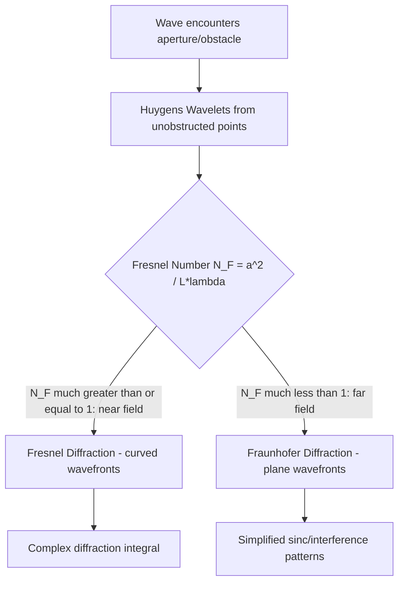

## Diffraction

### Definition and Physical Origin

Diffraction is the bending and spreading of waves as they encounter an obstacle or aperture, most pronounced when the size of the obstacle/aperture is comparable to the wavelength of the wave. It is a direct consequence of the wave nature of light and is fully explained by the Huygens–Fresnel principle: every unobstructed point on a wavefront acts as a source of secondary wavelets, and these wavelets interfere to produce the observed diffraction pattern rather than a sharp geometric shadow.

**Key Points**

- Diffraction and interference are not fundamentally distinct phenomena — both arise from the superposition of coherent waves; "diffraction" is conventionally used when discussing a continuum of secondary sources (e.g., across an aperture), while "interference" is used for a discrete number of sources (e.g., two slits)
- The degree of diffraction depends on the ratio of wavelength to aperture size, $\lambda/a$: significant spreading occurs when $\lambda \sim a$, while negligible spreading occurs when $\lambda \ll a$ (explaining why light diffraction is generally not obvious in everyday large-aperture situations, but sound waves — with much longer wavelengths — diffract noticeably around walls and corners)
- Diffraction sets a fundamental physical limit on the resolution of optical instruments (telescopes, microscopes, cameras), independent of the quality of their lens/mirror manufacturing

### Fresnel vs. Fraunhofer Diffraction

Diffraction phenomena are divided into two regimes based on the distance between the aperture, the source, and the observation screen, characterized by the Fresnel number:

$$N_F = \frac{a^2}{L\lambda}$$

where $a$ is the aperture size and $L$ is the relevant source-to-aperture or aperture-to-screen distance.

**Key Points**

- **Fresnel (near-field) diffraction**: $N_F \gtrsim 1$; occurs when the source or screen (or both) is at a finite distance from the aperture; the wavefronts arriving at and leaving the aperture are curved (spherical), making the mathematical treatment more complex
- **Fraunhofer (far-field) diffraction**: $N_F \ll 1$; occurs when both source and screen are effectively at infinite distance from the aperture (or equivalently, achieved in the laboratory using converging/collimating lenses on either side of the aperture); incident and diffracted wavefronts are treated as plane waves, greatly simplifying the mathematics
- Most introductory diffraction analysis (single slit, double slit, gratings) is performed in the Fraunhofer regime because of its mathematical tractability
- The Huygens–Fresnel diffraction integral applies to both regimes, differing only in the approximation used for the path-length term $r$ in the integral

### Single-Slit (Fraunhofer) Diffraction

When a plane wave passes through a single slit of width $a$, each point across the slit acts as a Huygens source. Integrating their contributions at angle $\theta$ on a distant screen yields the intensity pattern:

$$I(\theta) = I_0\left(\frac{\sin\beta}{\beta}\right)^2, \qquad \beta = \frac{\pi a \sin\theta}{\lambda}$$

**Key Points**

- **Minima (dark fringes)** occur at $a\sin\theta = m\lambda$, for $m = \pm1, \pm2, \dots$ (note: $m=0$ is excluded — it corresponds to the central maximum, not a minimum)
- The **central maximum** is twice as wide as any of the secondary maxima and contains the vast majority of the diffracted intensity
- Secondary maxima occur approximately midway between successive minima and decrease rapidly in intensity (the first secondary maximum is only about 4.7% as intense as the central maximum)
- As slit width $a$ decreases, the central maximum spreads wider (more diffraction); as $a$ increases, the pattern narrows toward the undiffracted geometric-shadow limit

**Example**

Light of wavelength $\lambda = 500\text{ nm}$ passes through a slit of width $a = 0.02\text{ mm}$. The angular position of the first minimum is:

$$\sin\theta_1 = \frac{\lambda}{a} = \frac{500\times10^{-9}}{0.02\times10^{-3}} = 0.025 \implies \theta_1 \approx 1.43°$$

On a screen $L = 1.5\text{ m}$ away, the half-width of the central maximum is approximately $y_1 = L\tan\theta_1 \approx 1.5 \times 0.025 = 3.75\text{ cm}$, giving a full central maximum width of about $7.5\text{ cm}$.

### Diffraction Gratings

A diffraction grating consists of a large number $N$ of equally spaced, narrow slits (or reflective grooves), extending the double-slit interference concept to many coherent sources. The condition for principal interference maxima is identical in form to the double-slit condition:

$$d\sin\theta = m\lambda, \quad m = 0, \pm1, \pm2,\dots$$

where $d$ is now the **grating spacing** (distance between adjacent slits/grooves).

**Key Points**

- As $N$ increases, the principal maxima become progressively sharper and narrower (angular width of a principal maximum scales as $\sim 1/N$), while $(N-2)$ secondary (weak) maxima appear between them
- Gratings therefore provide far superior spectral resolution compared to a simple double slit, making them essential in spectroscopy for resolving closely spaced spectral lines
- **Grating resolving power**: $R = \dfrac{\lambda}{\Delta\lambda} = mN$, where $\Delta\lambda$ is the minimum resolvable wavelength difference at order $m$ using $N$ illuminated slits
- Because $\sin\theta$ depends on $\lambda$, different wavelengths are dispersed to different angles (except at $m=0$, the undeviated central maximum, which appears white for white-light illumination) — this is the physical basis of grating spectrometers

**Example**

A grating with 5000 lines/cm has spacing $d = \dfrac{1\text{ cm}}{5000} = 2\times10^{-4}\text{ cm} = 2000\text{ nm}$. For light of $\lambda = 600\text{ nm}$, the first-order maximum occurs at:

$$\sin\theta = \frac{m\lambda}{d} = \frac{(1)(600)}{2000} = 0.3 \implies \theta \approx 17.5°$$

### Circular Aperture Diffraction and the Airy Pattern

For a circular aperture of diameter $D$ (relevant to all real lenses and mirrors, which have circular apertures), the diffraction pattern consists of a bright central spot (the **Airy disk**) surrounded by concentric faint rings, rather than the single-slit's linear fringe pattern. The angular radius of the first dark ring (edge of the Airy disk) is:

$$\sin\theta_1 = 1.22\,\frac{\lambda}{D}$$

The factor 1.22 arises from the Bessel function solution to the circular-aperture diffraction integral, distinguishing it from the simpler rectangular single-slit case.

**Key Points**

- This diffraction pattern fundamentally limits the resolution of any real optical instrument with a finite circular aperture, regardless of how well-corrected its aberrations are
- Smaller apertures (relative to wavelength) produce larger, more spread-out Airy disks, meaning **larger apertures yield better resolution** (up to the point where aberrations dominate instead)

### The Rayleigh Criterion

**Key Points**

- Two point sources (e.g., two stars, or two closely spaced object features) are considered **just resolvable** when the central maximum of one source's Airy pattern falls on the first minimum of the other's Airy pattern
- The minimum resolvable angular separation is:

  $$\theta_{\min} = 1.22\,\frac{\lambda}{D}$$
- This is a widely used, somewhat conservative convention rather than an absolute physical cutoff; sources closer than this can sometimes still be distinguished with advanced image-processing techniques, but the Rayleigh criterion serves as the standard benchmark for diffraction-limited resolution in telescopes, microscopes, and cameras

**Example**

The Hubble Space Telescope has a primary mirror diameter $D = 2.4\text{ m}$. For visible light $\lambda = 550\text{ nm}$, its diffraction-limited angular resolution is:

$$\theta_{\min} = 1.22\frac{550\times10^{-9}}{2.4} \approx 2.8\times10^{-7}\text{ rad} \approx 0.058\text{ arcseconds}$$

[Inference] This represents the theoretical diffraction-limited resolution; the telescope's actual achieved resolution in practice depends on additional factors such as pointing stability, detector sampling, and instrument-specific optical corrections, though Hubble's resolution is widely reported as close to this diffraction limit due to operating above Earth's atmosphere.

Airy pattern radial intensity profile (svg_diagram):

<svg xmlns="http://www.w3.org/2000/svg" viewBox="0 0 500 260">
<rect width="500" height="260" fill="#ffffff" />
<text x="250" y="20" font-size="14" text-anchor="middle" font-family="sans-serif" font-weight="bold">Airy Pattern Intensity Profile (svg_diagram)</text>
<line x1="40" y1="220" x2="470" y2="220" stroke="#333" stroke-width="1" />
<line x1="250" y1="220" x2="250" y2="40" stroke="#333" stroke-width="1" />
<path d="M 250 220 Q 260 60 280 60 Q 300 60 300 200 Q 300 210 310 210 Q 330 210 330 190 Q 340 195 345 200 Q 355 200 355 208 Q 365 205 370 210" stroke="#1f77b4" stroke-width="2" fill="none" />
<path d="M 250 220 Q 240 60 220 60 Q 200 60 200 200 Q 200 210 190 210 Q 170 210 170 190 Q 160 195 155 200 Q 145 200 145 208 Q 135 205 130 210" stroke="#1f77b4" stroke-width="2" fill="none" />
<text x="250" y="235" font-size="10" text-anchor="middle" font-family="sans-serif">0</text>
<text x="300" y="235" font-size="9" text-anchor="middle" font-family="sans-serif">1st min</text>
<text x="330" y="235" font-size="9" text-anchor="middle" font-family="sans-serif">1st ring</text>
<text x="35" y="130" font-size="10" font-family="sans-serif" text-anchor="end">Intensity</text>
<text x="470" y="235" font-size="10" font-family="sans-serif">θ</text>
</svg>

### Diffraction and Depth of Field / f-number in Imaging Systems

**Key Points**

- In photographic and imaging optics, stopping down the aperture (increasing the f-number, $N = f/D$) reduces spherical and other aberrations but increases the diffraction-limited spot size, since the Airy disk diameter scales with $1/D$
- This produces a practical trade-off: an optimal f-number exists where aberration blur and diffraction blur are balanced, beyond which further stopping down (higher f-number) degrades sharpness due to diffraction dominating — a phenomenon photographers refer to as "diffraction-limited" performance or reaching the "diffraction limit" of a lens

### Babinet's Principle

**Key Points**

- States that the diffraction pattern produced by an opaque obstacle is identical (in terms of intensity distribution away from the central beam direction) to the diffraction pattern produced by a complementary aperture of the same size and shape (i.e., a hole where the obstacle was solid, and solid where the hole was)
- Arises because the diffracted field from the obstacle plus the diffracted field from the complementary aperture must sum to the unobstructed incident wave; away from the direct beam axis (where the unobstructed wave itself is zero away from $\theta=0$ in the far field for a plane wave), the two diffraction patterns are identical
- Useful for analyzing diffraction from small opaque objects (e.g., a thin wire or a dust particle) by instead solving the equivalent and often simpler complementary-slit problem

### X-Ray Diffraction and Bragg's Law

**Key Points**

- When wavelengths become extremely short (X-rays, $\lambda \sim 0.01$–$10\text{ nm}$), crystalline atomic lattices (with comparable spacing between atomic planes) act as natural three-dimensional diffraction gratings
- **Bragg's Law**: constructive interference from reflection off parallel atomic planes separated by distance $d$ occurs when

  $$2d\sin\theta = m\lambda$$

  where $\theta$ is measured from the crystal plane (not the normal, unlike the optical convention)
- Forms the basis of X-ray crystallography, used to determine atomic and molecular structures (famously including the double-helix structure of DNA)

### Diffraction of Other Wave Types

**Key Points**

- Diffraction is a universal wave phenomenon, not exclusive to light: sound waves diffract around corners and obstacles (audible even without direct line of sight, due to sound's relatively long wavelengths ~cm to meters)
- Water waves diffract visibly around harbor breakwaters and through gaps
- Electron diffraction (Davisson–Germer experiment) demonstrated the wave nature of matter, using crystal lattices as diffraction gratings for electron de Broglie wavelengths, providing key early evidence for quantum mechanics

**Conclusion**

Diffraction is the spreading and interference of waves upon encountering apertures or obstacles of size comparable to the wavelength, fully described by the Huygens–Fresnel principle. It manifests differently across single slits, multiple-slit gratings, and circular apertures, but in every case imposes a fundamental physical limit — quantified through the Rayleigh criterion for circular apertures — on the resolving power of any optical instrument, independent of how well its aberrations are corrected. Beyond optics, diffraction is a universal signature of wave behavior, extending to sound, water waves, X-rays in crystals, and even matter waves in electron diffraction.

**Related Topics**

- Huygens–Fresnel Principle and the diffraction integral
- Diffraction gratings and spectrometer design
- Rayleigh criterion and diffraction-limited resolution
- Airy disk and point spread function (PSF) in imaging systems
- Bragg's Law and X-ray crystallography
- Babinet's Principle
- Electron diffraction and wave-particle duality
- Fresnel zones and zone plate lenses