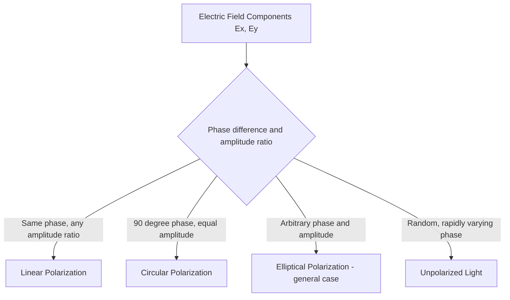

## Polarization of Light

### Definition and Physical Basis

Polarization describes the orientation of the oscillation direction of the transverse electric field vector of a light wave. Since light is an electromagnetic wave in which the electric field oscillates perpendicular to the direction of propagation, that oscillation can be confined to a single direction (linear polarization), rotate in a circular or elliptical pattern, or vary randomly (unpolarized light). Polarization is a property unique to transverse waves; longitudinal waves (such as sound in air) cannot be polarized.

**Key Points**

- Natural light sources (sunlight, incandescent bulbs) emit **unpolarized light**: a rapid, random superposition of electric field oscillations in all directions perpendicular to the propagation direction
- Polarization can be represented mathematically by decomposing the electric field into two orthogonal components, conventionally $E_x$ and $E_y$, both perpendicular to the propagation direction $z$
- The relative amplitude and phase difference between $E_x$ and $E_y$ fully determine the polarization state (linear, circular, elliptical, or unpolarized)

### Types of Polarization

**Linear (Plane) Polarization**

The electric field oscillates along a single fixed direction. If $E_x$ and $E_y$ oscillate in phase (or exactly $\pi$ out of phase), the resultant field traces a straight line:

$$E_x = E_{0x}\cos(kz-\omega t), \qquad E_y = E_{0y}\cos(kz-\omega t)$$

**Circular Polarization**

The electric field vector rotates at constant magnitude, tracing a circle as the wave propagates, occurring when $E_x$ and $E_y$ have equal amplitude and a phase difference of exactly $\pi/2$ ($90°$):

$$E_x = E_0\cos(kz-\omega t), \qquad E_y = E_0\cos\left(kz - \omega t - \tfrac{\pi}{2}\right)$$

**Key Points**

- **Right-hand** vs. **left-hand** circular polarization is distinguished by the direction of rotation of $\vec{E}$ when viewed facing the oncoming wave (convention varies between physics and engineering literature — some define handedness from the source's perspective, others from the receiver's)
- Circularly polarized light is used in 3D cinema glasses (each eye receives one handedness) and in certain antenna and satellite communication systems

**Elliptical Polarization**

The general case, where $E_x$ and $E_y$ have unequal amplitudes and/or an arbitrary phase difference, producing an elliptical trace. Linear and circular polarization are special cases of elliptical polarization.

Polarization states illustrated (svg_diagram):

<svg xmlns="http://www.w3.org/2000/svg" viewBox="0 0 620 240">
<rect width="620" height="240" fill="#ffffff" />
<text x="310" y="20" font-size="14" text-anchor="middle" font-family="sans-serif" font-weight="bold">Polarization States (svg_diagram)</text>

<text x="100" y="45" font-size="11" text-anchor="middle" font-family="sans-serif">Linear</text>

<line x1="100" y1="60" x2="100" y2="180" stroke="`#1f77b4`" stroke-width="2" />

<line x1="60" y1="120" x2="140" y2="120" stroke="#ccc" stroke-width="1" />

<text x="310" y="45" font-size="11" text-anchor="middle" font-family="sans-serif">Circular</text>

<circle cx="310" cy="120" r="45" fill="none" stroke="`#2ca02c`" stroke-width="2" />

<circle cx="310" cy="75" r="4" fill="`#2ca02c`" />

<line x1="270" y1="120" x2="350" y2="120" stroke="#ccc" stroke-width="1" />

<line x1="310" y1="75" x2="310" y2="165" stroke="#ccc" stroke-width="1" />

<text x="500" y="45" font-size="11" text-anchor="middle" font-family="sans-serif">Elliptical</text>

<ellipse cx="500" cy="120" rx="60" ry="30" fill="none" stroke="`#d62728`" stroke-width="2" />

<line x1="440" y1="120" x2="560" y2="120" stroke="#ccc" stroke-width="1" />

<line x1="500" y1="90" x2="500" y2="150" stroke="#ccc" stroke-width="1" />

</svg>

### Malus's Law: Polarization by Selective Absorption

A **polarizer** (e.g., a Polaroid sheet) transmits only the electric field component parallel to its **transmission axis**, absorbing the perpendicular component. When linearly polarized light of intensity $I_0$ (already polarized, e.g., by a first polarizer) passes through a second polarizer (an **analyzer**) whose transmission axis makes angle $\theta$ with the incoming polarization direction, the transmitted intensity follows **Malus's Law**:

$$I(\theta) = I_0\cos^2\theta$$

**Key Points**

- Maximum transmission ($I = I_0$) occurs when the analyzer axis is aligned with the incoming polarization ($\theta=0$)
- Zero transmission occurs when the axes are crossed at $\theta = 90°$ ("crossed polarizers")
- For **unpolarized** light incident on a single polarizer, exactly half the intensity is transmitted regardless of the polarizer's orientation, $I = \tfrac{1}{2}I_0$, since unpolarized light can be treated as an equal, randomly varying mix of all polarization directions, and averaging $\cos^2\theta$ over all $\theta$ gives $\tfrac{1}{2}$

**Example**

Unpolarized light of intensity $I_0 = 100\text{ W/m}^2$ passes through a first polarizer, then a second polarizer oriented at $30°$ to the first, then a third polarizer oriented at an additional $60°$ (i.e., $90°$ from the first).

Step 1 (first polarizer): $I_1 = \tfrac12(100) = 50\text{ W/m}^2$

Step 2 (second polarizer, $\theta=30°$ relative to first): $I_2 = I_1\cos^2(30°) = 50(0.75) = 37.5\text{ W/m}^2$

Step 3 (third polarizer, $\theta=60°$ relative to second): $I_3 = I_2\cos^2(60°) = 37.5(0.25) = 9.375\text{ W/m}^2$

Notably, even though the first and third polarizers are crossed at $90°$ (which alone would transmit zero light), inserting the intermediate polarizer at $30°$ allows a nonzero $9.375\text{ W/m}^2$ to pass through — a classic demonstration that polarizers do not simply "block" perpendicular light but project it onto a new axis at each stage.

### Polarization by Reflection: Brewster's Angle

When unpolarized light reflects off a dielectric surface (e.g., glass, water), the reflected light becomes partially polarized, with the degree of polarization depending on the angle of incidence. At one specific angle — **Brewster's angle** $\theta_B$ — the reflected light becomes **completely** linearly polarized, with its electric field oscillating perpendicular to the plane of incidence (i.e., purely "s-polarized").

$$\tan\theta_B = \frac{n_2}{n_1}$$

**Key Points**

- At Brewster's angle, the reflected and refracted rays are exactly perpendicular to each other ($\theta_B + \theta_{\text{refraction}} = 90°$), which is the physical reason the reflected light is fully polarized: the component of the refracted-then-re-radiated dipole oscillation parallel to the reflection direction cannot radiate in that direction, eliminating the p-polarized (parallel) reflected component entirely
- This is the physical basis for polarized sunglasses, which use a polarizing filter oriented to block horizontally polarized light — the dominant polarization component of glare reflected off horizontal surfaces like water, roads, and snow, since typical viewing/incidence angles for glare are near Brewster's angle for common surfaces

**Example**

For light reflecting off water ($n_2 = 1.33$) from air ($n_1 = 1.00$):

$$\theta_B = \arctan\left(\frac{1.33}{1.00}\right) = \arctan(1.33) \approx 53.1°$$

At this angle of incidence, glare reflected off the water surface is fully polarized horizontally, which polarized sunglasses (with a vertical transmission axis) effectively block.

### Polarization by Scattering

**Key Points**

- Light scattered by small particles (Rayleigh scattering, responsible for the blue sky) becomes partially polarized, with the degree of polarization depending on the scattering angle, reaching maximum polarization at $90°$ from the direction of the illuminating source (e.g., directly overhead relative to the sun's position at sunrise/sunset)
- This polarization of skylight is used by some animals (e.g., bees, some birds) for navigation, and can be observed by humans using polarizing filters or sunglasses tilted while looking at the sky perpendicular to the sun's direction

### Polarization by Birefringence (Double Refraction)

**Key Points**

- Certain anisotropic crystals (e.g., calcite, quartz) exhibit **birefringence**: the refractive index depends on the polarization direction and propagation direction of light through the crystal, described by an **ordinary ray** (index $n_o$, obeying standard Snell's law) and an **extraordinary ray** (index $n_e$, which varies with direction)
- A birefringent crystal splits an incident unpolarized beam into two spatially separated, orthogonally polarized beams — the basis of **Nicol prisms** and other polarizing prisms historically used before synthetic polarizing film became common
- **Wave plates** (retarders) are thin birefringent crystal slices cut to a specific thickness that introduces a controlled phase difference between the ordinary and extraordinary components:
  - A **quarter-wave plate** introduces a $\pi/2$ phase shift, converting linearly polarized light (at 45° to the crystal axes) into circularly polarized light, and vice versa
  - A **half-wave plate** introduces a $\pi$ phase shift, rotating the plane of linearly polarized light by twice the angle between the incoming polarization and the crystal's fast axis

### Optical Activity

**Key Points**

- Certain materials (chiral molecules in solution, quartz crystals along specific axes) rotate the plane of linearly polarized light as it passes through, a phenomenon called **optical activity** or **optical rotation**
- The rotation angle is proportional to the path length through the material and the concentration of the optically active substance (for solutions), described by the relation $\alpha = [\alpha]\, c\, l$, where $[\alpha]$ is the specific rotation, $c$ is concentration, and $l$ is path length
- Used analytically in **polarimetry** to determine the concentration of optically active substances (e.g., sugar solutions in the food industry, historically called "saccharimetry")
- Substances that rotate polarization clockwise (as viewed facing the oncoming light) are termed **dextrorotatory**; counterclockwise rotation is **levorotatory**

### Applications of Polarization

**Key Points**

- **Polarized sunglasses**: block horizontally polarized glare reflected from surfaces near Brewster's angle
- **LCD (liquid crystal display) screens**: use two crossed polarizers with a liquid crystal layer between them that rotates polarization when voltage is applied, controlling light transmission pixel-by-pixel
- **Photoelasticity / stress analysis**: some transparent materials become birefringent under mechanical stress; viewing stressed samples between crossed polarizers reveals colored stress-pattern fringes used in engineering stress analysis
- **3D cinema**: circularly (or linearly) polarized projection combined with matched polarized glasses delivers different images to each eye
- **Polarimetry in chemistry/biology**: determining the concentration or configuration (chirality) of optically active compounds
- **Photography**: polarizing filters reduce reflections from water and glass and can deepen sky contrast by attenuating polarized skylight

### Distinguishing Polarized from Unpolarized Light Experimentally

**Key Points**

- Rotating a single polarizer (analyzer) in front of a light source: if the transmitted intensity varies with rotation angle (following Malus's Law behavior, including possible complete extinction for fully linearly polarized light), the source is (at least partially) linearly polarized; if intensity remains constant through a full rotation, the light is unpolarized (or circularly polarized, which requires an additional quarter-wave plate test to distinguish from unpolarized light)
- **Degree of polarization**: for partially polarized light (a mixture of polarized and unpolarized components, common in real reflected/scattered light), defined as $P = \dfrac{I_{\max}-I_{\min}}{I_{\max}+I_{\min}}$, measured by rotating an analyzer and recording maximum and minimum transmitted intensities

**Conclusion**

Polarization describes the orientation and time-evolution of the transverse electric field oscillation of light, existing in linear, circular, and elliptical forms, with unpolarized light representing a rapid random superposition of all orientations. Polarization can be selectively produced, analyzed, or transformed through absorption (Malus's Law), reflection at Brewster's angle, scattering, and birefringent optical elements (wave plates, polarizing prisms), underlying a wide range of practical technologies from polarized sunglasses and LCD displays to stress analysis and chemical polarimetry.

**Related Topics**

- Malus's Law and polarizer/analyzer systems
- Brewster's angle and polarization by reflection
- Birefringence, wave plates, and retarders
- Optical activity and polarimetry
- Rayleigh scattering and atmospheric polarization
- LCD display technology and liquid crystal optics
- Photoelasticity and stress-induced birefringence
- Electromagnetic wave theory and transverse wave properties