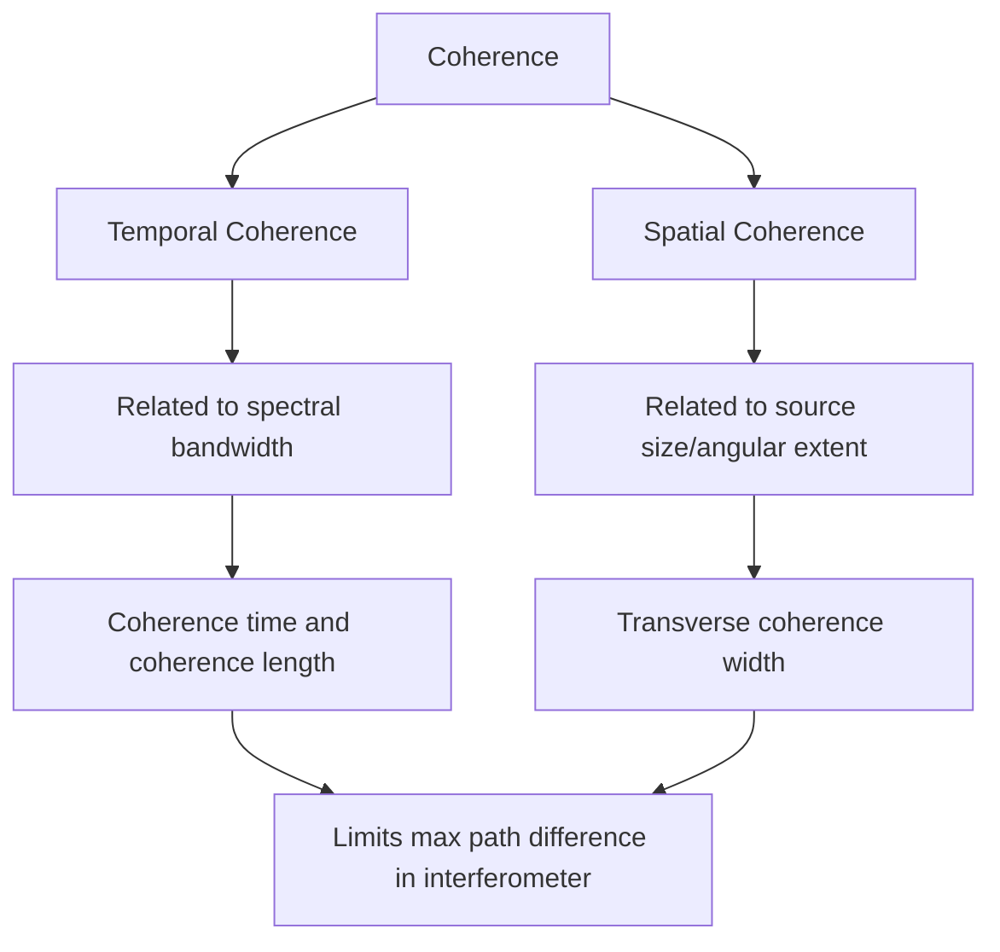
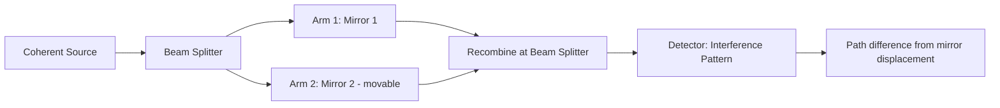

## Coherence and Interferometry

### Definition of Coherence

Coherence describes the degree to which a wave (or two separate waves) maintains a fixed, predictable phase relationship over space and/or time. Only coherent waves can produce a stable, observable interference pattern; if the phase relationship between superposing waves fluctuates randomly (faster than a detector or observer can respond), the interference terms average to zero and no stable fringe pattern is seen, even though interference is still occurring instantaneously at every moment.

**Key Points**

- Coherence is fundamentally about the **predictability of phase**, not the wave's intensity or amplitude
- Two broad categories are distinguished: **temporal coherence** (phase correlation of a wave with itself at a later time, at the same point in space) and **spatial coherence** (phase correlation between different points across a wavefront at the same time)
- Real light sources exhibit **partial coherence**: neither perfectly coherent nor perfectly incoherent, characterized by a finite coherence time and coherence length

### Temporal Coherence and Coherence Length

Temporal coherence relates to the spectral purity (monochromaticity) of a light source. A perfectly monochromatic wave (a single, infinite sine wave) would have perfect temporal coherence, but any real source has some finite spectral bandwidth $\Delta\nu$ (or $\Delta\lambda$), which limits how long the phase remains predictable.

**Coherence time** $\tau_c$ is the timescale over which the wave's phase remains correlated with itself, related to the spectral bandwidth by:

$$\tau_c \approx \frac{1}{\Delta\nu}$$

**Coherence length** $l_c$ is the corresponding spatial distance over which the wave maintains phase correlation, obtained by multiplying by the speed of light:

$$l_c = c\,\tau_c \approx \frac{c}{\Delta\nu} \approx \frac{\lambda^2}{\Delta\lambda}$$

**Key Points**

- A narrower spectral linewidth $\Delta\lambda$ (more monochromatic source) produces a longer coherence length, allowing interference to be observed over larger path-length differences between interfering beams
- In any interferometer, if the path-length difference between the two arms exceeds the coherence length, the interference fringes wash out and disappear, since the two beams are effectively "comparing" different, uncorrelated parts of the original wave train
- Typical coherence lengths: sunlight (broadband, white light) $\sim 1\,\mu\text{m}$; a filtered spectral lamp (e.g., a low-pressure sodium or mercury lamp) $\sim 1\text{ mm}$ to a few cm; a stabilized single-mode laser can exceed several meters to kilometers, since its spectral linewidth is extremely narrow

**Example**

A helium-neon laser operating at $\lambda = 633\text{ nm}$ with a spectral linewidth $\Delta\lambda \approx 0.002\text{ nm}$ (a typical stabilized single-mode value) has a coherence length of approximately:

$$l_c \approx \frac{\lambda^2}{\Delta\lambda} = \frac{(633\times10^{-9})^2}{0.002\times10^{-9}} \approx 0.2\text{ m}$$

[Inference] Actual coherence lengths for specific commercial laser models vary substantially depending on the exact laser design, stabilization technique, and single- vs. multi-longitudinal-mode operation; this example illustrates the order-of-magnitude scaling rather than a universal value for all He-Ne lasers.

### Spatial Coherence

Spatial coherence describes the correlation of phase between two different points on the same wavefront at a given instant, most relevant when a source has finite physical size (rather than being an idealized point source).

**Key Points**

- An idealized point source produces perfect spatial coherence across its entire wavefront (all points on a given wavefront share the same origin and therefore a fixed phase relation)
- An extended source (finite angular size, such as the sun or a lamp filament) can be modeled as many independent point sources, each producing its own set of wavefronts; the resulting superposition reduces spatial coherence, since different points on the "combined" wavefront may correlate with different, mutually incoherent point sources
- The **transverse coherence width** at a distance $L$ from a source of angular size $\theta_s$ is approximately $w_c \approx \dfrac{\lambda}{\theta_s}$
- This is why Young's original experiment required a **single slit before the double slit**: the single slit acts as a much smaller effective source, increasing the angular resolution and thus increasing spatial coherence at the double slit, ensuring both slits are illuminated coherently

**Example**

Sunlight (angular diameter $\theta_s \approx 0.53° \approx 9.3\times10^{-3}\text{ rad}$) at visible wavelength $\lambda = 550\text{ nm}$ has a transverse coherence width of approximately:

$$w_c \approx \frac{\lambda}{\theta_s} = \frac{550\times10^{-9}}{9.3\times10^{-3}} \approx 59\,\mu\text{m}$$

This small value explains why direct double-slit interference from unfiltered, uncollimated sunlight requires extremely closely spaced slits (well under 60 micrometers apart) to observe fringes directly, and why passing sunlight through a small pinhole first (as Young did) is far more practical.

### The Degree of Coherence (Formal Framework)

**Key Points**

- The **complex degree of coherence** $\gamma(\tau)$ formally quantifies temporal coherence via the normalized autocorrelation of the field, with $|\gamma(\tau)| = 1$ for perfect coherence and $|\gamma(\tau)| = 0$ for complete incoherence at delay $\tau$
- The **fringe visibility** in an interference experiment is directly related to $|\gamma(\tau)|$:

  $$V = \frac{I_{\max}-I_{\min}}{I_{\max}+I_{\min}} = |\gamma(\tau)|$$

  (for two beams of equal intensity)
- Measuring fringe visibility as a function of path difference (delay $\tau$) in an interferometer is, in fact, the standard experimental method for directly measuring a light source's coherence length/time
- [Inference] The rigorous, general theory unifying temporal and spatial coherence (mutual coherence function, cross-spectral density) is part of statistical optics; the treatment above summarizes the commonly used practical/engineering-level relations rather than the full formal statistical-optics derivation

### Interferometry: General Principle

An **interferometer** is an instrument that splits a light beam into two (or more) paths, recombines them, and measures the resulting interference pattern to extract precise information about path-length differences, refractive index, wavelength, or surface geometry — exploiting the extreme sensitivity of interference to path differences on the order of a fraction of a wavelength.

**Key Points**

- All interferometers require sufficient source coherence (temporal and/or spatial) for the specific path difference and beam geometry involved
- Interferometric measurements are among the most precise measurement techniques in physics, capable of resolving distance changes far smaller than the wavelength of light itself
- Common designs include the Michelson, Mach-Zehnder, Fabry-Pérot, and Sagnac interferometers, each suited to different measurement tasks

### The Michelson Interferometer

The Michelson interferometer splits an incoming beam using a beam splitter into two perpendicular paths, reflects each off a mirror, and recombines them to produce an interference pattern that depends on the path-length difference between the two arms.

**Key Points**

- Components: a coherent light source, a 50/50 beam splitter, two mirrors (one often mounted on a precision translation stage), and a detector/screen
- Moving one mirror by a distance $\Delta x$ changes the round-trip path length by $2\Delta x$, shifting the fringe pattern; counting fringe shifts allows extremely precise distance measurement:

  $$2\Delta x = m\lambda \implies \Delta x = \frac{m\lambda}{2}$$
- Famously used in the **Michelson–Morley experiment** (1887) to search for the hypothesized luminiferous ether by detecting an expected shift in interference fringes due to Earth's motion through the ether; the null result (no detected fringe shift) was pivotal historical evidence against the ether hypothesis and consistent with special relativity (formulated later, in 1905)
- Modern applications include Fourier-transform spectroscopy (FTIR) and, at extraordinary sensitivity, **gravitational wave detection** (LIGO), where km-scale Michelson interferometers detect mirror displacements far smaller than a proton's diameter caused by passing gravitational waves

Michelson interferometer schematic (svg_diagram):

<svg xmlns="http://www.w3.org/2000/svg" viewBox="0 0 460 320">
<rect width="460" height="320" fill="#ffffff" />
<text x="230" y="20" font-size="14" text-anchor="middle" font-family="sans-serif" font-weight="bold">Michelson Interferometer (svg_diagram)</text>
<rect x="40" y="150" width="10" height="60" fill="#666" />
<text x="10" y="185" font-size="10" font-family="sans-serif">Source</text>
<line x1="50" y1="180" x2="210" y2="180" stroke="#1f77b4" stroke-width="2" />
<line x1="190" y1="150" x2="230" y2="210" stroke="#333" stroke-width="2" />
<text x="235" y="220" font-size="9" font-family="sans-serif">Beam Splitter</text>
<line x1="210" y1="180" x2="210" y2="80" stroke="#2ca02c" stroke-width="2" />
<rect x="185" y="60" width="50" height="8" fill="#333" />
<text x="240" y="70" font-size="9" font-family="sans-serif">Mirror 1</text>
<line x1="210" y1="180" x2="380" y2="180" stroke="#d62728" stroke-width="2" />
<rect x="380" y="150" width="8" height="60" fill="#333" />
<text x="390" y="185" font-size="9" font-family="sans-serif">Mirror 2</text>
<text x="392" y="200" font-size="8" font-family="sans-serif">(movable)</text>
<line x1="210" y1="180" x2="210" y2="280" stroke="#888" stroke-width="2" />
<rect x="185" y="280" width="50" height="20" fill="#eee" stroke="#333" />
<text x="210" y="315" font-size="9" text-anchor="middle" font-family="sans-serif">Detector</text>
</svg>

### The Mach–Zehnder Interferometer

**Key Points**

- Uses two separate beam splitters and two fully separated beam paths (unlike Michelson's folded single-path design), recombining the beams at the second beam splitter
- Advantageous for applications requiring the two beams to pass through physically separate regions of space (e.g., one beam through a test sample/gas cell, the other as a reference), such as measuring refractive index changes in flow visualization, plasma diagnostics, and quantum optics experiments
- Provides two separate, spatially accessible interference outputs (unlike Michelson's single returning beam), useful in optical communications and quantum information processing (e.g., in various quantum interference and quantum computing photonic circuits)

### The Fabry–Pérot Interferometer

**Key Points**

- Consists of two parallel, closely-spaced, highly reflective mirrors, between which light undergoes many multiple reflections, each partial transmission through the mirrors contributing to a multi-beam (not just two-beam) interference pattern
- Produces very narrow, sharply defined transmission peaks compared to two-beam interferometers, with the transmission function given by the **Airy function**:

  $$T(\delta) = \frac{T_{\max}}{1 + F\sin^2(\delta/2)}$$

  where $\delta$ is the round-trip phase and $F$ is the **coefficient of finesse**, which increases with mirror reflectivity $R$: $F = \dfrac{4R}{(1-R)^2}$
- The sharpness of the transmission peaks is characterized by the **finesse** $\mathcal{F} = \dfrac{\pi\sqrt{F}}{2} = \dfrac{\pi\sqrt{R}}{1-R}$, which increases rapidly as mirror reflectivity $R$ approaches 1
- Used in high-resolution spectroscopy (able to resolve much finer wavelength differences than a standard diffraction grating for a given physical size), laser cavity design (the laser resonator itself is a Fabry–Pérot-type cavity), and wavelength-selective optical filters

### The Sagnac Interferometer

**Key Points**

- Splits light into two beams that travel the **same closed loop path in opposite directions** (clockwise and counterclockwise), then recombines them
- Uniquely sensitive to rotation: if the entire apparatus rotates, the two counter-propagating beams experience different effective path lengths (Sagnac effect), producing a rotation-dependent phase shift and fringe shift proportional to the rotation rate
- Forms the operating principle of the **ring laser gyroscope** and **fiber-optic gyroscope**, widely used in aircraft, spacecraft, and marine inertial navigation systems, since it is immune to common-path disturbances (such as thermal drift or vibration) that affect both counter-propagating beams identically and therefore cancel in the interference measurement

### Practical Considerations in Interferometry

**Key Points**

- **Coherence length constrains path-difference range**: any interferometer design must keep the maximum path difference between its arms within the source's coherence length, or fringes will not be observed; white-light interferometry deliberately exploits the very short coherence length of broadband sources to precisely locate the zero-path-difference position (used in optical coherence tomography and some surface-profiling instruments)
- **Vibration and thermal isolation**: because interferometers are sensitive to sub-wavelength path-length changes, precision instruments (especially gravitational-wave detectors and metrology-grade interferometers) require extensive vibration isolation, and behavior may vary significantly depending on environmental stability and mechanical design of the specific setup
- **Laser sources dominate modern interferometry** due to their long coherence length and high spatial coherence (near-ideal point-source-like divergence), though multi-wavelength or white-light sources are deliberately used in specific applications requiring short coherence length (absolute distance referencing, coherence tomography)

**Conclusion**

Coherence — the temporal and spatial predictability of a wave's phase — is the essential prerequisite for observable interference, quantified through coherence time/length (temporal) and transverse coherence width (spatial). Interferometry exploits controlled interference of coherent light to achieve extraordinarily precise measurements of distance, refractive index, wavelength, and rotation, with specific interferometer designs (Michelson, Mach-Zehnder, Fabry-Pérot, Sagnac) tailored to different measurement geometries and sensitivities, underlying technologies ranging from gravitational-wave astronomy to inertial navigation and high-resolution spectroscopy.

**Related Topics**

- Young's Double-Slit Experiment and spatial coherence requirements
- Michelson–Morley experiment and its role in special relativity
- Fabry–Pérot cavities and laser resonator design
- Optical Coherence Tomography (OCT) and white-light interferometry
- Ring laser and fiber-optic gyroscopes (Sagnac effect)
- Statistical optics: mutual coherence function and cross-spectral density
- Gravitational wave detection (LIGO/Virgo interferometer design)
- Fourier-transform spectroscopy