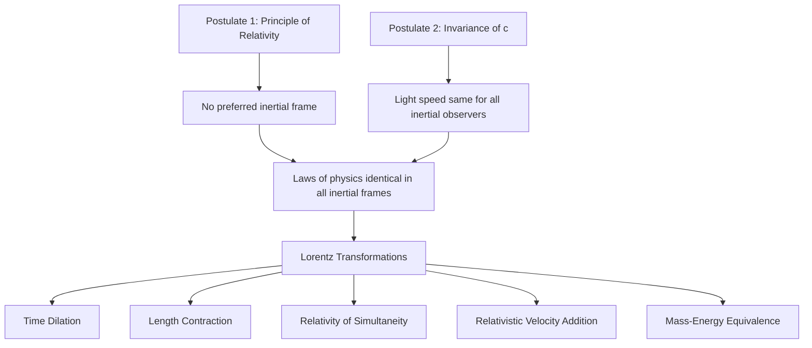

## The Postulates of Special Relativity

### Historical Context

By the late 19th century, Maxwell's equations of electromagnetism had successfully unified electricity, magnetism, and optics, predicting that light propagates as an electromagnetic wave at a fixed speed $c$. This created a conceptual tension with Newtonian (Galilean) relativity, in which velocities simply add: if light's speed were governed by ordinary Galilean velocity addition, its measured speed should differ depending on the observer's motion relative to a hypothesized medium (the "luminiferous ether"). The null result of the Michelson–Morley experiment (1887), which failed to detect Earth's motion through this hypothesized ether, was a key piece of evidence motivating a fundamental reexamination of space, time, and motion. Albert Einstein resolved this tension in 1905 by proposing two postulates from which the entire structure of special relativity follows.

**Key Points**

- Special relativity applies specifically to **inertial reference frames** (frames moving at constant velocity relative to one another, with no acceleration); general relativity later extended these ideas to accelerating frames and gravitation
- Einstein's 1905 paper, "On the Electrodynamics of Moving Bodies," derived the Lorentz transformations, time dilation, length contraction, and relativistic velocity addition directly from the two postulates below, rather than assuming them separately

### The First Postulate: The Principle of Relativity

**Statement**: The laws of physics are the same in all inertial reference frames. No inertial frame is preferred over any other; there is no way to perform a physical experiment entirely within a closed inertial frame that determines that frame's absolute velocity.

**Key Points**

- This generalizes the older Galilean principle of relativity (which applied only to the laws of mechanics) to *all* laws of physics, explicitly including electromagnetism and optics
- It directly rules out the idea of a privileged "ether frame" or any absolute rest frame against which all motion could be measured
- A consequence: there is no experiment — mechanical, electromagnetic, or otherwise — that can distinguish "being at rest" from "moving at constant velocity"; only *relative* motion between frames has physical meaning

### The Second Postulate: The Invariance of the Speed of Light

**Statement**: The speed of light in vacuum, $c$, has the same value in all inertial reference frames, regardless of the motion of the light source or the observer.

$$c = 299{,}792{,}458 \text{ m/s} \quad (\text{exact, by SI definition})$$

**Key Points**

- This postulate directly contradicts the classical (Galilean) velocity-addition expectation: if a source moving at velocity $v$ emits light, a classical observer would expect to measure the light's speed as $c+v$ or $c-v$ depending on direction; special relativity asserts the observer always measures exactly $c$
- This postulate was directly motivated by (though not strictly required to be a "consequence" of) the null result of the Michelson–Morley experiment, and is consistent with Maxwell's equations, which contain $c$ as a fixed constant with no reference to any observer's motion
- $c$ therefore functions not merely as "the speed of light" but as a fundamental structural constant of spacetime itself — the maximum speed at which any causal influence or information can propagate, a role confirmed by its appearance throughout relativistic mechanics and field theory, independent of whether photons are involved

### Why Both Postulates Are Needed Together

**Key Points**

- The first postulate alone (relativity of motion) is compatible with ordinary Newtonian mechanics and Galilean transformations, which already respect it for mechanical laws
- It is the **combination** of postulate 1 (physics is the same in all inertial frames) with postulate 2 (light's speed specifically is the same constant $c$ in all those frames) that forces a departure from Galilean kinematics: if velocities added classically, then a law of physics (Maxwell's prediction that light travels at $c$) would *not* hold identically in all frames, violating postulate 1
- Reconciling both postulates simultaneously requires abandoning the classical, frame-independent (absolute) notions of simultaneity, time intervals, and length, replacing the Galilean transformation between frames with the **Lorentz transformation**

### Immediate Logical Consequences

Although the postulates themselves make no explicit statement about time or length, applying them consistently to a simple thought experiment (a "light clock," in which light bounces between two mirrors) directly yields several core relativistic effects:

**Relativity of Simultaneity**

**Key Points**

- Two events that are simultaneous in one inertial frame are generally **not** simultaneous when observed from a different inertial frame moving relative to the first
- This is a direct consequence of postulate 2: since light must travel at $c$ in every frame, and different frames disagree about the timing of light reaching two separated locations, they must disagree about which events are simultaneous

**Time Dilation**

An observer at rest in a frame $S'$ carrying a clock is observed, from a different inertial frame $S$ (relative to which $S'$ moves at speed $v$), to have that clock run slow:

$$\Delta t = \gamma\,\Delta t', \qquad \gamma = \frac{1}{\sqrt{1-v^2/c^2}}$$

where $\Delta t'$ is the **proper time** (measured in the clock's own rest frame) and $\gamma$ is the **Lorentz factor**.

**Length Contraction**

An object of proper length $L_0$ (measured in its own rest frame) is measured to have a shorter length $L$ when observed from a frame in which it moves at speed $v$, along the direction of motion only:

$$L = \frac{L_0}{\gamma} = L_0\sqrt{1-v^2/c^2}$$

**Key Points**

- Both effects are strictly reciprocal between inertial observers: each of two observers in relative motion measures the *other's* clock as running slow and the *other's* length as contracted — there is no contradiction, because "simultaneity" and "measurement" are themselves frame-dependent, and careful analysis (e.g., of the relativistic "twin paradox") shows consistency once the asymmetry of any actual acceleration is properly accounted for
- The Lorentz factor $\gamma \geq 1$ always, approaching 1 (negligible relativistic effects) when $v \ll c$, and diverging toward infinity as $v \to c$

**Example**

A muon is created in the upper atmosphere moving toward Earth at $v = 0.98c$. In the muon's own rest frame, its mean lifetime is $\tau_0 \approx 2.2\,\mu\text{s}$ (a well-established value from particle physics, not itself a relativistic prediction). From Earth's frame, the Lorentz factor is:

$$\gamma = \frac{1}{\sqrt{1-(0.98)^2}} \approx 5.03$$

so the dilated lifetime observed from Earth is $\Delta t = \gamma\tau_0 \approx 5.03 \times 2.2\,\mu\text{s} \approx 11.1\,\mu\text{s}$ — long enough for the muon to travel much farther through the atmosphere before decaying than classical (non-relativistic) kinematics using the proper lifetime alone would predict. This effect is a well-documented experimental confirmation of time dilation, routinely cited in relativity pedagogy.

### Relativistic Velocity Addition

Because velocities cannot simply add (or c itself would not be invariant), the correct relativistic formula for combining velocity $u'$ (in frame $S'$) with the relative frame velocity $v$ (of $S'$ relative to $S$), for motion along the same line, is:

$$u = \frac{u' + v}{1 + \dfrac{u'v}{c^2}}$$

**Key Points**

- If $u' = c$ (e.g., a light beam), substituting gives $u = c$ regardless of $v$ — directly confirming consistency with the second postulate
- Reduces to the familiar Galilean addition $u \approx u' + v$ when both $u'$ and $v$ are small compared to $c$, correctly recovering everyday, non-relativistic kinematics as a limiting case

### Mass–Energy Equivalence

Although often introduced separately, the famous relation $E=mc^2$ (more completely, the relativistic energy-momentum relation) is also a consequence of applying the two postulates consistently to the dynamics (not just kinematics) of moving bodies:

$$E = \gamma m c^2, \qquad E^2 = (pc)^2 + (mc^2)^2$$

where $m$ is the invariant (rest) mass, $p$ is relativistic momentum, and $E$ is total relativistic energy.

**Key Points**

- At $v=0$ ($\gamma=1$, $p=0$), this reduces to the famous rest-energy relation $E_0 = mc^2$
- This relation underlies nuclear reactions (fission, fusion), particle physics, and the operation of particle accelerators, where kinetic energies comparable to or exceeding rest-mass energy are routine

### Scope and Limits of Special Relativity

**Key Points**

- Special relativity's postulates apply strictly to **inertial** (non-accelerating) reference frames; extending relativistic principles to accelerating frames and to gravity required Einstein's later development of **general relativity** (1915), based on the equivalence principle
- Special relativity does not incorporate gravity; in the absence of significant gravitational fields, its predictions have been confirmed to extremely high precision across particle physics, astrophysics, and everyday technologies (e.g., GPS satellite systems must account for special-relativistic time dilation, alongside a larger general-relativistic gravitational time dilation correction, to maintain positioning accuracy)
- The postulates make no reference to any particular type of physical law (mechanical, electromagnetic, or otherwise) — their generality is what forces *all* of physics, not merely electromagnetism, to conform to relativistic kinematics

**Conclusion**

Einstein's two postulates — the principle of relativity (physical laws are identical in all inertial frames) and the invariance of the speed of light (all inertial observers measure light in vacuum at the same speed $c$) — together overturn the classical, absolute notions of space and time inherited from Newtonian mechanics. Applied consistently, they necessitate the relativity of simultaneity, time dilation, length contraction, relativistic velocity addition, and mass–energy equivalence, all of which have been extensively confirmed experimentally and form the conceptual foundation for all of modern relativistic physics.

**Related Topics**

- Michelson–Morley experiment and the historical motivation for relativity
- Lorentz transformations (derivation and structure)
- Relativity of simultaneity and spacetime diagrams (Minkowski diagrams)
- Time dilation and the twin paradox
- Length contraction and relativistic invariants
- Relativistic energy-momentum relation and $E=mc^2$
- General relativity and the equivalence principle
- Experimental tests of special relativity (muon decay, particle accelerators, GPS corrections)