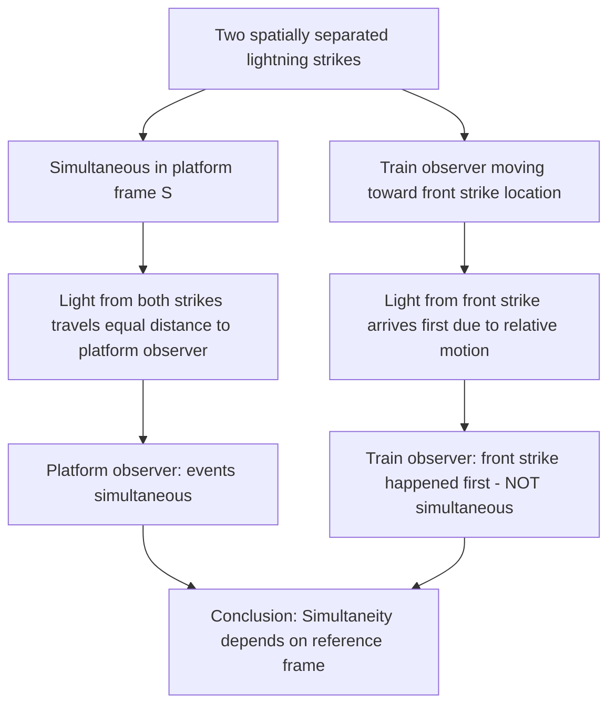
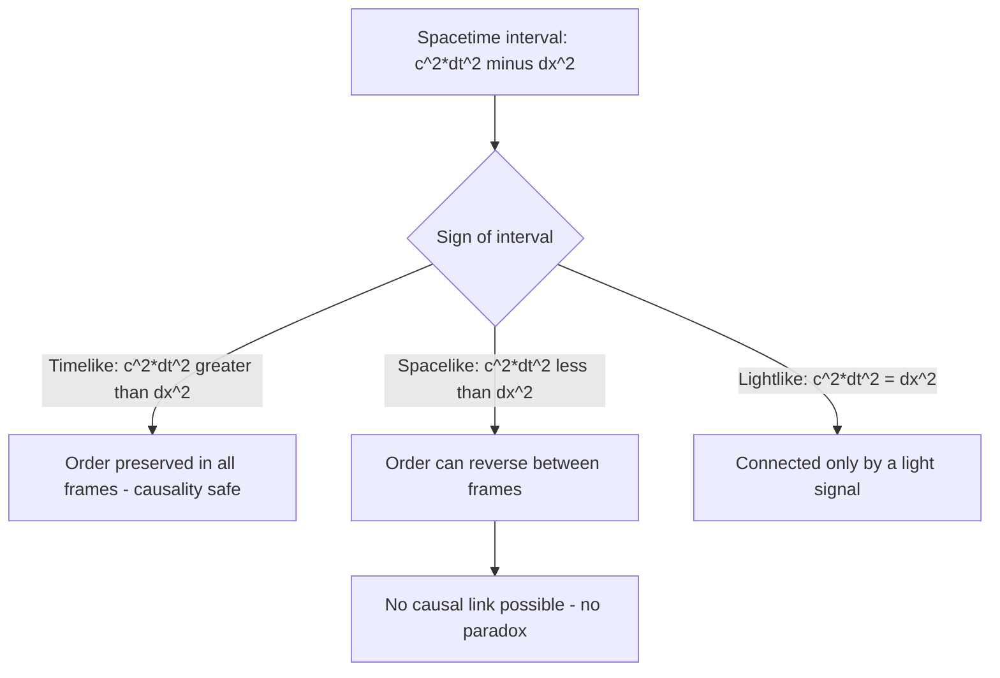

## Relativity of Simultaneity

### Definition and Core Statement

Relativity of simultaneity is the principle that whether two spatially separated events occur "at the same time" is not an absolute fact but depends on the inertial reference frame of the observer. Two events judged simultaneous by one observer will, in general, be judged as occurring at different times by another observer moving relative to the first — with no way to say either observer is objectively "wrong."

**Key Points**

- This is a direct logical consequence of Einstein's two postulates of special relativity: the constancy of the speed of light in all inertial frames, combined with the principle of relativity
- It represents one of the most conceptually disruptive departures from Newtonian physics, which assumed a single, universal, frame-independent notion of "now" shared by all observers everywhere
- Simultaneity is only absolute for events occurring at the **same spatial location**; for spatially separated events, simultaneity is inherently frame-dependent

### Einstein's Train Thought Experiment

The classic illustration, introduced by Einstein himself, involves a train moving at constant velocity relative to a station platform.

**Setup**: Two lightning bolts strike the front and back of a moving train simultaneously *as measured by an observer standing on the platform* (frame $S$), at the moment the midpoint of the train passes the midpoint of the platform.

**Platform observer's perspective**: Since the light from both strikes travels equal distances to reach the platform observer standing at the midpoint, and light travels at $c$ in all directions, the two flashes arrive simultaneously — confirming that the two strikes were indeed simultaneous in the platform frame.

**Train observer's perspective**: An observer sitting at the midpoint of the train (frame $S'$) is moving toward the location where the front strike occurred and away from the location of the back strike (relative to the light signals already emitted). Because light travels at $c$ in the train frame as well (postulate 2), the light from the front strike reaches this observer *before* the light from the back strike. The train observer therefore concludes that the front lightning strike occurred *before* the back strike — the two events are **not simultaneous** in the train's frame.

**Key Points**

- Both observers are correct in their own frames; there is no absolute answer to "which really happened first" independent of a choice of reference frame (except in cases where the events are causally connected, discussed below)
- The disagreement arises specifically because postulate 2 requires light to travel at the same speed $c$ for both observers, even though they are in relative motion — a requirement that Galilean physics never had to accommodate, since Galilean physics assumed instantaneous or frame-independent simultaneity a priori

Train thought experiment geometry (svg_diagram):

<svg xmlns="http://www.w3.org/2000/svg" viewBox="0 0 600 260">
<rect width="600" height="260" fill="#ffffff" />
<text x="300" y="20" font-size="14" text-anchor="middle" font-family="sans-serif" font-weight="bold">Einstein's Train Thought Experiment (svg_diagram)</text>
<line x1="40" y1="140" x2="560" y2="140" stroke="#888" stroke-width="1" stroke-dasharray="3,3" />
<text x="20" y="145" font-size="10" font-family="sans-serif">Platform</text>
<rect x="150" y="110" width="300" height="40" fill="none" stroke="#333" stroke-width="2" />
<text x="300" y="105" font-size="11" text-anchor="middle" font-family="sans-serif">Train (moving right, velocity v)</text>
<circle cx="300" cy="130" r="4" fill="#1f77b4" />
<text x="300" y="150" font-size="9" text-anchor="middle" font-family="sans-serif" fill="#1f77b4">Train observer O'</text>
<circle cx="300" cy="220" r="4" fill="#2ca02c" />
<text x="300" y="240" font-size="9" text-anchor="middle" font-family="sans-serif" fill="#2ca02c">Platform observer O</text>
<line x1="300" y1="216" x2="300" y2="145" stroke="#2ca02c" stroke-width="1" stroke-dasharray="2,2" />
<line x1="150" y1="60" x2="150" y2="110" stroke="#d62728" stroke-width="2" />
<text x="150" y="50" font-size="10" text-anchor="middle" font-family="sans-serif" fill="#d62728">Strike A (back)</text>
<line x1="450" y1="60" x2="450" y2="110" stroke="#d62728" stroke-width="2" />
<text x="450" y="50" font-size="10" text-anchor="middle" font-family="sans-serif" fill="#d62728">Strike B (front)</text>
<path d="M 300 130 L 460 5" stroke="none" />
<text x="300" y="180" font-size="9" text-anchor="middle" font-family="sans-serif">O' moves toward B, away from A → sees B's light first</text>
</svg>

### Mathematical Derivation via the Lorentz Transformation

The Lorentz transformation relating coordinates $(x,t)$ in frame $S$ to coordinates $(x',t')$ in frame $S'$ (moving at velocity $v$ along the $x$-axis relative to $S$) is:

$$t' = \gamma\left(t - \frac{vx}{c^2}\right), \qquad x' = \gamma(x-vt)$$

where $\gamma = 1/\sqrt{1-v^2/c^2}$.

**Key Points**

- Consider two events, 1 and 2, simultaneous in frame $S$ ($t_1 = t_2$) but occurring at different positions ($x_1 \neq x_2$). Their time coordinates in frame $S'$ are:

  $$t_1' = \gamma\left(t_1 - \frac{vx_1}{c^2}\right), \qquad t_2' = \gamma\left(t_2 - \frac{vx_2}{c^2}\right)$$
- Since $t_1 = t_2$, the time difference in $S'$ is:

  $$\Delta t' = t_2' - t_1' = -\gamma\frac{v(x_2-x_1)}{c^2} = -\gamma\frac{v\,\Delta x}{c^2}$$
- This is nonzero whenever $v \neq 0$ and $\Delta x \neq 0$ — directly proving that events simultaneous in one frame ($\Delta t = 0$) are generally *not* simultaneous in another frame ($\Delta t' \neq 0$) unless they also occur at the same location ($\Delta x = 0$)
- The sign of $\Delta t'$ depends on the direction of relative motion $v$ and which event is at the larger $x$-coordinate, consistent with the train thought experiment's conclusion that the observer moving toward one event perceives it as occurring earlier

**Example**

Two events occur simultaneously in frame $S$ (a laboratory) at positions $x_1 = 0$ and $x_2 = 300\text{ m}$, so $\Delta x = 300\text{ m}$ and $\Delta t = 0$. An observer in frame $S'$ moves at $v = 0.6c$ relative to the lab. The Lorentz factor is:

$$\gamma = \frac{1}{\sqrt{1-(0.6)^2}} = \frac{1}{\sqrt{0.64}} = 1.25$$

The time difference measured in $S'$ is:

$$\Delta t' = -\gamma\frac{v\,\Delta x}{c^2} = -1.25 \times \frac{(0.6\times3\times10^8)(300)}{(3\times10^8)^2} = -1.25 \times \frac{5.4\times10^{10}}{9\times10^{16}} \approx -7.5\times10^{-7}\text{ s}$$

So in frame $S'$, event 2 (at $x_2=300\text{ m}$) occurs about $0.75\,\mu\text{s}$ *before* event 1 — even though both events happened at exactly the same instant in the lab frame.

### Causality Is Preserved: The Role of the Invariant Interval

A critical subtlety is that relativity of simultaneity does **not** allow cause-and-effect relationships to be reversed between frames — only genuinely independent (non-causally-connected) events can have their time-ordering swapped by a change of reference frame.

**Key Points**

- The **spacetime interval** between two events, $\Delta s^2 = c^2\Delta t^2 - \Delta x^2$ (using the $(+,-)$ metric signature convention), is invariant — it has the same value in every inertial frame
- If two events are separated by a **timelike interval** ($c^2\Delta t^2 > \Delta x^2$, meaning a signal traveling slower than $c$ could connect them), their temporal order is the same in all inertial frames — cause always precedes effect for every observer, preserving causality
- If two events are separated by a **spacelike interval** ($c^2\Delta t^2 < \Delta x^2$, meaning not even a light signal could travel between them in the available time), then the time-ordering *can* be reversed depending on the observer's frame — but since no causal influence could have connected them in the first place, this reversal does not violate cause and effect
- The train thought experiment's two lightning strikes are spacelike separated (they occur at different locations, judged simultaneous — hence zero time difference with nonzero spatial separation — in at least one frame), which is precisely why their order can legitimately differ between observers without any causal paradox

### Relation to Length Contraction and Time Dilation

**Key Points**

- Relativity of simultaneity is the conceptually deepest of the three core kinematic effects of special relativity (alongside time dilation and length contraction) — it is, in fact, the underlying reason the other two effects arise and are mutually consistent between observers
- **Length contraction** specifically requires measuring the positions of both ends of a moving object *at the same time* in the observer's frame; because "the same time" is frame-dependent, different observers necessarily disagree about the measured length, since they are effectively measuring the endpoints' positions at different (frame-relative) moments
- Careful analysis of relativity of simultaneity is essential for correctly resolving apparent paradoxes in special relativity, such as the ladder/barn paradox, in which a moving ladder either "fits" or "doesn't fit" inside a barn depending on which frame's notion of simultaneity is used to define "the ladder is inside the barn at one instant"

### The Relativity of Simultaneity and "Now" Across the Universe

**Key Points**

- Because simultaneity is frame-dependent for spatially separated events, there is no single, universally agreed "present moment" connecting distant locations in the universe — the set of events an observer considers "happening now" at a distant location depends on that observer's velocity
- [Inference] This has led some physicists and philosophers to discuss the "block universe" or "eternalism" interpretation of spacetime, in which past, present, and future are treated as equally real, since no privileged universal "now" exists to distinguish them physically; this interpretation remains a topic of philosophical discussion rather than a directly testable physical prediction distinct from the mathematics of relativity itself
- Despite this reframing of "now," no observer can ever use relativity of simultaneity to send information faster than light or to influence events in their own causal past, preserving a consistent and paradox-free causal structure for all physically realizable (timelike or lightlike) signals

**Conclusion**

Relativity of simultaneity establishes that whether two spatially separated events occur at the same time depends on the observer's inertial reference frame, a direct mathematical consequence of the Lorentz transformation and, at a deeper level, of the requirement that the speed of light be invariant for every inertial observer. While this overturns the classical assumption of a single universal "now," causality is never violated: only spacelike-separated (non-causally-connected) events can have their order reversed between frames, while timelike-separated (causally connected) events maintain a consistent order for all observers. This principle underlies, and is essential for correctly deriving, the closely related phenomena of time dilation and length contraction.

**Related Topics**

- The Postulates of Special Relativity
- Lorentz Transformations (full derivation and structure)
- Time Dilation and the Twin Paradox
- Length Contraction and the Ladder/Barn Paradox
- Minkowski Spacetime Diagrams and worldlines
- Spacetime Interval and Light Cones
- Causality and the Invariance of Timelike/Spacelike Separation
- The Relativity of "Now" and philosophical interpretations of spacetime