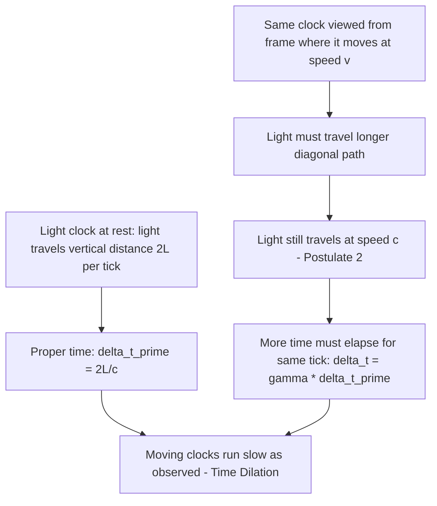
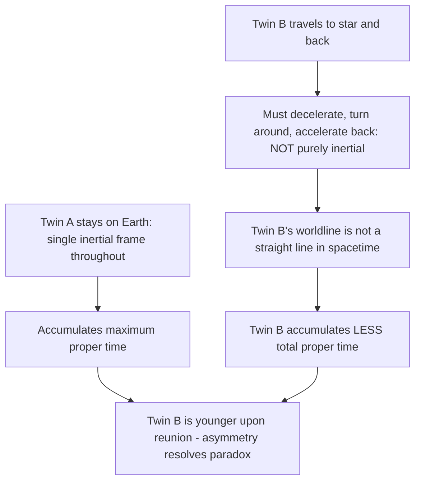

## Time Dilation

### Definition and Core Statement

Time dilation is the relativistic effect in which a clock moving relative to an observer is measured by that observer to run slower than an identical clock at rest in the observer's own frame. It is a direct, quantitative consequence of Einstein's two postulates of special relativity — specifically the requirement that the speed of light be the same constant $c$ for all inertial observers, regardless of relative motion.

**Key Points**

- Time dilation is **reciprocal** between inertial observers: each of two observers in uniform relative motion measures the *other's* clock as running slow, with neither perspective being more "correct" than the other
- The effect applies to *any* physical process that marks time, not just mechanical clocks — including atomic decay rates, biological aging, and oscillation periods of any physical system
- Time dilation has been confirmed to high experimental precision through particle-decay experiments, atomic clock comparisons, and satellite-based timing systems

### The Light-Clock Derivation

The clearest derivation of time dilation uses a conceptual **light clock**: a device consisting of two mirrors facing each other, separated by distance $L$, with a light pulse bouncing vertically between them. One "tick" of the clock corresponds to one round trip of the light pulse.

**In the clock's own rest frame** ($S'$), the light travels a vertical round-trip distance of $2L$, so the proper time per tick is:

$$\Delta t' = \frac{2L}{c}$$

**Observed from a frame $S$** in which the clock moves horizontally at speed $v$, the light pulse must travel a longer, diagonal path (since the mirrors themselves move horizontally during the light's transit), while still traveling at speed $c$ (postulate 2). Using the Pythagorean theorem on the diagonal path traveled during half a tick:

$$\left(\frac{c\,\Delta t}{2}\right)^2 = L^2 + \left(\frac{v\,\Delta t}{2}\right)^2$$

Solving for $\Delta t$:

$$\Delta t = \frac{2L}{c\sqrt{1-v^2/c^2}} = \gamma\,\Delta t', \qquad \gamma = \frac{1}{\sqrt{1-v^2/c^2}}$$

**Key Points**

- Because the diagonal path in frame $S$ is geometrically longer than the vertical path in $S'$, and light must travel at the same speed $c$ in both frames, more time must elapse in $S$ for one full tick — directly showing the moving clock runs slow *as measured from $S$*
- $\gamma$, the **Lorentz factor**, satisfies $\gamma \geq 1$ always, with $\gamma \to 1$ as $v \ll c$ (recovering ordinary non-relativistic time) and $\gamma \to \infty$ as $v \to c$

Light clock geometry (svg_diagram):

<svg xmlns="http://www.w3.org/2000/svg" viewBox="0 0 560 280">
<rect width="560" height="280" fill="#ffffff" />
<text x="280" y="20" font-size="14" text-anchor="middle" font-family="sans-serif" font-weight="bold">Light Clock: Rest Frame vs Moving Frame (svg_diagram)</text>

<text x="120" y="45" font-size="11" text-anchor="middle" font-family="sans-serif">Rest frame (S')</text>

<line x1="80" y1="70" x2="160" y2="70" stroke="#333" stroke-width="4" />

<line x1="80" y1="200" x2="160" y2="200" stroke="#333" stroke-width="4" />

<line x1="120" y1="70" x2="120" y2="200" stroke="`#1f77b4`" stroke-width="2" />

<text x="135" y="140" font-size="10" font-family="sans-serif" fill="`#1f77b4`">L</text>

<text x="420" y="45" font-size="11" text-anchor="middle" font-family="sans-serif">Moving frame (S), clock moves right at v</text>

<line x1="340" y1="70" x2="420" y2="70" stroke="#333" stroke-width="4" />

<line x1="420" y1="200" x2="500" y2="200" stroke="#333" stroke-width="4" />

<line x1="380" y1="70" x2="460" y2="200" stroke="`#d62728`" stroke-width="2" />

<text x="440" y="140" font-size="10" font-family="sans-serif" fill="`#d62728`">Diagonal path &gt; L</text>

<line x1="380" y1="230" x2="460" y2="230" stroke="#888" stroke-width="1" />

<text x="420" y="250" font-size="9" text-anchor="middle" font-family="sans-serif">v*Δt (mirror displacement)</text>

</svg>

### The Time Dilation Formula and Proper Time

$$\Delta t = \gamma\,\Delta t_0, \qquad \gamma = \frac{1}{\sqrt{1-v^2/c^2}}$$

**Key Points**

- $\Delta t_0$ (often written $\Delta\tau$) is the **proper time**: the time interval measured by a clock that is present at both events being timed, i.e., measured in the clock's own rest frame — always the *shortest* possible measured time interval between two events
- $\Delta t$ is the **dilated (coordinate) time**: the longer time interval measured by an observer relative to whom the clock is moving
- Proper time is a frame-invariant quantity (the same value regardless of which frame computes it via the full spacetime interval), which is why it serves as the natural, unambiguous "duration experienced" by the clock/observer carrying it
- The relation only strictly applies without complication to **inertial** (non-accelerating) motion; scenarios involving acceleration (such as the twin paradox) require integrating $\Delta\tau$ along the actual (possibly non-inertial) worldline

### Common Numerical Examples

**Example**

A spacecraft travels at $v = 0.8c$ relative to Earth. The Lorentz factor is:

$$\gamma = \frac{1}{\sqrt{1-(0.8)^2}} = \frac{1}{\sqrt{0.36}} = \frac{1}{0.6} \approx 1.667$$

If the spacecraft's onboard clock (proper time) measures $\Delta t_0 = 10$ years for a journey, Earth-based observers measure the elapsed time as:

$$\Delta t = \gamma \Delta t_0 \approx 1.667 \times 10 = 16.67 \text{ years}$$

So while 10 years pass for the astronauts, nearly 16.7 years pass on Earth during the same journey.

**Example: The Muon Experiment**

Muons created by cosmic ray collisions in the upper atmosphere (typically around 15 km altitude) travel toward Earth's surface at speeds close to $c$ (e.g., $v = 0.98c$). The muon's mean rest-frame lifetime is $\tau_0 \approx 2.2\,\mu\text{s}$, a value independently measured in particle physics experiments at rest.

$$\gamma = \frac{1}{\sqrt{1-(0.98)^2}} \approx 5.03$$

Non-relativistically, in $\tau_0 = 2.2\,\mu\text{s}$, a muon traveling near $c$ would travel only about $d = v\tau_0 \approx (0.98)(3\times10^8)(2.2\times10^{-6}) \approx 647\text{ m}$ — far short of reaching the ground from 15 km up. But from Earth's frame, time dilation extends the muon's observed lifetime to:

$$\Delta t = \gamma\tau_0 \approx 5.03 \times 2.2\,\mu\text{s} \approx 11.1\,\mu\text{s}$$

allowing it to travel roughly $d \approx (0.98)(3\times10^8)(11.1\times10^{-6}) \approx 3260\text{ m}$ — over five times farther, consistent with the observed fact that significant numbers of muons are detected reaching the ground. This experiment is widely cited as strong, direct experimental confirmation of time dilation.

### Time Dilation and the Twin Paradox

**Key Points**

- The **twin paradox** poses an apparent contradiction: if twin A stays on Earth while twin B travels at high speed to a distant star and returns, each twin (naively applying time dilation symmetrically) might expect to find the *other* twin younger upon reunion — a logical contradiction, since they cannot both be younger than each other
- The resolution lies in the fact that the situation is **not symmetric**: twin B must undergo acceleration (turning around at the distant star) to return, meaning twin B does not remain in a single inertial frame for the whole trip, while twin A does
- Careful calculation (e.g., via the invariant proper time integrated along each twin's actual worldline, or by analyzing the trip in three inertial-frame segments) shows that the traveling twin (B) accumulates strictly *less* total proper time than the stationary twin (A), and therefore is measurably younger upon return — a result confirmed conceptually by real-world analogs such as precise atomic clock comparisons on aircraft (the Hafele–Keating experiment) and, more directly, differential aging of particles in accelerator storage rings
- This is not a true logical paradox but a name reflecting the initially counterintuitive nature of the asymmetric result; it is fully consistent within special relativity once the asymmetric roles of the two twins (specifically, which one experiences acceleration) are properly accounted for

### Gravitational Time Dilation (Brief Distinction)

**Key Points**

- The time dilation discussed above — arising purely from *relative velocity* between inertial frames — is the special-relativistic (kinematic) effect
- A separate effect, **gravitational time dilation**, arises in general relativity from differences in gravitational potential (clocks run slower deeper in a gravitational well); this is conceptually and mathematically distinct from velocity-based time dilation, though both contribute in real-world systems
- **GPS satellites** must correct for *both* effects simultaneously: special-relativistic time dilation (satellites move at high orbital speed relative to Earth's surface, causing their clocks to run slightly slow) and general-relativistic gravitational time dilation (satellites are higher in Earth's gravitational well, causing their clocks to run slightly fast, an effect that dominates and is larger in magnitude); without correcting for both, GPS positioning would accumulate significant errors within minutes to hours

### Experimental Verification

**Key Points**

- **Muon lifetime experiments**: as detailed above, atmospheric muon flux measurements at sea level directly confirm relativistic time dilation
- **Hafele–Keating experiment (1971)**: atomic clocks flown on commercial aircraft around the world (both eastward and westward) were compared to a reference clock at the U.S. Naval Observatory; the measured time differences matched relativistic predictions (combining both special- and general-relativistic contributions) within experimental uncertainty
- **Particle accelerator experiments**: unstable particles circulating at relativistic speeds in storage rings (e.g., muons in the CERN muon storage ring experiments) show measured lifetimes extended by factors consistent with the predicted $\gamma$ at their circulating speed
- **Modern atomic clock comparisons**: extremely precise optical atomic clocks have directly measured time dilation at everyday speeds (e.g., relative to walking pace) and even at height differences of centimeters (combined special- and general-relativistic effects), demonstrating the ubiquity and precision of the predicted effects

**Conclusion**

Time dilation states that a moving clock is observed to run slower than an identical clock at rest, by a factor $\gamma = 1/\sqrt{1-v^2/c^2}$, as a direct consequence of requiring the speed of light to be invariant across all inertial reference frames. The effect is reciprocal between inertial observers, is distinguished from proper time (the invariant, frame-independent time experienced by a clock along its own worldline), and has been confirmed through numerous independent experiments including atmospheric muon decay, aircraft-based atomic clock comparisons, and particle accelerator measurements. Its resolution in the classic twin paradox hinges on recognizing the asymmetric role of acceleration between the two twins' worldlines.

**Related Topics**

- The Postulates of Special Relativity
- Relativity of Simultaneity
- Length Contraction
- The Twin Paradox and worldlines in spacetime
- Proper Time and the Invariant Spacetime Interval
- Gravitational Time Dilation and General Relativity
- The Hafele–Keating Experiment
- GPS Relativistic Corrections