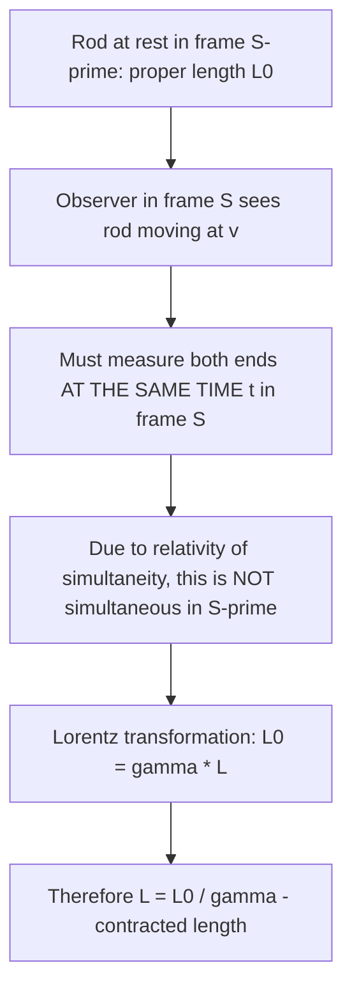

## Length Contraction

### Definition and Core Statement

Length contraction (also called Lorentz contraction) is the relativistic effect in which the measured length of an object is shorter when observed from a reference frame in which the object is moving, compared to its length measured in its own rest frame. Like time dilation, it is a direct consequence of Einstein's postulates of special relativity, and the two effects are intimately linked through the relativity of simultaneity.

**Key Points**

- Length contraction occurs **only along the direction of relative motion**; dimensions perpendicular to the motion are unaffected
- The effect is **reciprocal**: each of two observers in relative inertial motion measures the *other's* objects (aligned along the direction of motion) as contracted, with neither perspective privileged
- Length contraction is not an optical illusion or a property of light travel time — it is a genuine feature of the geometry of spacetime as jointly measured by a given observer's synchronized network of rulers and clocks

### The Length Contraction Formula

$$L = \frac{L_0}{\gamma} = L_0\sqrt{1-\frac{v^2}{c^2}}, \qquad \gamma = \frac{1}{\sqrt{1-v^2/c^2}}$$

**Key Points**

- $L_0$ is the **proper length**: the length of an object measured in the reference frame in which the object is at rest — always the *longest* possible measured value
- $L$ is the **contracted length**: the length measured by an observer relative to whom the object moves at speed $v$, always $L \leq L_0$
- Since $\gamma \geq 1$ always, $L \leq L_0$ always — moving objects are never measured as longer than their proper length, only shorter or (at $v=0$) equal
- As $v \to c$, $\gamma \to \infty$, so $L \to 0$: an object moving at speeds approaching $c$ would be measured as contracted toward zero length along its direction of motion (an idealized limit, since material objects cannot actually reach $v=c$)

### Derivation from Time Dilation and the Definition of Speed

A common derivation uses the fact that both observers must agree on the *relative speed* $v$ between them, combined with time dilation, applied to a simple scenario: a rod of proper length $L_0$ moving past a stationary observer at speed $v$.

**From the rod's own rest frame** ($S'$): the stationary observer (frame $S$) moves past the rod at speed $v$, taking a time $\Delta t' = L_0/v$ to traverse the rod's full length (proper time in $S'$, since both the start and end of this transit occur at the same location in $S$ — namely, at the observer's position).

**From the stationary observer's frame** ($S$): the observer experiences this same transit event pair but measures dilated time $\Delta t = \gamma\,\Delta t'$ for it (since the *rod's* frame, not the observer's, is the one in which this transit-timing clock reading is a proper time interval — care is needed in tracking which interval is "proper" in each derivation approach). The observer, using their own ruler, measures the rod's length as the distance covered during the *shorter* proper-time transit interval as clocked from their perspective:

$$L = v\Delta t = v\frac{\Delta t'}{\gamma} = \frac{v L_0/v}{\gamma} = \frac{L_0}{\gamma}$$

**Key Points**

- [Inference] Multiple equivalent derivations of length contraction exist in standard textbooks (via time dilation as above, via the Lorentz transformation directly, or via the invariant spacetime interval); they are mathematically consistent, though care must be taken in each approach to correctly identify which time interval is the "proper time" for that specific pair of events, as this is a common source of sign/algebra errors
- The more rigorous and less error-prone general derivation applies the Lorentz transformation directly to the coordinates of the two rod-endpoint measurement events, as shown next

### Rigorous Derivation via the Lorentz Transformation

Length contraction fundamentally requires measuring the positions of both ends of a moving object **at the same time** (simultaneously) in the observer's frame. Because simultaneity is frame-dependent (relativity of simultaneity), this is the deep reason the measured length differs between frames.

Let a rod be at rest in frame $S'$, with its ends at fixed positions $x_1'$ and $x_2'$, so its proper length is $L_0 = x_2' - x_1'$ (measured in $S'$, at any time — since the rod is not moving in this frame, simultaneity of measurement is not even required here).

In frame $S$, the rod moves at velocity $v$. To measure its length in $S$, an observer must record the positions $x_1$ and $x_2$ of both ends **at the same instant** $t$ in frame $S$. Using the Lorentz transformation $x' = \gamma(x - vt)$:

$$x_1' = \gamma(x_1 - vt), \qquad x_2' = \gamma(x_2 - vt)$$

(using the *same* $t$ for both, since the $S$-frame measurement is simultaneous by construction). Subtracting:

$$x_2' - x_1' = \gamma(x_2 - x_1) \implies L_0 = \gamma L \implies L = \frac{L_0}{\gamma}$$

**Key Points**

- This derivation makes explicit why the "same time $t$" condition is essential: because $S$ and $S'$ disagree about simultaneity for spatially separated events, an $S$-frame simultaneous measurement of the rod's ends corresponds to *non-simultaneous* measurements of those same two events in $S'$ — but since the rod is at rest in $S'$, this doesn't matter for defining $L_0$ in that frame
- This confirms that length contraction and relativity of simultaneity are not independent effects but are two aspects of the same underlying spacetime geometry

Length contraction illustration (svg_diagram):

<svg xmlns="http://www.w3.org/2000/svg" viewBox="0 0 560 240">
<rect width="560" height="240" fill="#ffffff" />
<text x="280" y="20" font-size="14" text-anchor="middle" font-family="sans-serif" font-weight="bold">Length Contraction (svg_diagram)</text>

<text x="150" y="55" font-size="11" text-anchor="middle" font-family="sans-serif">Rod's own rest frame (S')</text>

<rect x="60" y="75" width="180" height="30" fill="`#cde8f0`" stroke="`#1f77b4`" stroke-width="2" />

<text x="150" y="95" font-size="11" text-anchor="middle" font-family="sans-serif">L0 (proper length)</text>

<text x="420" y="145" font-size="11" text-anchor="middle" font-family="sans-serif">Same rod, observed moving at v (frame S)</text>

<rect x="360" y="165" width="120" height="30" fill="`#f7dede`" stroke="`#d62728`" stroke-width="2" />

<text x="420" y="185" font-size="10" text-anchor="middle" font-family="sans-serif">L = L0/γ (contracted)</text>

<line x1="360" y1="210" x2="480" y2="210" stroke="#888" stroke-width="1" />

<path d="M 300 190 L 350 190" stroke="#333" stroke-width="1" marker-end="url(#arrow)" />

<text x="325" y="205" font-size="9" font-family="sans-serif">v →</text>

</svg>

### Numerical Example

**Example**

A spacecraft has a proper length $L_0 = 100\text{ m}$ (measured by astronauts aboard, at rest relative to the ship) and travels at $v = 0.9c$ relative to Earth.

$$\gamma = \frac{1}{\sqrt{1-(0.9)^2}} = \frac{1}{\sqrt{0.19}} \approx 2.294$$

An Earth-based observer measures the spacecraft's length (along its direction of motion) as:

$$L = \frac{L_0}{\gamma} = \frac{100}{2.294} \approx 43.6\text{ m}$$

The spacecraft appears contracted to less than half its proper length to the Earth observer, while the astronauts aboard measure their ship's length as the full, uncontracted $100\text{ m}$ (their own rest frame) — and would, symmetrically, measure Earth (and Earth-based objects moving past them) as contracted in the direction of relative motion.

### The Ladder (Barn-Pole) Paradox

**Key Points**

- A classic apparent paradox: a ladder of proper length longer than a barn is run quickly through the barn (open doors on both ends); in the barn's rest frame, the moving ladder is length-contracted and briefly fits entirely inside the barn (both doors can be momentarily closed simultaneously), but in the ladder's rest frame, the barn is contracted and is *shorter* than the ladder, so the ladder never fully fits inside
- The resolution again relies on the **relativity of simultaneity**: "both doors closing at the same time" is a frame-dependent statement — in the barn frame, both doors do close simultaneously while the ladder is fully inside; in the ladder's frame, the two door-closing events are *not* simultaneous, and a careful spacetime analysis shows the front door opens again before the back of the ladder has entered, so the ladder is never trapped — both frames give a fully self-consistent account, with no physical contradiction (e.g., no actual collision) predicted by either
- This paradox is a valuable pedagogical tool precisely because its resolution requires simultaneously and correctly applying both length contraction and relativity of simultaneity together

### Length Contraction and Perceived (Visual) Appearance

**Key Points**

- Length contraction refers to a **measurement** made using a simultaneous determination of an object's endpoint positions in a given frame — it is distinct from what a moving object would actually *look like* to an observer or camera, which additionally depends on the finite travel time of light from different parts of the object to the observer's eye/camera at the moment of observation
- [Inference] Accounting for this light-travel-time effect (sometimes called the Terrell–Penrose effect or "Terrell rotation") shows that a rapidly moving object may visually *appear* rotated rather than simply flattened/contracted, an important and often underappreciated distinction between the measured (simultaneity-based) length contraction and the directly observed visual appearance of relativistic objects; this refinement does not contradict length contraction itself, which remains the correct description of a proper simultaneous measurement

### Length Contraction is Only Along the Direction of Motion

**Key Points**

- Dimensions of an object perpendicular to its direction of relative motion are **not** contracted — only the dimension parallel to $v$ is affected
- This can be shown by a symmetry/consistency argument: if perpendicular lengths *did* contract, then two identical rulers moving past each other perpendicular to their length (e.g., mounted on train cars passing on parallel tracks) could give contradictory, frame-dependent answers about which ruler is shorter when they physically pass alongside each other — an outcome inconsistent with a single, unambiguous physical event (such as which ruler leaves a mark on the other at a fixed height); no such contradiction arises for parallel (along-motion) contraction, since it does not involve directly comparing lengths via a single perpendicular physical contact event

### Experimental Status

**Key Points**

- Direct, isolated experimental verification of length contraction is inherently more difficult than for time dilation, since length contraction requires a simultaneous measurement of two spatially separated points on a rapidly moving object — an operationally challenging measurement
- [Inference] Length contraction is nonetheless considered extremely well-supported, both because it follows as a mathematically necessary consequence of the same Lorentz transformation that has been extensively and directly verified through time-dilation experiments (muon decay, atomic clocks), and through indirect confirmations in particle physics (e.g., the contracted electromagnetic field shape of relativistic charged particles, and the increased effective interaction cross-sections/geometries observed in heavy-ion collision experiments at accelerators, consistent with Lorentz-contracted nuclei)

**Conclusion**

Length contraction states that an object's measured length along its direction of motion is reduced by a factor of $1/\gamma$ when observed from a frame in which the object moves, relative to its proper length measured in its own rest frame. The effect is reciprocal between inertial observers, applies only along the direction of relative motion, and arises fundamentally from the relativity of simultaneity — since measuring a moving object's length necessarily requires locating both of its endpoints at the same time in the observer's frame, and different frames disagree about which events are simultaneous. Careful application of both length contraction and relativity of simultaneity together resolves apparent paradoxes such as the ladder-barn paradox, and the effect is consistent with, and considered as well-established as, the closely related and more directly tested phenomenon of time dilation.

**Related Topics**

- The Postulates of Special Relativity
- Relativity of Simultaneity
- Time Dilation and the Twin Paradox
- The Ladder (Barn-Pole) Paradox
- Lorentz Transformations
- Minkowski Spacetime Diagrams
- Terrell–Penrose Effect (visual appearance of relativistic objects)
- Relativistic Dynamics: Momentum, Energy, and Mass-Energy Equivalence