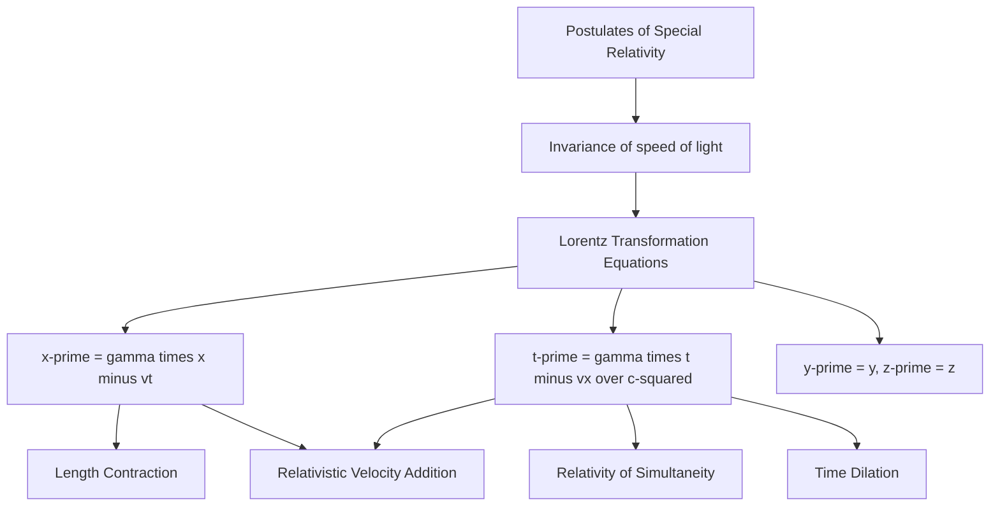

## The Lorentz Transformation

### Purpose and Definition

The Lorentz transformation is the set of equations that relates the spacetime coordinates $(x,y,z,t)$ of an event as measured in one inertial reference frame $S$ to the coordinates $(x',y',z',t')$ of the same event as measured in another inertial frame $S'$, moving at constant velocity $v$ relative to $S$. It replaces the Galilean transformation of classical mechanics as the correct transformation law consistent with Einstein's postulates of special relativity, particularly the invariance of the speed of light.

**Key Points**

- Named after Hendrik Lorentz, who derived the transformation mathematically (in the context of electromagnetism and the ether theory) before Einstein reinterpreted it as a fundamental statement about the structure of space and time itself
- Reduces to the Galilean transformation in the limit $v \ll c$, correctly recovering everyday non-relativistic kinematics as an approximation
- Forms the mathematical foundation from which time dilation, length contraction, relativity of simultaneity, and relativistic velocity addition are all derived as direct consequences

### Standard Configuration

The Lorentz transformation is typically presented for the simplest case: frame $S'$ moves at constant velocity $v$ along the shared $x$-axis relative to frame $S$, with the origins of both frames coinciding at $t = t' = 0$, and coordinate axes aligned (this is called the "standard configuration" or "boost along x").

**Key Points**

- The $y$ and $z$ coordinates (perpendicular to the direction of relative motion) are unaffected by the transformation — this is the coordinate-level statement corresponding to the fact that length contraction occurs only along the direction of motion
- This standard configuration captures the full physical content of the transformation without loss of generality, since any relative motion can be analyzed by choosing coordinate axes aligned with the direction of motion

### The Transformation Equations

From frame $S$ to frame $S'$ (where $S'$ moves at velocity $v$ along $+x$ relative to $S$):

$$x' = \gamma(x - vt), \qquad y' = y, \qquad z' = z, \qquad t' = \gamma\left(t - \frac{vx}{c^2}\right)$$

where the Lorentz factor is:

$$\gamma = \frac{1}{\sqrt{1-v^2/c^2}}$$

The **inverse transformation** (from $S'$ back to $S$) is obtained by swapping primed and unprimed coordinates and reversing the sign of $v$ (since $S$ moves at $-v$ relative to $S'$):

$$x = \gamma(x' + vt'), \qquad y = y', \qquad z = z', \qquad t = \gamma\left(t' + \frac{vx'}{c^2}\right)$$

**Key Points**

- The symmetric structure of the forward and inverse transformations (related simply by $v \to -v$) directly reflects the principle of relativity: neither frame is preferred, and each can be obtained from the other by the same transformation law with reversed relative velocity
- The presence of $x$ in the equation for $t'$ (and $x'$ in the equation for $t$) is the key structural feature responsible for relativity of simultaneity: time and space coordinates become mixed together under the transformation, unlike in Galilean relativity where $t' = t$ universally

### Derivation Sketch

**Key Points**

- The Lorentz transformation can be derived by requiring: (1) linearity (a uniformly moving object in one frame must remain uniformly moving in the other, ruling out nonlinear transformations), (2) reduction to the Galilean transformation as $v/c \to 0$, and (3) invariance of the speed of light — specifically, that if $x = ct$ describes a light pulse in frame $S$, then $x' = ct'$ must describe the same light pulse in frame $S'$
- Starting from a general linear ansatz $x' = A(x-vt)$ and $t' = Bx + Dt$, and imposing the light-invariance condition along with the requirement that the inverse transformation (obtained by symmetry, swapping primes and $v \to -v$) is self-consistent, uniquely fixes $A = D = \gamma$ and $B = -\gamma v/c^2$, yielding the standard equations above
- [Inference] Multiple equivalent derivation approaches exist in standard textbooks (via the light-clock thought experiment, via requiring invariance of the spacetime interval, or via the algebraic approach sketched here); all yield the identical final transformation equations, differing only in pedagogical emphasis and the physical postulates invoked most directly at each step

### The Invariant Spacetime Interval

A central property of the Lorentz transformation is that it leaves a specific combination of space and time coordinates — the **spacetime interval** — unchanged between any two events, for all inertial observers:

$$\Delta s^2 = c^2\Delta t^2 - \Delta x^2 - \Delta y^2 - \Delta z^2 \quad (\text{invariant: same value in every inertial frame})$$

**Key Points**

- This invariance can be directly verified by substituting the Lorentz transformation equations into $c^2\Delta t'^2 - \Delta x'^2$ and confirming it equals $c^2\Delta t^2 - \Delta x^2$
- The invariant interval plays a role in special relativity analogous to the invariant Euclidean distance $\Delta x^2+\Delta y^2+\Delta z^2$ under ordinary spatial rotations — the Lorentz transformation can be understood as a kind of "rotation" mixing space and time coordinates in four-dimensional Minkowski spacetime, mathematically a hyperbolic rotation (using $\cosh$ and $\sinh$ of a "rapidity" parameter) rather than a circular one
- The sign of $\Delta s^2$ classifies the relationship between two events as timelike ($\Delta s^2 > 0$, using this sign convention), spacelike ($\Delta s^2 < 0$), or lightlike/null ($\Delta s^2 = 0$), a classification that is itself frame-independent precisely because $\Delta s^2$ is invariant

### Rapidity Formulation

**Key Points**

- Defining the **rapidity** $\phi$ via $\tanh\phi = v/c$ (so that $\gamma = \cosh\phi$ and $\gamma v/c = \sinh\phi$), the Lorentz transformation takes the form:

  $$ct' = ct\cosh\phi - x\sinh\phi, \qquad x' = -ct\sinh\phi + x\cosh\phi$$
- This closely parallels an ordinary rotation by angle $\theta$: $x' = x\cos\theta + y\sin\theta$, $y'=-x\sin\theta+y\cos\theta$, but with hyperbolic functions replacing circular ones — reflecting the relative minus sign between the time and space terms in the invariant interval
- A major practical advantage of rapidity is that successive boosts (Lorentz transformations) along the same axis **add linearly**: $\phi_{\text{total}} = \phi_1 + \phi_2$, unlike velocities themselves, which combine via the more complex relativistic velocity-addition formula

### Deriving Relativistic Velocity Addition

**Key Points**

- Consider an object moving at velocity $u' = dx'/dt'$ in frame $S'$; applying the Lorentz transformation via the chain rule to find its velocity $u = dx/dt$ in frame $S$ yields:

  $$u = \frac{u'+v}{1+u'v/c^2}$$
- Substituting $u' = c$ (light in frame $S'$) gives $u = c$ regardless of $v$, directly confirming the Lorentz transformation's built-in consistency with the second postulate
- This is a purely algebraic consequence of the Lorentz transformation equations, illustrating how it serves as the single unifying mathematical structure from which time dilation, length contraction, simultaneity, and velocity addition can all be systematically derived, rather than treating each as an independent empirical rule

### Recovering Time Dilation and Length Contraction

**Time dilation**: For a clock at rest at a fixed position $x'=0$ in $S'$, ticking at events separated by $\Delta t'$, the inverse transformation gives $\Delta t = \gamma\left(\Delta t' + \dfrac{v\cdot 0}{c^2}\right) = \gamma\Delta t'$, directly reproducing the time dilation formula.

**Length contraction**: For a rod at rest in $S'$ with proper length $L_0 = \Delta x'$, measuring its endpoints simultaneously in $S$ (i.e., at the same $t$, so $\Delta t = 0$) using the transformation $\Delta x' = \gamma(\Delta x - v\Delta t) = \gamma\Delta x$ gives $\Delta x = \Delta x'/\gamma = L_0/\gamma$, directly reproducing the length contraction formula.

**Key Points**

- Both derivations confirm that time dilation and length contraction are not separate, independently postulated phenomena, but are both direct algebraic consequences of the single, unified Lorentz transformation
- This unification is one of the key conceptual payoffs of working with the full coordinate transformation rather than treating each relativistic effect in isolation

### Numerical Example

**Example**

An event occurs at $x = 600\text{ m}$, $t = 2\times10^{-6}\text{ s}$ in frame $S$. Frame $S'$ moves at $v = 0.6c$ relative to $S$. First compute $\gamma$:

$$\gamma = \frac{1}{\sqrt{1-(0.6)^2}} = \frac{1}{\sqrt{0.64}} = 1.25$$

Applying the transformation:

$$x' = \gamma(x-vt) = 1.25\left[600 - (0.6\times3\times10^8)(2\times10^{-6})\right] = 1.25[600-360] = 1.25(240) = 300\text{ m}$$

$$t' = \gamma\left(t - \frac{vx}{c^2}\right) = 1.25\left[2\times10^{-6} - \frac{(0.6\times3\times10^8)(600)}{(3\times10^8)^2}\right] = 1.25\left[2\times10^{-6} - 3.6\times10^{-7}\right] \approx 2.05\times10^{-6}\text{ s}$$

So the same event, at $(x,t) = (600\text{ m}, 2\,\mu\text{s})$ in $S$, corresponds to $(x',t') \approx (300\text{ m}, 2.05\,\mu\text{s})$ in $S'$.

### Matrix Form

**Key Points**

- The Lorentz transformation can be written compactly as a matrix acting on the four-vector $(ct,x,y,z)$:

  $$\begin{pmatrix}ct'\\x'\\y'\\z'\end{pmatrix} = \begin{pmatrix}\gamma & -\gamma\beta & 0 & 0\\-\gamma\beta & \gamma & 0 & 0\\0&0&1&0\\0&0&0&1\end{pmatrix}\begin{pmatrix}ct\\x\\y\\z\end{pmatrix}, \qquad \beta = \frac{v}{c}$$
- This matrix (a "boost matrix") is the foundational object of four-vector and tensor formulations of special relativity, generalizing naturally to boosts in arbitrary directions and providing the starting point for relativistic field theory and general relativity's more general coordinate transformations

### Limiting Case: Recovering Galilean Relativity

**Key Points**

- When $v \ll c$, $\gamma \approx 1$ and the term $vx/c^2$ in the time equation becomes negligible, so the Lorentz transformation reduces to:

  $$x' \approx x - vt, \qquad t' \approx t$$

  which is exactly the **Galilean transformation** used in classical (Newtonian) mechanics
- This confirms that special relativity does not discard Newtonian mechanics but subsumes it as the correct low-velocity limiting approximation — a hallmark of a successful more-general physical theory correctly reducing to its predecessor under appropriate limiting conditions

**Conclusion**

The Lorentz transformation is the fundamental mathematical relationship connecting spacetime coordinates between inertial reference frames in special relativity, uniquely determined by requiring consistency with the invariance of the speed of light. It unifies relativity of simultaneity, time dilation, length contraction, and relativistic velocity addition as direct algebraic consequences of a single coordinate transformation, preserves the invariant spacetime interval between events, reduces correctly to the Galilean transformation at low velocities, and provides the essential mathematical scaffolding — via four-vectors and boost matrices — for the broader relativistic formulation of physics.

**Related Topics**

- The Postulates of Special Relativity
- Relativity of Simultaneity
- Time Dilation and Length Contraction
- Minkowski Spacetime and the Invariant Interval
- Four-Vectors and Relativistic Tensor Notation
- Relativistic Velocity Addition
- Rapidity and Hyperbolic Rotations in Spacetime
- Relativistic Energy-Momentum Four-Vector