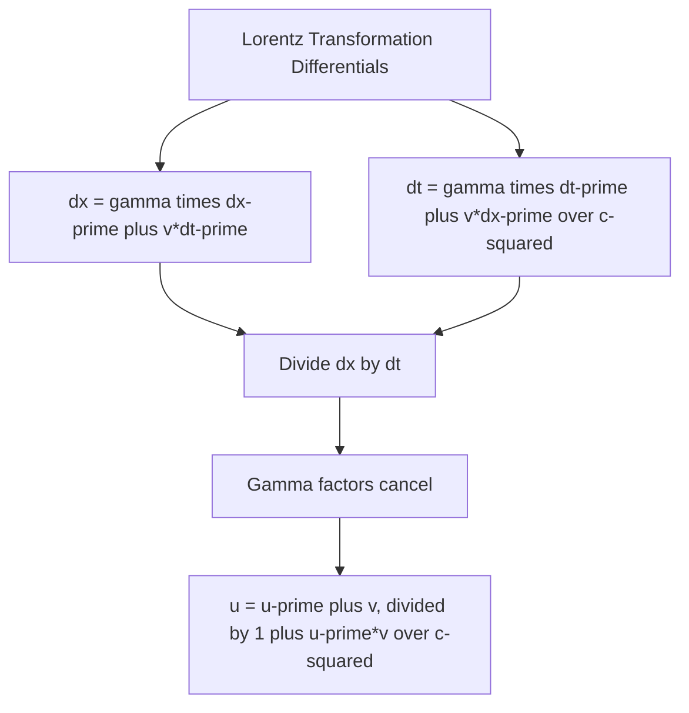

## Relativistic Velocity Addition

### Motivation and Departure from Galilean Addition

In classical (Galilean) mechanics, velocities simply add: if an object moves at velocity $u'$ within a frame $S'$ that itself moves at velocity $v$ relative to frame $S$, the object's velocity in $S$ is $u = u' + v$. This works well at everyday speeds but fails to be consistent with Einstein's second postulate — the invariance of the speed of light — since applying Galilean addition to a light beam ($u'=c$) would predict $u = c+v \neq c$ in frame $S$, contradicting the requirement that all inertial observers measure light at exactly $c$. Relativistic velocity addition is the corrected formula, derived from the Lorentz transformation, that resolves this inconsistency.

**Key Points**

- Relativistic velocity addition is not an independently postulated rule but a direct algebraic consequence of the Lorentz transformation
- It correctly reduces to the familiar Galilean formula in the limit where all velocities involved are small compared to $c$
- It guarantees that no combination of sub-light velocities can ever produce a resultant velocity exceeding $c$, and that combining any velocity with $c$ itself always yields exactly $c$

### The Relativistic Velocity Addition Formula (Collinear Motion)

For motion along a single shared axis (the simplest and most common case), consider an object moving at velocity $u'$ as measured in frame $S'$, where $S'$ itself moves at velocity $v$ relative to frame $S$. The object's velocity $u$ as measured in frame $S$ is:

$$u = \frac{u' + v}{1 + \dfrac{u'v}{c^2}}$$

**Derivation from the Lorentz Transformation**

Starting from the Lorentz transformation differentials:

$$dx = \gamma(dx' + v\,dt'), \qquad dt = \gamma\left(dt' + \frac{v\,dx'}{c^2}\right)$$

Dividing $dx$ by $dt$:

$$u = \frac{dx}{dt} = \frac{\gamma(dx'+v\,dt')}{\gamma\left(dt' + \dfrac{v\,dx'}{c^2}\right)} = \frac{\dfrac{dx'}{dt'}+v}{1+\dfrac{v}{c^2}\dfrac{dx'}{dt'}} = \frac{u'+v}{1+\dfrac{u'v}{c^2}}$$

**Key Points**

- The Lorentz factors $\gamma$ cancel entirely in this derivation, leaving a formula that depends only on $u'$, $v$, and $c$ — no explicit $\gamma$ appears in the final velocity-addition result
- The denominator term $u'v/c^2$ is the key relativistic correction; it is always positive when $u'$ and $v$ point in the same direction, which is precisely what suppresses the result from exceeding $c$

### Verifying Consistency with the Second Postulate

**Key Points**

- Setting $u' = c$ (a light beam moving at speed $c$ in frame $S'$):

  $$u = \frac{c+v}{1+\dfrac{cv}{c^2}} = \frac{c+v}{1+\dfrac{v}{c}} = \frac{c+v}{\dfrac{c+v}{c}} = c$$
- This confirms, directly and exactly, that light measured at speed $c$ in one inertial frame is measured at exactly $c$ in every other inertial frame, regardless of the relative velocity $v$ between the frames — precisely the content of Einstein's second postulate, now shown to be automatically built into the Lorentz transformation and its resulting velocity-addition law
- More generally, if $u' < c$ and $v < c$, it can be shown algebraically that $u < c$ always — no combination of two sub-luminal velocities can ever produce a resultant velocity at or above $c$ using this formula

### Recovering the Galilean Limit

**Key Points**

- When both $u'$ and $v$ are much smaller than $c$, the correction term $u'v/c^2$ becomes negligibly small compared to 1, so:

  $$u = \frac{u'+v}{1+\dfrac{u'v}{c^2}} \approx u'+v$$
- This confirms that relativistic velocity addition subsumes the classical Galilean formula as the correct low-speed approximation, consistent with the general pattern that special relativity reduces to Newtonian mechanics whenever all relevant speeds are small compared to $c$

### Numerical Examples

**Example 1: Two Sub-Light Velocities**

A spaceship moves at $v = 0.6c$ relative to Earth. It fires a probe forward at $u' = 0.5c$ relative to the spaceship. The probe's velocity relative to Earth is:

$$u = \frac{0.5c + 0.6c}{1+\dfrac{(0.5c)(0.6c)}{c^2}} = \frac{1.1c}{1+0.3} = \frac{1.1c}{1.3} \approx 0.846c$$

Notice that the naive Galilean sum ($0.5c+0.6c=1.1c$, exceeding $c$) is corrected downward to approximately $0.846c$, safely below $c$ — illustrating how the relativistic formula prevents superluminal results even when the classical sum would predict them.

**Example 2: Confirming the Light-Speed Limit**

A source moving at $v=0.99c$ relative to a lab emits a light pulse forward at $u'=c$ (in the source's own frame, as required by the second postulate). The lab-frame speed of the pulse is:

$$u = \frac{c+0.99c}{1+\dfrac{c(0.99c)}{c^2}} = \frac{1.99c}{1.99} = c$$

Exactly $c$, regardless of the source's speed — as required.

### Velocity Addition for Motion Perpendicular to the Boost

When the object's velocity has a component perpendicular to the direction of relative motion between the frames, the transformation is more involved, since time itself transforms differently along the two directions.

For an object with velocity components $u_x'$ (along the boost direction) and $u_y'$ (perpendicular) in frame $S'$, the components in frame $S$ (moving at $v$ along $x$ relative to $S'$... or equivalently $S'$ moving at $v$ relative to $S$, depending on convention) are:

$$u_x = \frac{u_x'+v}{1+\dfrac{u_x'v}{c^2}}, \qquad u_y = \frac{u_y'}{\gamma\left(1+\dfrac{u_x'v}{c^2}\right)}$$

**Key Points**

- The perpendicular velocity component $u_y$ is suppressed by a factor of $1/\gamma$ relative to the naive (Galilean) expectation that perpendicular velocities are unaffected by a boost along a different axis — this is a direct manifestation of time dilation, since the same spatial displacement $dy'=dy$ (perpendicular lengths are unaffected) corresponds to a *longer* elapsed coordinate time $dt$ in frame $S$ than the proper time $dt'$ used to define $u_y'$
- This asymmetry between parallel and perpendicular velocity transformation is a frequent source of error in relativistic problems and underlies phenomena such as the relativistic aberration of light (the apparent shift in the observed direction of light sources due to observer motion)

### Relativistic Aberration of Light (Application)

**Key Points**

- Combining the parallel and perpendicular velocity transformations for light ($u_x'^2+u_y'^2=c^2$, since light always travels at $c$ in any single frame) yields the **relativistic aberration formula**, describing how the observed angle of an incoming light ray changes between frames in relative motion:

  $$\cos\theta = \frac{\cos\theta' + \beta}{1+\beta\cos\theta'}, \qquad \beta = v/c$$

  where $\theta'$ is the angle of the light ray relative to the direction of motion as measured in the source's frame, and $\theta$ is the angle measured in the observer's (moving) frame
- This effect is observed astronomically, for example in the apparent forward-concentration ("headlight effect" or relativistic beaming) of radiation from rapidly moving sources such as relativistic jets from active galactic nuclei, and must be accounted for in interpreting the observed positions of stars from a moving Earth (classical stellar aberration, discovered by Bradley in 1727, is the low-velocity, non-relativistic limit of this same phenomenon)

### Rapidity: A Linearly Additive Alternative

**Key Points**

- As introduced in the context of the Lorentz transformation, defining rapidity $\phi$ via $\tanh\phi = v/c$ transforms the awkward, nonlinear velocity-addition formula into simple linear addition: successive collinear boosts combine as $\phi_{\text{total}} = \phi_1+\phi_2$
- This is why rapidity, rather than velocity itself, is often the more natural and computationally convenient variable in particle physics and relativistic kinematics calculations, particularly when combining many successive velocity boosts (e.g., analyzing decay products in particle accelerator collisions)
- The nonlinearity of ordinary velocity addition (as opposed to the linear addition of rapidities) is the deeper mathematical reason velocities cannot simply add classically at relativistic speeds — velocity space in special relativity is not a simple linear (Euclidean-like) vector space, but has an underlying hyperbolic geometry better parameterized by rapidity

### Experimental Verification: The Fizeau Experiment

**Key Points**

- The **Fizeau experiment** (1851), performed decades before special relativity was formulated, measured the speed of light in moving water and found a result inconsistent with simple Galilean velocity addition (light speed in water plus water's flow speed) but consistent with a partial "dragging coefficient" that puzzled 19th-century physicists
- Relativistic velocity addition, applied to light traveling in a medium of refractive index $n$ moving at speed $v$, correctly and naturally reproduces the Fizeau result (to leading order in $v/c$) without requiring any separately postulated "ether dragging" mechanism, since $u' = c/n$ (light's speed in the medium's rest frame) combined with the medium's velocity $v$ via the relativistic formula yields the observed result
- This retrospective agreement is often cited as a striking historical confirmation that relativistic kinematics, though formulated later, was implicitly required by pre-existing 19th-century optical data

**Conclusion**

Relativistic velocity addition replaces the classical Galilean sum of velocities with a formula derived directly from the Lorentz transformation, ensuring consistency with the invariance of the speed of light: no combination of sub-light velocities can produce a result at or above $c$, and combining any velocity with $c$ itself always yields exactly $c$. The formula reduces correctly to ordinary Galilean addition at low speeds, requires separate treatment for velocity components parallel and perpendicular to the relative motion between frames (with the perpendicular case revealing a direct connection to time dilation), and underlies related phenomena such as relativistic aberration and the historically significant Fizeau experiment.

**Related Topics**

- The Lorentz Transformation
- The Postulates of Special Relativity
- Time Dilation and Length Contraction
- Relativistic Aberration of Light and the Headlight Effect
- Rapidity and Hyperbolic Rotations in Spacetime
- The Fizeau Experiment and Historical Precursors to Relativity
- Relativistic Doppler Effect
- Four-Velocity and Relativistic Kinematics