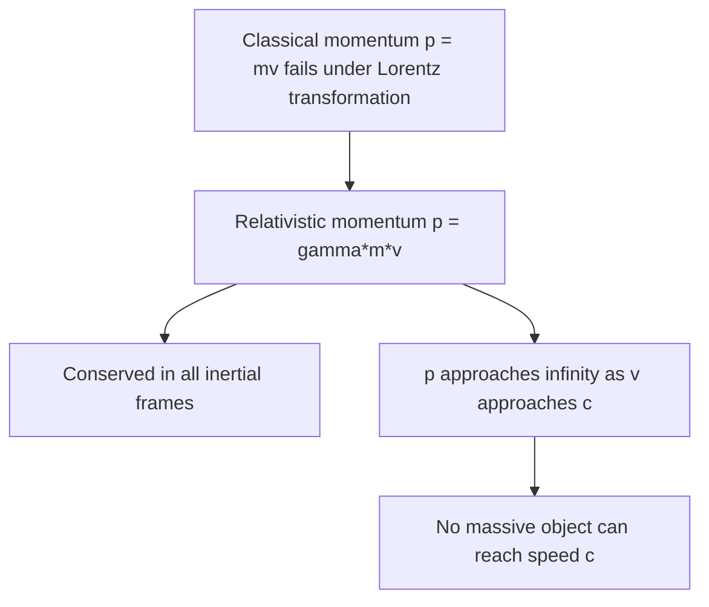

## Relativistic Momentum and Energy

### Why Classical Definitions Must Be Modified

In Newtonian mechanics, momentum is defined as $p = mv$ and kinetic energy as $KE = \tfrac12 mv^2$. These definitions are inconsistent with special relativity: if momentum were simply $mv$, then classical conservation of momentum would not hold simultaneously in all inertial frames once the relativistic (Lorentz) velocity-addition formula replaces the Galilean one. Consistency between the conservation laws and the Lorentz transformation requires redefining momentum (and, correspondingly, energy) with an additional factor of $\gamma$.

**Key Points**

- The relativistic definitions must reduce to the familiar classical formulas ($p \approx mv$, $KE \approx \tfrac12 mv^2$) when $v \ll c$, preserving the enormous experimental success of Newtonian mechanics at everyday speeds
- The mass $m$ appearing in relativistic formulas refers to the **invariant (rest) mass** — the mass measured in the object's own rest frame, the same value in every inertial frame — rather than any frame-dependent "relativistic mass" concept (an older, now largely deprecated way of packaging the $\gamma m$ combination, still occasionally seen in older textbooks and popular treatments)

### Relativistic Momentum

$$\vec{p} = \gamma m \vec{v}, \qquad \gamma = \frac{1}{\sqrt{1-v^2/c^2}}$$

**Key Points**

- As $v \to c$, $\gamma \to \infty$, so $p \to \infty$ for any nonzero rest mass $m$ — this is the deeper reason no massive object can ever be accelerated to reach $v=c$: doing so would require infinite momentum (and correspondingly infinite energy, see below)
- Relativistic momentum, defined this way, is conserved in all inertial frames for an isolated system, consistent with the relativistic velocity-addition law — unlike the naive classical formula $mv$, which would not be conserved in all frames once velocities combine relativistically
- Momentum remains a vector quantity; only its magnitude relation to $v$ picks up the additional $\gamma$ factor compared to the classical case

### Relativistic Total Energy

The **total relativistic energy** of a free particle is defined as:

$$E = \gamma m c^2$$

**Key Points**

- At $v=0$ ($\gamma=1$), this reduces to $E_0 = mc^2$, the famous **rest energy** — the intrinsic energy content of an object due to its mass alone, independent of motion
- As $v\to c$, $\gamma\to\infty$, so $E\to\infty$ as well, consistent with the same physical conclusion as for momentum: accelerating a massive object to $v=c$ would require an infinite energy input, and is therefore impossible
- Total relativistic energy $E$ includes both the rest energy and the kinetic energy contribution together, unlike the classical separation of "rest mass" and "kinetic energy" as wholly distinct concepts

### Relativistic Kinetic Energy

Kinetic energy is defined as the *additional* energy beyond the rest energy:

$$KE = E - E_0 = (\gamma-1)mc^2$$

**Key Points**

- This differs substantially from the classical formula $KE=\tfrac12 mv^2$ at high speeds, though it converges to it in the low-speed limit (shown via a Taylor/binomial expansion of $\gamma$ below)
- Because $\gamma \to \infty$ as $v\to c$, relativistic kinetic energy also diverges to infinity as $v \to c$ — reinforcing that reaching (let alone exceeding) the speed of light is physically impossible for any object with nonzero rest mass, since it would require an infinite energy input

**Recovering the Classical Limit**

Expanding $\gamma$ using the binomial series for small $v/c$:

$$\gamma = \left(1-\frac{v^2}{c^2}\right)^{-1/2} \approx 1+\frac{1}{2}\frac{v^2}{c^2}+\frac{3}{8}\frac{v^4}{c^4}+\cdots$$

Substituting into $KE=(\gamma-1)mc^2$:

$$KE \approx \left(\frac{1}{2}\frac{v^2}{c^2}\right)mc^2 = \frac{1}{2}mv^2$$

which is exactly the classical kinetic energy formula, confirming the correspondence principle: relativistic mechanics correctly reduces to Newtonian mechanics as $v/c \to 0$.

### The Energy-Momentum Relation (Relativistic Invariant)

Combining the expressions for $E$ and $p$ yields a relation that does not explicitly involve $v$ or $\gamma$, making it especially useful in particle physics:

$$E^2 = (pc)^2 + (mc^2)^2$$

**Derivation Sketch**

Starting from $E=\gamma mc^2$ and $p = \gamma m v$:

$$E^2 - (pc)^2 = \gamma^2 m^2 c^4 - \gamma^2 m^2 v^2 c^2 = \gamma^2 m^2 c^4\left(1-\frac{v^2}{c^2}\right) = \gamma^2 m^2 c^4 \cdot \frac{1}{\gamma^2} = m^2c^4$$

which rearranges directly to the boxed relation above.

**Key Points**

- This relation is a **relativistic invariant**: the quantity $E^2-(pc)^2$ has the same value $(mc^2)^2$ in every inertial frame, even though $E$ and $p$ individually differ between frames — analogous to how the spacetime interval $\Delta s^2$ is invariant even though $\Delta t$ and $\Delta x$ individually are frame-dependent
- This formula is the standard working relation in particle physics for connecting a particle's energy, momentum, and rest mass, and is often more directly useful than working with $v$ and $\gamma$ separately, especially for particles at extreme relativistic speeds where $v$ is very close to $c$ and computations involving $\gamma$ directly can become numerically awkward

**Massless Particles**

**Key Points**

- Setting $m=0$ in the energy-momentum relation gives $E = pc$ exactly — the relation describing photons and other massless particles, for which $v=c$ always and the concept of $\gamma m v$ (with $m=0$, $\gamma=\infty$, an indeterminate $0\times\infty$ form) must be replaced by treating $E=pc$ as the fundamental defining relation directly, rather than derived from $p=\gamma m v$
- This shows that the energy-momentum relation $E^2=(pc)^2+(mc^2)^2$ remains valid and well-defined even for massless particles, unlike the individual formulas $p=\gamma mv$ and $E=\gamma mc^2$, which become indeterminate at $m=0$, $v=c$

### Numerical Examples

**Example 1: Kinetic Energy of a Fast Proton**

A proton (rest mass energy $mc^2 \approx 938.3\text{ MeV}$) travels at $v=0.9c$. The Lorentz factor is:

$$\gamma = \frac{1}{\sqrt{1-(0.9)^2}} = \frac{1}{\sqrt{0.19}} \approx 2.294$$

Its total energy is:

$$E = \gamma mc^2 \approx 2.294 \times 938.3\text{ MeV} \approx 2152\text{ MeV}$$

Its kinetic energy is:

$$KE = (\gamma-1)mc^2 \approx (1.294)(938.3\text{ MeV}) \approx 1214\text{ MeV}$$

Compare this to the (incorrect, non-relativistic) classical estimate: $KE_{\text{classical}} = \tfrac12 mv^2 = \tfrac12 m(0.9c)^2 = 0.405\,mc^2 \approx 380\text{ MeV}$ — dramatically lower than the correct relativistic value, illustrating how badly the classical formula fails at high speeds.

**Example 2: Photon Energy from the Energy-Momentum Relation**

A photon of momentum $p = 2\times10^{-27}\text{ kg}\cdot\text{m/s}$ has energy (using $m=0$):

$$E = pc = (2\times10^{-27})(3\times10^8) = 6\times10^{-19}\text{ J} \approx 3.75\text{ eV}$$

consistent with the standard photon relation $E = pc = hf$ used in quantum mechanics and optics.

### Mass–Energy Equivalence and Its Broader Implications

**Key Points**

- The relation $E_0 = mc^2$ establishes that rest mass itself is a form of energy, convertible (in principle and, for subatomic processes, routinely in practice) into other energy forms and vice versa — this equivalence underlies nuclear fission and fusion, where a measurable decrease in total rest mass of the reaction products (the "mass defect") corresponds to an enormous release of kinetic and radiant energy via $E=mc^2$
- In particle physics, this equivalence permits processes such as pair production (a high-energy photon converting into a particle-antiparticle pair, provided sufficient energy is available to supply the created particles' combined rest energy) and matter-antimatter annihilation (particle-antiparticle pairs converting entirely into radiant energy)
- [Inference] While the relation $E=mc^2$ is often popularly summarized as showing "mass and energy are the same thing," a more precise statement is that rest mass is one particular, invariant contribution to a system's total energy content, and that total energy (not merely rest mass) is the conserved quantity satisfying relativistic conservation laws; behavior in strongly bound or composite systems can be more subtle than the simple single-particle formulas presented here

### Relativistic Force and the Breakdown of $F=ma$

**Key Points**

- The relativistically correct form of Newton's second law is $\vec{F} = \dfrac{d\vec{p}}{dt} = \dfrac{d(\gamma m\vec{v})}{dt}$, not simply $F=ma$
- Because $\gamma$ itself depends on $v$, differentiating this expression shows that the relationship between force and acceleration becomes direction-dependent at relativistic speeds: a constant force applied parallel to an already-fast particle's velocity produces less acceleration than the same force applied perpendicular to its velocity — a counterintuitive but well-established consequence of consistently applying $F=dp/dt$ with relativistic momentum
- This is directly relevant to the design and operation of particle accelerators, where achieving further increases in particle speed becomes progressively more difficult (requiring disproportionately more energy input) as particles approach $c$, since nearly all additional energy delivered to an already ultra-relativistic particle increases its momentum/energy rather than producing a further meaningful increase in its speed (which is already extremely close to, but strictly less than, $c$)

**Conclusion**

Relativistic momentum ($p=\gamma mv$) and total energy ($E=\gamma mc^2$) generalize their Newtonian counterparts to remain consistent with the Lorentz transformation and the invariance of the speed of light, both diverging to infinity as $v\to c$ and thereby establishing $c$ as an unattainable speed limit for any object with nonzero rest mass. The unifying energy-momentum relation $E^2=(pc)^2+(mc^2)^2$ remains valid even for massless particles (reducing to $E=pc$), and both classical momentum and kinetic energy formulas are correctly recovered as low-speed approximations. The famous rest-energy relation $E_0=mc^2$, emerging naturally from this framework, establishes mass as a form of energy, underlying phenomena from nuclear energy release to particle-antiparticle pair production and annihilation.

**Related Topics**

- The Postulates of Special Relativity
- The Lorentz Transformation
- Relativistic Velocity Addition
- Mass–Energy Equivalence and Nuclear Binding Energy
- Four-Momentum and Relativistic Kinematics
- Particle-Antiparticle Pair Production and Annihilation
- Relativistic Doppler Effect
- Particle Accelerator Design and Relativistic Dynamics