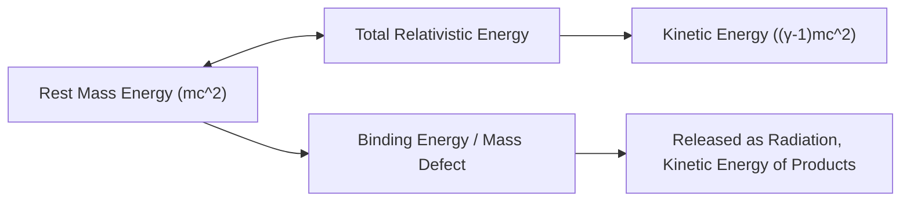

## Mass-Energy Equivalence

### Overview

Mass-energy equivalence is the physical principle stating that mass and energy are two manifestations of the same underlying quantity, related through the invariant speed of light. It emerges as a direct consequence of Einstein's special theory of relativity and fundamentally altered the classical view that mass and energy were separately conserved quantities.

### The Core Equation

$$E = mc^2$$

where:

- $E$ — energy (joules, J)
- $m$ — mass (kilograms, kg)
- $c$ — speed of light in vacuum, $c \approx 2.998 \times 10^8 \text{ m/s}$

**Key Points**

- $c^2$ is an enormous conversion factor ($\approx 9 \times 10^{16} \text{ m}^2/\text{s}^2$), so even small masses correspond to vast amounts of energy.
- This equation specifically gives the **rest energy** of an object — the energy it possesses purely by virtue of having mass, independent of motion.
- Mass is not "converted into" energy in the sense of disappearing; rather, mass is a form of energy, and total energy (including rest energy) is conserved.

### Derivation from Special Relativity

The relativistic energy-momentum relation is:

$$E^2 = (pc)^2 + (mc^2)^2$$

where $p$ is relativistic momentum. For a particle at rest ($p = 0$):

$$E^2 = (mc^2)^2 \implies E = mc^2$$

For a moving particle, total energy is:

$$E = \gamma m c^2$$

where the Lorentz factor is:

$$\gamma = \frac{1}{\sqrt{1 - v^2/c^2}}$$

Expanding $\gamma$ via a Taylor series for $v \ll c$:

$$E = mc^2\left(1 + \frac{1}{2}\frac{v^2}{c^2} + \frac{3}{8}\frac{v^4}{c^4} + \cdots\right) = mc^2 + \frac{1}{2}mv^2 + \cdots$$

The first term, $mc^2$, is the rest energy; the second term, $\frac{1}{2}mv^2$, recovers the classical Newtonian kinetic energy in the low-velocity limit. This demonstrates that special relativity reduces to Newtonian mechanics as $v/c \to 0$, and that kinetic energy is the *additional* energy above the rest energy.

### Total, Rest, and Kinetic Energy

| Quantity | Formula | Description |
| --- | --- | --- |
| Rest energy | $E_0 = mc^2$ | Energy from mass alone, at $v = 0$ |
| Total energy | $E = \gamma mc^2$ | Rest energy + kinetic energy |
| Kinetic energy | $K = (\gamma - 1)mc^2$ | Relativistic kinetic energy |
| Momentum | $p = \gamma m v$ | Relativistic momentum |

For massless particles (e.g., photons), the energy-momentum relation simplifies since $m = 0$:

$$E = pc$$

### Invariant Mass

A crucial subtlety: the $m$ in $E = mc^2$ refers to **invariant (rest) mass**, not "relativistic mass" — a now-largely-deprecated concept from older textbooks that treated mass as increasing with velocity ($m_{rel} = \gamma m$). Modern treatments avoid relativistic mass because it conflates energy and mass, and instead use invariant mass consistently across all reference frames.

[Inference] The relativistic-mass formulation persists in some introductory pedagogy and popular science because it offers an intuitive (if imprecise) explanation for why objects cannot reach $c$.

### Physical Interpretation and Consequences

**Key Points**

- Mass is a measure of an object's total internal energy content (rest energy), including kinetic and potential energies of its constituent particles.
- Binding energy has measurable mass consequences: a bound system (e.g., a nucleus) has *less* mass than the sum of its unbound constituent particles — the difference is the **mass defect**, corresponding to the binding energy released upon formation.
- Conversely, unbinding a system (fission) or forming a more tightly bound one (fusion) releases energy proportional to the mass difference.

### Example: Nuclear Binding Energy (Mass Defect)

Consider a helium-4 nucleus formed from 2 protons and 2 neutrons.

$$\Delta m = (2m_p + 2m_n) - m_{He-4}$$

Using approximate masses:

- $m_p \approx 1.007276 \text{ u}$
- $m_n \approx 1.008665 \text{ u}$
- $m_{He-4} \approx 4.002602 \text{ u}$

$$\Delta m = (2 \times 1.007276 + 2 \times 1.008665) - 4.002602 \approx 0.030280 \text{ u}$$

Converting to energy ($1 \text{ u} \approx 931.5 \text{ MeV}/c^2$):

$$E_{binding} = \Delta m \, c^2 \approx 0.030280 \times 931.5 \text{ MeV} \approx 28.2 \text{ MeV}$$

This is the energy released when the nucleus forms — and equivalently, the energy required to disassemble it back into free nucleons.

### Example: Electron-Positron Annihilation

When an electron and positron (each with rest mass $m_e \approx 9.109 \times 10^{-31} \text{ kg}$) annihilate at rest, their combined rest mass converts entirely into photon energy:

$$E = 2m_ec^2 \approx 2 \times (9.109\times10^{-31})(2.998\times10^8)^2 \approx 1.637 \times 10^{-13} \text{ J} \approx 1.022 \text{ MeV}$$

This produces two photons of $\approx 0.511 \text{ MeV}$ each (to conserve momentum), the basis of PET (positron emission tomography) imaging.

### Conservation Laws Unified

Pre-relativistic physics treated conservation of mass and conservation of energy as independent principles. Mass-energy equivalence unifies these into a single conservation law: **total mass-energy is conserved**, though mass and kinetic/radiant energy can interconvert.

### Experimental Verification

**Key Points**

- Nuclear fission and fusion reactions (measured energy release matches predicted mass defects to high precision).
- Particle-antiparticle annihilation, producing photon energy exactly matching $2m c^2$.
- Precision mass spectrometry combined with nuclear reaction Q-values.
- Cockcroft and Walton's 1932 experiment (splitting lithium nuclei with protons) provided early direct confirmation of $E=mc^2$ by comparing kinetic energy release to mass differences.

### Common Misconceptions

**Key Points**

- $E=mc^2$ does **not** imply mass "turns into" energy in a way that violates conservation — total energy (mass-energy) is always conserved.
- The equation applies to an object at rest; the general relation involves momentum ($E^2 = (pc)^2+(mc^2)^2$).
- "Relativistic mass" increasing with speed is a deprecated framing; modern physics keeps $m$ invariant and attributes increased energy to $\gamma$.
- Chemical reactions also involve mass-energy conversion (e.g., combustion releases energy, so products have marginally less mass than reactants), but the mass change is many orders of magnitude smaller than in nuclear reactions and is practically unmeasurable.

### Applications

- **Nuclear power/weapons**: Fission of heavy nuclei (e.g., U-235) releases energy from mass defects between parent and daughter nuclei.
- **Stellar nucleosynthesis**: Fusion in stars (e.g., hydrogen to helium) powers stellar output via mass-energy conversion.
- **Particle physics**: Particle accelerators create new particles by converting kinetic energy into mass ($E=mc^2$ run in reverse), and collider experiments determine particle rest masses from energy/momentum measurements.
- **Medical imaging**: PET scans rely on positron-electron annihilation energy.

### Related Topics

- Lorentz Transformations
- Relativistic Momentum and the Energy-Momentum Relation
- Time Dilation and Length Contraction
- Four-Vectors and Minkowski Spacetime
- Nuclear Binding Energy and the Semi-Empirical Mass Formula
- Relativistic Doppler Effect
- General Relativity: Mass-Energy as a Source of Spacetime Curvature