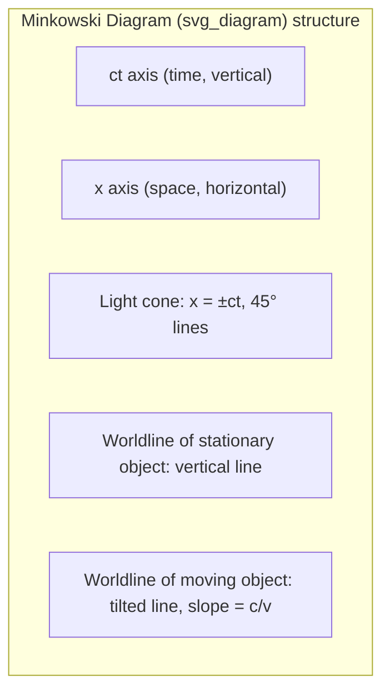
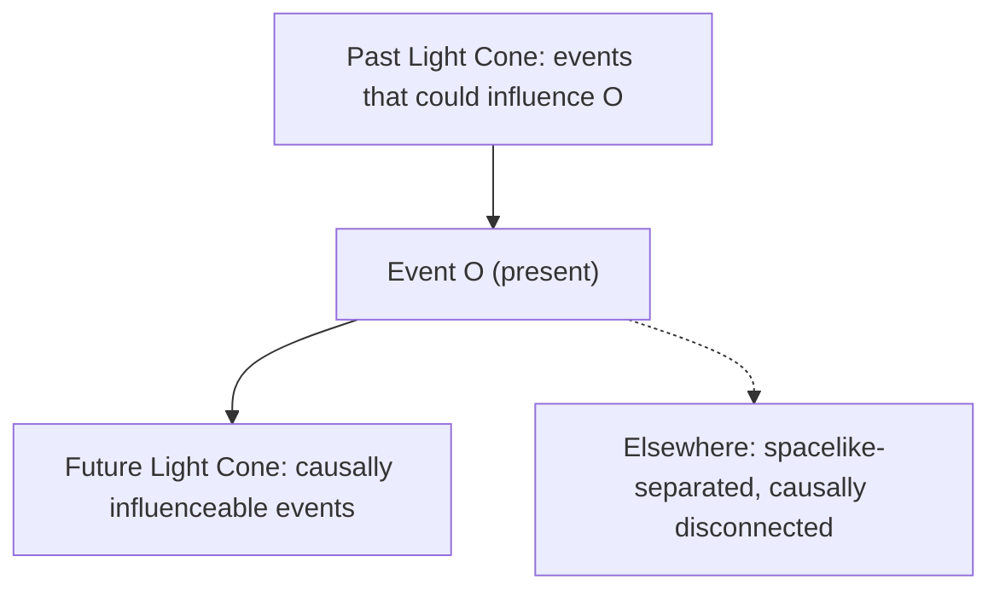

## Spacetime and Minkowski Diagrams

### Overview

Spacetime is the four-dimensional continuum combining the three spatial dimensions with time into a single geometric structure, introduced by Hermann Minkowski in 1908 as the natural mathematical framework for special relativity. A Minkowski diagram is the standard graphical tool for visualizing events, worldlines, and the relationships between frames of reference in this spacetime.

### The Spacetime Interval

Unlike Newtonian mechanics, where space and time are absolute and separate, relativity requires a combined structure in which the following quantity is invariant (the same in all inertial frames):

$$\Delta s^2 = c^2\Delta t^2 - \Delta x^2 - \Delta y^2 - \Delta z^2$$

(using the $(+,-,-,-)$ metric signature convention; the $(-,+,+,+)$ convention is equally common and flips overall signs).

**Key Points**

- $\Delta s^2 > 0$: **timelike** separation — events can be causally connected; an observer can travel between them.
- $\Delta s^2 < 0$: **spacelike** separation — no causal connection is possible; simultaneity is frame-dependent.
- $\Delta s^2 = 0$: **lightlike (null)** separation — only light (or other massless particles) can connect the events.
- The invariance of $\Delta s^2$ under Lorentz transformations is the defining geometric property of Minkowski spacetime, analogous to how Euclidean distance is invariant under rotations.

### The Minkowski Metric

In matrix form, using coordinates $(ct, x, y, z)$, the metric tensor is:

$$\eta_{\mu\nu} = \begin{pmatrix} 1 & 0 & 0 & 0 \\ 0 & -1 & 0 & 0 \\ 0 & 0 & -1 & 0 \\ 0 & 0 & 0 & -1 \end{pmatrix}$$

so that $\Delta s^2 = \eta_{\mu\nu}\Delta x^\mu \Delta x^\nu$ (Einstein summation convention). This is a **pseudo-Riemannian** metric (indefinite signature), distinguishing spacetime geometry from ordinary Euclidean geometry.

### Constructing a Minkowski Diagram

A Minkowski diagram plots one spatial axis ($x$) against a time axis, conventionally scaled as $ct$ so both axes share units of length.

**Key Points**

- The **vertical axis** represents $ct$ (time, scaled by $c$).
- The **horizontal axis** represents $x$ (space).
- Light rays travel at $45°$ lines, since $x = \pm ct$ when $v = c$.
- A **worldline** is the path of an object through spacetime; a stationary object's worldline is vertical, while a moving object's worldline is tilted from vertical by an angle $\theta$ where $\tan\theta = v/c$.
- Units are typically chosen with $c = 1$ (natural units) so light rays sit exactly at $45°$.

### SVG Illustration: Basic Minkowski Diagram

<svg xmlns="http://www.w3.org/2000/svg" viewBox="0 0 500 500">
<text x="250" y="25" text-anchor="middle" font-size="16" font-weight="bold">Minkowski Diagram (svg_diagram)</text>
<line x1="50" y1="450" x2="450" y2="450" stroke="black" stroke-width="2" />
<line x1="250" y1="450" x2="250" y2="50" stroke="black" stroke-width="2" />
<text x="460" y="455" font-size="14">x</text>
<text x="255" y="45" font-size="14">ct</text>
<line x1="250" y1="450" x2="450" y2="250" stroke="orange" stroke-width="1.5" stroke-dasharray="4,4" />
<line x1="250" y1="450" x2="50" y2="250" stroke="orange" stroke-width="1.5" stroke-dasharray="4,4" />
<text x="410" y="245" font-size="12" fill="orange">light ray (x=ct)</text>
<text x="60" y="245" font-size="12" fill="orange">light ray (x=-ct)</text>
<line x1="250" y1="450" x2="250" y2="80" stroke="blue" stroke-width="2" />
<text x="255" y="90" font-size="12" fill="blue">rest worldline</text>
<line x1="250" y1="450" x2="380" y2="100" stroke="green" stroke-width="2" />
<text x="385" y="100" font-size="12" fill="green">moving worldline (v &lt; c)</text>
<circle cx="250" cy="450" r="4" fill="black" />
<text x="200" y="470" font-size="12">Event O (origin)</text>
</svg>

### Light Cones

**Key Points**

- The **future light cone** consists of all events reachable from an origin event traveling at or below $c$; it represents all events the origin event could causally influence.
- The **past light cone** consists of all events that could have causally influenced the origin event.
- Events outside both cones (spacelike-separated) are causally disconnected — no signal or influence can connect them, and their temporal order is frame-dependent.
- Physical worldlines (of massive particles) must always remain within the light cone at every point, since $v < c$ requires the worldline's slope (in $ct$ vs. $x$) to exceed $45°$ from horizontal.

### Simultaneity and Relativity of Simultaneity

In a Minkowski diagram, a frame's "line of simultaneity" (the set of events judged simultaneous by an observer) is **not** horizontal for a moving observer — it tilts by the same angle $\theta$ (relative to horizontal) that the observer's worldline tilts from vertical, where $\tan\theta = v/c$.

**Key Points**

- Two events simultaneous in one frame (same $ct$) are generally **not** simultaneous in a relatively moving frame — this is the relativity of simultaneity.
- Graphically, this is shown by drawing tilted "primed" axes ($ct'$, $x'$) for a boosted frame; the $ct'$ axis coincides with the moving worldline, and the $x'$ axis tilts by the same angle in the opposite sense, keeping both axes equidistant from the light cone (a consequence of the invariance of $c$).

### Lorentz Transformation as a "Rotation"

The transformation between frames $S$ and $S'$ moving at relative velocity $v$ is a **hyperbolic rotation** in spacetime, not a Euclidean one:

$$ct' = \gamma(ct - \beta x), \quad x' = \gamma(x - \beta \, ct)$$

where $\beta = v/c$ and $\gamma = 1/\sqrt{1-\beta^2}$.

This can be written using a rapidity parameter $\phi$ (where $\tanh\phi = \beta$):

$$ct' = ct\cosh\phi - x\sinh\phi, \quad x' = x\cosh\phi - ct\sinh\phi$$

**Key Points**

- Unlike a Euclidean rotation (which uses $\sin,\cos$ and preserves $x^2+y^2$), a Lorentz boost uses $\sinh,\cosh$ and preserves $c^2t^2 - x^2$.
- Rapidities add linearly under successive boosts ($\phi_{total} = \phi_1+\phi_2$), unlike velocities, which combine via the relativistic velocity-addition formula — this makes rapidity a more natural parameter for chaining boosts.

### Invariant Hyperbolas (Calibration Curves)

On a Minkowski diagram, the set of events at a fixed proper time $\tau$ from the origin traces a hyperbola $c^2t^2 - x^2 = c^2\tau^2$, used to calibrate the scale of a boosted frame's axes graphically — since Lorentz boosts are hyperbolic rotations, they preserve these hyperbolas rather than circles.

**Example**

To calibrate one unit of proper time on a moving observer's $ct'$-axis: draw the hyperbola $c^2t^2 - x^2 = c^2$ (unit invariant interval); its intersection with the $ct'$-axis marks one unit of $ct'$ — visually smaller in coordinate distance than the rest frame's unit due to the hyperbola's curvature, correctly encoding time dilation without violating $c$-invariance.

### Worldlines and Proper Time

The **proper time** $\tau$ elapsed along a worldline between two events is:

$$\Delta\tau = \int \frac{ds}{c} = \int \sqrt{dt^2 - \frac{dx^2+dy^2+dz^2}{c^2}}$$

For an object moving at constant velocity $v$ between two events separated by coordinate time $\Delta t$:

$$\Delta\tau = \Delta t\sqrt{1-v^2/c^2} = \frac{\Delta t}{\gamma}$$

**Key Points**

- Proper time is the time measured by a clock physically carried along the worldline — it is the arc length of the worldline in spacetime geometry.
- This underlies the **twin paradox**: the twin who travels (non-inertial worldline) accumulates less proper time than the twin who stays in a single inertial frame, despite both starting and ending at the same two spacetime events.

### Example: Reading a Minkowski Diagram

Given two events, $A = (ct=2, x=1)$ and $B = (ct=4,x=3)$ (units: light-seconds/seconds):

$$\Delta s^2 = c^2(\Delta t)^2 - (\Delta x)^2 = (4-2)^2 - (3-1)^2 = 4 - 4 = 0$$

The interval is null — events $A$ and $B$ are connected by a light signal; a photon emitted at $A$ arrives exactly at $B$.

### Four-Vectors in Spacetime Diagrams

**Key Points**

- Position four-vector: $x^\mu = (ct, x, y, z)$.
- Four-velocity: $u^\mu = \gamma(c, \vec{v})$, always satisfying $u^\mu u_\mu = c^2$ (a normalization condition visualized as the worldline's tangent vector always terminating on the same invariant hyperbola).
- Four-momentum: $p^\mu = (E/c, \vec{p})$, connecting directly to the mass-energy relation $p^\mu p_\mu = (mc)^2 \Rightarrow E^2 = (pc)^2+(mc^2)^2$.

### Common Misconceptions

**Key Points**

- Minkowski diagrams are **not** ordinary Euclidean $x$–$y$ plots; distances on the page do not correspond to physical distances or times in the usual Pythagorean sense — the relevant invariant uses a minus sign.
- A tilted worldline does not mean the object is "really" moving diagonally through space in some absolute sense — the tilt encodes velocity relative to the diagram's chosen rest frame.
- The relativity of simultaneity shown by tilted lines of simultaneity is a genuine physical/geometric feature, not a mere illusion of measurement.

### Applications

- Visualizing causality constraints in particle physics and cosmology (causal structure of the universe, light cones around black holes).
- Resolving relativistic paradoxes graphically (twin paradox, ladder/barn paradox, relativity of simultaneity).
- Foundation for the analogous (but curved) spacetime diagrams used in general relativity (Penrose/conformal diagrams).
- Teaching tool for deriving time dilation and length contraction geometrically rather than algebraically.

### Related Topics

- Lorentz Transformations and Rapidity
- Time Dilation and Length Contraction
- The Relativity of Simultaneity
- Four-Vectors and Tensor Notation in Relativity
- The Twin Paradox
- Causal Structure and Light Cones
- Introduction to General Relativity and Curved Spacetime