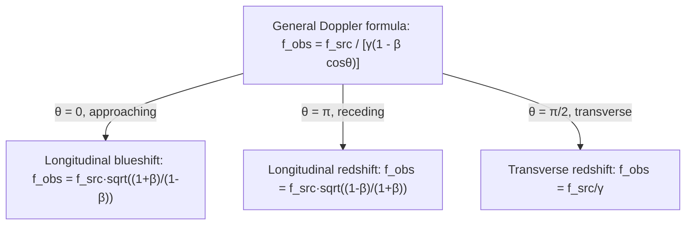

## The Relativistic Doppler Effect

### Overview

The relativistic Doppler effect describes the shift in observed frequency (or wavelength) of light or other electromagnetic radiation due to relative motion between source and observer, incorporating both the classical Doppler shift and time dilation effects absent from Newtonian acoustics. Unlike the classical (sound) Doppler effect, the relativistic version depends only on the relative velocity between source and observer — not on motion relative to a medium, since light requires none.

### Contrast with the Classical Doppler Effect

**Key Points**

- Classical (sound) Doppler shift depends on the velocities of source and observer *separately* relative to the medium (air), producing different formulas depending on which one moves.
- Relativistic Doppler shift depends only on the *relative* velocity $v$ between source and observer, consistent with the relativity postulate that no preferred medium/frame exists for light.
- The relativistic formula includes a time-dilation correction (factor of $\gamma$) not present in the classical case — this produces a **transverse Doppler effect** with no classical analog.

### Longitudinal Relativistic Doppler Formula

For a source and observer moving directly toward or away from each other along the line of sight, with relative velocity $v$ (positive for recession):

$$f_{obs} = f_{src}\sqrt{\frac{1-\beta}{1+\beta}} \quad \text{(receding)}$$

$$f_{obs} = f_{src}\sqrt{\frac{1+\beta}{1-\beta}} \quad \text{(approaching)}$$

where $\beta = v/c$. Equivalently, using a single signed convention (with $\beta > 0$ for recession):

$$f_{obs} = f_{src}\sqrt{\frac{1-\beta}{1+\beta}}$$

In terms of wavelength:

$$\lambda_{obs} = \lambda_{src}\sqrt{\frac{1+\beta}{1-\beta}} \quad \text{(receding, redshift)}$$

**Key Points**

- Recession ($\beta>0$): frequency decreases, wavelength increases — **redshift**.
- Approach ($\beta<0$ in the recession convention): frequency increases, wavelength decreases — **blueshift**.
- The formula is symmetric under source/observer interchange, unlike the classical case — only relative velocity matters.

### Derivation Sketch

The relativistic Doppler formula combines two effects:

1. **Classical light-travel-time effect**: successive wavefronts travel different distances as source and observer separate/approach.
2. **Time dilation**: the source's proper time runs slow relative to the observer's frame by a factor of $\gamma$.

Starting from the classical light Doppler shift $f_{obs} = f_{src}\frac{1}{1+\beta}$ (source receding, non-relativistic light case) and multiplying by the time-dilation factor for the moving source's clock:

$$f_{obs} = \frac{f_{src}}{\gamma(1+\beta)} = f_{src}\frac{\sqrt{1-\beta^2}}{1+\beta} = f_{src}\sqrt{\frac{(1-\beta)(1+\beta)}{(1+\beta)^2}} = f_{src}\sqrt{\frac{1-\beta}{1+\beta}}$$

This recovers the longitudinal formula above.

### Redshift Parameter $z$

Astronomers commonly express the shift using the redshift parameter:

$$z = \frac{\lambda_{obs}-\lambda_{src}}{\lambda_{src}} = \frac{\lambda_{obs}}{\lambda_{src}} - 1$$

For the relativistic Doppler case (recession):

$$1+z = \sqrt{\frac{1+\beta}{1-\beta}}$$

Solving for $\beta$ given a measured $z$:

$$\beta = \frac{(1+z)^2-1}{(1+z)^2+1}$$

**Key Points**

- For $z \ll 1$ (low velocities), this reduces to the classical approximation $z \approx \beta = v/c$.
- At $z=1$, $\beta = 0.6$; the relationship becomes increasingly nonlinear at high $z$, and $\beta \to 1$ only as $z \to \infty$.
- Cosmological redshift (from spacetime expansion) is conceptually distinct from Doppler redshift, though both use the same $z$ notation; cosmological redshift arises from the metric expansion of space itself rather than relative velocity through space. [Inference] For nearby, low-redshift sources the two are often treated as approximately equivalent in introductory contexts, though this equivalence breaks down at cosmological distances.

### Transverse Doppler Effect

When the source moves **perpendicular** to the line of sight (at the moment of closest approach, as measured in the observer's frame), there is still a frequency shift — purely due to time dilation, with no classical counterpart:

$$f_{obs} = \frac{f_{src}}{\gamma} = f_{src}\sqrt{1-\beta^2}$$

This is always a **redshift** (frequency decrease), since $\gamma \geq 1$ always.

**Key Points**

- The transverse Doppler effect is a direct, measurable consequence of time dilation — the moving source's clock (and thus its oscillation frequency) runs slow as seen by the stationary observer.
- It was experimentally confirmed by the Ives–Stilwell experiment (1938) using fast-moving hydrogen ion beams, providing early direct evidence for time dilation.
- Classical acoustic Doppler shift is exactly zero for pure transverse motion; the existence of a nonzero shift is itself a signature of relativity.

### General (Oblique) Formula

For a source moving at angle $\theta$ (measured in the observer's frame) relative to the line of sight, with speed $v = \beta c$:

$$f_{obs} = \frac{f_{src}}{\gamma(1-\beta\cos\theta)}$$

**Key Points**

- $\theta = 0$ (source approaching directly): reduces to the longitudinal blueshift formula.
- $\theta = \pi$ (source receding directly): reduces to the longitudinal redshift formula.
- $\theta = \pi/2$ (transverse, as measured in observer's frame): reduces to the pure transverse (time-dilation-only) redshift.

### SVG Illustration: Longitudinal vs Transverse Doppler Geometry

<svg xmlns="http://www.w3.org/2000/svg" viewBox="0 0 520 320">
<text x="260" y="25" text-anchor="middle" font-size="16" font-weight="bold">Doppler Geometry (svg_diagram)</text>
<circle cx="260" cy="160" r="6" fill="black" />
<text x="240" y="185" font-size="12">Observer</text>
<line x1="260" y1="160" x2="450" y2="160" stroke="red" stroke-width="2" marker-end="url(#arrow)" />
<text x="380" y="150" font-size="12" fill="red">receding (redshift)</text>
<line x1="260" y1="160" x2="70" y2="160" stroke="blue" stroke-width="2" marker-end="url(#arrow)" />
<text x="90" y="150" font-size="12" fill="blue">approaching (blueshift)</text>
<line x1="260" y1="160" x2="260" y2="40" stroke="green" stroke-width="2" marker-end="url(#arrow)" />
<text x="265" y="55" font-size="12" fill="green">transverse (time-dilation redshift only)</text>
</svg>

### Example Calculation

A distant galaxy's hydrogen emission line, normally at $\lambda_{src} = 656.3\text{ nm}$ (H-alpha), is observed at $\lambda_{obs} = 700.0\text{ nm}$.

**Step 1 — Compute $z$:**

$$z = \frac{700.0 - 656.3}{656.3} \approx 0.0666$$

**Step 2 — Compute recession velocity:**

$$\beta = \frac{(1+z)^2-1}{(1+z)^2+1} = \frac{(1.0666)^2-1}{(1.0666)^2+1} \approx \frac{0.1376}{2.1376} \approx 0.0644$$

$$v \approx 0.0644c \approx 1.93\times 10^4 \text{ km/s}$$

**Output**

The galaxy is receding at approximately $19{,}300 \text{ km/s}$, consistent with a redshift-based recession velocity well below relativistic regimes where the low-$z$ approximation $v \approx cz$ remains reasonably accurate.

### Applications

- **Astronomy/Cosmology**: Measuring recession velocities of galaxies, exoplanet detection via radial-velocity (stellar wobble) spectral shifts, quasar redshift surveys.
- **GPS and satellite systems**: Relativistic Doppler corrections (combined with gravitational time dilation) are necessary for precise timing.
- **Particle physics**: Interpreting spectral line shifts from fast-moving decay products and beams.
- **Ives–Stilwell-type experiments**: Direct laboratory tests of time dilation via transverse/oblique Doppler measurements.

### Common Misconceptions

**Key Points**

- The relativistic Doppler effect is not simply the classical formula with $v$ replaced by $\beta$ — the $\gamma$ factor introduces genuinely new physics (transverse shift).
- Cosmological redshift and kinematic (relative-velocity) Doppler redshift are physically distinct mechanisms, even though both are quantified by the same $z$ parameter and coincide in the low-redshift limit.
- A transverse Doppler redshift does not require any radial motion — it exists purely due to time dilation of the moving source's internal clock/oscillator.

### Related Topics

- Time Dilation and the Lorentz Factor
- Special Relativity and the Ives–Stilwell Experiment
- Cosmological Redshift and Hubble's Law
- Relativistic Aberration of Light
- Four-Vectors and the Relativistic Wave Vector
- Gravitational Redshift (General Relativity)