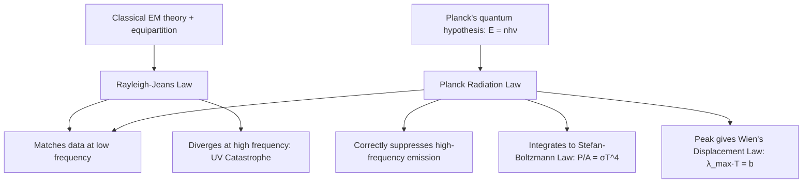
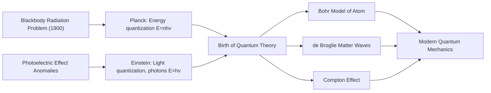

## Blackbody Radiation and the Photoelectric Effect

### Overview

Blackbody radiation and the photoelectric effect are the two foundational phenomena that exposed the failure of classical physics to describe light-matter interaction at small scales, motivating the introduction of energy quantization by Planck (1900) and the photon concept by Einstein (1905). Together they mark the empirical origin of quantum mechanics.

---

### Part I: Blackbody Radiation

#### Definition

A **blackbody** is an idealized object that absorbs all incident electromagnetic radiation regardless of wavelength or angle, and re-emits energy purely as a function of its temperature — its emission spectrum depends only on temperature, not on material composition.

**Key Points**

- A blackbody is both a perfect absorber and, in thermal equilibrium, the most efficient possible emitter at every wavelength (Kirchhoff's law of thermal radiation).
- Real approximations include cavities with small apertures, and to good approximation, stars.
- The emitted spectrum is continuous and characterized by a single parameter: absolute temperature $T$.

#### The Ultraviolet Catastrophe

Classical electromagnetism (via the equipartition theorem) predicted the **Rayleigh-Jeans law** for spectral radiance:

$$u(\nu, T) = \frac{8\pi\nu^2}{c^3}k_BT$$

**Key Points**

- This formula matches experimental blackbody spectra well at low frequencies (long wavelengths).
- It diverges as $\nu \to \infty$, predicting infinite emitted energy at high frequencies (ultraviolet and beyond) — the **ultraviolet catastrophe**, a clear contradiction of observed finite total emission.
- This divergence signaled a fundamental breakdown of classical statistical mechanics applied to electromagnetic field modes.

#### Planck's Quantum Hypothesis

Max Planck resolved the catastrophe (1900) by postulating that electromagnetic oscillators in the cavity walls can only exchange energy in discrete quanta:

$$E_n = nh\nu, \quad n = 0,1,2,\ldots$$

where $h$ is Planck's constant ($h \approx 6.626\times10^{-34} \text{ J·s}$) and $\nu$ is the oscillation frequency.

This yields the **Planck radiation law**:

$$u(\nu,T) = \frac{8\pi h\nu^3}{c^3}\frac{1}{e^{h\nu/k_BT}-1}$$

or, in terms of wavelength:

$$u(\lambda,T) = \frac{8\pi hc}{\lambda^5}\frac{1}{e^{hc/\lambda k_BT}-1}$$

**Key Points**

- At low frequencies ($h\nu \ll k_BT$), Planck's law reduces to the Rayleigh-Jeans law, matching classical results.
- At high frequencies ($h\nu \gg k_BT$), the exponential term suppresses emission, avoiding divergence and matching Wien's empirical law.
- $h$ was originally introduced as a mathematical fitting parameter; Planck himself initially regarded quantization as a calculational device rather than a physical reality. [Unverified] The extent to which Planck personally believed in physical energy quantization at the time (versus viewing it purely formally) remains debated among historians of science.

#### Wien's Displacement Law

The peak wavelength of blackbody emission is inversely proportional to temperature:

$$\lambda_{max}T = b, \quad b \approx 2.898\times10^{-3} \text{ m·K}$$

**Example**

For the Sun's surface ($T \approx 5778\text{ K}$):

$$\lambda_{max} = \frac{2.898\times10^{-3}}{5778} \approx 5.01\times10^{-7}\text{ m} = 501\text{ nm}$$

This falls in the visible green-blue range, close to the Sun's peak emission wavelength.

#### Stefan-Boltzmann Law

Total power radiated per unit area, integrated over all wavelengths:

$$P/A = \sigma T^4, \quad \sigma \approx 5.670\times10^{-8}\text{ W/(m}^2\text{K}^4\text{)}$$

This follows from integrating Planck's law over all frequencies, and the $T^4$ dependence itself was established empirically (Stefan) and derived thermodynamically (Boltzmann) before Planck's quantum derivation.

---

### Part II: The Photoelectric Effect

#### Phenomenon

When light shines on certain metal surfaces, electrons ("photoelectrons") can be ejected. Experimentally observed features contradicted classical wave predictions:

**Key Points**

- Classical (wave) prediction: increasing light **intensity** should increase the kinetic energy of ejected electrons, and any frequency of light, given sufficient intensity/time, should eventually eject electrons.
- Observed reality: kinetic energy of ejected electrons depends only on light **frequency**, not intensity; below a threshold frequency $\nu_0$, no electrons are ejected regardless of intensity; emission is essentially instantaneous (no observable time lag), even at very low intensity.
- Increasing intensity increases the **number** of photoelectrons (current), not their individual kinetic energy.

#### Einstein's Photon Hypothesis (1905)

Einstein proposed that light itself is quantized into discrete packets (**photons**), each carrying energy:

$$E = h\nu$$

An electron absorbs a single photon; if the photon's energy exceeds the metal's **work function** $\phi$ (minimum energy binding the electron to the material), the electron is ejected with the remaining energy as kinetic energy:

$$K_{max} = h\nu - \phi$$

This is the **photoelectric equation**.

**Key Points**

- Threshold frequency: $\nu_0 = \phi/h$; below this, no single photon carries enough energy to eject an electron, regardless of how many photons (intensity) arrive.
- $K_{max}$ depends linearly on $\nu$ with slope $h$, independent of intensity — matching experimental observation and providing an independent measurement of Planck's constant.
- Instantaneous emission is natural under the photon model: absorption is a single quantum event, not a gradual energy accumulation process.

#### Stopping Potential

Experimentally, $K_{max}$ is measured via the **stopping potential** $V_0$ — the retarding voltage that just halts the most energetic photoelectrons:

$$eV_0 = K_{max} = h\nu - \phi \implies V_0 = \frac{h}{e}\nu - \frac{\phi}{e}$$

A plot of $V_0$ vs. $\nu$ is linear, with slope $h/e$ and $y$-intercept $-\phi/e$ — this is the standard method (Millikan, 1916) used to experimentally confirm Einstein's equation and precisely measure $h$.

#### Example Calculation

A metal has a work function $\phi = 2.3\text{ eV}$. Light of wavelength $\lambda = 400\text{ nm}$ illuminates it.

**Step 1 — Photon energy:**

$$E = \frac{hc}{\lambda} = \frac{(6.626\times10^{-34})(3.00\times10^8)}{400\times10^{-9}} \approx 4.97\times10^{-19}\text{ J} \approx 3.10\text{ eV}$$

**Step 2 — Maximum kinetic energy:**

$$K_{max} = E - \phi = 3.10 - 2.3 = 0.80\text{ eV}$$

**Step 3 — Stopping potential:**

$$V_0 = K_{max}/e = 0.80\text{ V}$$

**Output**

Photoelectrons are ejected with maximum kinetic energy $0.80\text{ eV}$, requiring a stopping potential of $0.80\text{ V}$ to halt them.

#### SVG Illustration: Stopping Potential vs. Frequency

<svg xmlns="http://www.w3.org/2000/svg" viewBox="0 0 480 340">
<text x="240" y="25" text-anchor="middle" font-size="16" font-weight="bold">Stopping Potential vs Frequency (svg_diagram)</text>
<line x1="60" y1="290" x2="440" y2="290" stroke="black" stroke-width="2" />
<line x1="60" y1="290" x2="60" y2="50" stroke="black" stroke-width="2" />
<text x="445" y="295" font-size="13">ν (frequency)</text>
<text x="20" y="50" font-size="13">V₀</text>
<line x1="140" y1="290" x2="420" y2="90" stroke="blue" stroke-width="2.5" />
<line x1="60" y1="290" x2="140" y2="290" stroke="gray" stroke-width="1" stroke-dasharray="3,3" />
<circle cx="140" cy="290" r="4" fill="red" />
<text x="120" y="310" font-size="12" fill="red">ν₀ (threshold)</text>
<text x="330" y="120" font-size="12" fill="blue">slope = h/e</text>
<line x1="60" y1="250" x2="80" y2="250" stroke="green" stroke-width="1" stroke-dasharray="3,3" />
<text x="20" y="255" font-size="12" fill="green">−φ/e</text>
</svg>

#### Photon Momentum

Photons also carry momentum, consistent with $E=pc$ for massless particles:

$$p = \frac{h\nu}{c} = \frac{h}{\lambda}$$

This is later generalized by de Broglie to matter waves and directly underlies the **Compton effect** (photon-electron scattering with momentum transfer), which provided further confirmation of photon momentum.

### Wave-Particle Duality

**Key Points**

- Blackbody radiation established that electromagnetic *energy exchange* is quantized ($E=h\nu$ per quantum).
- The photoelectric effect established that light itself behaves as discrete particle-like quanta (photons) in its interaction with matter, carrying both energy and momentum.
- Light continues to exhibit wave behavior (interference, diffraction) in other contexts — the resolution is that light exhibits **wave-particle duality**, a foundational concept extended to all quantum objects (de Broglie, matter waves).
- Einstein received the 1921 Nobel Prize in Physics specifically for his explanation of the photoelectric effect, not for special or general relativity.

### Historical and Conceptual Significance

### Common Misconceptions

**Key Points**

- Planck's original quantization applied to the *exchange* of energy between matter and radiation, not necessarily to light itself as discrete particles — the leap to photons as physical quanta of light is specifically Einstein's 1905 contribution.
- Intensity vs. frequency confusion: higher intensity light does **not** produce higher-energy photoelectrons; only frequency determines individual photon energy.
- Below threshold frequency, no amount of exposure time or intensity ejects electrons — this contradicts classical wave-energy accumulation intuition.

### Applications

- **Astrophysics**: Stellar temperature and classification via blackbody spectral fitting.
- **Cosmic Microwave Background**: Near-perfect blackbody spectrum at $T\approx2.725\text{ K}$, strong evidence for Big Bang cosmology.
- **Photovoltaics and photodiodes**: Direct engineering application of the photoelectric effect.
- **Photomultiplier tubes and night-vision devices**: Rely on photoelectric emission for light detection and amplification.
- **Pyrometry**: Non-contact temperature measurement via blackbody radiation laws.

### Related Topics

- Planck's Constant and Energy Quantization
- The Bohr Model of the Hydrogen Atom
- de Broglie Wavelength and Matter Waves
- The Compton Effect
- Wave-Particle Duality
- The Photon and Quantum Electrodynamics (Introductory)
- The Cosmic Microwave Background as a Blackbody Spectrum