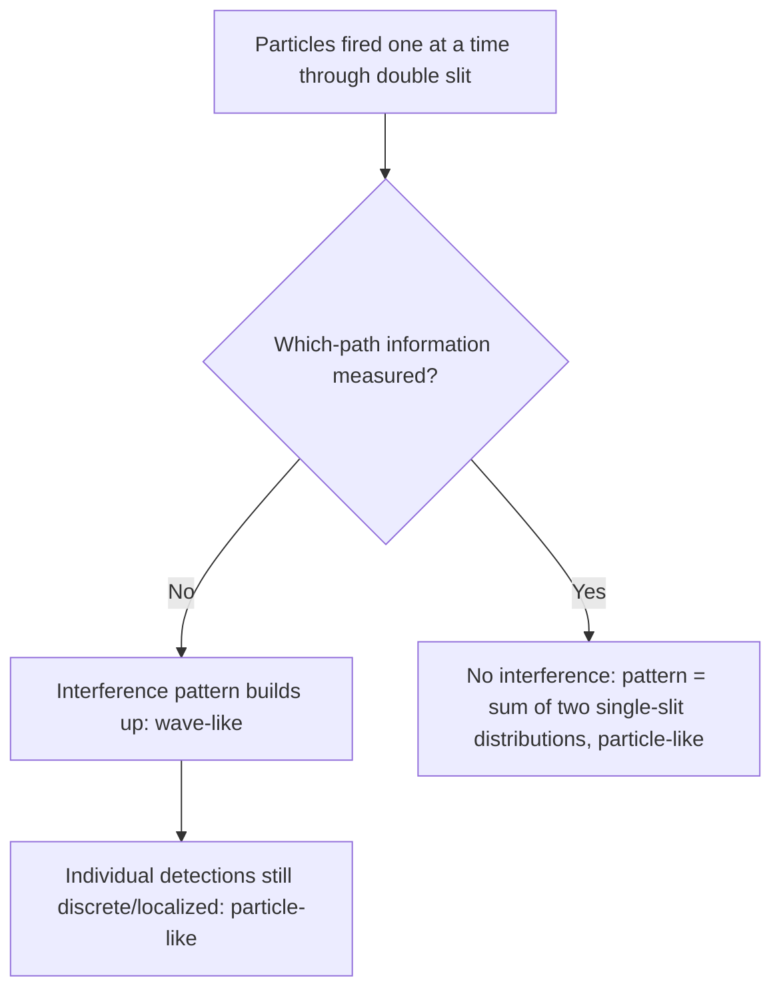

## Wave-Particle Duality

### Overview

Wave-particle duality is the principle that quantum entities — photons, electrons, and all matter and radiation — exhibit both wave-like and particle-like behavior, with the manifest character depending on the type of measurement or experiment performed. Neither classical picture alone (pure wave or pure particle) is sufficient; quantum objects are neither purely one nor the other in the classical sense.

### Historical Threads Leading to Duality

**Key Points**

- **Light as a wave**: Young's double-slit experiment (1801) and Maxwell's electromagnetic theory (1860s) established light's wave nature via interference and diffraction.
- **Light as particles**: Planck's blackbody quantization (1900) and Einstein's photoelectric effect explanation (1905) required treating light as discrete photon quanta.
- **Matter as particles**: Classical mechanics and early atomic models treated electrons, protons, etc., as point particles.
- **Matter as waves**: de Broglie's hypothesis (1924) proposed that all matter has an associated wavelength, later confirmed experimentally.

### The de Broglie Hypothesis

Louis de Broglie proposed that any particle with momentum $p$ has an associated wavelength:

$$\lambda = \frac{h}{p}$$

For a non-relativistic particle of mass $m$ moving at speed $v$:

$$\lambda = \frac{h}{mv}$$

**Key Points**

- This directly generalizes the photon relation $p = h/\lambda$ (derived from $E=pc$ and $E=h\nu$) to all matter, not just light.
- Macroscopic objects have imperceptibly small de Broglie wavelengths due to the tiny value of $h$, explaining why everyday objects show no observable wave behavior.
- For relativistic particles, momentum is $p=\gamma mv$, and the de Broglie relation still holds using this relativistic momentum.

**Example**

An electron accelerated through a potential difference of $V = 100\text{ V}$ gains kinetic energy $K = eV = 100\text{ eV} \approx 1.602\times10^{-17}\text{ J}$.

$$p = \sqrt{2mK} = \sqrt{2(9.109\times10^{-31})(1.602\times10^{-17})} \approx 5.40\times10^{-24}\text{ kg·m/s}$$

$$\lambda = \frac{h}{p} = \frac{6.626\times10^{-34}}{5.40\times10^{-24}} \approx 1.23\times10^{-10}\text{ m} \approx 0.123\text{ nm}$$

**Output**

This wavelength is comparable to atomic spacings in crystals — the physical basis for electron diffraction techniques.

### Experimental Confirmation of Matter Waves

**Key Points**

- **Davisson-Germer experiment (1927)**: Electrons scattered off a nickel crystal produced diffraction patterns matching de Broglie's predicted wavelength, providing direct experimental confirmation of electron wave behavior.
- **G.P. Thomson's electron diffraction experiments** (independently, 1927) showed similar diffraction through thin metal foils.
- Subsequent experiments have demonstrated wave interference for neutrons, atoms, and even large molecules (e.g., fullerenes), extending duality to increasingly massive systems.

### The Double-Slit Experiment

The canonical demonstration of duality: particles (electrons, photons, atoms) fired one at a time through two slits build up an interference pattern on a detection screen over many trials.

**Key Points**

- Each individual particle registers as a discrete, localized detection event (particle-like behavior).
- The cumulative statistical distribution of many detections forms an interference pattern characteristic of waves (wave-like behavior), including regions of destructive interference (fewer detections) that would be impossible if particles traveled through only one slit independently.
- If a measurement is made to determine which slit each particle passes through ("which-path" information), the interference pattern disappears, and the distribution reduces to the classical particle-like sum of two single-slit patterns.

### SVG Illustration: Double-Slit Outcomes

<svg xmlns="http://www.w3.org/2000/svg" viewBox="0 0 520 340">
<text x="260" y="25" text-anchor="middle" font-size="16" font-weight="bold">Double-Slit Duality (svg_diagram)</text>
<rect x="60" y="60" width="6" height="220" fill="black" />
<rect x="60" y="60" width="6" height="40" fill="white" />
<rect x="60" y="150" width="6" height="40" fill="white" />
<rect x="60" y="240" width="6" height="40" fill="white" />
<text x="40" y="300" font-size="11">slits</text>
<line x1="90" y1="170" x2="440" y2="170" stroke="gray" stroke-width="1" stroke-dasharray="2,2" />
<path d="M 440 170 C 430 90, 430 250, 440 170" fill="none" stroke="blue" stroke-width="0" />
<line x1="440" y1="60" x2="440" y2="280" stroke="black" stroke-width="2" />
<text x="450" y="70" font-size="11">screen</text>
<circle cx="435" cy="85" r="3" fill="blue" /><circle cx="437" cy="110" r="3" fill="blue" />
<circle cx="430" cy="130" r="2" fill="blue" /><circle cx="440" cy="150" r="4" fill="blue" />
<circle cx="434" cy="170" r="5" fill="blue" /><circle cx="440" cy="190" r="4" fill="blue" />
<circle cx="430" cy="210" r="2" fill="blue" /><circle cx="437" cy="230" r="3" fill="blue" />
<circle cx="435" cy="255" r="3" fill="blue" />
<text x="340" y="300" font-size="11" fill="blue">interference-pattern buildup</text>
</svg>

### Heisenberg's Uncertainty Principle

Wave-particle duality is intimately connected to the **Heisenberg uncertainty principle**:

$$\Delta x \, \Delta p \geq \frac{\hbar}{2}$$

**Key Points**

- A wave with a precisely defined wavelength (and thus momentum, via $p=h/\lambda$) must be spatially extended (infinite in the idealized case), making position highly uncertain.
- Localizing a particle's position requires superposing many wavelengths, increasing momentum uncertainty.
- This is not a statement about measurement imprecision alone — it reflects an intrinsic property of quantum states, following mathematically from the Fourier-transform relationship between position and momentum wavefunctions.
- Attempting to gain which-path information in the double-slit experiment necessarily introduces enough momentum disturbance (or entanglement) to wash out the interference pattern — this is sometimes framed as a manifestation of the uncertainty principle, though the precise mechanism (measurement-induced decoherence) is a deeper topic in quantum foundations.

### The Complementarity Principle

Niels Bohr formalized the resolution of duality as **complementarity**: wave and particle descriptions are mutually exclusive but jointly necessary for a complete description of quantum phenomena — a single experiment can reveal one aspect or the other, but never both simultaneously with full clarity.

**Key Points**

- Wave and particle behaviors are not contradictory once understood as complementary aspects revealed by different experimental contexts.
- This principle underlies much of the standard (Copenhagen) interpretation of quantum mechanics.
- [Inference] Complementarity is often summarized as "the type of question asked determines the type of answer obtained," though this phrasing simplifies significant ongoing philosophical debate about quantum measurement and interpretation.

### The Wavefunction

Quantum mechanically, a particle's state is described by a **wavefunction** $\Psi(x,t)$, whose squared magnitude gives probability density:

$$P(x,t) = |\Psi(x,t)|^2$$

**Key Points**

- The wavefunction itself is not directly observable; only $|\Psi|^2$ (probability density) connects to measurement outcomes (Born rule).
- Wave-like interference arises because wavefunctions add coherently (amplitudes, including phase, sum before squaring), producing constructive/destructive interference patterns in the resulting probability distribution.
- Particle-like discreteness arises upon measurement/detection, where the wavefunction's probabilistic prediction resolves into a single localized outcome.

### Comparison Table: Wave vs. Particle Manifestations

| Phenomenon | Wave-like evidence | Particle-like evidence |
| --- | --- | --- |
| Light | Interference, diffraction, polarization | Photoelectric effect, Compton scattering |
| Electrons | Davisson-Germer diffraction, electron microscopy | Discrete detection events, cathode ray deflection |
| Double-slit (any particle) | Interference pattern (many trials) | Discrete, localized single detections |

### Common Misconceptions

**Key Points**

- Quantum objects are not literally "sometimes a wave, sometimes a particle" switching identities — they are quantum entities whose behavior is described by a wavefunction, with wave and particle descriptions being classical limits/approximations appropriate to different experimental contexts.
- The interference pattern is not caused by particles interfering with *each other* — it persists even with particles sent one at a time, indicating each particle's wavefunction "interferes with itself."
- Duality does not imply particles are literally smeared out in space like a classical wave, nor that they are point-like billiard balls between measurements; the wavefunction's ontological status is itself a subject of ongoing interpretational debate (Copenhagen, many-worlds, pilot-wave, etc.), beyond standard operational quantum mechanics.

### Applications

- **Electron microscopy**: Exploits the short de Broglie wavelength of accelerated electrons to achieve resolution far beyond optical microscopes.
- **Neutron diffraction**: Used to probe crystal and magnetic structures, complementary to X-ray diffraction.
- **Quantum computing and cryptography**: Rely fundamentally on superposition and interference of quantum amplitudes.
- **Atom interferometry**: High-precision measurement of gravitational and inertial effects using matter-wave interference.

### Related Topics

- The Heisenberg Uncertainty Principle
- The Schrödinger Equation and Wavefunctions
- The Bohr Model and Atomic Quantization
- Quantum Superposition and Measurement
- The Born Rule and Probabilistic Interpretation
- Interpretations of Quantum Mechanics (Copenhagen, Many-Worlds, Pilot-Wave)
- Electron Microscopy and Diffraction Techniques