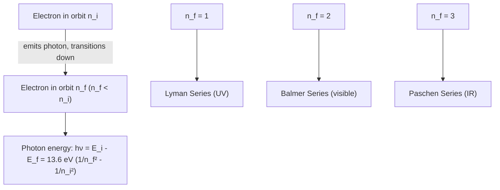

## The Bohr Model of the Atom

### Overview

The Bohr model, proposed by Niels Bohr in 1913, was the first quantum theory of atomic structure, successfully explaining the discrete spectral lines of hydrogen by postulating quantized electron orbits. Though later superseded by full quantum mechanics, it remains pedagogically important as the bridge between classical planetary atomic models and modern quantum theory.

### Historical Context

**Key Points**

- Rutherford's 1911 gold-foil scattering experiments established a nuclear atomic model: a small, dense, positively charged nucleus with electrons orbiting at a distance.
- Classical electromagnetism predicted this model was unstable: an orbiting (accelerating) electron should continuously radiate energy and spiral into the nucleus within a fraction of a second — in direct contradiction with the observed stability of atoms.
- Atomic emission spectra were known to be discrete (line spectra), not continuous, which classical physics could not explain — most notably the empirical Balmer series for hydrogen's visible lines.

### Bohr's Postulates

**Key Points**

1. Electrons occupy specific, stable, non-radiating circular orbits ("stationary states") around the nucleus, despite classical predictions of radiative collapse.
2. Only orbits satisfying quantized angular momentum are allowed:

   $$L = mvr = n\hbar, \quad n=1,2,3,\ldots$$

   where $\hbar = h/2\pi$ and $n$ is the **principal quantum number**.
3. Electrons emit or absorb a photon only when transitioning between allowed orbits, with photon energy equal to the energy difference between the orbits:

   $$h\nu = E_i - E_f$$
4. While in a stationary state, the electron does not radiate energy, in direct departure from classical electrodynamics.

### Derivation of Orbital Radius and Energy

For a hydrogen-like atom (nuclear charge $+Ze$, one electron), balancing the Coulomb attractive force with the required centripetal force:

$$\frac{1}{4\pi\epsilon_0}\frac{Ze^2}{r^2} = \frac{mv^2}{r}$$

Combined with the quantization condition $mvr = n\hbar$, solving simultaneously gives the allowed radii:

$$r_n = \frac{4\pi\epsilon_0\hbar^2}{mZe^2}n^2 = \frac{n^2}{Z}a_0$$

where $a_0$ is the **Bohr radius**:

$$a_0 = \frac{4\pi\epsilon_0\hbar^2}{me^2} \approx 5.29\times10^{-11}\text{ m} = 0.529\text{ Å}$$

**Key Points**

- Orbital radius scales as $n^2$ — higher energy levels correspond to dramatically larger orbits.
- For hydrogen ($Z=1$), the ground state ($n=1$) radius is exactly $a_0$, a natural atomic length scale still used throughout atomic physics.

### Energy Levels

The total energy (kinetic + potential) of the electron in orbit $n$:

$$E_n = -\frac{Z^2 m e^4}{8\epsilon_0^2h^2n^2} = -\frac{Z^2 \cdot 13.6\text{ eV}}{n^2}$$

**Key Points**

- For hydrogen ($Z=1$), $E_1 = -13.6\text{ eV}$ — the ground-state (lowest, most negative) energy, corresponding to the ionization energy of hydrogen.
- Energy levels become less negative (closer to zero) and more closely spaced as $n$ increases, converging to $E_\infty = 0$ (ionization/unbound electron).
- The negative sign indicates a bound state — energy must be supplied to remove the electron to infinity ($n\to\infty$).

### Spectral Line Formula (Rydberg Formula)

Transition energy between levels $n_i \to n_f$:

$$\Delta E = E_i - E_f = -13.6\text{ eV}\left(\frac{1}{n_i^2}-\frac{1}{n_f^2}\right)$$

Converting to wavelength via $\Delta E = hc/\lambda$ recovers the empirical **Rydberg formula**, derived here from first principles:

$$\frac{1}{\lambda} = R_H\left(\frac{1}{n_f^2}-\frac{1}{n_i^2}\right), \quad R_H \approx 1.097\times10^7\text{ m}^{-1}$$

**Key Points**

- This was a landmark theoretical achievement: Bohr's model derived the Rydberg constant $R_H$ from fundamental constants ($m, e, \epsilon_0, h, c$), rather than treating it as a purely empirical fitting parameter.
- Named series correspond to transitions to specific final states: **Lyman series** ($n_f=1$, ultraviolet), **Balmer series** ($n_f=2$, visible), **Paschen series** ($n_f=3$, infrared).

### SVG Illustration: Bohr Energy Levels and Transitions

<svg xmlns="http://www.w3.org/2000/svg" viewBox="0 0 480 360">
<text x="240" y="25" text-anchor="middle" font-size="16" font-weight="bold">Bohr Energy Levels (svg_diagram)</text>
<line x1="60" y1="320" x2="420" y2="320" stroke="black" stroke-width="1.5" />
<text x="20" y="325" font-size="12">n=1 (-13.6 eV)</text>
<line x1="60" y1="220" x2="420" y2="220" stroke="black" stroke-width="1.5" />
<text x="20" y="225" font-size="12">n=2 (-3.4 eV)</text>
<line x1="60" y1="160" x2="420" y2="160" stroke="black" stroke-width="1.5" />
<text x="20" y="165" font-size="12">n=3 (-1.51 eV)</text>
<line x1="60" y1="120" x2="420" y2="120" stroke="black" stroke-width="1.5" />
<text x="20" y="125" font-size="12">n=4 (-0.85 eV)</text>
<line x1="60" y1="60" x2="420" y2="60" stroke="gray" stroke-width="1" stroke-dasharray="4,4" />
<text x="20" y="65" font-size="12">n=∞ (0 eV)</text>
<line x1="150" y1="220" x2="150" y2="320" stroke="blue" stroke-width="1.5" marker-end="url(#a1)" />
<text x="155" y="270" font-size="10" fill="blue">Lyman</text>
<line x1="250" y1="160" x2="250" y2="220" stroke="green" stroke-width="1.5" marker-end="url(#a2)" />
<text x="255" y="195" font-size="10" fill="green">Balmer</text>
</svg>

### Example Calculation

Find the wavelength of the $n=3 \to n=2$ transition (first line of the Balmer series, $H_\alpha$).

**Step 1 — Energy difference:**

$$\Delta E = 13.6\left(\frac{1}{2^2}-\frac{1}{3^2}\right) = 13.6\left(\frac{1}{4}-\frac{1}{9}\right) = 13.6 \times 0.1389 \approx 1.889\text{ eV}$$

**Step 2 — Wavelength:**

$$\lambda = \frac{hc}{\Delta E} = \frac{1240\text{ eV·nm}}{1.889\text{ eV}} \approx 656.3\text{ nm}$$

**Output**

This matches the well-known $H_\alpha$ line at $656.3\text{ nm}$ (red), confirming the model's predictive accuracy for hydrogen's visible spectrum.

### Successes of the Bohr Model

**Key Points**

- Correctly predicted the hydrogen emission/absorption spectrum, including previously unobserved series (Lyman, Paschen) later confirmed experimentally.
- Explained why atoms are stable (postulating non-radiating stationary states) and why spectra are discrete rather than continuous.
- Correctly derived the Rydberg constant from fundamental physical constants.
- Extendable to other one-electron ("hydrogen-like") systems: He⁺, Li²⁺, and similar ions, using the $Z^2$ scaling.

### Limitations and Failures

**Key Points**

- Fails for multi-electron atoms — cannot account for electron-electron repulsion or accurately predict spectra beyond hydrogen-like ions.
- Cannot explain fine structure (small splittings of spectral lines) or the Zeeman effect (splitting in magnetic fields) without ad hoc modifications.
- Assumes well-defined circular electron orbits with simultaneously precise position and momentum, which directly violates the Heisenberg uncertainty principle established later.
- Provides no explanation for why angular momentum should be quantized — this is simply postulated, not derived from a deeper principle (later justified via de Broglie's matter-wave standing-wave condition: $2\pi r_n = n\lambda$).
- Cannot predict relative intensities of spectral lines or explain chemical bonding.
- Superseded by the full quantum mechanical treatment (Schrödinger equation), which replaces fixed orbits with probabilistic electron orbitals and naturally incorporates angular momentum quantization, spin, and multi-electron effects.

### The Bridge to Modern Quantum Mechanics

**Key Points**

- de Broglie's 1924 hypothesis retroactively justified Bohr's angular momentum quantization: setting the electron's orbital circumference equal to an integer number of de Broglie wavelengths ($2\pi r_n = n\lambda = nh/p$) reproduces exactly $L=n\hbar$.
- Bohr's model is often described as part of the "old quantum theory" — a transitional framework (1900-1925) combining classical mechanics with ad hoc quantization rules, later fully replaced by the systematic quantum mechanics of Heisenberg, Schrödinger, and Dirac.
- The **correspondence principle**, also articulated by Bohr, states that quantum predictions must converge to classical results in the limit of large quantum numbers ($n\to\infty$) — a guiding heuristic in the model's construction.

### Common Misconceptions

**Key Points**

- Electrons do not actually orbit the nucleus in well-defined circular paths like planets — this is a simplified, classical-flavored visualization; modern quantum mechanics describes electron positions via probabilistic orbitals (wavefunctions), not trajectories.
- The Bohr model works reasonably well only for hydrogen-like (single-electron) systems, not for the wide range of atoms and ions in the periodic table.
- Quantized angular momentum in the Bohr model is a postulate, not something classically derivable — its justification is deeply rooted in the later wave nature of matter.

### Applications

- **Spectroscopy**: Foundational framework for understanding atomic emission/absorption lines used in astronomy (stellar composition) and analytical chemistry.
- **Rydberg atoms**: Highly excited atoms with large $n$, where Bohr-like semiclassical behavior becomes an increasingly good approximation (correspondence principle).
- **X-ray spectroscopy**: Moseley's law for characteristic X-ray frequencies of elements builds directly on Bohr-model energy-level concepts.
- **Pedagogical foundation**: Standard introductory bridge before presenting the full quantum mechanical hydrogen atom solution.

### Related Topics

- The Rydberg Formula and Atomic Spectral Series
- de Broglie Matter Waves and Wave-Particle Duality
- The Heisenberg Uncertainty Principle
- The Schrödinger Equation and the Quantum Hydrogen Atom
- Quantum Numbers and Electron Orbitals
- Moseley's Law and X-Ray Spectroscopy
- Fine Structure and the Zeeman Effect