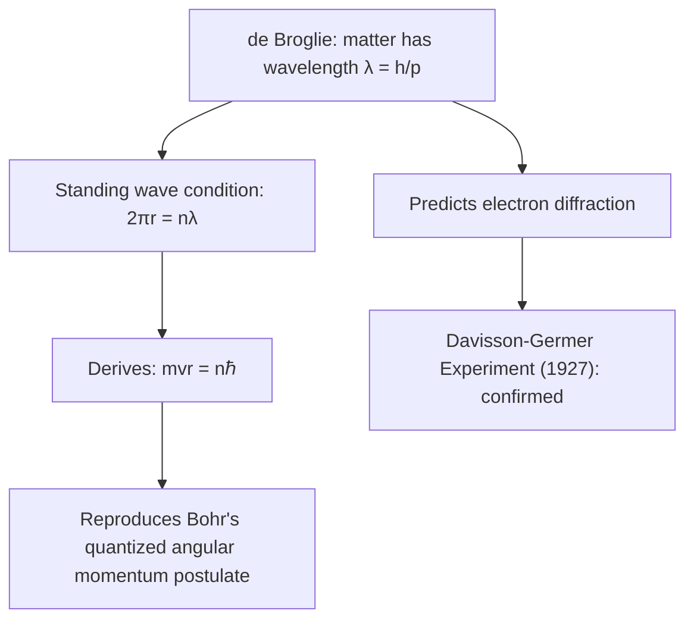

## The de Broglie Hypothesis

### Overview

The de Broglie hypothesis, proposed by Louis de Broglie in his 1924 doctoral thesis, postulates that all matter exhibits wave-like properties, with a wavelength inversely proportional to momentum. This extended the wave-particle duality already established for light to all massive particles, and directly motivated Schrödinger's development of wave mechanics the following year.

### Motivation and Conceptual Basis

**Key Points**

- By 1924, light had been shown to possess both wave properties (interference, diffraction) and particle properties (photoelectric effect, Compton scattering).
- De Broglie reasoned that nature should exhibit a fundamental symmetry: if light (traditionally a wave) has particle-like character, then matter (traditionally particles) should correspondingly possess wave-like character.
- This was a bold theoretical extrapolation with no direct experimental support at the time of proposal — Einstein championed the idea, which helped prompt subsequent experimental investigation.

### The de Broglie Relation

Building on the photon momentum relation $p = h/\lambda$ (itself derived from $E=pc$ and $E=h\nu$), de Broglie proposed the same relation holds universally for matter:

$$\lambda = \frac{h}{p}$$

For a non-relativistic particle of mass $m$ and speed $v$:

$$\lambda = \frac{h}{mv}$$

For the general (relativistic) case, using relativistic momentum $p=\gamma mv$:

$$\lambda = \frac{h}{\gamma m v}$$

**Key Points**

- $h$ is Planck's constant, $h \approx 6.626\times10^{-34}\text{ J·s}$ — the same fundamental constant appearing in blackbody radiation and the photoelectric effect.
- The de Broglie wavelength is often called the **matter wave** wavelength.
- An associated **de Broglie frequency** is also defined via $E = h\nu$, using the particle's total energy $E$.

### Relation to Kinetic Energy

For a non-relativistic particle with kinetic energy $K$:

$$p = \sqrt{2mK} \implies \lambda = \frac{h}{\sqrt{2mK}}$$

For a charged particle accelerated through potential difference $V$ (kinetic energy $K=qV$):

$$\lambda = \frac{h}{\sqrt{2mqV}}$$

**Key Points**

- This form is especially useful for electrons accelerated in laboratory apparatus (e.g., electron guns, microscopes), where accelerating voltage is the controlled experimental parameter.
- For relativistic particles (where $K$ is a significant fraction of rest energy $mc^2$), the more general relation $\lambda = hc/\sqrt{K^2+2Kmc^2}$ must be used instead.

### Why Macroscopic Objects Show No Observable Wave Behavior

**Example**

A $0.145\text{ kg}$ baseball moving at $40\text{ m/s}$:

$$\lambda = \frac{h}{mv} = \frac{6.626\times10^{-34}}{(0.145)(40)} \approx 1.14\times10^{-34}\text{ m}$$

**Output**

This wavelength is roughly 20 orders of magnitude smaller than a proton's diameter — utterly undetectable and physically irrelevant, explaining why macroscopic objects display no observable diffraction or interference and classical mechanics suffices.

**Key Points**

- Wave effects become significant only when the de Broglie wavelength is comparable to a relevant physical length scale (e.g., a crystal lattice spacing, a slit width).
- This is why matter-wave phenomena are prominent for electrons, neutrons, and atoms (small mass), but utterly negligible for everyday macroscopic objects (large mass).

### Bohr Model Justification: Standing Waves

De Broglie's own original motivation directly justified Bohr's previously ad hoc angular momentum quantization postulate. Requiring an integer number of de Broglie wavelengths to fit around a circular orbit (a standing-wave condition, avoiding destructive self-interference):

$$2\pi r_n = n\lambda = \frac{nh}{p} = \frac{nh}{mv}$$

Rearranging:

$$mvr_n = n\frac{h}{2\pi} = n\hbar$$

This exactly reproduces Bohr's quantization condition $L = n\hbar$, now derived from a physical wave picture rather than simply postulated.

### SVG Illustration: Standing Wave Around a Bohr Orbit

<svg xmlns="http://www.w3.org/2000/svg" viewBox="0 0 400 400">
<text x="200" y="25" text-anchor="middle" font-size="16" font-weight="bold">de Broglie Standing Wave (svg_diagram)</text>
<circle cx="200" cy="210" r="120" fill="none" stroke="gray" stroke-width="1" stroke-dasharray="3,3" />
<circle cx="200" cy="210" r="6" fill="orange" />
<text x="185" y="235" font-size="11">nucleus</text>
<path d="M 320,210 a 120,120 0 0,1 -84.8,84.8 a 120,120 0 0,1 -169.7,0 a 120,120 0 0,1 0,-169.7 a 120,120 0 0,1 169.7,0 a 120,120 0 0,1 84.8,84.8" fill="none" stroke="blue" stroke-width="2" />
<text x="140" y="380" font-size="12" fill="blue">n = 4 standing wave: integer wavelengths fit the circumference</text>
</svg>

### Experimental Confirmation

**Key Points**

- **Davisson-Germer experiment (1927)**: Electrons scattered from a nickel crystal surface produced a diffraction pattern with angles matching de Broglie's predicted wavelength for the electrons' known momentum — the first direct experimental confirmation.
- **G.P. Thomson's independent experiments (1927)**: Electron beams transmitted through thin polycrystalline metal foils produced diffraction rings analogous to X-ray diffraction (Debye-Scherrer patterns), further confirming matter-wave behavior. Thomson and Davisson shared the 1937 Nobel Prize in Physics for this work.
- Later experiments extended confirmation to neutrons, atoms, and increasingly large composite molecules, demonstrating that wave behavior is a general feature of matter rather than limited to electrons.

### Example Calculation: Electron Diffraction

An electron is accelerated through $V = 54\text{ V}$ (the classic Davisson-Germer voltage).

**Step 1 — Kinetic energy:**

$$K = eV = 54\text{ eV} = 8.65\times10^{-18}\text{ J}$$

**Step 2 — Momentum:**

$$p = \sqrt{2mK} = \sqrt{2(9.109\times10^{-31})(8.65\times10^{-18})} \approx 3.97\times10^{-24}\text{ kg·m/s}$$

**Step 3 — de Broglie wavelength:**

$$\lambda = \frac{h}{p} = \frac{6.626\times10^{-34}}{3.97\times10^{-24}} \approx 1.67\times10^{-10}\text{ m} \approx 0.167\text{ nm}$$

**Output**

This is close to interatomic spacings in nickel's crystal lattice, which is precisely why diffraction effects (analogous to X-ray crystallography) were observable in the original Davisson-Germer experiment.

### Matter Waves vs. Classical Waves

**Key Points**

- De Broglie's "matter wave" is not a physical oscillation of a medium (unlike sound or water waves) — it is formalized in quantum mechanics as the particle's quantum-mechanical wavefunction, whose squared magnitude gives position probability density (Born rule).
- De Broglie's own early picture treated the wave somewhat more literally as a "pilot wave" guiding the particle — a concept later developed into a full interpretation of quantum mechanics (de Broglie–Bohm pilot-wave theory), distinct from the mainstream Copenhagen interpretation.
- The de Broglie relation is a special case of the more general quantum mechanical relation between momentum and the wavefunction's spatial frequency, expressed rigorously via the momentum operator $\hat{p} = -i\hbar\partial/\partial x$.

### Common Misconceptions

**Key Points**

- The de Broglie wavelength does not mean a particle is physically spread out over that distance in the way a classical wave occupies space — it characterizes the particle's associated quantum wavefunction, whose interpretation is probabilistic.
- Wave behavior is not exclusive to "special" particles like electrons — in principle all matter has an associated de Broglie wavelength, but it is only observable when comparable to a relevant length scale in the experiment.
- The de Broglie hypothesis alone does not constitute a complete quantum theory; it was a crucial stepping stone toward Schrödinger's wave equation, which properly formalizes matter waves mathematically.

### Applications

- **Electron microscopy**: Transmission and scanning electron microscopes exploit short de Broglie wavelengths (far shorter than visible light) to achieve nanometer- and sub-nanometer-scale resolution.
- **Neutron diffraction**: Used in materials science and crystallography, complementary to X-ray diffraction, particularly sensitive to light elements and magnetic structure.
- **Atom interferometry**: High-precision measurement of gravitational acceleration, rotation, and fundamental constants using matter-wave interference of cold atoms.
- **Electron diffraction techniques (LEED, RHEED)**: Surface science tools for determining crystal surface structure.

### Related Topics

- Wave-Particle Duality
- The Bohr Model of the Atom
- The Davisson-Germer Experiment
- The Schrödinger Equation
- The Heisenberg Uncertainty Principle
- Electron Microscopy
- The de Broglie–Bohm Pilot-Wave Interpretation