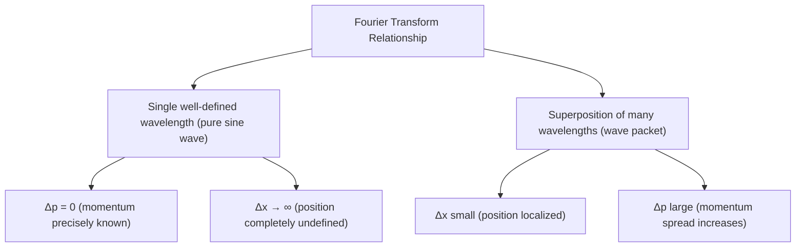

## The Heisenberg Uncertainty Principle

### Overview

The Heisenberg uncertainty principle, formulated by Werner Heisenberg in 1927, states that certain pairs of physical properties — most famously position and momentum — cannot both be known to arbitrary precision simultaneously. It is not a limitation of measurement technology but a fundamental structural feature of quantum mechanics, arising directly from the wave nature of matter.

### Statement of the Principle

For position ($x$) and momentum ($p$):

$$\Delta x \, \Delta p \geq \frac{\hbar}{2}$$

where $\Delta x$ and $\Delta p$ are the standard deviations of position and momentum measurements over an ensemble of identically prepared systems, and $\hbar = h/2\pi \approx 1.055\times10^{-34}\text{ J·s}$.

**Key Points**

- The inequality sets a fundamental lower bound on the *product* of uncertainties — reducing one increases the other.
- Some textbooks use $\Delta x\Delta p \geq \hbar/2$ (standard-deviation definition, most rigorous), while others use the looser heuristic $\Delta x\Delta p \gtrsim h$ for order-of-magnitude estimates — conventions vary by source.
- This is a statement about the intrinsic statistical spread in an ensemble of measurements on identically prepared states, not about disturbance from a single clumsy measurement (though early derivations, including Heisenberg's own microscope thought experiment, were framed that way).

### Other Conjugate Pairs

The uncertainty principle applies to any pair of **conjugate variables** — quantities related by Fourier transform in quantum mechanics:

| Conjugate Pair | Relation |
| --- | --- |
| Position — Momentum | $\Delta x\,\Delta p \geq \hbar/2$ |
| Energy — Time | $\Delta E\,\Delta t \geq \hbar/2$ |
| Angular position — Angular momentum | $\Delta\theta\,\Delta L \geq \hbar/2$ |

**Key Points**

- The energy-time relation is somewhat distinct in character from position-momentum, since time is not a quantum operator in standard non-relativistic quantum mechanics — it is often interpreted as relating the lifetime of a state to the uncertainty (natural linewidth) of its energy.
- [Unverified] The precise operational meaning of the energy-time uncertainty relation remains an area of some interpretational subtlety, distinct from the mathematically rigorous derivation available for position-momentum.

### Origin in Wave Mechanics

The uncertainty principle is not an independent postulate but a mathematical consequence of representing particles as waves (wavefunctions). A wavefunction with a well-defined wavelength (and thus well-defined momentum via $p=h/\lambda$) must, by the properties of Fourier analysis, be spread over an infinite extent in position.

**Key Points**

- A single sine wave (perfectly defined $\lambda$, hence perfectly defined $p$) extends infinitely in space — $\Delta x \to \infty$, $\Delta p = 0$.
- To localize a wave (reduce $\Delta x$), many different wavelengths (a range of momenta) must be superposed — a **wave packet** — increasing $\Delta p$.
- This is mathematically identical to the uncertainty relation between a signal's duration and its frequency bandwidth in classical Fourier analysis/signal processing — the same mathematics, applied to probability amplitudes rather than classical signals.

### SVG Illustration: Wave Packet Localization Trade-off

<svg xmlns="http://www.w3.org/2000/svg" viewBox="0 0 500 360">
<text x="250" y="25" text-anchor="middle" font-size="16" font-weight="bold">Position-Momentum Trade-off (svg_diagram)</text>
<text x="30" y="60" font-size="12">Δx large, Δp small:</text>
<path d="M 30,100 Q 55,70 80,100 T 130,100 T 180,100 T 230,100 T 280,100 T 330,100 T 380,100 T 430,100" fill="none" stroke="blue" stroke-width="2" />
<text x="30" y="180" font-size="12">Δx small, Δp large:</text>
<path d="M 200,220 Q 210,195 220,220 T 240,220" fill="none" stroke="red" stroke-width="1.5" />
<path d="M 220,220 Q 230,180 240,220 T 260,220" fill="none" stroke="red" stroke-width="1.5" />
<path d="M 240,220 Q 255,140 270,220 T 300,220" fill="none" stroke="red" stroke-width="2.5" />
<path d="M 270,220 Q 285,180 300,220 T 320,220" fill="none" stroke="red" stroke-width="1.5" />
<path d="M 300,220 Q 310,195 320,220 T 340,220" fill="none" stroke="red" stroke-width="1.5" />
<text x="150" y="290" font-size="11" fill="red">localized wave packet (sum of many wavelengths)</text>
</svg>

### Formal Derivation (Commutator Approach)

In modern quantum mechanics, position and momentum are represented by non-commuting operators:

$$[\hat{x},\hat{p}] = \hat{x}\hat{p} - \hat{p}\hat{x} = i\hbar$$

The general uncertainty relation for any two Hermitian operators $\hat{A}, \hat{B}$ is:

$$\Delta A \, \Delta B \geq \frac{1}{2}\left|\langle[\hat{A},\hat{B}]\rangle\right|$$

Substituting the position-momentum commutator directly yields:

$$\Delta x\,\Delta p \geq \frac{1}{2}|\langle i\hbar\rangle| = \frac{\hbar}{2}$$

**Key Points**

- This is the rigorous, general derivation (Robertson's inequality, 1929), showing the uncertainty principle follows necessarily from the algebraic structure (non-commutativity) of quantum operators.
- Any two observables whose operators do not commute are subject to an analogous uncertainty relation; commuting observables (e.g., $\hat{x}$ and $\hat{y}$ for a single particle) can, in principle, be simultaneously known with arbitrary precision.

### Heisenberg's Original Microscope Thought Experiment

Heisenberg's 1927 paper illustrated the principle using a thought experiment: attempting to observe an electron's position with a gamma-ray microscope necessarily involves scattering a photon off the electron, which imparts an uncontrollable momentum kick.

**Key Points**

- Higher-resolution position measurement requires shorter-wavelength (higher-momentum) photons, which disturb the electron's momentum more severely upon scattering — illustrating a trade-off.
- This "observer effect" framing is pedagogically useful but is now understood as a specific illustrative example rather than the fundamental origin of the principle — the uncertainty principle holds even for idealized, non-disturbing measurement schemes, since it originates from the wavefunction's intrinsic statistical properties, not merely measurement disturbance.

### Example Calculation

An electron is confined to a region of width $\Delta x = 1.0\times10^{-10}\text{ m}$ (roughly an atomic diameter).

**Step 1 — Minimum momentum uncertainty:**

$$\Delta p \geq \frac{\hbar}{2\Delta x} = \frac{1.055\times10^{-34}}{2(1.0\times10^{-10})} \approx 5.28\times10^{-25}\text{ kg·m/s}$$

**Step 2 — Corresponding minimum velocity uncertainty:**

$$\Delta v = \frac{\Delta p}{m_e} = \frac{5.28\times10^{-25}}{9.109\times10^{-31}} \approx 5.79\times10^{5}\text{ m/s}$$

**Output**

Confining an electron to atomic dimensions forces a minimum velocity uncertainty of order $10^5$–$10^6\text{ m/s}$ — a substantial fraction of typical atomic-scale electron velocities, illustrating why electrons cannot be treated as localized classical particles orbiting a nucleus on fixed trajectories (directly undermining the literal Bohr-orbit picture).

### Consequences and Physical Implications

**Key Points**

- **Zero-point energy**: A particle confined to a finite region cannot have exactly zero momentum (else $\Delta x\Delta p = 0$), implying a minimum, irreducible kinetic energy even at absolute zero temperature — directly responsible for phenomena like the finite ground-state energy of the quantum harmonic oscillator ($E_0 = \frac{1}{2}\hbar\omega$).
- **Atomic stability**: Explains why electrons don't collapse into the nucleus classically — extreme localization near the nucleus would require enormous momentum uncertainty (and thus kinetic energy), which is energetically unfavorable.
- **Virtual particles and vacuum fluctuations**: The energy-time uncertainty relation is often invoked (with some interpretational caveats) to motivate the existence of short-lived virtual particle-antiparticle pairs in quantum field theory.
- **Natural linewidth**: Excited atomic states with finite lifetime $\Delta t$ have an inherent minimum energy uncertainty $\Delta E \geq \hbar/(2\Delta t)$, observed as spectral line broadening.

### Common Misconceptions

**Key Points**

- The uncertainty principle is not primarily about measurement disturbance or technological limitation — even a perfect, idealized measurement apparatus cannot circumvent it, since the uncertainty is a property of the quantum state itself.
- It does not imply that particles secretly *have* precise simultaneous position and momentum values that are merely unknown to us (a "hidden variable" reading) — in the standard (Copenhagen) interpretation, a particle in a state with definite momentum genuinely has no well-defined position, not merely an unmeasured one. [Inference] This interpretive claim is tied to the standard interpretation; alternative interpretations, such as de Broglie–Bohm pilot-wave theory, treat definite particle trajectories as ontologically real while reproducing identical measurement statistics, so how literally to read the principle remains an active topic in the foundations of quantum mechanics.
- The principle applies to the *statistical spread* over repeated measurements on identically prepared systems, not necessarily to the precision achievable in a single measurement of one variable alone (a single position measurement can in principle be made very precise; the constraint is on the joint/statistical uncertainty structure of the underlying state).

### Applications

- **Scanning tunneling microscopy and quantum tunneling**: Understanding barrier penetration relies on the same wave-mechanical foundations underlying the uncertainty principle.
- **Laser physics and spectroscopy**: Natural linewidth and frequency stability calculations directly use energy-time uncertainty.
- **Quantum cryptography**: Security proofs for protocols like BB84 rely fundamentally on the impossibility of simultaneously measuring conjugate quantum properties without disturbance.
- **Semiconductor and nanostructure physics**: Quantum confinement effects in quantum dots/wells are direct consequences of position-momentum uncertainty.

### Related Topics

- Wave-Particle Duality and Matter Waves
- The Schrödinger Equation and Wavefunctions
- Commutators and Operators in Quantum Mechanics
- The Quantum Harmonic Oscillator and Zero-Point Energy
- Quantum Tunneling
- Interpretations of Quantum Mechanics
- Natural Linewidth and Spectral Broadening