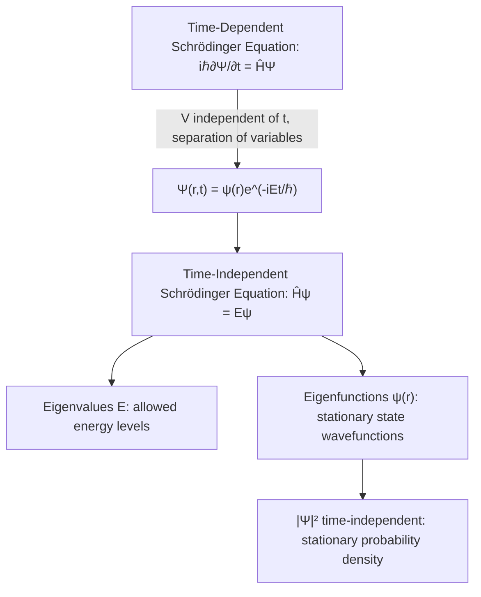

## The Schrödinger Equation

### Overview

The Schrödinger equation, formulated by Erwin Schrödinger in 1925-1926, is the central dynamical equation of non-relativistic quantum mechanics, governing how a quantum system's wavefunction evolves in time. It plays a role analogous to Newton's second law in classical mechanics, but describes the evolution of probability amplitudes rather than deterministic particle trajectories.

### The Wavefunction

The state of a quantum system is described by a complex-valued **wavefunction** $\Psi(\mathbf{r},t)$, containing all physically accessible information about the system.

**Key Points**

- The **Born rule** interprets $|\Psi(\mathbf{r},t)|^2$ as a probability density: the probability of finding the particle in volume element $d^3r$ around position $\mathbf{r}$ at time $t$ is $|\Psi(\mathbf{r},t)|^2 d^3r$.
- Normalization requires $\int|\Psi|^2 d^3r = 1$ (total probability of finding the particle somewhere is 1).
- The wavefunction itself is not directly observable — only quantities derived from it (probabilities, expectation values) connect to measurement.

### The Time-Dependent Schrödinger Equation

The fundamental equation governing wavefunction evolution:

$$i\hbar\frac{\partial \Psi(\mathbf{r},t)}{\partial t} = \hat{H}\Psi(\mathbf{r},t)$$

where $\hat{H}$ is the **Hamiltonian operator**, representing total energy. For a single particle in a potential $V(\mathbf{r},t)$:

$$\hat{H} = -\frac{\hbar^2}{2m}\nabla^2 + V(\mathbf{r},t)$$

giving the explicit form:

$$i\hbar\frac{\partial \Psi}{\partial t} = -\frac{\hbar^2}{2m}\nabla^2\Psi + V(\mathbf{r},t)\Psi$$

**Key Points**

- $-\frac{\hbar^2}{2m}\nabla^2$ is the kinetic energy operator, derived by promoting classical momentum to the operator $\hat{p} = -i\hbar\nabla$ and using $KE = p^2/2m$.
- $V(\mathbf{r},t)\Psi$ represents potential energy, generally acting as simple multiplication in the position representation.
- The equation is first-order in time (unlike Newton's second law, which is second-order), meaning the initial wavefunction $\Psi(\mathbf{r},0)$ fully determines all future evolution — a deterministic evolution of the *wavefunction*, even though measurement outcomes remain probabilistic.

### The Time-Independent Schrödinger Equation

When the potential $V(\mathbf{r})$ does not depend explicitly on time, solutions can be found via separation of variables: $\Psi(\mathbf{r},t) = \psi(\mathbf{r})e^{-iEt/\hbar}$, leading to:

$$\hat{H}\psi(\mathbf{r}) = E\psi(\mathbf{r})$$

or explicitly:

$$-\frac{\hbar^2}{2m}\nabla^2\psi(\mathbf{r}) + V(\mathbf{r})\psi(\mathbf{r}) = E\psi(\mathbf{r})$$

**Key Points**

- This is an **eigenvalue equation**: solving it yields allowed energy eigenvalues $E$ and corresponding spatial wavefunctions (eigenstates) $\psi(\mathbf{r})$.
- States satisfying this equation are called **stationary states** — their probability density $|\Psi|^2$ does not change in time, even though the wavefunction itself acquires a time-dependent phase factor.
- Solving this equation for a given potential is the central task in most introductory quantum mechanics problems (particle in a box, harmonic oscillator, hydrogen atom, etc.).

### Boundary Conditions and Well-Behaved Wavefunctions

Physically acceptable solutions $\psi(\mathbf{r})$ must satisfy:

**Key Points**

- **Single-valued**: one value of $\psi$ at each point in space.
- **Continuous**: no abrupt jumps (generally $\psi$ and $d\psi/dx$ must be continuous, except at points of infinite potential).
- **Finite/normalizable**: $\psi \to 0$ sufficiently fast at infinity so that $\int|\psi|^2 d^3r$ converges to a finite value.
- These boundary conditions, combined with the differential equation, are precisely what force energy quantization in bound systems — only specific discrete values of $E$ yield solutions satisfying all these constraints simultaneously.

### Solved Example: Infinite Square Well (Particle in a Box)

For a particle confined to $0 < x < L$ with $V=0$ inside and $V=\infty$ outside, boundary conditions require $\psi(0)=\psi(L)=0$.

**Solution:**

$$\psi_n(x) = \sqrt{\frac{2}{L}}\sin\left(\frac{n\pi x}{L}\right), \quad n=1,2,3,\ldots$$

$$E_n = \frac{n^2\pi^2\hbar^2}{2mL^2} = \frac{n^2h^2}{8mL^2}$$

**Example**

For an electron confined to $L = 1.0\text{ nm}$ ($n=1$):

$$E_1 = \frac{(1)^2(6.626\times10^{-34})^2}{8(9.109\times10^{-31})(1.0\times10^{-9})^2} \approx 6.02\times10^{-20}\text{ J} \approx 0.376\text{ eV}$$

**Output**

Energy levels scale as $n^2/L^2$ — smaller confinement regions or lighter particles produce widely spaced, more clearly quantized energy levels, directly relevant to quantum dot and nanostructure design.

### SVG Illustration: Particle-in-a-Box Wavefunctions

<svg xmlns="http://www.w3.org/2000/svg" viewBox="0 0 480 360">
<text x="240" y="25" text-anchor="middle" font-size="16" font-weight="bold">Infinite Square Well States (svg_diagram)</text>
<line x1="80" y1="60" x2="80" y2="320" stroke="black" stroke-width="2" />
<line x1="400" y1="60" x2="400" y2="320" stroke="black" stroke-width="2" />
<line x1="80" y1="320" x2="400" y2="320" stroke="black" stroke-width="1" stroke-dasharray="3,3" />
<text x="60" y="335" font-size="12">0</text>
<text x="395" y="335" font-size="12">L</text>
<path d="M 80,260 Q 240,180 400,260" fill="none" stroke="blue" stroke-width="2" />
<text x="405" y="255" font-size="11" fill="blue">n=1</text>
<path d="M 80,190 Q 160,140 240,190 T 400,190" fill="none" stroke="green" stroke-width="2" />
<text x="405" y="185" font-size="11" fill="green">n=2</text>
<path d="M 80,120 Q 130,80 180,120 T 280,120 T 380,120" fill="none" stroke="red" stroke-width="2" />
<text x="405" y="115" font-size="11" fill="red">n=3</text>
</svg>

### Other Canonical Solvable Systems

| System | Key Feature |
| --- | --- |
| Infinite square well | Discrete energies $E_n \propto n^2$; sine wavefunctions |
| Finite square well | Wavefunction penetrates into classically forbidden region (evanescent tails) |
| Quantum harmonic oscillator | Evenly spaced levels $E_n = (n+\tfrac{1}{2})\hbar\omega$; Hermite polynomial eigenfunctions; nonzero zero-point energy |
| Hydrogen atom | 3D Coulomb potential; quantized energies $E_n=-13.6\text{eV}/n^2$ matching Bohr model; introduces orbital angular momentum quantum numbers $\ell, m$ |
| Quantum tunneling (finite barrier) | Nonzero transmission probability through classically forbidden regions |

### Expectation Values and Operators

Physical observables correspond to Hermitian operators; the expectation value of observable $A$ in state $\Psi$ is:

$$\langle A \rangle = \int \Psi^* \hat{A} \Psi \, d^3r$$

**Key Points**

- Position operator: $\hat{x} = x$ (multiplication).
- Momentum operator: $\hat{p} = -i\hbar\nabla$ (differentiation).
- The non-commutativity of $\hat{x}$ and $\hat{p}$ ($[\hat{x},\hat{p}]=i\hbar$) is the formal origin of the Heisenberg uncertainty principle.
- Time evolution of expectation values connects to classical equations of motion via **Ehrenfest's theorem**, providing the correspondence-principle link between quantum and classical mechanics.

### Superposition and Time Evolution

**Key Points**

- Any general (non-stationary) state can be expanded as a superposition of energy eigenstates: $\Psi(\mathbf{r},t) = \sum_n c_n\psi_n(\mathbf{r})e^{-iE_nt/\hbar}$.
- Because each term evolves with a different phase factor, superpositions of different energy eigenstates produce time-dependent probability densities $|\Psi|^2$ — physically observable oscillatory behavior, unlike single stationary states.
- The coefficients $|c_n|^2$ give the probability of measuring energy $E_n$ upon a projective energy measurement, consistent with the Born rule.

### Historical Note: Schrödinger's Motivation

Schrödinger developed the wave equation directly building on de Broglie's matter-wave hypothesis, seeking a wave equation whose solutions would reproduce the known quantized energy levels of the hydrogen atom (matching Bohr's results) from a more fundamental wave-mechanical starting point, rather than Bohr's ad hoc postulates.

**Key Points**

- Schrödinger's wave mechanics and Heisenberg's independently developed matrix mechanics (1925) were shown by Schrödinger himself to be mathematically equivalent formulations of the same underlying quantum theory.
- Schrödinger shared the 1933 Nobel Prize in Physics with Paul Dirac for this foundational contribution.

### Common Misconceptions

**Key Points**

- The Schrödinger equation is inherently non-relativistic; it does not incorporate special relativity or predict electron spin — these require the relativistic Dirac equation.
- "Solving" the Schrödinger equation does not yield a particle's trajectory — it yields a wavefunction whose squared magnitude gives probability distributions; individual measurement outcomes remain fundamentally probabilistic under the standard interpretation.
- The equation itself evolves deterministically; the apparent "randomness" of quantum mechanics arises specifically at the point of measurement (wavefunction collapse in the standard/Copenhagen framework), a separate and more interpretively contentious aspect of the theory.

### Applications

- **Atomic and molecular physics**: Predicting electron orbital structure, chemical bonding, and spectroscopic properties.
- **Semiconductor physics**: Band structure calculations, quantum well and quantum dot device design.
- **Quantum chemistry**: Computational methods (Hartree-Fock, DFT) are built on approximate solutions to many-electron Schrödinger-type equations.
- **Quantum tunneling devices**: Tunnel diodes, scanning tunneling microscopy, and nuclear alpha decay models.
- **Quantum computing**: Time evolution of qubit states under controlled Hamiltonians is governed directly by the Schrödinger equation.

### Related Topics

- The Heisenberg Uncertainty Principle
- The Quantum Harmonic Oscillator
- The Hydrogen Atom: Full Quantum Treatment
- Quantum Tunneling
- Operators, Eigenvalues, and Eigenfunctions in Quantum Mechanics
- The Born Rule and Measurement Postulate
- Matrix Mechanics and the Equivalence of Quantum Formulations