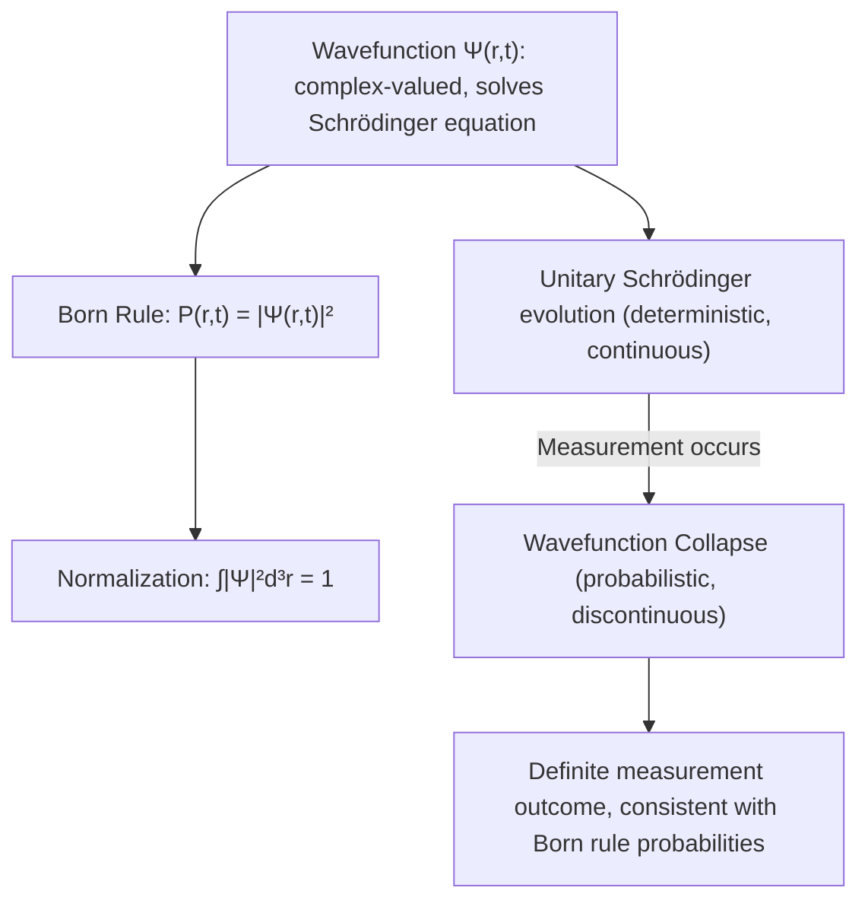

## Wavefunctions and Probability Interpretation

### Overview

The wavefunction $\Psi$ is the fundamental mathematical object encoding all physically accessible information about a quantum system, and the Born probability interpretation is the rule connecting this abstract mathematical object to actual, measurable experimental outcomes. Together they form the interpretive core distinguishing quantum mechanics from classical physics.

### Defining the Wavefunction

**Key Points**

- The wavefunction $\Psi(\mathbf{r},t)$ is, in general, a complex-valued function of position and time (or more abstractly, an element of a Hilbert space).
- It is obtained as a solution to the Schrödinger equation for a given physical system and set of boundary/initial conditions.
- Unlike classical fields (e.g., the electromagnetic field), the wavefunction is not directly measurable — no experiment measures $\Psi$ itself, only quantities derived from it.

### The Born Rule

Proposed by Max Born in 1926, the **Born rule** states that the probability density for finding a particle at position $\mathbf{r}$ at time $t$ is given by the squared modulus of the wavefunction:

$$P(\mathbf{r},t) = |\Psi(\mathbf{r},t)|^2 = \Psi^*(\mathbf{r},t)\Psi(\mathbf{r},t)$$

The probability of finding the particle within a small volume $d^3r$ around $\mathbf{r}$ is:

$$dP = |\Psi(\mathbf{r},t)|^2 \, d^3r$$

**Key Points**

- Because $\Psi$ is generally complex, $|\Psi|^2$ (always real and non-negative) is required to yield a physically sensible probability density.
- Born originally proposed this interpretation somewhat tentatively; it was rapidly adopted as the standard interpretive link between the mathematics of quantum theory and experimental prediction, and Born received the 1954 Nobel Prize in Physics largely for this contribution.
- The Born rule is a *postulate* of quantum mechanics — it is not derived from the Schrödinger equation itself, but added as a separate interpretive rule connecting the formalism to measurement.

### Normalization

For $|\Psi|^2$ to represent a valid probability density, the total probability of finding the particle *somewhere* in space must equal 1:

$$\int_{-\infty}^{\infty}|\Psi(\mathbf{r},t)|^2 \, d^3r = 1$$

A wavefunction satisfying this condition is called **normalized**.

**Key Points**

- If a solution to the Schrödinger equation is not normalized, it can typically be normalized by multiplying by an appropriate constant, provided the integral $\int|\Psi|^2 d^3r$ is finite (i.e., the function is "square-integrable").
- Normalization, once established at $t=0$, is preserved for all subsequent times under Schrödinger evolution — a consequence of the Hamiltonian being Hermitian, which guarantees probability conservation.
- States that cannot be normalized in this way (e.g., idealized plane waves representing perfectly definite momentum) are mathematical idealizations, not physically realizable states, though they remain extremely useful as calculational tools.

### Example: Normalizing a Wavefunction

Consider an unnormalized wavefunction for a particle in an infinite square well of width $L$: $\psi(x) = A\sin(\pi x/L)$ for $0<x<L$.

**Step 1 — Apply normalization condition:**

$$\int_0^L |A|^2\sin^2(\pi x/L)\,dx = 1$$

**Step 2 — Evaluate the integral:**

$$|A|^2 \cdot \frac{L}{2} = 1 \implies |A|^2 = \frac{2}{L} \implies A = \sqrt{\frac{2}{L}}$$

**Output**

The normalized wavefunction is $\psi(x) = \sqrt{2/L}\sin(\pi x/L)$, matching the ground state of the infinite square well and confirming that $\int_0^L|\psi(x)|^2dx=1$ exactly.

### Probability Current and Continuity

The time-evolution of probability density satisfies a continuity equation, ensuring probability is conserved locally (not just globally):

$$\frac{\partial P}{\partial t} + \nabla \cdot \mathbf{j} = 0$$

where the **probability current** is:

$$\mathbf{j} = \frac{\hbar}{2mi}\left(\Psi^*\nabla\Psi - \Psi\nabla\Psi^*\right)$$

**Key Points**

- This equation has the identical mathematical structure to charge/mass conservation continuity equations in classical physics, reflecting that probability behaves as a locally conserved quantity — it does not disappear from one region and instantaneously reappear elsewhere.
- The probability current is essential for computing tunneling transmission/reflection coefficients in barrier-penetration problems.

### Expectation Values

Given a normalized wavefunction, the expectation value (statistical mean over many identical measurements) of an observable represented by operator $\hat{A}$ is:

$$\langle A \rangle = \int \Psi^*\hat{A}\Psi \, d^3r$$

**Key Points**

- Position expectation value: $\langle x \rangle = \int \Psi^* x \, \Psi \, dx$.
- Momentum expectation value: $\langle p \rangle = \int \Psi^*(-i\hbar\partial/\partial x)\Psi \, dx$.
- The **standard deviation** (uncertainty) $\Delta A = \sqrt{\langle A^2\rangle - \langle A\rangle^2}$ quantifies the statistical spread — directly the quantity appearing in the Heisenberg uncertainty relation.

### Wavefunction Collapse

Upon measurement of an observable, the wavefunction is postulated to "collapse" to an eigenstate of the measured operator, with outcome probabilities given by the Born rule applied to the expansion coefficients in that operator's eigenbasis.

**Key Points**

- Before measurement, a system may exist in a superposition of multiple eigenstates; after measurement, subsequent measurements of the same observable (absent further evolution) reproducibly yield the same result — consistent with the system having "collapsed" into a definite eigenstate.
- Collapse is discontinuous and non-unitary, in contrast to the smooth, deterministic, unitary evolution governed by the Schrödinger equation between measurements — this discontinuity is a central conceptual puzzle in quantum foundations, often called the **measurement problem**.
- [Inference] Whether wavefunction collapse represents a genuine physical process, an update of the observer's information, or an artifact of an incomplete theoretical description remains actively debated among physicists and philosophers of physics, with different interpretations (Copenhagen, many-worlds, objective collapse models, pilot-wave theory) offering differing accounts.

### SVG Illustration: Probability Density from a Wavefunction

<svg xmlns="http://www.w3.org/2000/svg" viewBox="0 0 480 320">
<text x="240" y="25" text-anchor="middle" font-size="16" font-weight="bold">Wavefunction to Probability Density (svg_diagram)</text>
<line x1="60" y1="120" x2="420" y2="120" stroke="gray" stroke-width="1" stroke-dasharray="2,2" />
<path d="M 60,120 Q 130,60 200,120 T 340,120 T 420,120" fill="none" stroke="blue" stroke-width="2" />
<text x="55" y="60" font-size="12" fill="blue">Ψ(x) — wavefunction (can be negative/complex)</text>
<line x1="60" y1="280" x2="420" y2="280" stroke="black" stroke-width="1" />
<path d="M 60,280 Q 130,190 200,280 T 340,190 T 420,280" fill="none" stroke="red" stroke-width="2" />
<path d="M 60,280 Q 130,190 200,280 T 340,190 T 420,280 L 420,280 Z" fill="red" fill-opacity="0.15" stroke="none" />
<text x="55" y="310" font-size="12" fill="red">|Ψ(x)|² — probability density (always ≥ 0)</text>
</svg>

### Complex Numbers and Physical Reality

**Key Points**

- The wavefunction's complex nature is essential, not merely a calculational convenience — it allows for interference effects (via relative phase) that a purely real-valued description cannot capture.
- Global phase (multiplying the entire wavefunction by $e^{i\theta}$) has no physical/observable consequence, since $|\Psi|^2$ is unchanged.
- Relative phase between components of a superposition, however, is physically significant and directly responsible for interference phenomena (e.g., double-slit interference patterns).

### Position vs. Momentum Space Representations

**Key Points**

- The same quantum state can be represented equivalently as a position-space wavefunction $\Psi(x)$ or a momentum-space wavefunction $\Phi(p)$, related by Fourier transform.
- $|\Phi(p)|^2$ gives the probability density for measuring momentum $p$, exactly analogous to $|\Psi(x)|^2$ for position.
- This Fourier-transform relationship between the two representations is the precise mathematical origin of the position-momentum Heisenberg uncertainty relation.

### Common Misconceptions

**Key Points**

- $\Psi$ itself is not a physical, directly observable wave analogous to a sound or water wave — only $|\Psi|^2$ connects to measurable probabilities, and even then only statistically, across many repeated trials on identically prepared systems.
- A negative or complex value of $\Psi$ at some point does not indicate "negative probability" — probability density is always $|\Psi|^2 \geq 0$; the sign/phase of $\Psi$ itself carries interference information rather than probability information directly.
- Normalization is a mathematical requirement for consistent probabilistic interpretation, not an arbitrary convention — an unnormalized wavefunction simply has not yet been scaled to represent a valid probability distribution.

### Applications

- **Quantum chemistry**: Electron probability densities (orbitals) directly determine molecular geometry, bonding, and reactivity predictions.
- **Quantum computing**: Qubit state probabilities and interference of amplitudes are direct applications of the Born rule and superposition.
- **Scanning tunneling microscopy**: Interpreting tunneling current relies on probability density calculations in classically forbidden regions.
- **Spectroscopy**: Transition probabilities between quantum states (selection rules) are computed via overlap integrals of wavefunctions.

### Related Topics

- The Schrödinger Equation
- The Heisenberg Uncertainty Principle
- Wave-Particle Duality
- Quantum Superposition and the Measurement Problem
- Operators, Eigenstates, and Eigenvalues
- Interpretations of Quantum Mechanics
- Quantum Tunneling and Probability Current