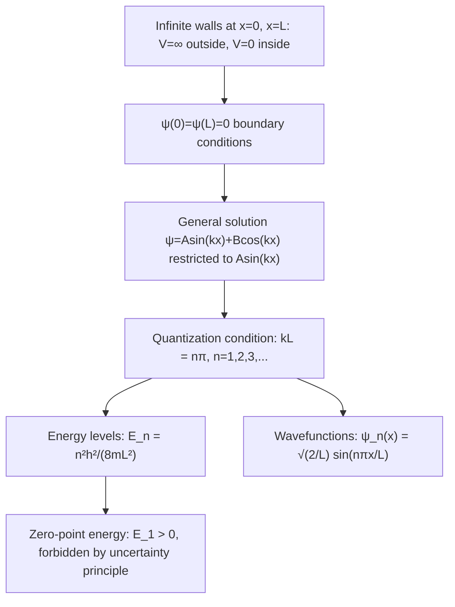

## The Particle in a Box

### Overview

The particle in a box (infinite square well) is the simplest non-trivial exactly-solvable problem in quantum mechanics, describing a particle confined to a finite region by infinitely high potential walls. It serves as the canonical pedagogical introduction to quantization arising directly from boundary conditions, and provides a foundational model for confined quantum systems throughout physics and chemistry.

### Setup and Potential

A particle of mass $m$ is confined to move in one dimension within $0 \leq x \leq L$, subject to the potential:

$$V(x) = \begin{cases} 0 & 0 < x < L \\ \infty & x \leq 0 \text{ or } x \geq L \end{cases}$$

**Key Points**

- The infinite potential outside the well represents impenetrable walls — the particle has exactly zero probability of being found outside $[0,L]$.
- Inside the well, the particle is completely free (no forces act on it), so the time-independent Schrödinger equation reduces to the free-particle form.
- This idealized model is also referred to as the **infinite square well** or **infinite potential well**.

### Solving the Time-Independent Schrödinger Equation

Inside the well ($V=0$), the time-independent Schrödinger equation becomes:

$$-\frac{\hbar^2}{2m}\frac{d^2\psi}{dx^2} = E\psi \implies \frac{d^2\psi}{dx^2} = -k^2\psi, \quad k^2 = \frac{2mE}{\hbar^2}$$

The general solution is:

$$\psi(x) = A\sin(kx) + B\cos(kx)$$

**Boundary conditions** (wavefunction must vanish where $V=\infty$, by continuity):

$$\psi(0) = 0 \implies B = 0$$

$$\psi(L) = 0 \implies A\sin(kL) = 0 \implies kL = n\pi, \quad n=1,2,3,\ldots$$

**Key Points**

- $n=0$ is excluded: it would give $\psi(x)=0$ everywhere, representing no particle at all (not a valid normalizable state).
- Negative integers $n$ give physically identical states to their positive counterparts (differing only by an overall sign, which has no physical consequence), so only positive integers are counted as distinct states.
- The boundary conditions alone — a purely geometric/topological constraint — are what force energy quantization, without any additional postulate.

### Quantized Energy Levels

From $k = n\pi/L$ and $k^2 = 2mE/\hbar^2$:

$$E_n = \frac{n^2\pi^2\hbar^2}{2mL^2} = \frac{n^2h^2}{8mL^2}, \quad n=1,2,3,\ldots$$

**Key Points**

- Energy is quantized: only discrete values $E_1, E_2, E_3,\ldots$ are allowed, in sharp contrast to the classical particle in a box, which can have any energy (including zero).
- Energy levels scale as $n^2$ — spacing between adjacent levels *increases* with $n$ (unlike, for example, the evenly-spaced harmonic oscillator).
- Energy scales as $1/L^2$: tighter confinement produces larger, more widely spaced energy levels — a direct manifestation of the Heisenberg uncertainty principle (smaller $\Delta x$ forces larger $\Delta p$, hence larger kinetic energy).
- The ground state energy $E_1 = \pi^2\hbar^2/2mL^2$ is strictly greater than zero — this irreducible minimum energy is the **zero-point energy**, forbidden from vanishing by the uncertainty principle (a stationary, zero-energy particle would have simultaneously exact position within $[0,L]$ and exact momentum $p=0$).

### Normalized Wavefunctions

$$\psi_n(x) = \sqrt{\frac{2}{L}}\sin\left(\frac{n\pi x}{L}\right), \quad 0 \leq x \leq L$$

(and $\psi_n(x)=0$ outside the well)

**Key Points**

- The normalization constant $\sqrt{2/L}$ ensures $\int_0^L|\psi_n(x)|^2dx = 1$.
- $\psi_n$ has $n-1$ interior nodes (points where $\psi=0$, excluding the boundaries) — the number of nodes increases with energy, a general feature of bound-state wavefunctions in one dimension.
- Eigenfunctions for different $n$ are mutually orthogonal: $\int_0^L\psi_n^*(x)\psi_m(x)\,dx = 0$ for $n\neq m$, a general property of eigenfunctions of a Hermitian operator (the Hamiltonian) belonging to distinct eigenvalues.

### SVG Illustration: First Three Energy Levels and Wavefunctions

<svg xmlns="http://www.w3.org/2000/svg" viewBox="0 0 500 380">
<text x="250" y="25" text-anchor="middle" font-size="16" font-weight="bold">Particle in a Box: n=1,2,3 (svg_diagram)</text>
<line x1="90" y1="60" x2="90" y2="340" stroke="black" stroke-width="3" />
<line x1="420" y1="60" x2="420" y2="340" stroke="black" stroke-width="3" />
<text x="70" y="360" font-size="12">x=0</text>
<text x="405" y="360" font-size="12">x=L</text>
<line x1="90" y1="300" x2="420" y2="300" stroke="gray" stroke-width="1" stroke-dasharray="3,3" />
<text x="30" y="305" font-size="11">E₁</text>
<path d="M 90,300 Q 255,250 420,300" fill="none" stroke="blue" stroke-width="2" />
<line x1="90" y1="220" x2="420" y2="220" stroke="gray" stroke-width="1" stroke-dasharray="3,3" />
<text x="30" y="225" font-size="11">E₂</text>
<path d="M 90,220 Q 170,170 255,220 T 420,220" fill="none" stroke="green" stroke-width="2" />
<line x1="90" y1="120" x2="420" y2="120" stroke="gray" stroke-width="1" stroke-dasharray="3,3" />
<text x="30" y="125" font-size="11">E₃</text>
<path d="M 90,120 Q 130,75 170,120 T 255,120 T 340,120 T 420,120" fill="none" stroke="red" stroke-width="2" />
</svg>

### Example Calculation

An electron is confined to a 1D box of width $L = 0.5\text{ nm}$ (roughly a small molecule's scale).

**Step 1 — Ground state energy:**

$$E_1 = \frac{h^2}{8mL^2} = \frac{(6.626\times10^{-34})^2}{8(9.109\times10^{-31})(0.5\times10^{-9})^2}$$

$$E_1 \approx 2.41\times10^{-19}\text{ J} \approx 1.51\text{ eV}$$

**Step 2 — First excited state ($n=2$) energy:**

$$E_2 = 4E_1 \approx 6.02\text{ eV}$$

**Step 3 — Transition energy and wavelength:**

$$\Delta E = E_2 - E_1 = 3E_1 \approx 4.52\text{ eV}$$

$$\lambda = \frac{hc}{\Delta E} = \frac{1240\text{ eV·nm}}{4.52\text{ eV}} \approx 274\text{ nm}$$

**Output**

This transition falls in the near-ultraviolet range, illustrating how box confinement at molecular length scales produces optical transitions directly relevant to real conjugated-molecule spectroscopy.

### Extensions: Finite Square Well

**Key Points**

- Replacing infinite walls with a finite potential height $V_0$ allows the wavefunction to penetrate into the classically forbidden region outside the well (exponentially decaying "evanescent tails"), rather than vanishing sharply at the boundary.
- A finite well supports only a limited number of bound states (fewer than the infinite well, which supports infinitely many), and may support zero bound states if $V_0$ and $L$ are both sufficiently small.
- Matching wavefunction and derivative continuity at the boundaries (rather than the simple $\psi=0$ condition) leads to transcendental equations for allowed energies, generally requiring numerical or graphical solution.

### Extensions: 2D and 3D Boxes

For a particle in a rectangular 3D box ($0<x<L_x$, $0<y<L_y$, $0<z<L_z$), the Schrödinger equation separates, giving:

$$E_{n_x,n_y,n_z} = \frac{h^2}{8m}\left(\frac{n_x^2}{L_x^2}+\frac{n_y^2}{L_y^2}+\frac{n_z^2}{L_z^2}\right)$$

**Key Points**

- Each spatial dimension contributes an independent quantum number.
- For a cubic box ($L_x=L_y=L_z=L$), different combinations of $(n_x,n_y,n_z)$ can give the same total energy — this is called **degeneracy**, an important concept in atomic and molecular physics and statistical mechanics.

### Correspondence Principle Check

**Key Points**

- As $n\to\infty$, the probability density $|\psi_n(x)|^2$ oscillates increasingly rapidly, and its spatial average over any small region approaches the uniform classical probability distribution $1/L$ expected for a classical particle bouncing between the walls — an explicit illustration of Bohr's correspondence principle.
- The relative spacing between adjacent energy levels, $(E_{n+1}-E_n)/E_n \approx 2/n$, shrinks as $n$ grows, so the discrete quantum spectrum becomes increasingly indistinguishable from the classical continuum at high energy.

### Common Misconceptions

**Key Points**

- The "walls" of the box are an idealization (infinite potential); no real physical potential is truly infinite, but the model is an excellent approximation whenever confining energies are much larger than the energies of interest.
- The particle does not sit motionless in the ground state — $E_1>0$ specifically reflects nonzero kinetic energy (zero-point energy), consistent with the uncertainty principle; there is no state of exactly zero energy for a confined particle.
- Increasing $n$ does not mean the particle "moves faster" in a simple classical sense throughout the box — position probability is distributed according to $|\psi_n(x)|^2$, with a spatially varying pattern of nodes and antinodes rather than uniform classical motion at low $n$.

### Applications

- **Quantum dots and nanostructures**: Semiconductor quantum dots are physically realized "particles in a box" (in 3D), with tunable optical properties based on confinement size — a direct engineering application of $E_n \propto 1/L^2$.
- **Conjugated molecule spectroscopy**: The free-electron model treats delocalized $\pi$-electrons in conjugated polyene chains approximately as particles in a 1D box, providing reasonable estimates of absorption wavelengths.
- **Nuclear physics**: Simplified nucleon-confinement models use box-like potentials as first approximations.
- **Pedagogical foundation**: Serves as the simplest worked example before introducing the finite well, harmonic oscillator, and hydrogen atom.

### Related Topics

- The Schrödinger Equation
- The Quantum Harmonic Oscillator
- The Finite Square Well and Quantum Tunneling
- The Heisenberg Uncertainty Principle
- Quantum Dots and Nanostructure Physics
- Degeneracy and Quantum Numbers
- The Correspondence Principle