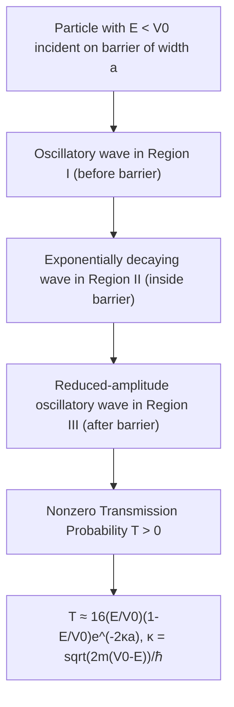

## Quantum Tunneling

### Overview

Quantum tunneling is the phenomenon whereby a particle penetrates and passes through a potential energy barrier even when its energy is less than the barrier height — a process strictly forbidden by classical mechanics. It arises directly from the wave nature of matter and the requirement that wavefunctions remain continuous, and underlies a wide range of physical processes from nuclear decay to modern electronic devices.

### Classical vs. Quantum Barrier Behavior

**Key Points**

- Classically, a particle with total energy $E$ less than a potential barrier height $V_0$ cannot exist inside or beyond the barrier — it simply reflects back with 100% certainty (like a ball rolling toward a hill too tall to climb).
- Quantum mechanically, the wavefunction does not abruptly terminate at the barrier edge; it decays exponentially inside the classically forbidden region and, for a barrier of finite width, retains nonzero amplitude on the far side — implying a nonzero probability of the particle being detected beyond the barrier.
- This is a direct manifestation of the fact that quantum particles obey the Schrödinger equation everywhere, with no special classical prohibition against nonzero wavefunction amplitude in regions where $E<V(x)$.

### Setting Up the Problem: Rectangular Barrier

Consider a particle of energy $E$ incident on a rectangular potential barrier of height $V_0 > E$ and width $a$, located at $0 \leq x \leq a$:

$$V(x) = \begin{cases} 0 & x<0 \\ V_0 & 0\leq x \leq a \\ 0 & x>a \end{cases}$$

**Key Points**

- **Region I** ($x<0$): free particle, oscillatory wavefunction (incident + reflected wave).
- **Region II** ($0\leq x\leq a$, the barrier): since $E<V_0$, the Schrödinger equation yields exponentially growing/decaying solutions rather than oscillatory ones.
- **Region III** ($x>a$): free particle again, purely transmitted (outgoing) wave.

### Wavefunction Forms in Each Region

$$\psi_I(x) = Ae^{ikx} + Be^{-ikx}, \quad k=\sqrt{2mE}/\hbar$$

$$\psi_{II}(x) = Ce^{\kappa x} + De^{-\kappa x}, \quad \kappa = \sqrt{2m(V_0-E)}/\hbar$$

$$\psi_{III}(x) = Fe^{ikx}$$

**Key Points**

- $\kappa$ is real (not imaginary) precisely because $E<V_0$ — this is what produces exponential decay rather than oscillation inside the barrier.
- Matching $\psi$ and $d\psi/dx$ continuity at $x=0$ and $x=a$ yields four equations determining the relative amplitudes $B, C, D, F$ in terms of the incident amplitude $A$.
- No incoming wave exists in Region III (particle only moves rightward there after tunneling), which fixes the boundary structure of the problem.

### Transmission and Reflection Coefficients

Solving the boundary-matching equations yields the **transmission coefficient** (tunneling probability):

T = \frac{|F|^2}{|A|^2} = \left[1+\frac{V_0^2\sinh^2(\kappa a)}{4E(V_0-E)}\right]^{-1}$}

For a wide or high barrier ($\kappa a \gg 1$), this simplifies to the widely used approximation:

$$T \approx 16\frac{E}{V_0}\left(1-\frac{E}{V_0}\right)e^{-2\kappa a}$$

**Key Points**

- $R + T = 1$ (reflection and transmission probabilities sum to unity, consistent with total probability conservation).
- Transmission probability decreases exponentially with barrier width $a$ and with $\sqrt{V_0-E}$ (via $\kappa$) — thicker or higher (relative to $E$) barriers dramatically suppress tunneling.
- Unlike classical mechanics, $T>0$ always, however small, whenever the barrier has finite width — there is no barrier so tall or wide as to make tunneling exactly (rather than merely negligibly) impossible.

### SVG Illustration: Tunneling Through a Barrier

<svg xmlns="http://www.w3.org/2000/svg" viewBox="0 0 520 340">
<text x="260" y="25" text-anchor="middle" font-size="16" font-weight="bold">Quantum Tunneling (svg_diagram)</text>
<line x1="50" y1="260" x2="470" y2="260" stroke="gray" stroke-width="1" stroke-dasharray="2,2" />
<rect x="220" y="100" width="80" height="160" fill="#ddd" stroke="black" stroke-width="1.5" />
<text x="235" y="95" font-size="12">V₀</text>
<line x1="50" y1="220" x2="220" y2="220" stroke="gray" stroke-width="1" stroke-dasharray="3,3" />
<text x="30" y="225" font-size="11">E</text>
<path d="M 50,220 Q 90,195 130,220 T 210,220" fill="none" stroke="blue" stroke-width="2" />
<text x="60" y="195" font-size="11" fill="blue">incident</text>
<path d="M 220,220 C 240,205 260,150 300,140" fill="none" stroke="red" stroke-width="2" />
<text x="225" y="150" font-size="11" fill="red">decaying (barrier)</text>
<path d="M 300,225 Q 340,205 380,225 T 460,225" fill="none" stroke="green" stroke-width="1.5" />
<text x="360" y="200" font-size="11" fill="green">transmitted (reduced amplitude)</text>
</svg>

### Example Calculation

An electron with $E=1.0\text{ eV}$ encounters a barrier of height $V_0=2.0\text{ eV}$ and width $a=0.5\text{ nm}$.

**Step 1 — Compute $\kappa$:**

$$\kappa = \frac{\sqrt{2m(V_0-E)}}{\hbar} = \frac{\sqrt{2(9.109\times10^{-31})(1.0\times1.602\times10^{-19})}}{1.055\times10^{-34}}$$

$$\kappa \approx 5.13\times10^{9}\text{ m}^{-1}$$

**Step 2 — Compute $\kappa a$:**

$$\kappa a = (5.13\times10^9)(0.5\times10^{-9}) \approx 2.56$$

**Step 3 — Approximate transmission coefficient:**

$$T \approx 16\left(\frac{1}{2}\right)\left(\frac{1}{2}\right)e^{-2(2.56)} = 4 \times e^{-5.13} \approx 4 \times 0.00593 \approx 0.024$$

**Output**

Roughly a $2.4\%$ chance the electron tunnels through, despite classically having insufficient energy — demonstrating that tunneling, while exponentially suppressed, is not astronomically negligible at nanometer scales and typical semiconductor energy barriers.

### Alpha Decay: Gamow's Theory

**Key Points**

- Alpha particles inside a nucleus are held by the strong nuclear force but face a Coulomb repulsion barrier upon attempting to escape — classically, alpha particles with insufficient energy to surmount this barrier could never escape.
- George Gamow (1928) explained alpha decay as a quantum tunneling process: the alpha particle tunnels through the Coulomb barrier with a small but nonzero probability per unit time.
- This theory successfully explained the **Geiger-Nuttall law**, an empirical relationship between alpha-decay half-life and decay energy, by showing that small changes in barrier penetration probability (highly sensitive to $E$ via the exponential term) produce the enormous observed range of half-lives (from microseconds to billions of years) across different radioactive isotopes.

### Scanning Tunneling Microscopy (STM)

**Key Points**

- STM exploits the exponential sensitivity of tunneling current to barrier width (tip-to-surface distance) to achieve atomic-resolution imaging of conductive surfaces.
- Electrons tunnel through the vacuum gap (acting as a potential barrier) between a sharp conducting tip and the sample surface; tunneling current is measured as the tip is scanned across the surface.
- Because $T$ depends exponentially on gap width, even sub-angstrom changes in tip-surface distance produce measurable changes in tunneling current, enabling atomic-scale surface topography imaging (Binnig and Rohrer, 1981 Nobel Prize in Physics, 1986).

### Resonant Tunneling and the Tunnel Diode

**Key Points**

- In certain semiconductor heterostructures (double-barrier quantum well systems), tunneling probability can be sharply enhanced at specific energies matching quasi-bound states within the well — **resonant tunneling**.
- **Tunnel diodes (Esaki diodes)** exploit quantum tunneling across a very thin, heavily doped p-n junction to achieve fast switching and negative differential resistance, used in high-frequency oscillator and switching applications. Leo Esaki received the 1973 Nobel Prize in Physics for this discovery.

### Nuclear Fusion in Stars

**Key Points**

- Classical thermal energies in stellar cores (even at temperatures of millions of kelvin) are generally insufficient to overcome the Coulomb repulsion barrier between positively charged nuclei required for fusion.
- Quantum tunneling allows a small but critical fraction of nuclei to fuse despite sub-barrier kinetic energies, enabling stellar nucleosynthesis (including hydrogen fusion in the Sun) to proceed at observed rates — without tunneling, stellar fusion rates would be far too slow to sustain observed stellar energy output.

### Common Misconceptions

**Key Points**

- Tunneling does not mean the particle gains extra energy to "jump over" the barrier — the particle's energy $E$ remains unchanged throughout; the wavefunction merely has nonzero amplitude (and thus detection probability) on the far side despite $E<V_0$ everywhere in the barrier region.
- Tunneling probability is generally extremely small for macroscopic objects and macroscopic barriers (exponentially suppressed with barrier width and $\sqrt{m}$), which is why tunneling is not observed in everyday macroscopic experience — it is not forbidden for large objects, merely fantastically improbable.
- Tunneling is not "instantaneous action" bypassing the barrier region in any classical sense; the process is fully described by continuous wave mechanics governed by the Schrödinger equation, though the question of tunneling "time" itself remains a subtle and historically debated topic in quantum foundations. [Unverified] Precise operational definitions of tunneling time remain a matter of ongoing research and are not settled to the same degree as transmission probability itself.

### Applications

- **Scanning tunneling microscopy (STM)**: Atomic-resolution surface imaging.
- **Tunnel diodes and resonant tunneling diodes**: High-speed electronic switching and oscillator components.
- **Flash memory (floating-gate transistors)**: Quantum tunneling is used to inject/remove charge from the floating gate during write/erase operations.
- **Alpha radioactive decay**: Explains observed half-life systematics via Gamow's tunneling theory.
- **Stellar nucleosynthesis**: Enables fusion reactions in stellar cores at observed stellar temperatures.
- **Josephson junctions**: Cooper-pair tunneling across thin insulating barriers, foundational to superconducting quantum devices and some qubit architectures.

### Related Topics

- The Schrödinger Equation and Boundary Conditions
- Alpha Decay and the Geiger-Nuttall Law
- Scanning Tunneling Microscopy
- The Finite Square Well
- Nuclear Fusion and Stellar Nucleosynthesis
- Josephson Junctions and Superconducting Qubits
- The Heisenberg Uncertainty Principle