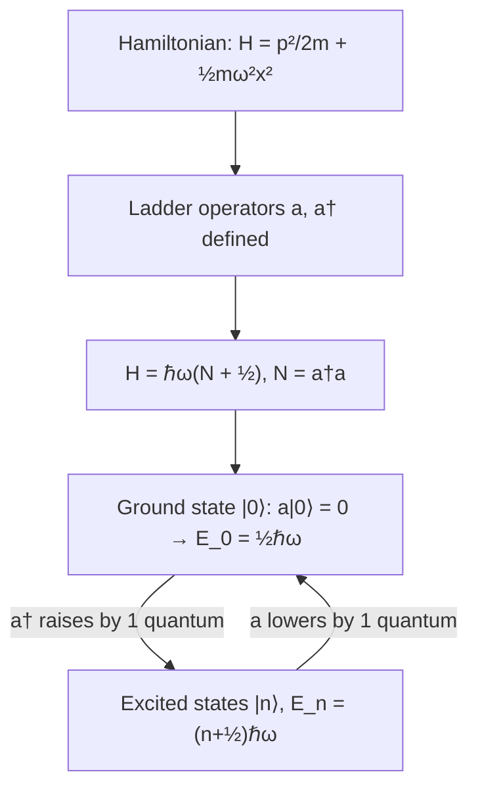

## The Quantum Harmonic Oscillator

### Overview

The quantum harmonic oscillator describes a particle subject to a restoring force proportional to displacement (a parabolic potential), representing one of the most important exactly-solvable systems in quantum mechanics. It serves as the foundational model for molecular vibrations, quantized electromagnetic field modes, phonons in solids, and countless other physical systems well-approximated near a potential minimum.

### The Classical Harmonic Oscillator (Review)

A classical particle in a potential $V(x) = \frac{1}{2}m\omega^2x^2$ (e.g., a mass on a spring with force constant $k=m\omega^2$) undergoes sinusoidal oscillation with angular frequency $\omega = \sqrt{k/m}$, and can possess any energy $E\geq0$, including exactly zero (particle at rest at equilibrium).

**Key Points**

- The parabolic potential is the generic first approximation (Taylor expansion) near *any* smooth potential minimum, making the harmonic oscillator broadly applicable well beyond literal springs.
- Classically, the oscillator spends more time near the turning points (where velocity is lowest) than near the center — the classical probability distribution is largest at the edges of motion.

### The Quantum Hamiltonian

$$\hat{H} = \frac{\hat{p}^2}{2m} + \frac{1}{2}m\omega^2\hat{x}^2$$

The time-independent Schrödinger equation:

$$-\frac{\hbar^2}{2m}\frac{d^2\psi}{dx^2} + \frac{1}{2}m\omega^2x^2\psi = E\psi$$

**Key Points**

- This is a linear second-order differential equation with a position-dependent (non-constant) potential, requiring more sophisticated solution methods than the particle-in-a-box case.
- Two standard solution approaches exist: the **analytic (series solution) method**, yielding Hermite polynomials, and the **algebraic (ladder operator) method**, which is more elegant and widely used in advanced treatments.

### Quantized Energy Levels

$$E_n = \left(n+\frac{1}{2}\right)\hbar\omega, \quad n=0,1,2,3,\ldots$$

**Key Points**

- Energy levels are **evenly spaced** by $\hbar\omega$ — a distinctive feature not shared by the particle in a box (where spacing grows as $n^2$).
- The lowest allowed energy, $E_0 = \frac{1}{2}\hbar\omega$, is strictly positive — this is the **zero-point energy**, a direct consequence of the Heisenberg uncertainty principle (a particle at rest exactly at $x=0$ would have simultaneously zero position uncertainty and zero momentum uncertainty).
- Unlike the classical oscillator (which can have $E=0$), the quantum oscillator can never be perfectly at rest, even at absolute zero temperature.

### Wavefunctions: Hermite Polynomials

The normalized energy eigenfunctions are:

$$\psi_n(x) = \left(\frac{m\omega}{\pi\hbar}\right)^{1/4}\frac{1}{\sqrt{2^nn!}}H_n(\xi)e^{-\xi^2/2}, \quad \xi = \sqrt{\frac{m\omega}{\hbar}}x$$

where $H_n(\xi)$ are the **Hermite polynomials** ($H_0=1$, $H_1=2\xi$, $H_2=4\xi^2-2$, etc.)

**Key Points**

- Every eigenfunction includes the Gaussian factor $e^{-\xi^2/2}$, ensuring normalizability (decay at large $|x|$) for all $n$.
- $\psi_n$ has exactly $n$ nodes, consistent with the general rule that node count increases with energy for 1D bound states.
- Eigenfunctions alternate parity: $\psi_n(-x) = (-1)^n\psi_n(x)$ — even $n$ gives even-parity wavefunctions, odd $n$ gives odd-parity, a direct consequence of the potential's symmetry $V(-x)=V(x)$.

### The Ladder Operator (Algebraic) Method

Define non-Hermitian **raising and lowering (ladder) operators**:

$$\hat{a} = \sqrt{\frac{m\omega}{2\hbar}}\left(\hat{x}+\frac{i\hat{p}}{m\omega}\right), \quad \hat{a}^\dagger = \sqrt{\frac{m\omega}{2\hbar}}\left(\hat{x}-\frac{i\hat{p}}{m\omega}\right)$$

satisfying $[\hat{a},\hat{a}^\dagger] = 1$. The Hamiltonian becomes:

$$\hat{H} = \hbar\omega\left(\hat{a}^\dagger\hat{a}+\frac{1}{2}\right) = \hbar\omega\left(\hat{N}+\frac{1}{2}\right)$$

where $\hat{N}=\hat{a}^\dagger\hat{a}$ is the **number operator**.

**Key Points**

- $\hat{a}^\dagger$ ("creation" operator) raises a state's energy by one quantum $\hbar\omega$: $\hat{a}^\dagger|n\rangle = \sqrt{n+1}|n+1\rangle$.
- $\hat{a}$ ("annihilation" operator) lowers energy by one quantum: $\hat{a}|n\rangle = \sqrt{n}|n-1\rangle$.
- The ground state $|0\rangle$ is defined by $\hat{a}|0\rangle=0$ — there is no state below it, terminating the "ladder" and naturally enforcing $E_0>0$.
- This algebraic method generalizes directly to quantum field theory, where analogous creation/annihilation operators create and destroy field quanta (photons, phonons, etc.) — a deep and widely used structural connection.

### SVG Illustration: Harmonic Oscillator Energy Levels

<svg xmlns="http://www.w3.org/2000/svg" viewBox="0 0 480 380">
<text x="240" y="25" text-anchor="middle" font-size="16" font-weight="bold">QHO Potential and Levels (svg_diagram)</text>
<path d="M 60,340 Q 240,60 420,340" fill="none" stroke="black" stroke-width="2" />
<line x1="90" y1="300" x2="390" y2="300" stroke="blue" stroke-width="1.5" />
<text x="400" y="305" font-size="11" fill="blue">n=0 (½ℏω)</text>
<line x1="110" y1="255" x2="370" y2="255" stroke="green" stroke-width="1.5" />
<text x="380" y="260" font-size="11" fill="green">n=1 (1.5ℏω)</text>
<line x1="130" y1="210" x2="350" y2="210" stroke="red" stroke-width="1.5" />
<text x="360" y="215" font-size="11" fill="red">n=2 (2.5ℏω)</text>
<line x1="150" y1="165" x2="330" y2="165" stroke="purple" stroke-width="1.5" />
<text x="340" y="170" font-size="11" fill="purple">n=3 (3.5ℏω)</text>
<text x="150" y="360" font-size="11">equally spaced: ΔE = ℏω between adjacent levels</text>
</svg>

### Expectation Values and the Correspondence Principle

**Key Points**

- For any energy eigenstate, $\langle x\rangle = 0$ and $\langle p\rangle = 0$ (symmetric distributions around the equilibrium point).
- Position and momentum uncertainties satisfy $\Delta x\,\Delta p = (n+\tfrac{1}{2})\hbar$, saturating the minimum uncertainty bound ($\hbar/2$) exactly in the ground state ($n=0$) — the ground state is a **minimum uncertainty state**.
- As $n$ increases, $|\psi_n(x)|^2$ develops an envelope increasingly resembling the classical probability distribution (higher probability near classical turning points, lower near the center) — another explicit example of the correspondence principle.

### Coherent States

**Key Points**

- **Coherent states** (eigenstates of the annihilation operator, $\hat{a}|\alpha\rangle=\alpha|\alpha\rangle$ for complex $\alpha$) are special superpositions of number states that most closely mimic classical oscillatory motion, with a minimum-uncertainty Gaussian wave packet that oscillates back and forth without spreading.
- These states are particularly important in quantum optics, where they describe the closest quantum analog to a classical coherent light wave (e.g., idealized laser light).

### Example Calculation

A diatomic molecule (e.g., approximating CO) vibrates with effective spring constant $k=1860\text{ N/m}$ and reduced mass $\mu \approx 1.14\times10^{-26}\text{ kg}$.

**Step 1 — Angular frequency:**

$$\omega = \sqrt{k/\mu} = \sqrt{1860/(1.14\times10^{-26})} \approx 4.04\times10^{14}\text{ rad/s}$$

**Step 2 — Zero-point energy:**

$$E_0 = \frac{1}{2}\hbar\omega = \frac{1}{2}(1.055\times10^{-34})(4.04\times10^{14}) \approx 2.13\times10^{-20}\text{ J} \approx 0.133\text{ eV}$$

**Step 3 — Photon energy for $n=0\to1$ transition:**

$$\Delta E = \hbar\omega \approx 2.66\times10^{-20}\text{ J} \approx 0.266\text{ eV}$$

Corresponding wavelength: $\lambda = hc/\Delta E \approx 4.66\times10^{-6}\text{ m} \approx 4.66\text{ μm}$ (mid-infrared).

**Output**

This falls squarely in the infrared range, consistent with the well-known fact that molecular vibrational transitions are observed via infrared spectroscopy.

### Selection Rules

**Key Points**

- For the quantum harmonic oscillator interacting with electromagnetic radiation (in the dipole approximation), the selection rule $\Delta n = \pm 1$ governs allowed transitions — direct transitions between non-adjacent levels (e.g., $n=0\to2$) are forbidden to leading (electric dipole) order.
- This selection rule follows from the vanishing of the position matrix element $\langle n'|\hat{x}|n\rangle$ except when $n'=n\pm1$, a consequence of the ladder-operator structure of $\hat{x}$ in terms of $\hat{a},\hat{a}^\dagger$.

### Common Misconceptions

**Key Points**

- The zero-point energy $E_0=\frac{1}{2}\hbar\omega$ is not merely a mathematical artifact or arbitrary energy-origin choice — it represents genuine, physically measurable residual motion (and associated physical effects, such as contributions to the Casimir effect and quantum fluctuations) present even at absolute zero.
- Energy levels being evenly spaced is a special property of the *exactly parabolic* potential — real physical potentials (e.g., real molecular bonds) are only approximately harmonic near equilibrium, and deviate at higher excitation (anharmonicity), where the strict $\Delta n=\pm1$ selection rule also begins to break down.
- Ladder operators $\hat{a}, \hat{a}^\dagger$ are mathematical tools, not physically measurable observables themselves — they are non-Hermitian, and only specific combinations of them (such as $\hat{x}, \hat{p}$, or $\hat{N}$) correspond to physical, measurable quantities.

### Applications

- **Molecular vibrational spectroscopy**: Infrared and Raman spectroscopy directly probe vibrational energy level spacings, widely used for chemical identification.
- **Quantum field theory**: The quantized electromagnetic field is formally an (infinite) collection of independent harmonic oscillators, one per mode — photons are literally quanta of these oscillator excitations.
- **Phonons in solids**: Lattice vibrations in crystals are quantized as phonons, mathematically modeled via coupled (and, after normal-mode transformation, effectively independent) quantum harmonic oscillators.
- **Quantum optics and coherent states**: Laser light and other quantum optical phenomena are frequently analyzed using harmonic-oscillator coherent-state formalism.
- **Trapped-ion and optomechanical quantum computing**: Motional states of trapped ions are frequently modeled and manipulated as quantum harmonic oscillator states.

### Related Topics

- The Schrödinger Equation
- Ladder Operators and Second Quantization
- The Heisenberg Uncertainty Principle and Minimum-Uncertainty States
- Molecular Vibrational Spectroscopy
- Quantization of the Electromagnetic Field
- Phonons and Lattice Dynamics
- Coherent States in Quantum Optics