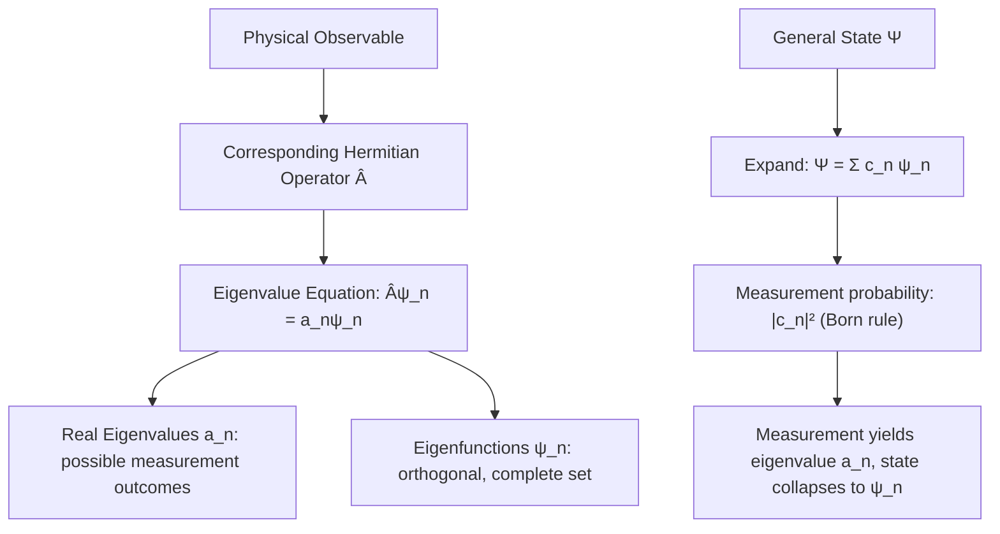

## Operators and Observables

### Overview

In quantum mechanics, every measurable physical quantity (observable) is represented mathematically by a linear operator acting on the state space (Hilbert space) of a system. This operator formalism generalizes and unifies the treatment of position, momentum, energy, angular momentum, and all other physical observables, providing the rigorous mathematical foundation underlying wave mechanics.

### Operators in Quantum Mechanics

**Key Points**

- An **operator** $\hat{A}$ is a mathematical rule that acts on a wavefunction (or abstract state vector) to produce another wavefunction/state vector: $\hat{A}\psi = \phi$.
- Physical observables (position, momentum, energy, angular momentum, spin, etc.) are each represented by a specific corresponding **Hermitian operator**.
- Operators generally do not commute: the order of application matters, i.e., $\hat{A}\hat{B}\psi \neq \hat{B}\hat{A}\psi$ in general — a central departure from classical physics, where physical quantities are simply numbers that always commute under multiplication.

### Common Operators

| Observable | Operator (position representation) |
| --- | --- |
| Position | $\hat{x} = x$ (multiplication) |
| Momentum | $\hat{p} = -i\hbar\dfrac{\partial}{\partial x}$ |
| Kinetic Energy | $\hat{T} = -\dfrac{\hbar^2}{2m}\nabla^2$ |
| Potential Energy | $\hat{V} = V(x)$ (multiplication) |
| Total Energy (Hamiltonian) | $\hat{H} = \hat{T}+\hat{V} = -\dfrac{\hbar^2}{2m}\nabla^2+V(x)$ |
| Angular Momentum ($z$-component) | $\hat{L}_z = -i\hbar\dfrac{\partial}{\partial\phi}$ |

**Key Points**

- The momentum operator's form ($-i\hbar\partial/\partial x$) follows from requiring consistency with the de Broglie relation $p=h/\lambda$ applied to a plane wave $\psi=e^{ikx}$.
- The Hamiltonian operator $\hat{H}$ is the quantum operator corresponding to total energy, and appears directly in the Schrödinger equation governing time evolution.

### Hermitian Operators

An operator $\hat{A}$ is **Hermitian** (self-adjoint) if:

$$\int \psi^*(\hat{A}\phi)\,dx = \int (\hat{A}\psi)^*\phi\,dx \quad \text{for all valid } \psi, \phi$$

**Key Points**

- Physical observables are represented exclusively by Hermitian operators — this is a foundational postulate of quantum mechanics.
- Hermiticity guarantees two crucial physical properties: **eigenvalues are always real** (essential, since measurement outcomes must be real numbers), and **eigenfunctions corresponding to different eigenvalues are automatically orthogonal**.
- The requirement of real eigenvalues is precisely why observables cannot be represented by arbitrary (non-Hermitian) operators — a complex-valued "measurement outcome" would have no physical meaning.

### Eigenvalues and Eigenfunctions

An eigenfunction $\psi_n$ of operator $\hat{A}$ satisfies:

$$\hat{A}\psi_n = a_n\psi_n$$

where $a_n$ is the corresponding (real) **eigenvalue**.

**Key Points**

- If a system is in an eigenstate $\psi_n$ of $\hat{A}$, a measurement of the observable $A$ yields the corresponding eigenvalue $a_n$ with certainty (probability 1).
- The set of all eigenvalues of an operator is called its **spectrum** — this can be discrete (e.g., bound-state energies), continuous (e.g., free-particle momentum), or a mixture of both.
- Eigenfunctions of a Hermitian operator corresponding to different eigenvalues form an orthogonal set, and (for physically relevant operators) a **complete** set — meaning any physically allowed wavefunction can be expanded as a superposition of them.

### Expansion in Eigenbasis and Measurement

Any general state $\Psi$ can be expanded in terms of the eigenfunctions of an observable $\hat{A}$:

$$\Psi = \sum_n c_n\psi_n, \quad c_n = \int \psi_n^*\Psi\,dx$$

**Key Points**

- The probability of measuring eigenvalue $a_n$ is $|c_n|^2$ (Born rule generalized to arbitrary observables), provided $\Psi$ is normalized.
- Upon measurement yielding $a_n$, the state "collapses" to the corresponding eigenstate $\psi_n$ — an immediate repeated measurement of the same observable will reproducibly yield $a_n$ again.
- This expansion framework unifies position measurement (eigenfunctions are delta functions), momentum measurement (eigenfunctions are plane waves), and energy measurement (eigenfunctions are the stationary states solving the time-independent Schrödinger equation) under a single formal structure.

### Expectation Values

$$\langle A \rangle = \int \Psi^*\hat{A}\Psi\,dx = \sum_n |c_n|^2 a_n$$

**Key Points**

- The expectation value is the statistical mean of measurement outcomes over many identical trials on identically prepared systems, not the result of any single measurement.
- Variance/uncertainty: $(\Delta A)^2 = \langle A^2\rangle - \langle A\rangle^2$, which vanishes exactly (zero uncertainty) if and only if the system is in an eigenstate of $\hat{A}$.

### Commutators and Compatible Observables

The **commutator** of two operators is defined as:

$$[\hat{A},\hat{B}] = \hat{A}\hat{B}-\hat{B}\hat{A}$$

**Key Points**

- If $[\hat{A},\hat{B}]=0$, the operators are said to **commute**, and it is possible (in general) to find a common set of simultaneous eigenfunctions — both observables can, in principle, be known precisely at the same time.
- If $[\hat{A},\hat{B}]\neq0$, the observables are **incompatible**: they cannot generally be simultaneously known with arbitrary precision, and are subject to a generalized Heisenberg-type uncertainty relation, $\Delta A\,\Delta B \geq \frac{1}{2}|\langle[\hat{A},\hat{B}]\rangle|$.
- The canonical example: $[\hat{x},\hat{p}] = i\hbar \neq 0$, directly giving rise to the position-momentum uncertainty principle.
- Energy and time are treated somewhat differently, since time is a parameter rather than an operator in standard non-relativistic quantum mechanics; the energy-time uncertainty relation has a distinct interpretive character from the position-momentum case.

### Example: Verifying the Position-Momentum Commutator

Apply $[\hat{x},\hat{p}]$ to an arbitrary test function $f(x)$:

$$[\hat{x},\hat{p}]f = \hat{x}\hat{p}f - \hat{p}\hat{x}f = x\left(-i\hbar\frac{df}{dx}\right) - \left(-i\hbar\frac{d}{dx}\right)(xf)$$

$$= -i\hbar x f' - \left(-i\hbar\right)\left(f+xf'\right) = -i\hbar xf' + i\hbar f + i\hbar xf' = i\hbar f$$

**Output**

$$[\hat{x},\hat{p}] = i\hbar$$

This confirms the fundamental canonical commutation relation, from which the Heisenberg uncertainty principle follows directly via the general operator uncertainty relation.

### The Hamiltonian and Time Evolution

**Key Points**

- The Hamiltonian operator $\hat{H}$ plays a doubly important role: it is both the operator corresponding to the observable "total energy," and the generator of time evolution via the time-dependent Schrödinger equation $i\hbar\partial\Psi/\partial t = \hat{H}\Psi$.
- **Ehrenfest's theorem** relates the time evolution of expectation values to commutators with $\hat{H}$: $\frac{d\langle A\rangle}{dt} = \frac{i}{\hbar}\langle[\hat{H},\hat{A}]\rangle + \left\langle\frac{\partial \hat{A}}{\partial t}\right\rangle$, providing the formal bridge connecting quantum expectation-value dynamics to classical equations of motion (correspondence principle).
- If $[\hat{H},\hat{A}]=0$ and $\hat{A}$ has no explicit time dependence, then $\langle A\rangle$ is constant in time — such $\hat{A}$ is called a **conserved quantity** or **constant of motion**, directly generalizing classical conservation laws.

### Angular Momentum Operators

**Key Points**

- Orbital angular momentum operators $\hat{L}_x,\hat{L}_y,\hat{L}_z$ satisfy the characteristic non-commuting algebra $[\hat{L}_x,\hat{L}_y]=i\hbar\hat{L}_z$ (and cyclic permutations) — no two distinct components of angular momentum can be simultaneously known precisely.
- However, $\hat{L}^2$ (total angular momentum squared) commutes with each individual component $\hat{L}_z$ (conventionally chosen), so $L^2$ and $L_z$ can be simultaneously specified — the basis for angular momentum quantum numbers $\ell, m$ in atomic physics.
- This non-commuting structure directly underlies the quantization of angular momentum and the structure of atomic orbitals.

### Bra-Ket (Dirac) Notation

**Key Points**

- Modern quantum mechanics often uses **Dirac notation**: states are written as **kets** $|\psi\rangle$, with corresponding **bras** $\langle\psi|$ (complex conjugate transpose), and inner products written $\langle\phi|\psi\rangle$.
- Expectation values are written compactly as $\langle A\rangle = \langle\Psi|\hat{A}|\Psi\rangle$, and eigenvalue equations as $\hat{A}|n\rangle=a_n|n\rangle$ — representation-independent notation that applies equally to position-space wavefunctions, momentum-space wavefunctions, or abstract finite-dimensional state spaces (e.g., spin).
- This notation generalizes naturally to systems (such as spin) with no direct position-space wavefunction representation at all.

### Common Misconceptions

**Key Points**

- Operators are not simply "functions" acting like ordinary numbers — their non-commutativity is a genuinely new mathematical/physical feature with no classical analog, not merely a notational inconvenience.
- Being in an eigenstate of one operator does not imply being in an eigenstate of another, non-commuting operator — a particle with definite momentum, for instance, has maximally uncertain position, and vice versa.
- The expectation value $\langle A\rangle$ is a statistical average, not a prediction for the outcome of any individual measurement — a single measurement on a system not already in an eigenstate of $\hat{A}$ generally yields one specific eigenvalue $a_n$, not the expectation value itself.

### Applications

- **Spectroscopy**: Selection rules for allowed transitions are derived from matrix elements of relevant operators (e.g., the dipole moment operator) between energy eigenstates.
- **Quantum computing**: Quantum gates are represented as unitary operators acting on qubit state vectors; measurement operators determine readout probabilities.
- **Angular momentum and atomic structure**: The operator algebra of $\hat{L}^2,\hat{L}_z$ (and analogously spin operators $\hat{S}^2,\hat{S}_z$) underlies the entire classification scheme of atomic orbitals and spectroscopic term symbols.
- **Conservation laws**: Symmetries of the Hamiltonian (translation invariance, rotational invariance, etc.) are identified with commuting conserved-quantity operators via Noether's-theorem-like reasoning adapted to quantum mechanics.

### Related Topics

- The Heisenberg Uncertainty Principle
- The Schrödinger Equation
- Angular Momentum in Quantum Mechanics
- Dirac (Bra-Ket) Notation and Hilbert Spaces
- Ehrenfest's Theorem and the Correspondence Principle
- Spin and the Stern-Gerlach Experiment
- Commutation Relations and Conservation Laws