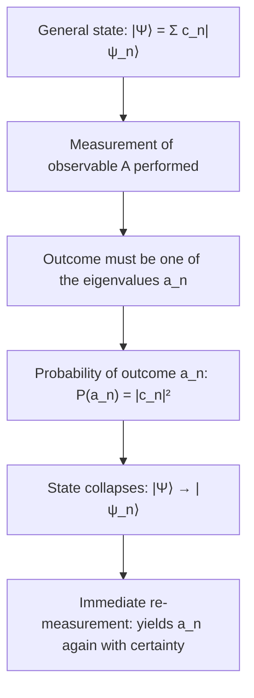

## Eigenvalues, Eigenstates, and Measurement

### Overview

The eigenvalue-eigenstate structure of quantum mechanics, together with the measurement postulate, forms the precise mathematical machinery connecting the abstract formalism of operators and wavefunctions to concrete, testable experimental predictions. This framework specifies exactly what values a measurement can yield, with what probability, and what happens to the quantum state as a result.

### The Eigenvalue Equation

For an operator $\hat{A}$ representing an observable, an **eigenstate** $|\psi_n\rangle$ (or eigenfunction $\psi_n$) satisfies:

$$\hat{A}|\psi_n\rangle = a_n|\psi_n\rangle$$

where $a_n$ is the corresponding **eigenvalue**.

**Key Points**

- $|\psi_n\rangle$ is unchanged (up to an overall scalar factor $a_n$) by the action of $\hat{A}$ — this is the defining algebraic property of an eigenstate.
- Because $\hat{A}$ is Hermitian for physical observables, all eigenvalues $a_n$ are guaranteed to be real numbers, consistent with their interpretation as possible outcomes of a real-valued physical measurement.
- Depending on the operator and system, the eigenvalue spectrum may be **discrete** (e.g., bound-state energies, angular momentum), **continuous** (e.g., free-particle position or momentum), or a mixture (e.g., the hydrogen atom Hamiltonian, with discrete bound states and a continuous ionized spectrum).

### The Measurement Postulate

The core measurement postulate of quantum mechanics states:

**Key Points**

1. A measurement of observable $A$ can only yield one of the eigenvalues $a_n$ of the corresponding operator $\hat{A}$ — no other outcome is possible.
2. If the system is in a general (normalized) state $|\Psi\rangle = \sum_n c_n|\psi_n\rangle$, the probability of obtaining outcome $a_n$ is $P(a_n) = |c_n|^2$, where $c_n = \langle\psi_n|\Psi\rangle$ (the **Born rule**, generalized beyond position measurement).
3. Immediately after a measurement yielding $a_n$, the system's state **collapses** to the corresponding eigenstate $|\psi_n\rangle$ (or, for a degenerate eigenvalue, projects onto the relevant eigenspace).
4. A subsequent immediate re-measurement of the same observable, on the collapsed state, reproducibly yields $a_n$ again with certainty.

### Expansion Coefficients and Completeness

For a discrete, complete, orthonormal eigenbasis $\{|\psi_n\rangle\}$ satisfying $\langle\psi_m|\psi_n\rangle=\delta_{mn}$:

$$|\Psi\rangle = \sum_n c_n|\psi_n\rangle, \quad c_n = \langle\psi_n|\Psi\rangle$$

**Key Points**

- **Completeness** means any physically allowed state can be expanded in this basis — no information is lost by working in the eigenbasis representation.
- Normalization of $|\Psi\rangle$ ($\langle\Psi|\Psi\rangle=1$) automatically ensures $\sum_n|c_n|^2=1$, so the measurement probabilities correctly sum to unity.
- For continuous spectra (e.g., position or momentum), the sum becomes an integral, and $|c_n|^2$ becomes a probability *density* rather than a discrete probability — the eigenstates themselves ($\delta$-functions or plane waves) are not individually normalizable, requiring some mathematical care (rigged Hilbert space formalism) beyond the scope of introductory treatment.

### Example: Measurement in a Two-State System

Consider a particle in a superposition of two energy eigenstates:

$$|\Psi\rangle = \frac{1}{\sqrt{3}}|\psi_1\rangle + \sqrt{\frac{2}{3}}|\psi_2\rangle$$

with $E_1 = 2.0\text{ eV}$, $E_2 = 5.0\text{ eV}$.

**Step 1 — Verify normalization:**

$$\left|\frac{1}{\sqrt{3}}\right|^2 + \left|\sqrt{\frac{2}{3}}\right|^2 = \frac{1}{3}+\frac{2}{3} = 1 \checkmark$$

**Step 2 — Measurement probabilities:**

$$P(E_1) = \frac{1}{3} \approx 33.3\%, \quad P(E_2) = \frac{2}{3} \approx 66.7\%$$

**Step 3 — Expectation value of energy:**

$$\langle E\rangle = P(E_1)E_1 + P(E_2)E_2 = \frac{1}{3}(2.0) + \frac{2}{3}(5.0) \approx 4.0\text{ eV}$$

**Output**

A single energy measurement will yield either exactly $2.0\text{ eV}$ (33.3% of the time) or exactly $5.0\text{ eV}$ (66.7% of the time) — never any value in between; only the statistical average over many trials equals $4.0\text{ eV}$.

### SVG Illustration: Measurement Collapse

<svg xmlns="http://www.w3.org/2000/svg" viewBox="0 0 500 320">
<text x="250" y="25" text-anchor="middle" font-size="16" font-weight="bold">Measurement and Collapse (svg_diagram)</text>
<text x="40" y="80" font-size="13">Before measurement:</text>
<ellipse cx="150" cy="140" rx="90" ry="40" fill="#cce5ff" stroke="blue" stroke-width="1.5" />
<text x="95" y="145" font-size="11">|Ψ⟩ = c₁|ψ₁⟩ + c₂|ψ₂⟩</text>
<line x1="150" y1="180" x2="150" y2="220" stroke="black" stroke-width="1.5" marker-end="url(#mm)" />
<text x="160" y="205" font-size="11">measure A</text>
<rect x="60" y="240" width="110" height="50" fill="#d4edda" stroke="green" stroke-width="1.5" />
<text x="70" y="270" font-size="11" fill="green">|ψ₁⟩, prob |c₁|²</text>
<rect x="290" y="240" width="110" height="50" fill="#f8d7da" stroke="red" stroke-width="1.5" />
<text x="300" y="270" font-size="11" fill="red">|ψ₂⟩, prob |c₂|²</text>
<line x1="150" y1="180" x2="345" y2="220" stroke="black" stroke-width="1.5" marker-end="url(#mm)" />
</svg>

### Degenerate Eigenvalues

**Key Points**

- When multiple linearly independent eigenstates share the same eigenvalue ($\hat{A}|\psi_n^{(1)}\rangle = a_n|\psi_n^{(1)}\rangle$ and $\hat{A}|\psi_n^{(2)}\rangle = a_n|\psi_n^{(2)}\rangle$), the eigenvalue is called **degenerate**.
- Measurement yielding a degenerate eigenvalue $a_n$ collapses the state onto the *projection* of $|\Psi\rangle$ within the corresponding degenerate eigenspace, not necessarily onto one specific basis vector within it.
- Degeneracy is physically significant — e.g., hydrogen atom energy levels $E_n$ are degenerate with respect to angular momentum quantum numbers $\ell,m$ (at the non-relativistic, non-fine-structure level), directly affecting spectral line structure and statistical weightings.

### Simultaneous Measurability: Compatible Observables

**Key Points**

- Two observables $\hat{A}, \hat{B}$ can be **simultaneously measured with arbitrary precision** if and only if their operators commute: $[\hat{A},\hat{B}]=0$.
- Commuting Hermitian operators share a **common eigenbasis** — a complete set of states that are simultaneously eigenstates of both operators, allowing both quantities to be specified precisely at once (e.g., simultaneous eigenstates of $\hat{L}^2$ and $\hat{L}_z$, labeled by quantum numbers $\ell, m$).
- Non-commuting observables (e.g., $\hat{x}$ and $\hat{p}$) cannot generally share simultaneous eigenstates, directly connecting the measurement postulate to the Heisenberg uncertainty principle.

### Degenerate vs. Non-Degenerate Spectra: A Worked Comparison

| Scenario | Example | Measurement Outcome |
| --- | --- | --- |
| Non-degenerate discrete | 1D infinite square well energies | Unique state per eigenvalue; full collapse to that state |
| Degenerate discrete | Hydrogen atom energy $E_n$ (degenerate in $\ell,m$) | Collapse projects onto the degenerate subspace, not a single state |
| Continuous | Free particle momentum | Probability *density* over a continuum of outcomes |

### The Projection Postulate (Formal Statement)

For a general (possibly degenerate) observable, using the **projection operator** $\hat{P}_n$ onto the eigenspace of eigenvalue $a_n$:

$$P(a_n) = \langle\Psi|\hat{P}_n|\Psi\rangle, \quad |\Psi\rangle \to \frac{\hat{P}_n|\Psi\rangle}{\sqrt{\langle\Psi|\hat{P}_n|\Psi\rangle}}$$

**Key Points**

- This is the fully general (von Neumann) formulation of the measurement postulate, reducing to the simpler discrete-sum formula in the non-degenerate case.
- Projection operators satisfy $\hat{P}_n^2=\hat{P}_n$ (idempotency) and $\sum_n\hat{P}_n = \hat{I}$ (completeness/resolution of the identity), formalizing the requirement that some outcome must always occur.

### The Measurement Problem

**Key Points**

- The measurement postulate describes *what* happens upon measurement (probabilistic collapse) but does not, within standard quantum mechanics, explain *why* or precisely *when* collapse occurs, or what physically constitutes a "measurement" as opposed to ordinary unitary evolution — this is the **measurement problem**, a central topic in the foundations and interpretation of quantum mechanics.
- Collapse is fundamentally different in character from the smooth, deterministic, unitary evolution described by the Schrödinger equation — introducing this discontinuous, seemingly separate dynamical rule is philosophically and physically significant.
- [Inference] Different interpretations of quantum mechanics (Copenhagen, many-worlds, objective collapse models such as GRW, de Broglie–Bohm pilot-wave theory) offer differing accounts of what collapse "really" is or whether it occurs as a fundamental process at all, while all reproducing identical Born-rule measurement statistics for standard experiments — making the interpretive question largely (though not entirely, depending on the specific model) empirically underdetermined at present.

### Common Misconceptions

**Key Points**

- The expansion coefficients $c_n$ are not simply "how much" of each eigenstate is physically present in some literal mixture sense — $|c_n|^2$ gives a probability, and the state $|\Psi\rangle$ before measurement is a genuine coherent superposition, not a statistical ensemble of systems each secretly already in one definite eigenstate.
- Measurement collapse is not merely a subjective update of the observer's knowledge in all interpretations — in the standard (Copenhagen-style) reading, the system's physical state itself changes discontinuously; the correct characterization of collapse is precisely the subject of ongoing interpretive debate rather than a settled matter.
- A degenerate eigenvalue measurement does not necessarily collapse the state to one specific member of the degenerate eigenspace — the collapse rule properly involves projection onto the entire relevant subspace.

### Applications

- **Quantum computing**: Qubit readout is a direct physical implementation of the measurement postulate — measuring a qubit in a superposition yields a definite classical bit value with Born-rule probability.
- **Spectroscopy**: Interpreting the intensity of spectral lines relies on the probabilistic transition and measurement framework built on eigenstates and matrix elements.
- **Quantum cryptography (e.g., BB84 protocol)**: Security relies on the fact that measuring a quantum state in an incompatible (non-commuting) basis unavoidably disturbs it, precluding undetected eavesdropping.
- **Stern-Gerlach experiments**: Direct experimental demonstration of quantized measurement outcomes (discrete spin eigenvalues) and the subsequent collapse of the spin state.

### Related Topics

- Operators and Observables
- The Heisenberg Uncertainty Principle
- The Born Rule and Wavefunction Collapse
- Degenerate Perturbation Theory
- The Stern-Gerlach Experiment and Spin Measurement
- Interpretations of Quantum Mechanics
- Quantum Computing and Qubit Readout