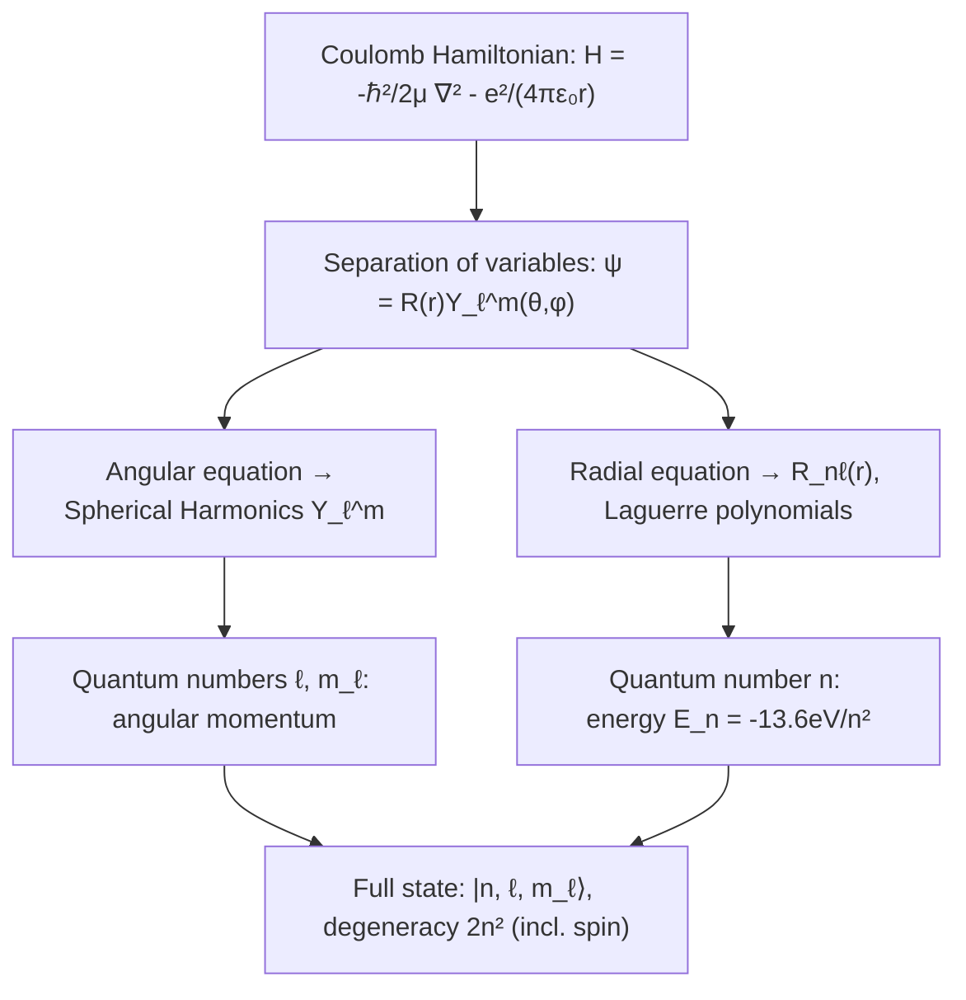

## The Hydrogen Atom

### Overview

The hydrogen atom is the simplest atomic system — a single electron bound to a single proton by the Coulomb force — and is one of the very few realistic three-dimensional quantum systems solvable exactly in closed form. Its solution provides the theoretical foundation for atomic structure, the periodic table, and molecular quantum chemistry.

### The Hamiltonian

For an electron (mass $m_e$, charge $-e$) bound to a proton (charge $+e$) via the Coulomb potential:

$$\hat{H} = -\frac{\hbar^2}{2\mu}\nabla^2 - \frac{e^2}{4\pi\epsilon_0 r}$$

where $\mu = \dfrac{m_em_p}{m_e+m_p} \approx m_e$ is the **reduced mass** of the electron-proton system.

**Key Points**

- The potential $V(r) = -e^2/(4\pi\epsilon_0 r)$ depends only on the radial distance $r$ — this **central potential** symmetry is what makes the problem exactly solvable via separation of variables in spherical coordinates.
- Using reduced mass $\mu$ rather than the bare electron mass $m_e$ correctly accounts for the proton's finite mass (the two-body problem reduces to an equivalent one-body problem); since $m_p \gg m_e$, $\mu \approx m_e$ to about $0.05\%$ accuracy.
- The full three-dimensional Schrödinger equation $\hat{H}\psi = E\psi$ becomes a partial differential equation in $r,\theta,\phi$.

### Separation of Variables

In spherical coordinates, the wavefunction separates as:

$$\psi(r,\theta,\phi) = R(r)Y_\ell^m(\theta,\phi)$$

**Key Points**

- $R(r)$ is the **radial wavefunction**, depending on the principal quantum number $n$ and orbital angular momentum quantum number $\ell$.
- $Y_\ell^m(\theta,\phi)$ are the **spherical harmonics**, universal angular functions shared by *any* central-potential problem (not specific to hydrogen) — they are simultaneous eigenfunctions of $\hat{L}^2$ and $\hat{L}_z$.
- This separation is possible precisely because the potential depends only on $r$, decoupling the angular and radial parts of the Schrödinger equation.

### Quantum Numbers

Three quantum numbers emerge from solving the boundary-value problem, plus a fourth (spin) added afterward:

| Quantum Number | Symbol | Allowed Values | Governs |
| --- | --- | --- | --- |
| Principal | $n$ | $1,2,3,\ldots$ | Energy, overall size/shell |
| Orbital (azimuthal) | $\ell$ | $0,1,\ldots,n-1$ | Orbital angular momentum magnitude, subshell |
| Magnetic | $m_\ell$ | $-\ell,\ldots,+\ell$ | Orbital angular momentum $z$-projection |
| Spin | $m_s$ | $\pm\frac{1}{2}$ | Electron spin projection (not from spatial Schrödinger equation) |

**Key Points**

- $\ell$ is conventionally labeled by letter: $\ell=0\to s$, $\ell=1\to p$, $\ell=2\to d$, $\ell=3\to f$ (historical spectroscopic notation), giving rise to orbital names like $2p$, $3d$.
- For each $n$, there are $n$ allowed values of $\ell$ (0 through $n-1$), and for each $\ell$, there are $2\ell+1$ allowed values of $m_\ell$.
- Spin quantum numbers are not predicted by the non-relativistic Schrödinger equation itself — they emerge naturally from the relativistic Dirac equation, but are incorporated into non-relativistic treatments as an additional experimentally-motivated postulate.

### Energy Levels

$$E_n = -\frac{\mu e^4}{2(4\pi\epsilon_0)^2\hbar^2 n^2} = -\frac{13.6\text{ eV}}{n^2}, \quad n=1,2,3,\ldots$$

**Key Points**

- This exactly reproduces the Bohr model's energy formula, now derived rigorously from the Schrödinger equation rather than from semiclassical postulates.
- Energy depends *only* on $n$, not on $\ell$ or $m_\ell$ — a special feature of the pure $1/r$ Coulomb potential called an **"accidental" degeneracy** (more precisely, a consequence of a hidden dynamical symmetry, related to the conserved Laplace-Runge-Lenz vector).
- For a given $n$, the total degeneracy (counting all $\ell, m_\ell, m_s$ combinations) is $2n^2$.

### Radial Wavefunctions

$$R_{n\ell}(r) \propto e^{-r/na_0}\left(\frac{r}{a_0}\right)^\ell L_{n-\ell-1}^{2\ell+1}\left(\frac{2r}{na_0}\right)$$

where $L$ denotes an associated Laguerre polynomial and $a_0$ is the **Bohr radius**:

$$a_0 = \frac{4\pi\epsilon_0\hbar^2}{\mu e^2} \approx 5.29\times10^{-11}\text{ m}$$

**Key Points**

- The exponential decay factor $e^{-r/na_0}$ shows that orbital "size" grows roughly as $n^2$, matching Bohr model intuition.
- $R_{n\ell}$ has $n-\ell-1$ radial nodes — orbitals with lower $\ell$ (for fixed $n$) have more radial nodes and penetrate closer to the nucleus.
- The ground state ($n=1,\ell=0$) radial wavefunction is simply $R_{10}(r) \propto e^{-r/a_0}$, with no nodes.

### The Ground State Wavefunction

$$\psi_{100}(r,\theta,\phi) = \frac{1}{\sqrt{\pi a_0^3}}e^{-r/a_0}$$

**Key Points**

- This is spherically symmetric (no angular dependence), consistent with $\ell=m_\ell=0$.
- The probability density $|\psi_{100}|^2$ peaks at $r=0$, but the **radial probability distribution** $P(r) = 4\pi r^2|\psi_{100}|^2$ (accounting for the growing volume of spherical shells at larger $r$) peaks exactly at $r=a_0$ — recovering the Bohr radius as the *most probable* radius, though not the *average* one, in the quantum treatment.

### SVG Illustration: Orbital Shapes (s, p, d)

<svg xmlns="http://www.w3.org/2000/svg" viewBox="0 0 520 260">
<text x="260" y="25" text-anchor="middle" font-size="16" font-weight="bold">Hydrogen Orbital Shapes (svg_diagram)</text>
<circle cx="100" cy="150" r="60" fill="#cce5ff" stroke="blue" stroke-width="1.5" opacity="0.7" />
<text x="70" y="230" font-size="12">s orbital (ℓ=0)</text>
<ellipse cx="260" cy="150" rx="20" ry="60" fill="#d4edda" stroke="green" stroke-width="1.5" opacity="0.7" />
<ellipse cx="260" cy="70" rx="20" ry="10" fill="#d4edda" stroke="green" stroke-width="1.5" opacity="0.7" />
<ellipse cx="260" cy="230" rx="20" ry="10" fill="#d4edda" stroke="green" stroke-width="1.5" opacity="0.7" />
<text x="225" y="248" font-size="12">p orbital (ℓ=1)</text>
<ellipse cx="420" cy="120" rx="45" ry="16" fill="#f8d7da" stroke="red" stroke-width="1.5" opacity="0.7" transform="rotate(45 420 120)" />
<ellipse cx="420" cy="180" rx="45" ry="16" fill="#f8d7da" stroke="red" stroke-width="1.5" opacity="0.7" transform="rotate(-45 420 180)" />
<text x="385" y="240" font-size="12">d orbital (ℓ=2)</text>
</svg>

### Example Calculation: Spectral Transition

Compute the wavelength of light emitted for the $n=4\to n=2$ transition.

**Step 1 — Energy of each level:**

$$E_4 = -\frac{13.6}{16} = -0.850\text{ eV}, \quad E_2 = -\frac{13.6}{4} = -3.40\text{ eV}$$

**Step 2 — Transition energy:**

$$\Delta E = E_2-E_4 = -3.40-(-0.850) = -2.55\text{ eV}$$

(magnitude $2.55\text{ eV}$ emitted as a photon)

**Step 3 — Wavelength:**

$$\lambda = \frac{hc}{|\Delta E|} = \frac{1240\text{ eV·nm}}{2.55\text{ eV}} \approx 486\text{ nm}$$

**Output**

This corresponds to $H_\beta$, the second line of the Balmer series (blue-green visible light), matching well-established hydrogen spectroscopic data.

### Degeneracy and Fine Structure

**Key Points**

- The pure Coulomb, non-relativistic result predicts exact degeneracy in $\ell$ for fixed $n$ — but this degeneracy is only approximate in real hydrogen.
- **Fine structure** (small energy splittings depending on $\ell$ and total angular momentum $j$) arises from relativistic corrections and spin-orbit coupling, requiring the Dirac equation or perturbative relativistic corrections for accurate treatment.
- **Hyperfine structure** (even smaller splittings, e.g., the famous 21 cm hydrogen line used in radio astronomy) arises from interaction between electron spin and the proton's nuclear magnetic moment.
- [Inference] These finer splittings are typically treated as small perturbative corrections to the non-relativistic Schrödinger solution presented here, rather than requiring a fully independent re-derivation, since they are many orders of magnitude smaller than the primary Bohr-like energy spacing.

### Selection Rules for Transitions

**Key Points**

- Electric dipole transitions between hydrogen states obey selection rules $\Delta \ell = \pm 1$ and $\Delta m_\ell = 0,\pm1$, derived from the angular momentum properties of the photon and the matrix elements of the dipole operator.
- These selection rules explain why certain transitions (e.g., $2s\to1s$) are strongly suppressed ("forbidden" to leading order) compared to allowed transitions like $2p\to1s$, directly shaping observed spectral line intensities.

### Comparison: Bohr Model vs. Full Quantum Treatment

| Feature | Bohr Model | Schrödinger Treatment |
| --- | --- | --- |
| Energy levels $E_n$ | Correct ($-13.6\text{eV}/n^2$) | Correct, same formula |
| Electron trajectory | Definite circular orbits | Probabilistic orbitals, no trajectories |
| Angular momentum | Postulated $L=n\hbar$ | Derived; $L=\sqrt{\ell(\ell+1)}\hbar$, can be zero |
| Multi-electron atoms | Fails | Extendable via approximation methods |
| Orbital shapes | N/A (point orbits) | Rich structure: s, p, d, f orbitals |

### Common Misconceptions

**Key Points**

- Electron "orbitals" are not literal orbits or trajectories — they are probability density distributions ($|\psi|^2$) describing where the electron is likely to be found upon measurement, with no well-defined path between measurements.
- The ground state has $\ell=0$ (zero orbital angular momentum), in direct contrast to the Bohr model's prediction of $L=n\hbar=\hbar$ for the ground state ($n=1$) — this is a genuine discrepancy the full quantum treatment corrects.
- Energy depending only on $n$ (not $\ell$) is specific to the idealized pure $1/r$ Coulomb potential of hydrogen — this degeneracy is lifted in multi-electron atoms, where electron-electron screening makes energy depend on both $n$ and $\ell$.

### Applications

- **Atomic spectroscopy**: The theoretical basis for interpreting hydrogen (and hydrogen-like ion) emission and absorption spectra.
- **Quantum chemistry**: Hydrogen-like orbitals serve as the essential building-block basis functions for approximate treatments of multi-electron atoms and molecules.
- **Radio astronomy**: The hyperfine-structure 21 cm hydrogen line is a fundamental tool for mapping interstellar neutral hydrogen gas.
- **Rydberg atom physics**: Highly excited ($n\gg1$) hydrogen-like states are used in precision quantum optics and quantum information experiments, where semiclassical (correspondence-principle) behavior becomes increasingly accurate.

### Related Topics

- The Schrödinger Equation in Three Dimensions
- Angular Momentum and Spherical Harmonics
- The Bohr Model of the Atom
- Spin and the Stern-Gerlach Experiment
- Fine and Hyperfine Structure
- Multi-Electron Atoms and the Pauli Exclusion Principle
- Selection Rules and Atomic Spectroscopy