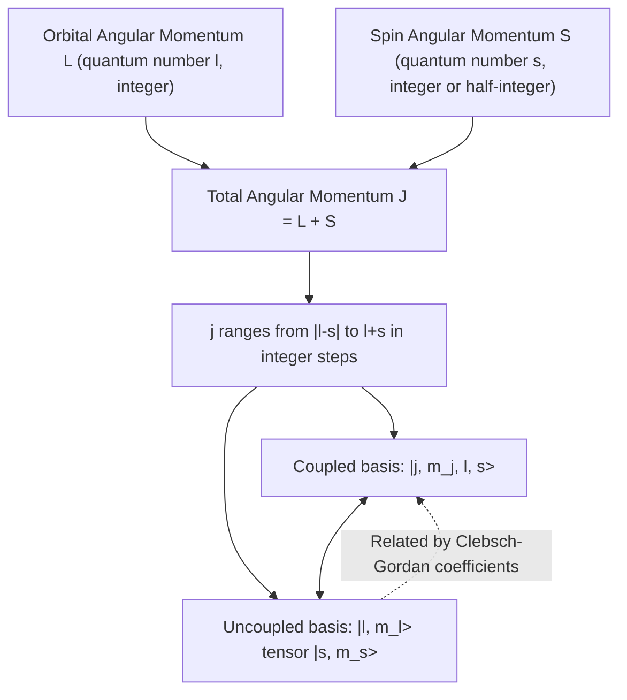

## Orbital and Spin Angular Momentum

### Overview

Angular momentum in quantum mechanics comprises two fundamentally distinct types: **orbital angular momentum** $\mathbf{L}$, arising from the spatial motion of a particle (analogous to classical rotational motion), and **spin angular momentum** $\mathbf{S}$, an intrinsic quantum property with no classical analog. Both are vector operators satisfying the same underlying angular momentum algebra, which is why they are treated within a unified mathematical formalism despite their different physical origins.

### Orbital Angular Momentum

**Classical Correspondence and Quantum Operator**

Classically, orbital angular momentum is $\mathbf{L} = \mathbf{r} \times \mathbf{p}$. Promoting position and momentum to quantum operators ($\hat{\mathbf{r}}$, $\hat{\mathbf{p}} = -i\hbar\nabla$) gives the orbital angular momentum operator:

$$\hat{\mathbf{L}} = \hat{\mathbf{r}} \times \hat{\mathbf{p}}$$

with Cartesian components:

$$\hat{L}_x = \hat{y}\hat{p}_z - \hat{z}\hat{p}_y, \quad \hat{L}_y = \hat{z}\hat{p}_x - \hat{x}\hat{p}_z, \quad \hat{L}_z = \hat{x}\hat{p}_y - \hat{y}\hat{p}_x$$

**Commutation Relations**

The components of $\hat{\mathbf{L}}$ do not commute with each other:

$$[\hat{L}_x, \hat{L}_y] = i\hbar \hat{L}_z, \quad [\hat{L}_y, \hat{L}_z] = i\hbar \hat{L}_x, \quad [\hat{L}_z, \hat{L}_x] = i\hbar \hat{L}_y$$

This is compactly written as $[\hat{L}_i, \hat{L}_j] = i\hbar\epsilon_{ijk}\hat{L}_k$ (Einstein summation, $\epsilon_{ijk}$ the Levi-Civita symbol). Because these operators do not commute, $L_x$, $L_y$, $L_z$ cannot be simultaneously measured with arbitrary precision — this is the origin of angular momentum uncertainty relations.

The total angular momentum squared operator $\hat{L}^2 = \hat{L}_x^2 + \hat{L}_y^2 + \hat{L}_z^2$ **does** commute with each component:

$$[\hat{L}^2, \hat{L}_z] = 0$$

This allows $\hat{L}^2$ and one component (conventionally $\hat{L}_z$) to be simultaneously diagonalized, forming a complete set of commuting observables (CSCO) for angular momentum.

**Eigenvalues and Quantum Numbers**

Solving the eigenvalue problem in spherical coordinates yields the spherical harmonics $Y_l^m(\theta, \phi)$ as simultaneous eigenfunctions:

$$\hat{L}^2 Y_l^m = \hbar^2 l(l+1) Y_l^m, \qquad l = 0, 1, 2, 3, \ldots$$

$$\hat{L}_z Y_l^m = \hbar m Y_l^m, \qquad m = -l, -l+1, \ldots, l-1, l$$

Here $l$ is the **orbital angular momentum quantum number** (also called the azimuthal quantum number) and $m$ (or $m_l$) is the **magnetic quantum number**, restricted to $2l+1$ integer values. The requirement that $l$ be a non-negative integer (rather than half-integer) follows from the single-valuedness of $Y_l^m(\theta,\phi)$ under $\phi \to \phi + 2\pi$.

**Ladder (Raising/Lowering) Operators**

Define $\hat{L}_\pm = \hat{L}_x \pm i\hat{L}_y$. These satisfy:

$$\hat{L}_\pm |l, m\rangle = \hbar\sqrt{l(l+1) - m(m\pm 1)}\,|l, m\pm 1\rangle$$

The ladder operators shift $m$ by $\pm 1$ while leaving $l$ unchanged, terminating at $m = \pm l$ (i.e., $\hat{L}_+|l,l\rangle = 0$ and $\hat{L}_-|l,-l\rangle = 0$).

### Spin Angular Momentum

**Motivation and Discovery**

The **Stern-Gerlach experiment** (1922) demonstrated that silver atoms passing through an inhomogeneous magnetic field split into exactly **two** discrete beams, not the odd number $(2l+1)$ predicted for any integer $l$. This necessitated a new form of angular momentum — intrinsic **spin** — that is not derivable from spatial coordinates and can take half-integer values.

**Formal Definition**

Spin operators $\hat{\mathbf{S}} = (\hat{S}_x, \hat{S}_y, \hat{S}_z)$ satisfy the **same commutation algebra** as orbital angular momentum:

$$[\hat{S}_i, \hat{S}_j] = i\hbar\epsilon_{ijk}\hat{S}_k$$

$$\hat{S}^2|s,m_s\rangle = \hbar^2 s(s+1)|s,m_s\rangle, \qquad \hat{S}_z|s,m_s\rangle = \hbar m_s|s,m_s\rangle$$

Critically, $s$ is fixed for a given particle species (an intrinsic property, like mass or charge) and can be either integer or **half-integer**: $s = 0, \tfrac{1}{2}, 1, \tfrac{3}{2}, \ldots$, with $m_s = -s, -s+1, \ldots, s$.

- **Electrons, protons, neutrons**: $s = \tfrac{1}{2}$ (fermions), giving $m_s = \pm\tfrac{1}{2}$ — exactly the two states observed in Stern-Gerlach.
- **Photons**: $s = 1$ (bosons)
- **Higgs boson**: $s = 0$

**Spin-1/2 and Pauli Matrices**

For spin-$\tfrac{1}{2}$ particles, spin operators are represented using the **Pauli matrices** $\hat{S}_i = \frac{\hbar}{2}\sigma_i$:

$$\sigma_x = \begin{pmatrix} 0 & 1 \\ 1 & 0 \end{pmatrix}, \quad \sigma_y = \begin{pmatrix} 0 & -i \\ i & 0 \end{pmatrix}, \quad \sigma_z = \begin{pmatrix} 1 & 0 \\ 0 & -1 \end{pmatrix}$$

The spin-up and spin-down eigenstates of $\hat{S}_z$ are represented as two-component spinors:

$$|\uparrow\rangle = \begin{pmatrix} 1 \\ 0 \end{pmatrix}, \qquad |\downarrow\rangle = \begin{pmatrix} 0 \\ 1 \end{pmatrix}$$

A general spin-$\tfrac{1}{2}$ state is $\chi = \begin{pmatrix} a \\ b \end{pmatrix}$ with $|a|^2 + |b|^2 = 1$.

**Key Points**

- Orbital angular momentum arises from spatial wavefunctions; $l$ must be a non-negative integer.
- Spin is intrinsic and has no spatial wavefunction origin; $s$ can be integer or half-integer and is fixed per particle type.
- Both obey identical commutation algebra, which is the defining mathematical signature of "angular momentum" in quantum mechanics — this is why generalized angular momentum theory treats $l$ and $s$ under a common formalism using quantum number $j$.

### Coupling of Orbital and Spin Angular Momentum

For particles with both orbital motion and spin (e.g., an electron in an atom), the **total angular momentum** is:

$$\hat{\mathbf{J}} = \hat{\mathbf{L}} + \hat{\mathbf{S}}$$

$\hat{\mathbf{J}}$ satisfies the same commutation relations as $\hat{\mathbf{L}}$ and $\hat{\mathbf{S}}$ individually. The eigenvalues follow:

$$\hat{J}^2|j, m_j\rangle = \hbar^2 j(j+1)|j,m_j\rangle, \qquad \hat{J}_z|j,m_j\rangle = \hbar m_j|j,m_j\rangle$$

where $j$ ranges via the **Clebsch-Gordan series**:

$$j = |l - s|, |l-s|+1, \ldots, l+s$$

**Example: Electron with $l=1$ (p-orbital)**

For an electron ($s = \tfrac{1}{2}$) in a $p$-orbital ($l = 1$):

$$j = |1 - \tfrac{1}{2}|, \ldots, 1 + \tfrac{1}{2} = \tfrac{1}{2}, \tfrac{3}{2}$$

This gives two possible total angular momentum states, labeled spectroscopically as $p_{1/2}$ and $p_{3/2}$, which have slightly different energies due to **spin-orbit coupling** — the interaction between the electron's spin magnetic moment and the magnetic field generated by its orbital motion. This splitting is directly observable as **fine structure** in atomic spectra (e.g., the sodium D-line doublet).

**Uncoupled vs. Coupled Basis**

Two equally valid bases describe a combined $l$-$s$ system:

1. **Uncoupled basis**: $|l, m_l\rangle \otimes |s, m_s\rangle$ — eigenstates of $\hat{L}_z$, $\hat{S}_z$, $\hat{L}^2$, $\hat{S}^2$
2. **Coupled basis**: $|j, m_j, l, s\rangle$ — eigenstates of $\hat{J}^2$, $\hat{J}_z$, $\hat{L}^2$, $\hat{S}^2$

The two bases are related by **Clebsch-Gordan coefficients**:

$$|j, m_j\rangle = \sum_{m_l, m_s} C^{j,m_j}_{l,m_l;s,m_s} |l,m_l\rangle|s,m_s\rangle$$

The coupled basis is generally preferred when spin-orbit interaction is present in the Hamiltonian, since $\hat{L}_z$ and $\hat{S}_z$ individually do not commute with the spin-orbit term $\hat{\mathbf{L}}\cdot\hat{\mathbf{S}}$, but $\hat{J}^2$ does.

### Worked Example: Coupling $l=1$, $s=1/2$ States

**Example**

Find the Clebsch-Gordan decomposition for $j = 3/2, m_j = 1/2$ in terms of uncoupled states $|l, m_l\rangle|s, m_s\rangle$ for $l=1$, $s=1/2$.

Using standard Clebsch-Gordan tables for $1 \otimes \tfrac{1}{2}$:

$$\left|\tfrac{3}{2}, \tfrac{1}{2}\right\rangle = \sqrt{\frac{2}{3}}\,|1,0\rangle\left|\tfrac{1}{2},\tfrac{1}{2}\right\rangle + \sqrt{\frac{1}{3}}\,|1,1\rangle\left|\tfrac{1}{2},-\tfrac{1}{2}\right\rangle$$

**Output**

This shows that a definite total angular momentum state ($j=3/2, m_j=1/2$) is a quantum superposition of two uncoupled orbital-spin product states, with measurement probabilities $2/3$ and $1/3$ respectively for finding the system in each uncoupled configuration.

### Spin-Orbit Coupling Hamiltonian

The interaction energy arises from the relativistic correction:

$$\hat{H}_{SO} = \xi(r)\, \hat{\mathbf{L}} \cdot \hat{\mathbf{S}}$$

where $\xi(r)$ depends on the radial potential (for hydrogen-like atoms, $\xi(r) \propto \dfrac{1}{r}\dfrac{dV}{dr}$). Using the identity:

$$\hat{\mathbf{L}}\cdot\hat{\mathbf{S}} = \frac{1}{2}\left(\hat{J}^2 - \hat{L}^2 - \hat{S}^2\right)$$

the energy shift is evaluated directly in the coupled basis:

$$\langle \hat{\mathbf{L}}\cdot\hat{\mathbf{S}}\rangle = \frac{\hbar^2}{2}\left[j(j+1) - l(l+1) - s(s+1)\right]$$

[Inference] The exact magnitude of fine-structure splitting for a given atom requires evaluating $\langle \xi(r)\rangle$ using the specific radial wavefunction, so numerical splitting values are element- and orbital-dependent rather than universal.

### Diagram: Angular Momentum Coupling Scheme

### Diagram: Vector Model of Angular Momentum (svg_diagram)

<svg xmlns="http://www.w3.org/2000/svg" viewBox="0 0 500 320">
<text x="250" y="25" font-size="16" font-weight="bold" text-anchor="middle" fill="#1a1a1a">Vector Model: L, S Precessing About J (svg_diagram)</text>
<ellipse cx="250" cy="170" rx="150" ry="60" fill="none" stroke="#999" stroke-width="1.5" stroke-dasharray="4,3" />
<text x="250" y="245" font-size="12" text-anchor="middle" fill="#666">Cone of precession about J-axis</text>

<line x1="250" y1="170" x2="250" y2="60" stroke="#1a1a1a" stroke-width="2.5" />
<polygon points="245,68 250,55 255,68" fill="#1a1a1a" />
<text x="262" y="65" font-size="14" fill="#1a1a1a">J</text>

<line x1="250" y1="170" x2="150" y2="100" stroke="#c0392b" stroke-width="2.5" />
<polygon points="150,100 165,108 158,118" fill="#c0392b" />
<text x="120" y="95" font-size="14" fill="#c0392b">L</text>

<line x1="250" y1="170" x2="350" y2="105" stroke="#2980b9" stroke-width="2.5" />
<polygon points="350,105 340,118 335,108" fill="#2980b9" />
<text x="360" y="100" font-size="14" fill="#2980b9">S</text>

<text x="250" y="290" font-size="12" text-anchor="middle" fill="`#1a1a1a`">L and S combine vectorially to form J = L + S;</text>

<text x="250" y="308" font-size="12" text-anchor="middle" fill="`#1a1a1a`">only |J|, |L|, |S|, and one projection (Jz) are simultaneously well-defined</text>

</svg>

### Common Misconceptions

- **Spin as literal rotation**: Spin is not physical spinning of a particle about an axis; it is an intrinsic quantum degree of freedom with no classical spatial interpretation. Treating it as literal rotation leads to contradictions (e.g., implied superluminal surface velocities for a point particle).
- **Assuming $l$ can be half-integer**: Orbital angular momentum $l$ is restricted to non-negative integers due to boundary conditions on $Y_l^m(\theta,\phi)$; only spin can take half-integer values.
- **Confusing $m_l$ and $m_j$**: $m_l$ is the projection quantum number in the uncoupled basis; $m_j$ is the projection in the coupled (total angular momentum) basis. They coincide only in the absence of spin-orbit coupling.
- **Neglecting non-commutativity**: Students sometimes assume $L_x$, $L_y$, $L_z$ can all be known simultaneously; the commutation relations forbid this except in the trivial case $l=0$.

### Conclusion

Orbital angular momentum ($\hat{\mathbf{L}}$) originates from spatial motion and is restricted to integer quantum numbers $l$, while spin angular momentum ($\hat{\mathbf{S}}$) is an intrinsic property permitting half-integer values, with both governed by identical $SU(2)$ commutation algebra. Their combination into total angular momentum $\hat{\mathbf{J}} = \hat{\mathbf{L}} + \hat{\mathbf{S}}$, mediated by Clebsch-Gordan coefficients, underlies critical physical phenomena including atomic fine structure, the Zeeman effect, and the periodic table's shell structure via the Pauli exclusion principle.

**Related Topics**

- Clebsch-Gordan coefficients and angular momentum addition theorem
- Fine structure and the Zeeman/Paschen-Back effects
- Pauli exclusion principle and fermion statistics
- Spinor formalism and the Dirac equation
- Wigner-Eckart theorem and tensor operators
- Hydrogen atom fine structure corrections
- Total angular momentum in multi-electron atoms (LS vs. jj coupling)