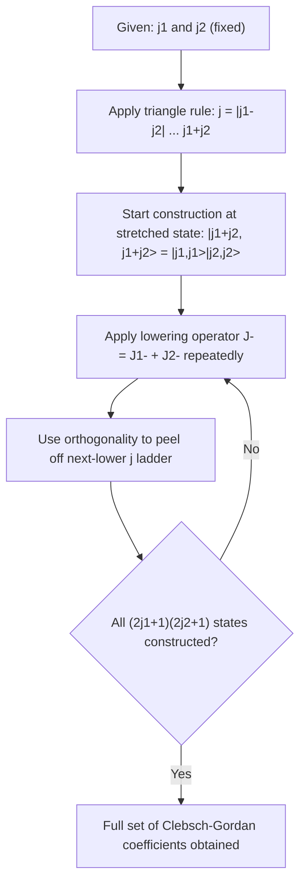

## Addition of Angular Momenta

### Overview

The addition of angular momenta addresses how two (or more) angular momentum operators — orbital, spin, or a combination — combine to form a total angular momentum operator. This formalism is essential for multi-particle systems, multi-electron atoms, nuclear structure, and any scenario involving coupled quantum degrees of freedom. The central mathematical tool is the transformation between **uncoupled** and **coupled** bases, mediated by **Clebsch-Gordan coefficients**.

### The General Problem

Given two angular momentum operators $\hat{\mathbf{J}}_1$ and $\hat{\mathbf{J}}_2$ (each independently satisfying the standard angular momentum commutation algebra and acting on different degrees of freedom, so $[\hat{J}_{1i}, \hat{J}_{2j}] = 0$ for all $i,j$), define the total angular momentum:

$$\hat{\mathbf{J}} = \hat{\mathbf{J}}_1 + \hat{\mathbf{J}}_2$$

$\hat{\mathbf{J}}$ can be shown to satisfy the same commutation relations as any angular momentum operator:

$$[\hat{J}_i, \hat{J}_j] = i\hbar\epsilon_{ijk}\hat{J}_k$$

This guarantees that $\hat{J}^2$ and $\hat{J}_z$ have well-defined simultaneous eigenstates $|j, m_j\rangle$, just as for a single angular momentum.

### Two Complete Bases

**Uncoupled basis**: Simultaneous eigenstates of $\hat{J}_1^2$, $\hat{J}_{1z}$, $\hat{J}_2^2$, $\hat{J}_{2z}$:

$$|j_1, m_1\rangle \otimes |j_2, m_2\rangle \equiv |j_1, m_1; j_2, m_2\rangle$$

This basis has dimension $(2j_1+1)(2j_2+1)$.

**Coupled basis**: Simultaneous eigenstates of $\hat{J}^2$, $\hat{J}_z$, $\hat{J}_1^2$, $\hat{J}_2^2$:

$$|j, m_j; j_1, j_2\rangle$$

**Key Points**

- Both bases span the *same* total Hilbert space of dimension $(2j_1+1)(2j_2+1)$.
- $\hat{J}_1^2$ and $\hat{J}_2^2$ commute with $\hat{J}^2$ and $\hat{J}_z$, so $j_1$ and $j_2$ remain good quantum numbers in *both* bases.
- $\hat{J}_{1z}$ and $\hat{J}_{2z}$ individually do **not** commute with $\hat{J}^2$, so $m_1$ and $m_2$ are not simultaneously well-defined with $j$ in the coupled basis.

### The Clebsch-Gordan Series (Allowed Values of j)

Given fixed $j_1$ and $j_2$, the possible values of total angular momentum quantum number $j$ are:

$$j = |j_1 - j_2|, \, |j_1 - j_2| + 1, \, \ldots, \, j_1 + j_2$$

This is the **triangle rule** — $j$, $j_1$, $j_2$ must be able to form the sides of a triangle (including degenerate cases). For each allowed $j$, $m_j$ ranges over $2j+1$ values from $-j$ to $j$, and:

$$m_j = m_1 + m_2$$

**Dimension check**: The total number of coupled states must equal the uncoupled dimension:

$$\sum_{j=|j_1-j_2|}^{j_1+j_2} (2j+1) = (2j_1+1)(2j_2+1)$$

This identity always holds and serves as a useful consistency check after enumerating allowed $j$ values.

### Worked Example 1: Two Spin-1/2 Particles

**Example**

Find the allowed total spin states for two spin-$\tfrac{1}{2}$ particles ($j_1 = j_2 = \tfrac{1}{2}$).

Triangle rule: $j = |{\tfrac12 - \tfrac12}|, \ldots, \tfrac12+\tfrac12 = 0, 1$

- $j=1$ (**triplet**): 3 states ($m_j = -1, 0, +1$)
- $j=0$ (**singlet**): 1 state ($m_j = 0$)

**Dimension check**: $(2 \times 1) + (2 \times 0 + 1) = 3 + 1 = 4 = (2)(2)$ ✓, matching the uncoupled basis $\{|\uparrow\uparrow\rangle, |\uparrow\downarrow\rangle, |\downarrow\uparrow\rangle, |\downarrow\downarrow\rangle\}$.

**Explicit states (Clebsch-Gordan construction):**

$$|1, 1\rangle = |\uparrow\uparrow\rangle$$

$$|1, 0\rangle = \frac{1}{\sqrt{2}}\left(|\uparrow\downarrow\rangle + |\downarrow\uparrow\rangle\right)$$

$$|1, -1\rangle = |\downarrow\downarrow\rangle$$

$$|0, 0\rangle = \frac{1}{\sqrt{2}}\left(|\uparrow\downarrow\rangle - |\downarrow\uparrow\rangle\right)$$

The triplet states are symmetric under particle exchange; the singlet state is antisymmetric. This symmetry property is fundamental to the theory of identical particles (e.g., the two-electron system in helium and in covalent bonding).

### Constructing Clebsch-Gordan Coefficients: The Stretched State Method

The state with maximum $j = j_1+j_2$ and maximum $m_j = j_1+j_2$ is always a **single, unambiguous product state**:

$$|j_1+j_2, j_1+j_2\rangle = |j_1,j_1\rangle|j_2,j_2\rangle$$

**Procedure to build the full CG table:**

1. Start from the stretched state (above) — always exactly one term, coefficient $= 1$.
2. Apply the lowering operator $\hat{J}_- = \hat{J}_{1-} + \hat{J}_{2-}$ to generate $|j_1+j_2, m_j-1\rangle$ as a superposition of uncoupled states.
3. Use orthogonality to states already constructed to find the next-highest $j$ state at the same $m_j$.
4. Repeat, descending in $m_j$ and constructing new $j$ ladders via orthogonality, until all $(2j_1+1)(2j_2+1)$ states are found.

### Worked Example 2: Applying the Lowering Operator

**Example**

For $j_1 = 1$, $j_2 = \tfrac12$, construct $|j{=}\tfrac32, m_j{=}\tfrac12\rangle$ starting from the stretched state.

**Step 1 — Stretched state:**

$$\left|\tfrac32, \tfrac32\right\rangle = |1,1\rangle\left|\tfrac12,\tfrac12\right\rangle$$

**Step 2 — Apply $\hat{J}_- = \hat{J}_{1-}+\hat{J}_{2-}$:**

Using $\hat{J}_-|j,m\rangle = \hbar\sqrt{j(j+1)-m(m-1)}\,|j,m-1\rangle$:

LHS: $\hat{J}_-\left|\tfrac32,\tfrac32\right\rangle = \hbar\sqrt{3}\left|\tfrac32,\tfrac12\right\rangle$

RHS: $\hat{J}_{1-}|1,1\rangle\left|\tfrac12,\tfrac12\right\rangle + |1,1\rangle\hat{J}_{2-}\left|\tfrac12,\tfrac12\right\rangle = \hbar\sqrt{2}\,|1,0\rangle\left|\tfrac12,\tfrac12\right\rangle + \hbar\,|1,1\rangle\left|\tfrac12,-\tfrac12\right\rangle$

**Step 3 — Solve for the target state:**

$$\left|\tfrac32,\tfrac12\right\rangle = \sqrt{\tfrac23}\,|1,0\rangle\left|\tfrac12,\tfrac12\right\rangle + \sqrt{\tfrac13}\,|1,1\rangle\left|\tfrac12,-\tfrac12\right\rangle$$

**Output**

This matches the result quoted in the earlier orbital-spin coupling example, confirming consistency of the construction method for $l=1$, $s=1/2$.

### Clebsch-Gordan Coefficients: Notation and Properties

The general expansion is written:

$$|j, m_j\rangle = \sum_{m_1, m_2} \langle j_1, m_1; j_2, m_2 | j, m_j\rangle \, |j_1, m_1\rangle|j_2, m_2\rangle$$

The coefficients $\langle j_1, m_1; j_2, m_2 | j, m_j \rangle$ are the **Clebsch-Gordan (CG) coefficients**. Key properties:

- **Selection rule**: CG coefficient is zero unless $m_j = m_1 + m_2$.
- **Orthogonality**: $\sum_{m_1,m_2}\langle j_1 m_1 j_2 m_2|jm_j\rangle\langle j_1 m_1 j_2 m_2|j'm_j'\rangle = \delta_{jj'}\delta_{m_jm_j'}$
- **Real-valued**: By the Condon-Shortley phase convention, CG coefficients are always real numbers (never complex).
- **Symmetry relations**: CG coefficients relate under exchange of $j_1 \leftrightarrow j_2$ and sign reversal of all $m$ values, e.g. $\langle j_1 m_1 j_2 m_2|jm_j\rangle = (-1)^{j_1+j_2-j}\langle j_1,-m_1;j_2,-m_2|j,-m_j\rangle$

[Inference] For coupling more than two angular momentum quantum numbers, or for computational applications, values are typically obtained from tabulated CG tables or software libraries rather than re-derived by hand, since the ladder-operator method becomes algebraically cumbersome beyond small $j_1, j_2$.

### Practical Applications

- **Multi-electron atoms (LS coupling / Russell-Saunders coupling)**: Individual electron orbital angular momenta $\{l_i\}$ couple to total $L$; individual spins $\{s_i\}$ couple to total $S$; then $L$ and $S$ couple to $J$. Valid for light atoms where spin-orbit interaction is weaker than electrostatic repulsion.
- **jj-coupling**: For heavy atoms, each electron's $l_i$ and $s_i$ couple individually to $j_i$ first, then all $j_i$ combine to total $J$. Used when spin-orbit interaction dominates over electron-electron interaction.
- **Nuclear physics**: Total nuclear spin arises from coupling of individual nucleon spins and orbital angular momenta within the nuclear shell model.
- **Two-particle entangled states**: The singlet state $|0,0\rangle$ constructed above is a canonical example of a maximally entangled two-particle state, foundational to quantum information theory (e.g., Bell states) and tests of quantum nonlocality (Bell inequality violations, EPR-type experiments).
- **Selection rules in spectroscopy**: Photon emission/absorption selection rules ($\Delta j = 0, \pm1$; $j=0 \to j=0$ forbidden) follow directly from angular momentum addition rules combined with the photon's intrinsic spin ($s_{\text{photon}}=1$).

### Diagram: Angular Momentum Addition Procedure

### Diagram: Coupling Scheme for Two Spin-1/2 Particles (svg_diagram)

<svg xmlns="http://www.w3.org/2000/svg" viewBox="0 0 560 260">
<text x="280" y="25" font-size="16" font-weight="bold" text-anchor="middle" fill="#1a1a1a">Two Spin-1/2 Coupling: Triplet and Singlet (svg_diagram)</text>

<rect x="30" y="60" width="180" height="140" fill="none" stroke="#555" stroke-width="1.5" />
<text x="120" y="80" font-size="13" text-anchor="middle" font-weight="bold" fill="#1a1a1a">Uncoupled Basis</text>
<text x="120" y="105" font-size="12" text-anchor="middle" fill="#1a1a1a">|↑↑⟩</text>
<text x="120" y="130" font-size="12" text-anchor="middle" fill="#1a1a1a">|↑↓⟩</text>
<text x="120" y="155" font-size="12" text-anchor="middle" fill="#1a1a1a">|↓↑⟩</text>
<text x="120" y="180" font-size="12" text-anchor="middle" fill="#1a1a1a">|↓↓⟩</text>

<line x1="220" y1="130" x2="300" y2="130" stroke="#1a1a1a" stroke-width="2" />
<polygon points="300,124 315,130 300,136" fill="#1a1a1a" />
<text x="260" y="118" font-size="11" text-anchor="middle" fill="#1a1a1a">CG</text>

<rect x="330" y="60" width="200" height="140" fill="none" stroke="#555" stroke-width="1.5" />
<text x="430" y="80" font-size="13" text-anchor="middle" font-weight="bold" fill="#1a1a1a">Coupled Basis</text>
<text x="430" y="105" font-size="12" text-anchor="middle" fill="#c0392b">j=1, m=+1: |↑↑⟩</text>
<text x="430" y="130" font-size="12" text-anchor="middle" fill="#c0392b">j=1, m=0: (|↑↓⟩+|↓↑⟩)/√2</text>
<text x="430" y="155" font-size="12" text-anchor="middle" fill="#c0392b">j=1, m=-1: |↓↓⟩</text>
<text x="430" y="180" font-size="12" text-anchor="middle" fill="#2980b9">j=0, m=0: (|↑↓⟩-|↓↑⟩)/√2</text>

<text x="280" y="230" font-size="12" text-anchor="middle" fill="`#1a1a1a`">Triplet (j=1, symmetric) and Singlet (j=0, antisymmetric)</text>

</svg>

### Common Misconceptions

- **Assuming $j = j_1 + j_2$ always**: The triangle rule permits a *range* of $j$ values, not just the maximum sum. Only the stretched state corresponds uniquely to $j = j_1+j_2$.
- **Treating $m_1, m_2$ as good quantum numbers in the coupled basis**: In the coupled representation $|j, m_j\rangle$, individual $m_1$ and $m_2$ are not sharp — the state is generally a superposition over allowed $(m_1, m_2)$ pairs satisfying $m_1+m_2=m_j$.
- **Forgetting the selection rule $m_j = m_1+m_2$**: This is often the fastest way to identify which uncoupled product terms can contribute to a given coupled state.
- **Confusing symmetric/antisymmetric labeling with $j$ parity in general**: For two spin-1/2 particles specifically, triplet ($j=1$) is symmetric and singlet ($j=0$) is antisymmetric, but this exact correspondence does not generalize unmodified to arbitrary $j_1, j_2$.

### Conclusion

The addition of angular momenta provides the systematic framework for combining two independent angular momentum operators into eigenstates of total angular momentum, governed by the triangle rule $j = |j_1-j_2|, \ldots, j_1+j_2$ and connected to the uncoupled product basis through Clebsch-Gordan coefficients. This formalism, illustrated concretely through the two-spin-1/2 system's triplet/singlet decomposition, underlies multi-electron atomic structure, nuclear shell coupling schemes, spectroscopic selection rules, and the construction of maximally entangled quantum states.

**Related Topics**

- Wigner 3-j, 6-j, and 9-j symbols
- Wigner-Eckart theorem and tensor operator matrix elements
- LS coupling vs. jj coupling in multi-electron atoms
- Identical particles, exchange symmetry, and the Pauli exclusion principle
- Bell states and entanglement in quantum information
- Nuclear shell model and total nuclear spin
- Irreducible representations of SU(2) and rotation group theory