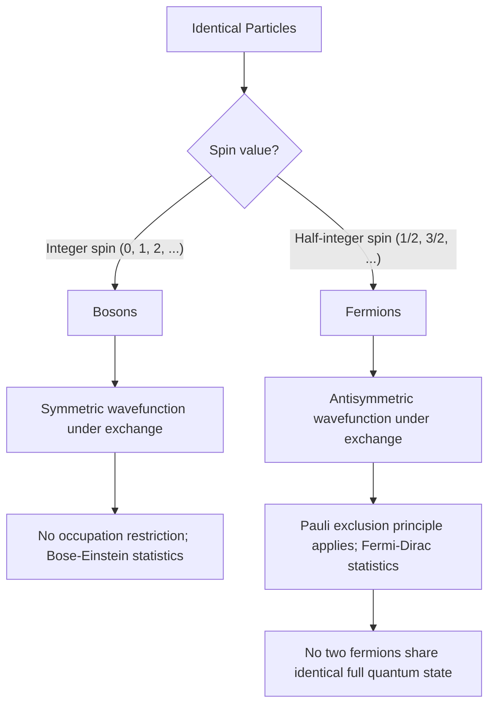

## Identical Particles and the Pauli Exclusion Principle

### Overview

In quantum mechanics, **identical particles** (e.g., all electrons, all photons) are fundamentally indistinguishable — not merely difficult to tell apart, but in principle impossible to label or track individually. This indistinguishability imposes strict symmetry requirements on multi-particle wavefunctions, dividing all particles into two classes: **bosons** (symmetric wavefunctions) and **fermions** (antisymmetric wavefunctions). The **Pauli exclusion principle** is a direct consequence of fermion antisymmetry and underlies atomic structure, the periodic table, and the stability of matter itself.

### Indistinguishability and the Exchange Operator

**Classical vs. Quantum Indistinguishability**

Classically, identical particles (e.g., two billiard balls of the same mass) can still be distinguished by tracking continuous trajectories. In quantum mechanics, wavefunctions overlap and particles have no well-defined trajectories, so if two particles share all intrinsic properties (mass, charge, spin), there is no physical means — even in principle — to determine "which particle is which" after any interaction.

**The Exchange (Permutation) Operator**

Define the particle exchange operator $\hat{P}_{12}$ acting on a two-particle wavefunction:

$$\hat{P}_{12}\,\psi(\mathbf{r}_1, \mathbf{r}_2) = \psi(\mathbf{r}_2, \mathbf{r}_1)$$

Since swapping identical particles cannot change any physically observable quantity, the Hamiltonian must commute with $\hat{P}_{12}$:

$$[\hat{H}, \hat{P}_{12}] = 0$$

This means $\hat{H}$ and $\hat{P}_{12}$ share simultaneous eigenstates. Since applying $\hat{P}_{12}$ twice returns the original state ($\hat{P}_{12}^2 = 1$), the eigenvalues of $\hat{P}_{12}$ must be $\pm 1$:

$$\hat{P}_{12}\,\psi = \pm\,\psi$$

### Bosons and Fermions

**Symmetric wavefunctions (eigenvalue $+1$) — Bosons:**

$$\psi(\mathbf{r}_1, \mathbf{r}_2) = +\psi(\mathbf{r}_2, \mathbf{r}_1)$$

Particles with **integer spin** ($s = 0, 1, 2, \ldots$) are bosons: photons, gluons, W/Z bosons, the Higgs boson, and composite particles like $^4\text{He}$ atoms.

**Antisymmetric wavefunctions (eigenvalue $-1$) — Fermions:**

$$\psi(\mathbf{r}_1, \mathbf{r}_2) = -\psi(\mathbf{r}_2, \mathbf{r}_1)$$

Particles with **half-integer spin** ($s = \tfrac12, \tfrac32, \ldots$) are fermions: electrons, protons, neutrons, quarks, and neutrinos.

**Key Points**

- This connection between spin and exchange symmetry is the **spin-statistics theorem**, a result derivable from relativistic quantum field theory (proven rigorously by Pauli in 1940), though it can be motivated but not fully derived from non-relativistic quantum mechanics alone.
- The symmetry classification is a strict, universal property of the particle species — no physical system realizes a "partially symmetric" state for genuinely identical particles.

### Constructing Symmetric and Antisymmetric Wavefunctions

Given two single-particle states $\phi_a$ and $\phi_b$, the properly symmetrized/antisymmetrized two-particle states are:

**Bosons (symmetric):**

$$\psi_S(\mathbf{r}_1,\mathbf{r}_2) = \frac{1}{\sqrt{2}}\left[\phi_a(\mathbf{r}_1)\phi_b(\mathbf{r}_2) + \phi_b(\mathbf{r}_1)\phi_a(\mathbf{r}_2)\right]$$

**Fermions (antisymmetric):**

$$\psi_A(\mathbf{r}_1,\mathbf{r}_2) = \frac{1}{\sqrt{2}}\left[\phi_a(\mathbf{r}_1)\phi_b(\mathbf{r}_2) - \phi_b(\mathbf{r}_1)\phi_a(\mathbf{r}_2)\right]$$

**Critical observation**: If $\phi_a = \phi_b$ (both particles in the *same* single-particle state), then $\psi_A \to 0$ identically — the antisymmetric wavefunction vanishes. This vanishing is the mathematical origin of the Pauli exclusion principle.

### The Pauli Exclusion Principle

**Statement**: No two identical fermions can occupy the same complete quantum state simultaneously.

This follows directly from the antisymmetry requirement: since $\psi_A = 0$ when both particles share identical quantum numbers, such a configuration has zero probability amplitude and therefore cannot occur.

**Formal statement including spin**: For electrons in an atom, "complete quantum state" means the full set of quantum numbers $(n, l, m_l, m_s)$. No two electrons in an atom can have identical values of all four quantum numbers.

[Inference] The exclusion principle is often stated as a separate postulate in introductory treatments, but it is more fundamentally understood as a *consequence* of antisymmetrization required by fermionic exchange statistics, not an independent physical law.

### Total Wavefunction: Spatial × Spin

For particles with spin (like electrons), the total wavefunction is a product of spatial and spin parts, and the *overall* wavefunction (spatial × spin) must be antisymmetric under exchange for fermions:

$$\Psi_{\text{total}} = \psi_{\text{spatial}} \times \chi_{\text{spin}}$$

This allows two combinations:

| Spatial part | Spin part | Overall symmetry |
| --- | --- | --- |
| Symmetric | Antisymmetric (singlet, $S=0$) | Antisymmetric ✓ |
| Antisymmetric | Symmetric (triplet, $S=1$) | Antisymmetric ✓ |

This is why, for two-electron systems (e.g., helium, or two electrons in a bonding orbital), a symmetric spatial wavefunction *forces* the spin state into the antisymmetric singlet, and vice versa. This spatial-spin correlation, even without any explicit spin-dependent force in the Hamiltonian, produces an effective energy difference between singlet and triplet configurations — the origin of the **exchange interaction** and **exchange energy**, which is responsible for ferromagnetism and Hund's rules.

### Worked Example: Two Electrons in an Infinite Square Well

**Example**

Two non-interacting electrons occupy an infinite square well of width $L$. Construct the ground-state total wavefunction, accounting for antisymmetrization.

Single-particle infinite well eigenstates: $\phi_n(x) = \sqrt{\tfrac{2}{L}}\sin\left(\tfrac{n\pi x}{L}\right)$, with energy $E_n = \tfrac{n^2\pi^2\hbar^2}{2mL^2}$.

**If electrons could occupy the same spatial state** ($n=1$ for both): The spatial part would be symmetric, $\phi_1(x_1)\phi_1(x_2)$, forcing the spin state to be the antisymmetric singlet. This *is* allowed (Pauli exclusion permits identical spatial quantum numbers only if spins are opposite):

$$\Psi = \phi_1(x_1)\phi_1(x_2) \times \frac{1}{\sqrt2}\left(|\uparrow\downarrow\rangle - |\downarrow\uparrow\rangle\right)$$

Total ground-state energy: $E = 2E_1 = \dfrac{\pi^2\hbar^2}{mL^2}$

**Output**

This confirms the exclusion principle does *not* forbid two electrons from sharing the same spatial orbital — it forbids them from sharing the same *complete* state including spin. Two electrons in the same orbital must have opposite (paired) spins, exactly as taught in the Aufbau principle for electron configurations.

### The Slater Determinant

For $N$ identical fermions, the antisymmetrized wavefunction generalizes to the **Slater determinant**:

$$\Psi(\mathbf{r}_1,\ldots,\mathbf{r}_N) = \frac{1}{\sqrt{N!}}\begin{vmatrix}

\phi_1(\mathbf{r}_1) & \phi_2(\mathbf{r}_1) & \cdots & \phi_N(\mathbf{r}_1) \

\phi_1(\mathbf{r}_2) & \phi_2(\mathbf{r}_2) & \cdots & \phi_N(\mathbf{r}_2) \

\vdots & \vdots & \ddots & \vdots \

\phi_1(\mathbf{r}_N) & \phi_2(\mathbf{r}_N) & \cdots & \phi_N(\mathbf{r}_N)

\end{vmatrix}$$

The determinant structure automatically enforces antisymmetry: swapping any two particles (rows) swaps two rows of the determinant, which changes its sign — precisely the required antisymmetry. Furthermore, if any two single-particle states $\phi_i = \phi_j$ are identical, the determinant has two identical columns and evaluates to zero, again reproducing the Pauli exclusion principle directly from determinant algebra.

[Inference] The Slater determinant is an approximation method (assuming non-interacting or effectively independent particles) rather than an exact solution for interacting many-body systems; real atomic and molecular calculations typically use it as a starting basis for further correlation corrections (e.g., configuration interaction, Hartree-Fock theory).

### Applications and Physical Consequences

- **Periodic table structure**: The exclusion principle dictates that electrons fill atomic orbitals in order of increasing energy, with at most 2 electrons (opposite spins) per spatial orbital, directly producing electron shell structure and periodic chemical properties.
- **Degeneracy pressure**: In white dwarfs and neutron stars, exclusion-principle-driven degeneracy pressure among electrons/neutrons counteracts gravitational collapse, even at zero temperature. This is the physical basis for the Chandrasekhar mass limit.
- **Bose-Einstein condensation**: Bosons, unbounded by exclusion, can macroscopically occupy a single ground state at sufficiently low temperature — the defining phenomenon of Bose-Einstein condensates, observed experimentally in ultracold atomic gases.
- **Chemical bonding**: Covalent bond formation (e.g., $\text{H}_2$) relies on symmetric spatial wavefunctions paired with antisymmetric (singlet) spin states for the bonding electron pair.
- **Hund's rules**: Electrons occupying degenerate orbitals (e.g., in the same subshell) preferentially align spins (maximizing total $S$) due to exchange energy minimization, before pairing becomes necessary.

### Diagram: Exchange Symmetry Classification

### Diagram: Antisymmetrization Producing the Exclusion Principle (svg_diagram)

<svg xmlns="http://www.w3.org/2000/svg" viewBox="0 0 560 260">
<text x="280" y="25" font-size="16" font-weight="bold" text-anchor="middle" fill="#1a1a1a">Antisymmetric Wavefunction Vanishes for Identical States (svg_diagram)</text>

<text x="280" y="65" font-size="14" text-anchor="middle" fill="`#1a1a1a`">psi_A(r1,r2) = [phi_a(r1) phi_b(r2) - phi_b(r1) phi_a(r2)] / sqrt(2)</text>

<line x1="60" y1="100" x2="500" y2="100" stroke="#999" stroke-width="1" />

<text x="280" y="130" font-size="13" text-anchor="middle" fill="`#2980b9`">Case: a ≠ b (different states)</text>

<text x="280" y="155" font-size="12" text-anchor="middle" fill="`#2980b9`">psi_A is nonzero → allowed configuration</text>

<line x1="60" y1="175" x2="500" y2="175" stroke="#999" stroke-width="1" />

<text x="280" y="200" font-size="13" text-anchor="middle" fill="`#c0392b`">Case: a = b (identical states)</text>

<text x="280" y="225" font-size="12" text-anchor="middle" fill="`#c0392b`">psi_A = [phi_a(r1)phi_a(r2) - phi_a(r1)phi_a(r2)]/sqrt(2) = 0</text>

<text x="280" y="248" font-size="12" text-anchor="middle" fill="`#c0392b`">Forbidden by Pauli exclusion principle</text>

</svg>

### Common Misconceptions

- **"Electrons in the same orbital violate exclusion"**: False — two electrons *can* share the same spatial orbital, provided their spins are opposite (paired), making the full quantum state distinct.
- **Treating identical particles as merely "hard to distinguish"**: Quantum indistinguishability is a fundamental postulate, not a practical limitation; even with unlimited measurement precision, no observable in principle distinguishes which identical particle is which.
- **Assuming the Pauli principle applies to bosons**: The exclusion principle is exclusive to fermions; bosons face no such restriction and can macroscopically populate a single state (as in lasers or BEC).
- **Confusing symmetrization with normalization**: Symmetrized/antisymmetrized combinations still require proper normalization (the $1/\sqrt{2}$ factor above assumes $\phi_a \neq \phi_b$ and orthonormal single-particle states); the general normalization constant changes when more than two particles or non-orthogonal states are involved.

### Conclusion

Identical particles in quantum mechanics must be classified as bosons (symmetric wavefunctions, integer spin) or fermions (antisymmetric wavefunctions, half-integer spin) per the spin-statistics theorem, with no intermediate case permitted. Antisymmetrization of fermionic wavefunctions—formalized compactly via the Slater determinant—directly yields the Pauli exclusion principle, forbidding any two identical fermions from sharing a complete quantum state. This single principle underlies atomic shell structure, the periodic table, chemical bonding, degeneracy pressure in compact stars, and the qualitative distinction between fermionic and bosonic matter throughout physics.

**Related Topics**

- Slater determinants and Hartree-Fock theory
- Exchange energy, exchange interaction, and Hund's rules
- Bose-Einstein condensation and Fermi-Dirac statistics
- Degeneracy pressure: white dwarfs and neutron stars
- Second quantization and creation/annihilation operators
- Spin-statistics theorem in relativistic quantum field theory
- Multi-electron atomic configurations and the Aufbau principle