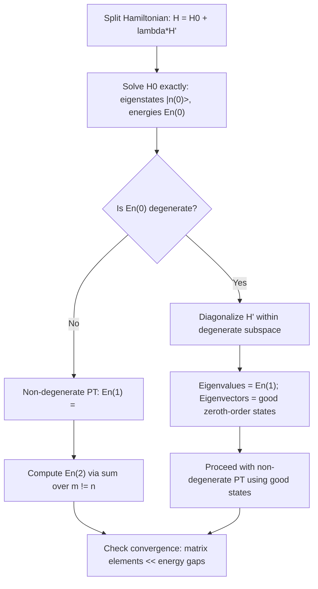

## Time-Independent Perturbation Theory

### Overview

Time-independent perturbation theory (TIPT) is a systematic approximation method for finding energy eigenvalues and eigenstates of a Hamiltonian $\hat{H}$ that is "close to" an exactly solvable Hamiltonian $\hat{H}_0$. Since exact analytic solutions of the Schrödinger equation exist for only a small set of idealized systems (infinite well, harmonic oscillator, hydrogen atom, etc.), perturbation theory extends this limited exact toolkit to the vast majority of realistic physical systems by treating small additional interactions as corrections.

### Setup and Fundamental Assumption

The total Hamiltonian is split into an exactly solvable part and a small perturbation:

$$\hat{H} = \hat{H}_0 + \lambda \hat{H}'$$

where $\hat{H}_0$ has known, exact eigenstates and eigenvalues:

$$\hat{H}_0 |n^{(0)}\rangle = E_n^{(0)} |n^{(0)}\rangle$$

$\lambda$ is a bookkeeping parameter (formally set to $\lambda = 1$ at the end) used to organize the expansion order by order, and $\hat{H}'$ is the perturbing interaction, assumed "small" relative to $\hat{H}_0$ in a sense made precise by the convergence conditions discussed below.

The energies and states of the full Hamiltonian are expanded as power series in $\lambda$:

$$E_n = E_n^{(0)} + \lambda E_n^{(1)} + \lambda^2 E_n^{(2)} + \cdots$$

$$|n\rangle = |n^{(0)}\rangle + \lambda|n^{(1)}\rangle + \lambda^2|n^{(2)}\rangle + \cdots$$

### Non-Degenerate Perturbation Theory

**First-Order Energy Correction**

Substituting the expansions into $\hat{H}|n\rangle = E_n|n\rangle$ and collecting terms order by order in $\lambda$, the first-order energy shift is:

$$E_n^{(1)} = \langle n^{(0)} | \hat{H}' | n^{(0)} \rangle$$

This is simply the expectation value of the perturbation in the *unperturbed* state — the simplest and most commonly used result in perturbation theory.

**First-Order State Correction**

$$|n^{(1)}\rangle = \sum_{m \neq n} \frac{\langle m^{(0)}|\hat{H}'|n^{(0)}\rangle}{E_n^{(0)} - E_m^{(0)}} |m^{(0)}\rangle$$

The state correction mixes in contributions from all other unperturbed states $|m^{(0)}\rangle$, weighted by the matrix element of $\hat{H}'$ and inversely by the energy gap to state $n$. This immediately reveals the **non-degeneracy requirement**: if $E_m^{(0)} = E_n^{(0)}$ for $m \neq n$, the denominator vanishes and the expansion diverges — hence the need for degenerate perturbation theory (below) when degeneracies are present.

**Second-Order Energy Correction**

$$E_n^{(2)} = \sum_{m \neq n} \frac{|\langle m^{(0)}|\hat{H}'|n^{(0)}\rangle|^2}{E_n^{(0)} - E_m^{(0)}}$$

**Key Points**

- The ground state's second-order energy correction is **always negative** ($E_0^{(0)} - E_m^{(0)} < 0$ for all $m \neq 0$ when $n=0$ is the lowest state), reflecting that mixing with higher states always lowers the ground-state energy — a general variational-theorem consequence.
- Second-order corrections are dominated by nearby states (small energy denominator) with strong coupling matrix elements (large numerator); distant, weakly-coupled states contribute negligibly.

### Worked Example 1: Perturbed Infinite Square Well

**Example**

An infinite square well of width $L$ (unperturbed states $\phi_n(x) = \sqrt{2/L}\sin(n\pi x/L)$, energies $E_n^{(0)} = n^2\pi^2\hbar^2/2mL^2$) is perturbed by a small constant potential bump $H' = V_0$ for $0 < x < L$ (uniform across the well).

**First-order correction:**

$$E_n^{(1)} = \langle n|V_0|n\rangle = V_0 \int_0^L |\phi_n(x)|^2\,dx = V_0$$

**Output**

Since $H' = V_0$ is a constant, it commutes with $\hat{H}_0$ and the first-order result is exact for all orders — every energy level shifts by exactly $V_0$, with no change to the eigenstates. This trivial case is a useful sanity check: constant potential shifts must reproduce $E_n \to E_n^{(0)} + V_0$ exactly.

### Worked Example 2: Anharmonic Oscillator Perturbation

**Example**

A harmonic oscillator ($\hat{H}_0 = \hat{p}^2/2m + \tfrac12 m\omega^2 x^2$) is perturbed by a quartic term $\hat{H}' = \lambda x^4$. Find the first-order ground-state energy correction.

Using the standard result $\langle 0|x^4|0\rangle = \dfrac{3\hbar^2}{4m^2\omega^2}$ (computable via ladder operators $x = \sqrt{\hbar/2m\omega}(\hat{a}+\hat{a}^\dagger)$):

$$E_0^{(1)} = \lambda\langle 0|x^4|0\rangle = \frac{3\lambda\hbar^2}{4m^2\omega^2}$$

This is a standard textbook result illustrating how ladder-operator matrix elements make perturbative calculations tractable for the harmonic oscillator basis, which is why $\hat{H}_0 = $ harmonic oscillator appears frequently as the unperturbed system in this formalism (e.g., in molecular vibration anharmonicity and quantum field theory).

### Degenerate Perturbation Theory

**The Problem**

When $E_n^{(0)}$ is $g$-fold degenerate (multiple orthogonal states $|n_1^{(0)}\rangle, \ldots, |n_g^{(0)}\rangle$ share the same unperturbed energy), the non-degenerate formula for $|n^{(1)}\rangle$ diverges due to zero energy denominators. The resolution requires **diagonalizing the perturbation within the degenerate subspace first**.

**Procedure**

1. Construct the $g \times g$ matrix of $\hat{H}'$ restricted to the degenerate subspace: $H'_{ij} = \langle n_i^{(0)}|\hat{H}'|n_j^{(0)}\rangle$
2. Diagonalize this matrix. The eigenvalues give the first-order energy corrections $E_n^{(1)}$, and the eigenvectors give the correct "good" zeroth-order linear combinations $|n^{(0)}\rangle_{\text{good}}$ that perturbation theory should be built around.
3. Proceed with standard (now non-degenerate, since the perturbation typically lifts the degeneracy) perturbation theory using these good states.

**Key Points**

- Choosing an *arbitrary* basis within the degenerate subspace (rather than the eigenbasis of $H'_{ij}$) generally gives inconsistent, basis-dependent results at higher order — the diagonalization step is not optional.
- If $\hat{H}'$ happens to already be diagonal in the original degenerate basis, that basis was already the "good" basis, and standard formulas apply immediately.

### Worked Example 3: Degenerate Perturbation (Stark Effect Setup)

**Example**

Consider the $n=2$ level of hydrogen (4-fold degenerate: $2s$, $2p_x$, $2p_y$, $2p_z$) perturbed by a uniform external electric field along $z$: $\hat{H}' = eEz$. Set up the degenerate perturbation matrix.

By parity, $\langle \psi_i | z | \psi_j\rangle$ is nonzero only between states of *opposite* parity (since $z$ is odd under parity, and $2s$ is even while $2p$ states are odd). The relevant nonzero matrix elements couple only $|2s\rangle$ and $|2p_z\rangle$:

$$\langle 2s|\hat{H}'|2p_z\rangle = \langle 2p_z|\hat{H}'|2s\rangle^* \equiv -3eEa_0 \quad (\text{real, standard result})$$

All other matrix elements vanish by symmetry (angular integration over $\phi$ kills $2p_x, 2p_y$ coupling; parity kills same-parity couplings). The $4\times4$ matrix decouples into a $2\times2$ block (for $2s$, $2p_z$) and two trivial $1\times1$ zero blocks (for $2p_x$, $2p_y$, unshifted at first order):

$$H' = \begin{pmatrix} 0 & -3eEa_0 \\ -3eEa_0 & 0 \end{pmatrix}$$

**Output**

Diagonalizing gives eigenvalues $E^{(1)} = \pm 3eEa_0$, meaning the $n=2$ level splits into three distinct energies: $+3eEa_0$, $0$ (doubly degenerate, from $2p_x, 2p_y$), and $-3eEa_0$. This is the **linear Stark effect**, notable for being *linear* in field strength $E$ — a direct consequence of degeneracy, in contrast to the ground state ($n=1$, non-degenerate), which exhibits only a *quadratic* Stark shift via second-order non-degenerate perturbation theory.

### Convergence and Validity Conditions

Perturbation theory is a valid approximation when:

$$\left|\frac{\langle m^{(0)}|\hat{H}'|n^{(0)}\rangle}{E_n^{(0)} - E_m^{(0)}}\right| \ll 1 \quad \text{for all } m \neq n$$

i.e., the perturbation matrix elements must be small compared to the relevant unperturbed energy gaps. This condition can fail even for "physically small" perturbations if energy levels are closely spaced (near-degenerate), which is precisely why degenerate/near-degenerate perturbation theory requires special treatment.

[Inference] Perturbation series in quantum mechanics are frequently only *asymptotic* rather than convergent series (a well-known example being quantum electrodynamics), meaning that including more terms improves accuracy only up to an optimal truncation order, beyond which the approximation can worsen; this behavior is problem-dependent and not guaranteed to occur in every system.

### Diagram: Perturbation Theory Workflow

### Diagram: Energy Level Shifts Under Perturbation (svg_diagram)

<svg xmlns="http://www.w3.org/2000/svg" viewBox="0 0 520 300">
<text x="260" y="25" font-size="16" font-weight="bold" text-anchor="middle" fill="#1a1a1a">Degenerate Level Splitting Under Perturbation (svg_diagram)</text>

<line x1="80" y1="150" x2="220" y2="150" stroke="#1a1a1a" stroke-width="3" />
<text x="150" y="140" font-size="12" text-anchor="middle" fill="#1a1a1a">E_n^(0) (4-fold degenerate)</text>
<text x="150" y="175" font-size="11" text-anchor="middle" fill="#666">Unperturbed</text>

<line x1="230" y1="150" x2="290" y2="150" stroke="#1a1a1a" stroke-width="2" />
<polygon points="290,144 305,150 290,156" fill="#1a1a1a" />
<text x="260" y="140" font-size="11" text-anchor="middle" fill="#1a1a1a">H' turned on</text>

<line x1="320" y1="80" x2="460" y2="80" stroke="#c0392b" stroke-width="3" />
<text x="470" y="85" font-size="12" fill="#c0392b">+3eEa0</text>
<line x1="320" y1="150" x2="460" y2="150" stroke="#27ae60" stroke-width="3" />
<text x="470" y="145" font-size="12" fill="#27ae60">0 (2-fold)</text>
<line x1="320" y1="220" x2="460" y2="220" stroke="#2980b9" stroke-width="3" />
<text x="470" y="225" font-size="12" fill="#2980b9">-3eEa0</text>

<text x="260" y="270" font-size="12" text-anchor="middle" fill="`#1a1a1a`">Perturbation lifts degeneracy: linear Stark splitting of n=2 hydrogen level</text>

</svg>

### Common Misconceptions

- **Applying non-degenerate formulas directly to degenerate levels**: This produces divergent (infinite) results due to zero energy denominators; the degenerate subspace must be diagonalized first.
- **Assuming first-order correction is always sufficient**: Some perturbations (e.g., constant potential shifts) are exact at first order, while others require second-order (or higher) corrections for meaningful accuracy; the appropriate order depends on the physical situation and desired precision.
- **Confusing "small perturbation" with "small energy correction"**: A perturbation can have large matrix elements but still give valid results if unperturbed energy gaps are even larger; validity is governed by the *ratio*, not the absolute size of $\hat{H}'$.
- **Neglecting to check parity/symmetry before computing matrix elements**: As in the Stark effect example, symmetry arguments (parity, angular momentum selection rules) often eliminate most matrix elements before any integral needs to be explicitly evaluated, substantially simplifying degenerate perturbation calculations.

### Conclusion

Time-independent perturbation theory systematically approximates the eigenvalues and eigenstates of a Hamiltonian $\hat{H} = \hat{H}_0 + \lambda\hat{H}'$ by expanding in powers of the perturbation strength, using first-order energy shifts $E_n^{(1)} = \langle n^{(0)}|\hat{H}'|n^{(0)}\rangle$ and second-order corrections built from matrix elements weighted by inverse energy gaps. Degenerate levels require an additional diagonalization step within the degenerate subspace before the standard formulas apply, as demonstrated by the linear Stark effect in hydrogen's $n=2$ level. This formalism is indispensable throughout atomic, molecular, nuclear, and condensed matter physics wherever exact solutions are unavailable but a nearby exactly-solvable reference system exists.

**Related Topics**

- Time-dependent perturbation theory and Fermi's Golden Rule
- Fine structure and hyperfine structure of hydrogen
- Variational method and the Rayleigh-Ritz principle
- WKB (semiclassical) approximation
- Stark effect (linear and quadratic) and Zeeman effect
- Quantum anharmonic oscillators and molecular vibrational spectra
- Rayleigh-Schrödinger vs. Brillouin-Wigner perturbation theory