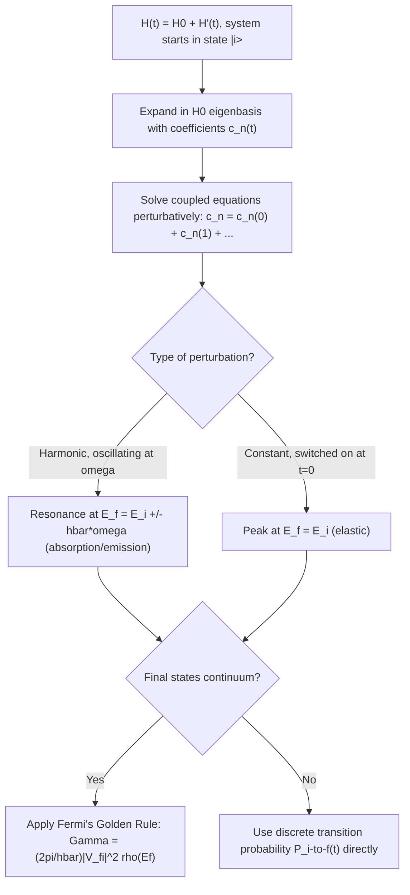

## Time-Dependent Perturbation Theory

### Overview

Time-dependent perturbation theory (TDPT) addresses systems where a Hamiltonian $\hat{H}(t) = \hat{H}_0 + \hat{H}'(t)$ contains an explicitly time-varying perturbation, making the energy eigenstates of $\hat{H}_0$ no longer stationary. This framework calculates **transition probabilities** between quantum states induced by time-dependent interactions — such as an atom absorbing a photon, a system responding to an oscillating electric field, or particle decay — and culminates in **Fermi's Golden Rule**, one of the most widely used results in quantum mechanics.

### Setup: The Interaction Picture

The full time-dependent Schrödinger equation is:

$$i\hbar\frac{\partial}{\partial t}|\Psi(t)\rangle = \left[\hat{H}_0 + \hat{H}'(t)\right]|\Psi(t)\rangle$$

Since $\hat{H}_0$ has known eigenstates $\hat{H}_0|n\rangle = E_n|n\rangle$, expand the full state in this basis with time-dependent coefficients:

$$|\Psi(t)\rangle = \sum_n c_n(t)\, e^{-iE_nt/\hbar}\, |n\rangle$$

The factored phase $e^{-iE_nt/\hbar}$ isolates the trivial free evolution under $\hat{H}_0$, so that $|c_n(t)|^2$ directly represents the **probability of finding the system in state $|n\rangle$ at time $t$**, provided the system started in a definite eigenstate of $\hat{H}_0$.

Substituting into the Schrödinger equation and projecting onto $\langle m|$ yields the exact coupled equations:

$$i\hbar\, \dot{c}_m(t) = \sum_n c_n(t)\, \langle m|\hat{H}'(t)|n\rangle\, e^{i\omega_{mn}t}$$

where $\omega_{mn} \equiv (E_m - E_n)/\hbar$ is the transition (Bohr) angular frequency.

### First-Order Perturbative Solution

**Initial condition**: system starts entirely in state $|i\rangle$, i.e., $c_i(0) = 1$, $c_n(0) = 0$ for $n \neq i$.

**Zeroth order**: $c_n^{(0)}(t) = \delta_{ni}$ (no perturbation, no transitions).

**First order**: Substituting $c_n^{(0)}$ into the RHS of the coupled equations and integrating:

$$c_f^{(1)}(t) = \frac{1}{i\hbar}\int_0^t \langle f|\hat{H}'(t')|i\rangle\, e^{i\omega_{fi}t'}\, dt'$$

The **transition probability** from initial state $|i\rangle$ to final state $|f\rangle$ ($f \neq i$) at time $t$ is:

$$P_{i\to f}(t) = |c_f^{(1)}(t)|^2 = \left|\frac{1}{\hbar}\int_0^t \langle f|\hat{H}'(t')|i\rangle\, e^{i\omega_{fi}t'}\, dt'\right|^2$$

**Key Points**

- This first-order result is valid only when $P_{i\to f} \ll 1$ (weak-perturbation / short-time regime), since the derivation assumed $c_i(t) \approx 1$ throughout — the "undepleted initial state" approximation.
- Higher-order corrections (Dyson series) are required when transition probabilities become significant, or for processes forbidden at first order (e.g., two-photon transitions).

### Case 1: Sinusoidal (Harmonic) Perturbation

A perturbation oscillating at frequency $\omega$, turned on at $t=0$:

$$\hat{H}'(t) = \hat{V}\left(e^{i\omega t} + e^{-i\omega t}\right)$$

(this form represents, e.g., an oscillating electric field coupling to a dipole moment). Carrying out the time integral:

$$c_f^{(1)}(t) = -\frac{i}{\hbar}\langle f|\hat{V}|i\rangle\left[\frac{e^{i(\omega_{fi}+\omega)t}-1}{i(\omega_{fi}+\omega)} + \frac{e^{i(\omega_{fi}-\omega)t}-1}{i(\omega_{fi}-\omega)}\right]$$

Each term is sharply peaked (as a function of $\omega$) near a **resonance condition**:

- $\omega_{fi} \approx -\omega$ (i.e., $E_f = E_i - \hbar\omega$): **stimulated emission** — the perturbation induces a downward transition.
- $\omega_{fi} \approx +\omega$ (i.e., $E_f = E_i + \hbar\omega$): **absorption** — the perturbation induces an upward transition, with the system absorbing energy $\hbar\omega$.

Near resonance, only one term dominates (the other is far off-resonance and negligible), giving the standard **Rabi-type transition probability**:

$$P_{i\to f}(t) \approx \frac{|\langle f|\hat{V}|i\rangle|^2}{\hbar^2}\, \frac{\sin^2\left[(\omega_{fi}-\omega)t/2\right]}{\left[(\omega_{fi}-\omega)/2\right]^2}$$

### Worked Example: Two-Level Atom Driven Near Resonance

**Example**

A two-level atom with states $|1\rangle$ (ground, energy $0$) and $|2\rangle$ (excited, energy $\hbar\omega_0$) is driven by an oscillating field with $\langle 2|\hat{V}|1\rangle = V_0$, at driving frequency $\omega$ close to resonance ($\omega \approx \omega_0$). Find the transition probability to the excited state after time $t$.

Using the resonance-approximated formula with $\omega_{fi} = \omega_0$:

$$P_{1\to 2}(t) = \frac{|V_0|^2}{\hbar^2}\frac{\sin^2[(\omega_0-\omega)t/2]}{[(\omega_0-\omega)/2]^2}$$

**Output**

At exact resonance ($\omega = \omega_0$), this expression's indeterminate form resolves (via L'Hôpital's rule or Taylor expansion) to $P_{1\to2}(t) = (V_0t/\hbar)^2$, growing quadratically in time. [Inference] This quadratic growth is only physically sensible for short times; it violates the requirement $P \le 1$ once $t$ becomes large, signaling that first-order perturbation theory has broken down and the full (non-perturbative) **Rabi oscillation** treatment — which correctly gives $P_{1\to2}(t) = \sin^2(V_0t/\hbar)$, bounded between 0 and 1 — is needed for accurate long-time behavior.

### Case 2: Constant Perturbation Turned On Suddenly

A perturbation switched on at $t=0$ and held constant, $\hat{H}'(t) = \hat{V}$ for $t>0$:

$$c_f^{(1)}(t) = -\frac{i}{\hbar}\langle f|\hat{V}|i\rangle \int_0^t e^{i\omega_{fi}t'}dt' = -\frac{\langle f|\hat{V}|i\rangle}{\hbar\omega_{fi}}\left(e^{i\omega_{fi}t}-1\right)$$

giving:

$$P_{i\to f}(t) = \frac{4|\langle f|\hat{V}|i\rangle|^2}{\hbar^2}\, \frac{\sin^2(\omega_{fi}t/2)}{\omega_{fi}^2}$$

This transition probability, as a function of $\omega_{fi}$ (i.e., of final-state energy $E_f$), has the characteristic **diffraction-like** shape: a central peak of height $\propto t^2$ and width $\propto 1/t$ centered at $\omega_{fi}=0$ ($E_f = E_i$), with decaying side lobes.

### Fermi's Golden Rule

When the final states form a **continuum** (e.g., ionization, scattering, decay into a continuum of momentum states) with density of states $\rho(E_f)$, the transition rate is obtained by summing $P_{i\to f}(t)$ over all final states in a narrow energy range and dividing by $t$. As $t \to \infty$, the sharply peaked $\sin^2(\omega_{fi}t/2)/\omega_{fi}^2$ function approaches a Dirac delta function:

$$\lim_{t\to\infty} \frac{\sin^2(\omega_{fi}t/2)}{\omega_{fi}^2} = \frac{\pi t}{2}\,\delta(\omega_{fi})$$

Substituting and converting to a **constant transition rate** $\Gamma = dP/dt$ gives **Fermi's Golden Rule** for a constant perturbation:

$$\boxed{\Gamma_{i\to f} = \frac{2\pi}{\hbar} |\langle f|\hat{V}|i\rangle|^2\, \rho(E_f)}\Bigg|_{E_f = E_i}$$

For a harmonic perturbation (absorption/emission case), the analogous result is:

$$\Gamma_{i\to f} = \frac{2\pi}{\hbar}|\langle f|\hat{V}|i\rangle|^2\,\rho(E_f)\Big|_{E_f = E_i \pm \hbar\omega}$$

**Key Points**

- Fermi's Golden Rule gives a **constant** transition rate (transitions per unit time), valid in the regime where $t$ is long enough for the delta-function approximation to hold, yet short enough that the initial-state depletion (the "no back-transitions" assumption) remains negligible — the "golden rule regime."
- The rule states that the transition rate is proportional to the squared matrix element (coupling strength) and the density of available final states — more final states to transition into means a faster rate, even if each individual matrix element is unchanged.
- Energy conservation is enforced by the delta function: for a constant perturbation, transitions occur only to states with $E_f = E_i$ (elastic); for a harmonic perturbation, $E_f = E_i \pm \hbar\omega$ (photon absorbed or emitted).

### Worked Example: Fermi's Golden Rule for Photoionization Setup

**Example**

An atom in a bound state $|i\rangle$ is subjected to a harmonic perturbation from incident light at frequency $\omega$, ionizing the atom into a continuum of free-particle final states $|f\rangle$ with density of states $\rho(E_f)$. State the general form of the ionization rate.

Applying the harmonic Fermi's Golden Rule with the resonance condition for absorption ($E_f = E_i + \hbar\omega$):

$$\Gamma_{\text{ionization}} = \frac{2\pi}{\hbar}\left|\langle f|\hat{V}|i\rangle\right|^2 \rho(E_f)\Big|_{E_f = E_i+\hbar\omega}$$

**Output**

This expression forms the theoretical foundation of photoionization cross-section calculations; the explicit rate depends on evaluating the dipole matrix element $\langle f|\hat{V}|i\rangle$ (typically via the dipole approximation $\hat{V} \propto \hat{\mathbf{r}}\cdot\mathbf{E}_0$) between the bound initial state and the continuum final state, which [Inference] generally requires numerical methods or specific approximations (e.g., plane-wave final states) for all but the simplest atomic systems such as hydrogen.

### Selection Rules

Selection rules arise from the vanishing of the matrix element $\langle f|\hat{V}|i\rangle$ due to symmetry, independent of the detailed dynamics. For electric dipole transitions ($\hat{V} \propto \hat{\mathbf{r}}$), standard atomic selection rules are:

$$\Delta l = \pm 1, \qquad \Delta m = 0, \pm 1$$

These follow from parity considerations (position operator is odd under parity, requiring initial and final states to have opposite parity) combined with angular momentum conservation (the photon carries one unit of spin angular momentum, $s_{\text{photon}}=1$).

### Diagram: Time-Dependent Perturbation Theory Workflow

### Diagram: Resonance Structure of Transition Probability (svg_diagram)

<svg xmlns="http://www.w3.org/2000/svg" viewBox="0 0 540 300">
<text x="270" y="25" font-size="16" font-weight="bold" text-anchor="middle" fill="#1a1a1a">Transition Probability vs. Detuning (svg_diagram)</text>

<line x1="60" y1="250" x2="480" y2="250" stroke="#1a1a1a" stroke-width="1.5" />
<line x1="270" y1="250" x2="270" y2="50" stroke="#1a1a1a" stroke-width="1.5" />
<text x="480" y="270" font-size="12" text-anchor="middle" fill="#1a1a1a">omega_fi - omega</text>
<text x="270" y="40" font-size="12" text-anchor="middle" fill="#1a1a1a">P(t)</text>
<text x="270" y="265" font-size="11" text-anchor="middle" fill="#1a1a1a">0 (resonance)</text>

<path d="M 200 250 Q 235 90 270 90 Q 305 90 340 250" fill="none" stroke="#c0392b" stroke-width="2.5" />

<path d="M 140 250 Q 160 200 180 250" fill="none" stroke="#2980b9" stroke-width="2" />
<path d="M 360 250 Q 380 200 400 250" fill="none" stroke="#2980b9" stroke-width="2" />
<path d="M 100 250 Q 115 225 130 250" fill="none" stroke="#2980b9" stroke-width="1.5" />
<path d="M 410 250 Q 425 225 440 250" fill="none" stroke="#2980b9" stroke-width="1.5" />

<text x="270" y="290" font-size="12" text-anchor="middle" fill="`#1a1a1a`">Central peak height ~ t^2, width ~ 1/t; approaches delta function as t → infinity</text>

</svg>

### Common Misconceptions

- **Applying first-order TDPT at all times**: First-order results are valid only while $P_{i\to f} \ll 1$; at long times or strong coupling, the initial state depletes and exact (or Rabi-type) treatments are needed.
- **Confusing Fermi's Golden Rule's applicability**: The Golden Rule specifically requires a *continuum* of final states (or a very dense quasi-continuum); applying it to a genuinely discrete two-level system yields nonsensical results, since no true delta-function limit exists — Rabi oscillations, not a constant rate, describe that case.
- **Ignoring the "golden rule regime" time window**: The rule assumes $t$ large enough for resonance narrowing (delta-function approximation) but small enough that transition probability hasn't saturated; outside this window, the constant-rate approximation is invalid.
- **Overlooking selection rules before computing matrix elements**: As with degenerate perturbation theory, symmetry-based selection rules (parity, $\Delta l$, $\Delta m$) should be checked first, since they often eliminate the need to evaluate an explicit integral that would otherwise vanish.

### Conclusion

Time-dependent perturbation theory computes transition probabilities and rates for quantum systems subject to explicitly time-varying interactions, using a first-order expansion of the coupled amplitude equations in the $\hat{H}_0$ eigenbasis. Harmonic perturbations produce resonant absorption/emission at $E_f = E_i \pm \hbar\omega$, while constant perturbations peak at $E_f = E_i$; in both cases, transitions into a continuum of final states are governed by Fermi's Golden Rule, $\Gamma = (2\pi/\hbar)|\langle f|\hat{V}|i\rangle|^2\rho(E_f)$. This framework underlies atomic spectroscopy, photoionization, radioactive decay rates, and scattering theory throughout modern physics.

**Related Topics**

- Fermi's Golden Rule applications: alpha decay, photoionization, Auger effect
- Rabi oscillations and the rotating wave approximation
- Dipole approximation and atomic selection rules
- Dyson series and higher-order time-dependent perturbation
- Interaction picture and the Schrödinger/Heisenberg pictures
- Sudden and adiabatic approximations
- Scattering theory and the Born approximation