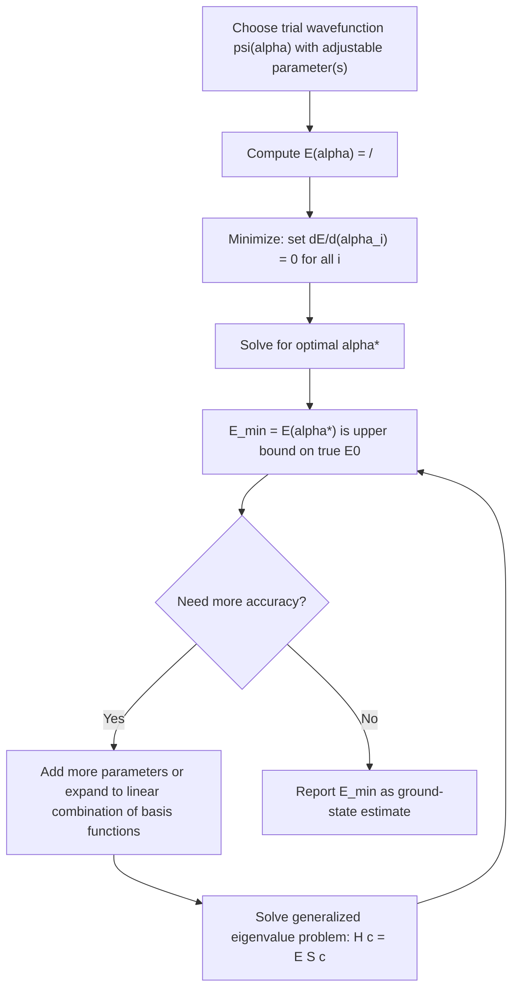

## The Variational Method

### Overview

The variational method (also called the Rayleigh-Ritz method) is an approximation technique for estimating the ground-state energy of a quantum system whose exact Schrödinger equation cannot be solved analytically. Unlike perturbation theory, it requires no small parameter or nearby exactly-solvable Hamiltonian — only an educated guess for the form of the wavefunction. It is one of the most widely used tools in quantum chemistry, atomic physics, and nuclear physics for systems where perturbative expansions are inapplicable or where a genuinely non-perturbative estimate is needed.

### The Variational Theorem

**Statement**: For any normalized trial wavefunction $|\psi\rangle$ (not necessarily an eigenstate of $\hat{H}$), the expectation value of the energy is always greater than or equal to the true ground-state energy $E_0$:

$$\langle \psi|\hat{H}|\psi\rangle \geq E_0$$

with equality if and only if $|\psi\rangle$ equals the true ground state $|\psi_0\rangle$ (up to a phase).

**Proof**

Expand the arbitrary normalized trial state $|\psi\rangle$ in the complete orthonormal basis of true (unknown) energy eigenstates $\{|n\rangle\}$ of $\hat{H}$, with eigenvalues $E_0 \le E_1 \le E_2 \le \cdots$:

$$|\psi\rangle = \sum_n c_n |n\rangle, \qquad \sum_n |c_n|^2 = 1$$

Then:

$$\langle\psi|\hat{H}|\psi\rangle = \sum_n |c_n|^2 E_n$$

Since $E_n \geq E_0$ for every $n$:

$$\sum_n |c_n|^2 E_n \geq \sum_n |c_n|^2 E_0 = E_0 \sum_n |c_n|^2 = E_0$$

Therefore $\langle\psi|\hat{H}|\psi\rangle \geq E_0$, with equality only when all $c_n = 0$ except $c_0$ (i.e., $|\psi\rangle = |0\rangle$ exactly).

**Key Points**

- This theorem holds for *any* normalized trial state, regardless of how poor an approximation it is to the true ground state — it always provides a rigorous **upper bound**, never an underestimate.
- The proof requires no knowledge of the true eigenstates $|n\rangle$ or eigenvalues $E_n$; it only relies on their existence and completeness.

### The Variational Procedure

1. **Choose a trial wavefunction** $\psi(\mathbf{r}; \alpha_1, \alpha_2, \ldots)$ depending on one or more adjustable parameters $\alpha_i$, guided by physical intuition (symmetry, boundary conditions, expected asymptotic behavior).
2. **Compute the energy functional**:

$$E(\alpha_1, \alpha_2, \ldots) = \frac{\langle\psi(\alpha)|\hat{H}|\psi(\alpha)\rangle}{\langle\psi(\alpha)|\psi(\alpha)\rangle}$$

(the denominator is included explicitly so the trial function need not be pre-normalized).

3. **Minimize** $E(\alpha)$ with respect to each parameter:

$$\frac{\partial E}{\partial \alpha_i} = 0 \quad \text{for all } i$$

4. The resulting minimum value $E_{\min} = E(\alpha^*)$ is the **best upper-bound estimate** of $E_0$ achievable within the chosen functional form of the trial wavefunction.

**Key Points**

- The quality of the estimate depends entirely on how well the *functional form* of the trial wavefunction resembles the true ground state — more parameters (more flexibility) generally give a lower (better) upper bound, but at increased computational cost.
- The method estimates only the **ground state** directly; excited-state estimates require additional constraints (e.g., orthogonality to lower states) discussed below.

### Worked Example 1: Ground State of the Quantum Harmonic Oscillator (Using a Gaussian Trial Function)

**Example**

Estimate the ground-state energy of $\hat{H} = -\dfrac{\hbar^2}{2m}\dfrac{d^2}{dx^2} + \dfrac12 m\omega^2 x^2$ using the normalized Gaussian trial function $\psi(x) = \left(\dfrac{2\alpha}{\pi}\right)^{1/4} e^{-\alpha x^2}$, with $\alpha$ as the variational parameter.

**Kinetic energy expectation value:**

$$\langle T \rangle = \frac{\hbar^2 \alpha}{2m}$$

**Potential energy expectation value:**

$$\langle V \rangle = \frac{m\omega^2}{8\alpha}$$

**Total energy functional:**

$$E(\alpha) = \frac{\hbar^2\alpha}{2m} + \frac{m\omega^2}{8\alpha}$$

**Minimize:**

$$\frac{dE}{d\alpha} = \frac{\hbar^2}{2m} - \frac{m\omega^2}{8\alpha^2} = 0 \quad\Rightarrow\quad \alpha^* = \frac{m\omega}{2\hbar}$$

**Substitute back:**

$$E_{\min} = \frac{\hbar^2}{2m}\cdot\frac{m\omega}{2\hbar} + \frac{m\omega^2}{8}\cdot\frac{2\hbar}{m\omega} = \frac{\hbar\omega}{4} + \frac{\hbar\omega}{4} = \frac{\hbar\omega}{2}$$

**Output**

The variational estimate $E_{\min} = \hbar\omega/2$ **exactly** matches the known exact ground-state energy of the harmonic oscillator. This occurs because the true ground state of the harmonic oscillator *is* a Gaussian — the trial function's functional form was rich enough to contain the exact solution, so the variational minimum coincides exactly with $E_0$.

### Worked Example 2: Ground State of Hydrogen (Using a Gaussian Trial Function)

**Example**

Estimate the ground-state energy of the hydrogen atom ($\hat{H} = -\dfrac{\hbar^2}{2m}\nabla^2 - \dfrac{e^2}{4\pi\epsilon_0 r}$) using a normalized Gaussian trial function $\psi(r) = \left(\dfrac{2\alpha}{\pi}\right)^{3/4} e^{-\alpha r^2}$.

Standard integral evaluation gives:

$$\langle T\rangle = \frac{3\hbar^2\alpha}{2m}, \qquad \langle V\rangle = -\frac{e^2}{4\pi\epsilon_0}\sqrt{\frac{8\alpha}{\pi}}$$

Minimizing $E(\alpha) = \langle T\rangle + \langle V\rangle$ with respect to $\alpha$ yields (after calculus):

$$E_{\min} = -\frac{4}{3\pi}\cdot\frac{me^4}{2(4\pi\epsilon_0)^2\hbar^2} \approx -0.424 \times \frac{me^4}{2(4\pi\epsilon_0)^2\hbar^2}$$

**Output**

Comparing to the exact hydrogen ground-state energy $E_0 = -\dfrac{me^4}{2(4\pi\epsilon_0)^2\hbar^2} = -13.6\text{ eV}$, the Gaussian trial estimate gives approximately $-0.424 \times 27.2\text{ eV} \approx -11.5\text{ eV}$ — correctly above (less negative than) $-13.6\text{ eV}$, consistent with the variational theorem, but noticeably less accurate than the harmonic oscillator case. [Inference] This poorer agreement reflects the mismatch between the Gaussian's smooth behavior at $r=0$ and the true hydrogen ground state's cusp (discontinuous derivative) at the origin required by the Coulomb singularity — a known limitation of Gaussian basis functions that is compensated for in practical quantum chemistry calculations by using linear combinations of many Gaussians.

### The Linear Variational Method (Rayleigh-Ritz Matrix Method)

When the trial wavefunction is chosen as a **linear combination** of fixed basis functions $\{\chi_i\}$:

$$\psi = \sum_{i=1}^N c_i \chi_i$$

the variational parameters are the linear coefficients $c_i$ themselves. Minimizing $E(c_1,\ldots,c_N)$ subject to normalization leads to the **generalized matrix eigenvalue equation**:

$$\mathbf{H}\mathbf{c} = E\,\mathbf{S}\mathbf{c}$$

where $H_{ij} = \langle\chi_i|\hat{H}|\chi_j\rangle$ is the Hamiltonian matrix and $S_{ij} = \langle\chi_i|\chi_j\rangle$ is the overlap matrix (equal to the identity matrix if the basis is orthonormal). This reduces the variational problem to a standard linear-algebra eigenvalue problem, solvable numerically for arbitrarily large basis sets.

**Key Points**

- The **lowest eigenvalue** of this matrix equation is a variational upper bound on $E_0$, exactly as in the continuous-parameter case.
- The **Hylleraas-Undheim / MacDonald theorem** extends the variational principle to excited states: the $k$-th lowest eigenvalue of the $N \times N$ matrix problem is a rigorous upper bound on the $k$-th excited state energy $E_{k-1}$, provided $N$ basis functions are used. This is the theoretical foundation for basis-set expansion methods throughout computational quantum chemistry (e.g., Hartree-Fock, configuration interaction).
- Increasing the basis size $N$ can only lower (improve) each eigenvalue estimate or leave it unchanged — never raise it — a direct consequence of the variational theorem applied to the enlarged trial space.

### Application to Excited States

Direct application of the basic variational theorem only bounds the **ground state**. To estimate an excited state using a single trial function (rather than the matrix method), the trial function must be constrained to be **orthogonal to all known lower-energy states**:

$$\langle\psi_{\text{trial}}|\psi_0\rangle = 0, \quad \langle\psi_{\text{trial}}|\psi_1\rangle = 0, \quad \ldots$$

Under this constraint, $\langle\psi_{\text{trial}}|\hat{H}|\psi_{\text{trial}}\rangle \geq E_n$ (the energy of the lowest state *not* excluded by the orthogonality conditions). In practice, orthogonality is often enforced by symmetry alone (e.g., a trial function with odd parity is automatically orthogonal to all even-parity states, including the ground state, if the ground state has definite even parity) rather than by explicit orthogonalization to numerically known states.

### Diagram: Variational Method Procedure

### Diagram: Variational Bound Visualization (svg_diagram)

<svg xmlns="http://www.w3.org/2000/svg" viewBox="0 0 540 280">
<text x="270" y="25" font-size="16" font-weight="bold" text-anchor="middle" fill="#1a1a1a">Variational Energy Always Bounds E0 From Above (svg_diagram)</text>

<line x1="60" y1="220" x2="480" y2="220" stroke="#1a1a1a" stroke-width="1.5" />
<text x="270" y="245" font-size="12" text-anchor="middle" fill="#1a1a1a">Variational parameter alpha</text>

<line x1="60" y1="180" x2="480" y2="180" stroke="#27ae60" stroke-width="2" stroke-dasharray="6,4" />
<text x="490" y="185" font-size="12" fill="#27ae60">E0 (true)</text>

<path d="M 80 100 Q 200 60 270 65 Q 340 70 460 130" fill="none" stroke="#c0392b" stroke-width="2.5" />
<text x="270" y="50" font-size="12" text-anchor="middle" fill="#c0392b">E(alpha)</text>

<circle cx="270" cy="65" r="5" fill="#2980b9" />
<line x1="270" y1="65" x2="270" y2="220" stroke="#2980b9" stroke-width="1" stroke-dasharray="3,3" />
<text x="270" y="238" font-size="11" text-anchor="middle" fill="#2980b9">alpha*</text>

<text x="270" y="270" font-size="12" text-anchor="middle" fill="`#1a1a1a`">E(alpha) curve always lies above the true E0 line; minimum gives best estimate</text>

</svg>

### Common Misconceptions

- **Believing the variational method can underestimate $E_0$**: This is impossible by the theorem's proof; any computed $E(\alpha)$, however poorly chosen the trial function, satisfies $E(\alpha) \geq E_0$ always.
- **Assuming more parameters always dramatically improve accuracy**: While adding parameters cannot worsen the bound, the *improvement* can be marginal if the added flexibility does not address the specific functional mismatch (e.g., wrong asymptotic decay or missing a cusp) between trial and true wavefunctions.
- **Applying the basic theorem directly to excited states without constraints**: Without enforcing orthogonality to the ground state (via symmetry or explicit projection), a naive trial function will variationally "collapse" toward estimating the ground state itself, not the intended excited state.
- **Confusing the linear variational (matrix) method with the continuous-parameter method**: Both are applications of the same underlying theorem, but the matrix method's eigenvalues bound *multiple* states simultaneously (Hylleraas-Undheim theorem), while a single continuous-parameter trial function generally bounds only the ground state (or a specific excited state if orthogonality is enforced).

### Conclusion

The variational method provides a rigorous, non-perturbative upper bound on the ground-state energy of any quantum system via $\langle\psi|\hat{H}|\psi\rangle \geq E_0$, made practical through minimization over trial-function parameters or, more generally, via the linear (Rayleigh-Ritz) matrix eigenvalue formulation that also bounds excited states through the Hylleraas-Undheim theorem. Demonstrated exactly for the harmonic oscillator and approximately for the hydrogen atom using Gaussian trial functions, this method forms the computational backbone of modern quantum chemistry, where large basis-set expansions and matrix diagonalization techniques (Hartree-Fock, density functional theory, configuration interaction) extend the same foundational principle to complex many-electron systems.

**Related Topics**

- Rayleigh-Ritz method and basis-set expansion techniques
- Hartree-Fock self-consistent field theory
- Linear combination of atomic orbitals (LCAO) in molecular physics
- Hylleraas-Undheim (MacDonald) theorem for excited states
- Density functional theory (DFT) fundamentals
- Configuration interaction and post-Hartree-Fock methods
- Comparison of variational and perturbative approximation methods