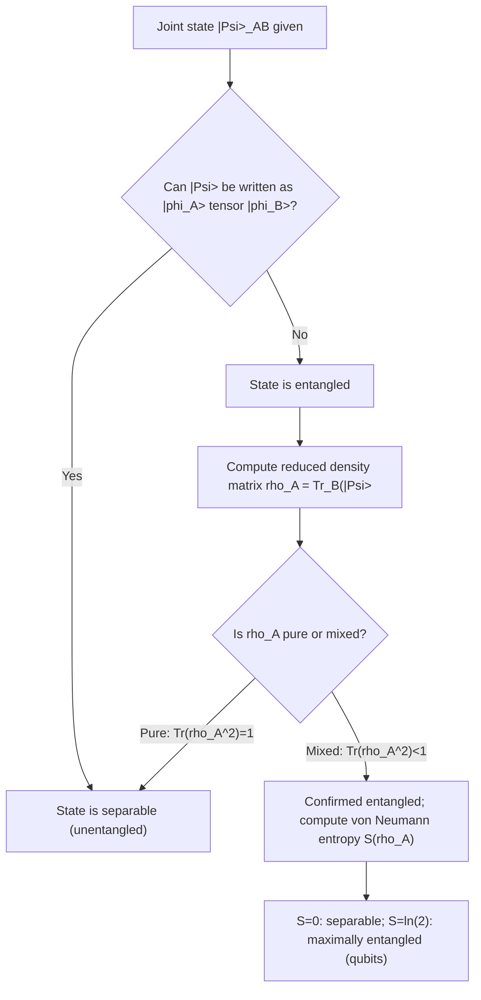

## Quantum Entanglement

### Overview

Quantum entanglement is a phenomenon in which two or more quantum systems form a joint state that cannot be factored into independent single-system states, such that measurement outcomes on the subsystems exhibit correlations stronger than any classical (local, pre-determined) theory can produce. Entanglement is not merely correlation — it is a distinct quantum resource underlying quantum information science, quantum computing, quantum cryptography, and foundational tests of quantum mechanics itself (Bell's theorem).

### Formal Definition

**Product (Separable) States**

A two-particle state $|\Psi\rangle$ is **separable** (unentangled) if it can be written as a simple tensor product of individual single-particle states:

$$|\Psi\rangle = |\phi_1\rangle \otimes |\phi_2\rangle$$

For a general (possibly mixed) two-particle state, separability more broadly means the density matrix can be written as a classical (convex) mixture of product states: $\hat{\rho} = \sum_i p_i\, \hat{\rho}_1^{(i)} \otimes \hat{\rho}_2^{(i)}$.

**Entangled States**

A state is **entangled** if it *cannot* be written in this factored/separable form. The canonical example is the two-qubit **singlet state**:

$$|\Psi^-\rangle = \frac{1}{\sqrt{2}}\left(|0\rangle_A|1\rangle_B - |1\rangle_A|0\rangle_B\right)$$

No choice of single-particle states $|\phi_A\rangle$, $|\phi_B\rangle$ reproduces this state as a simple product — this can be verified directly: attempting the factorization leads to a contradiction in the coefficients, confirming the state's entangled nature.

**Key Points**

- Entanglement is a property of the *joint* state, not of either subsystem individually — an entangled state generally cannot be described by assigning a definite (pure) state to each particle separately.
- The degree of entanglement can be quantified formally (e.g., via the von Neumann entropy of the reduced density matrix, discussed below); it is not simply a binary "entangled or not" classification for mixed states, though pure states are cleanly binary (either separable or entangled).

### The Bell Basis

For two qubits, four maximally entangled states form a complete orthonormal basis, the **Bell states**:

$$|\Phi^\pm\rangle = \frac{1}{\sqrt2}\left(|00\rangle \pm |11\rangle\right), \qquad |\Psi^\pm\rangle = \frac{1}{\sqrt2}\left(|01\rangle \pm |10\rangle\right)$$

These states are maximally entangled: measuring either qubit in the computational basis yields a perfectly random ($50/50$) outcome individually, yet the two outcomes are perfectly correlated (or anti-correlated) between the particles. The Bell basis is central to quantum teleportation, superdense coding, and entanglement-based quantum key distribution protocols.

### Reduced Density Matrix and Entanglement Entropy

For a composite system in a pure joint state $|\Psi\rangle_{AB}$, the state of subsystem $A$ alone is described by the **reduced density matrix**, obtained by tracing out subsystem $B$:

$$\hat{\rho}_A = \text{Tr}_B\left(|\Psi\rangle\langle\Psi|\right)$$

**Key diagnostic**:

- If $|\Psi\rangle_{AB}$ is separable, $\hat{\rho}_A$ is a **pure state** ($\text{Tr}(\hat{\rho}_A^2) = 1$).
- If $|\Psi\rangle_{AB}$ is entangled, $\hat{\rho}_A$ is a **mixed state** ($\text{Tr}(\hat{\rho}_A^2) < 1$) — tracing out an entangled partner necessarily leaves the remaining subsystem in a statistical mixture, even though the total system remains in a definite pure state.

The **von Neumann entanglement entropy** quantifies the degree of entanglement:

$$S(\hat{\rho}_A) = -\text{Tr}(\hat{\rho}_A \ln \hat{\rho}_A)$$

$S = 0$ indicates no entanglement (separable); $S = \ln 2$ (for qubits) indicates maximal entanglement, as in any Bell state.

### Worked Example: Reduced Density Matrix of the Singlet State

**Example**

Compute the reduced density matrix $\hat{\rho}_A$ for the singlet state $|\Psi^-\rangle = \tfrac{1}{\sqrt2}(|0\rangle_A|1\rangle_B - |1\rangle_A|0\rangle_B)$ and verify it is mixed.

**Full density matrix:**

$$\hat{\rho} = |\Psi^-\rangle\langle\Psi^-| = \frac{1}{2}\Big(|01\rangle\langle01| - |01\rangle\langle10| - |10\rangle\langle01| + |10\rangle\langle10|\Big)$$

**Trace out subsystem B:**

$$\hat{\rho}_A = \text{Tr}_B(\hat{\rho}) = \frac{1}{2}|0\rangle\langle0| + \frac{1}{2}|1\rangle\langle1| = \frac{1}{2}\hat{I}$$

(the off-diagonal terms vanish because $\langle 0|1\rangle_B = \langle1|0\rangle_B = 0$ upon tracing).

**Output**

$\hat{\rho}_A = \tfrac{1}{2}\hat{I}$ is the **maximally mixed state**, with $\text{Tr}(\hat{\rho}_A^2) = \tfrac12 < 1$, confirming subsystem $A$ alone carries zero information about which outcome will occur — all information is encoded purely in the *correlation* between $A$ and $B$, not in either particle individually. This is the hallmark signature of maximal entanglement.

### Bell's Theorem and Local Hidden Variables

**The EPR Paradox (1935)**: Einstein, Podolsky, and Rosen argued that quantum mechanics' predictions for entangled particles imply either "spooky action at a distance" or that quantum mechanics is incomplete, with particles possessing pre-determined ("hidden variable") properties that quantum theory simply fails to specify.

**Bell's Inequality (1964)**: John Bell showed that *any* local hidden-variable theory (one where each particle carries definite, pre-assigned properties and no faster-than-light influence occurs) must satisfy a specific statistical inequality relating correlations measured at different detector angles. A commonly used experimental form is the **CHSH inequality**:

$$|S| = |E(a,b) - E(a,b') + E(a',b) + E(a',b')| \leq 2$$

where $E(a,b)$ is the correlation between measurements at settings $a$ (on particle $A$) and $b$ (on particle $B$).

**Quantum Mechanical Prediction**: For appropriately chosen measurement angles on entangled particles, quantum mechanics predicts:

$$|S|_{\text{QM}} = 2\sqrt{2} \approx 2.828$$

This exceeds the classical bound of $2$ — a violation known as the **Tsirelson bound**, representing the maximum value achievable by quantum mechanics (itself less than the absolute algebraic maximum of $4$).

**Key Points**

- Experimental tests (starting with Aspect's experiments in the early 1980s, and continuing through increasingly rigorous "loophole-free" Bell tests in the 2010s) have consistently confirmed violation of Bell inequalities, ruling out local hidden-variable theories as a complete description of nature.
- This result does **not** permit faster-than-light communication (see the no-signaling theorem below); it demonstrates that nature is fundamentally **non-local** or that at least one core assumption of local realism (locality, realism, or measurement independence) must be abandoned.

### The No-Signaling Theorem

Despite entanglement producing correlations that violate Bell inequalities, entanglement **cannot be used to transmit information faster than light**. This follows because:

- The reduced density matrix $\hat{\rho}_A$ (and hence all measurement statistics observable by party $A$ alone) is **completely independent of any measurement choice or outcome made by party $B$**.
- Party $A$'s local measurement statistics are identical whether or not party $B$ has even performed a measurement yet.

[Inference] This is why entanglement-based protocols like quantum teleportation still require a classical communication channel (e.g., a phone call reporting measurement results) to complete the transfer of information — the "spooky" correlation alone reveals a specific pattern only when compared against a classical record shared afterward, never instantaneously.

### Entanglement in Quantum Information Applications

- **Quantum teleportation**: Uses a shared entangled pair plus classical communication to transmit an unknown quantum state from one party to another, without physically transporting the particle itself.
- **Superdense coding**: A shared entangled pair allows transmission of **two classical bits** of information by physically sending only **one qubit**.
- **Quantum key distribution (E91 protocol)**: Uses entangled photon pairs and Bell-inequality violation checks to detect eavesdropping, providing information-theoretic security guarantees.
- **Quantum computing**: Entanglement between qubits is a necessary resource for the computational speedup of many quantum algorithms (e.g., Shor's algorithm, Grover's algorithm) over classical computation; a quantum computer using only separable (unentangled) states offers no proven advantage over classical simulation for most known algorithms.

### Diagram: Entanglement Verification Workflow

### Diagram: Bell Test Experimental Setup (svg_diagram)

<svg xmlns="http://www.w3.org/2000/svg" viewBox="0 0 560 280">
<text x="280" y="25" font-size="16" font-weight="bold" text-anchor="middle" fill="#1a1a1a">Bell Test: Entangled Pair, Separated Measurements (svg_diagram)</text>

<circle cx="280" cy="150" r="25" fill="none" stroke="#1a1a1a" stroke-width="2" />
<text x="280" y="155" font-size="12" text-anchor="middle" fill="#1a1a1a">Source</text>

<line x1="255" y1="150" x2="100" y2="150" stroke="#c0392b" stroke-width="2" />
<polygon points="100,145 85,150 100,155" fill="#c0392b" />
<rect x="40" y="120" width="60" height="60" fill="none" stroke="#c0392b" stroke-width="2" />
<text x="70" y="155" font-size="12" text-anchor="middle" fill="#c0392b">Detector A</text>
<text x="70" y="200" font-size="11" text-anchor="middle" fill="#c0392b">Setting: a or a'</text>

<line x1="305" y1="150" x2="460" y2="150" stroke="#2980b9" stroke-width="2" />
<polygon points="460,145 475,150 460,155" fill="#2980b9" />
<rect x="480" y="120" width="60" height="60" fill="none" stroke="#2980b9" stroke-width="2" />
<text x="510" y="155" font-size="12" text-anchor="middle" fill="#2980b9">Detector B</text>
<text x="510" y="200" font-size="11" text-anchor="middle" fill="#2980b9">Setting: b or b'</text>

<text x="280" y="240" font-size="12" text-anchor="middle" fill="`#1a1a1a`">Spacelike-separated measurements test CHSH inequality |S| ≤ 2 (classical)</text>

<text x="280" y="260" font-size="12" text-anchor="middle" fill="`#1a1a1a`">Quantum mechanics predicts and confirms |S| up to 2*sqrt(2) ≈ 2.828</text>

</svg>

### Common Misconceptions

- **"Entanglement allows faster-than-light signaling"**: False — the no-signaling theorem guarantees local measurement statistics are unaffected by a distant party's actions; correlations are only revealed by later classical comparison of results.
- **"Measuring one particle instantaneously changes the physical state of the other"**: This framing is interpretation-dependent and controversial; what is unambiguous and experimentally verified is the *statistical correlation* between outcomes, not a physical causal influence transmitted between particles.
- **Confusing entanglement with classical correlation**: Classical correlations (e.g., two envelopes each containing one of a pair of colored balls) can be explained by pre-existing hidden variables and never violate Bell inequalities; quantum entanglement's correlations are provably stronger, verified by Bell inequality violation.
- **Assuming Bell test violations "prove" a specific interpretation of quantum mechanics**: The violation rules out local hidden-variable theories, but multiple interpretations (Copenhagen, many-worlds, pilot-wave/Bohmian, etc.) remain consistent with the experimental facts; which interpretation is "correct" remains a matter of ongoing philosophical and foundational debate rather than settled experimental physics [Speculation as to which interpretation is preferred].

### Conclusion

Quantum entanglement describes joint quantum states that cannot be factored into independent single-particle states, producing correlations between measurement outcomes that no local hidden-variable theory can reproduce, as proven by Bell's theorem and confirmed experimentally through CHSH inequality violations up to the Tsirelson bound of $2\sqrt2$. Despite these non-classical correlations, the no-signaling theorem ensures entanglement cannot transmit information faster than light. Beyond its foundational significance, entanglement serves as an essential physical resource for quantum teleportation, superdense coding, quantum key distribution, and the computational advantages of quantum computing algorithms.

**Related Topics**

- CHSH inequality and loophole-free Bell tests
- Quantum teleportation protocol and superdense coding
- Von Neumann entropy and entanglement measures (concurrence, negativity)
- EPR paradox and interpretations of quantum mechanics
- Quantum key distribution (BB84, E91 protocols)
- Density matrices, mixed states, and the partial trace operation
- Entanglement in many-body systems and quantum phase transitions